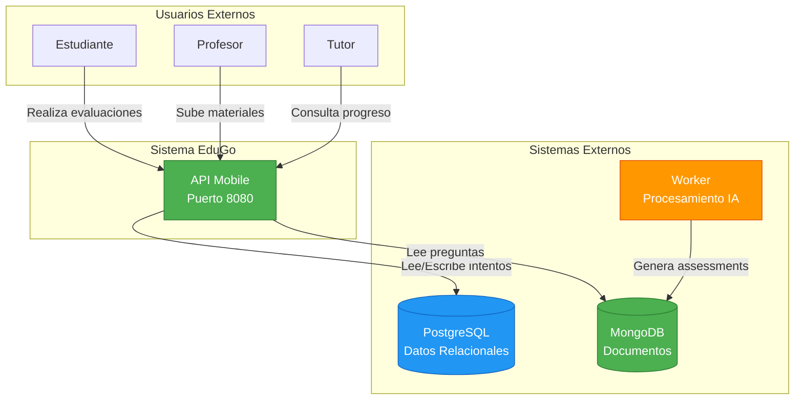
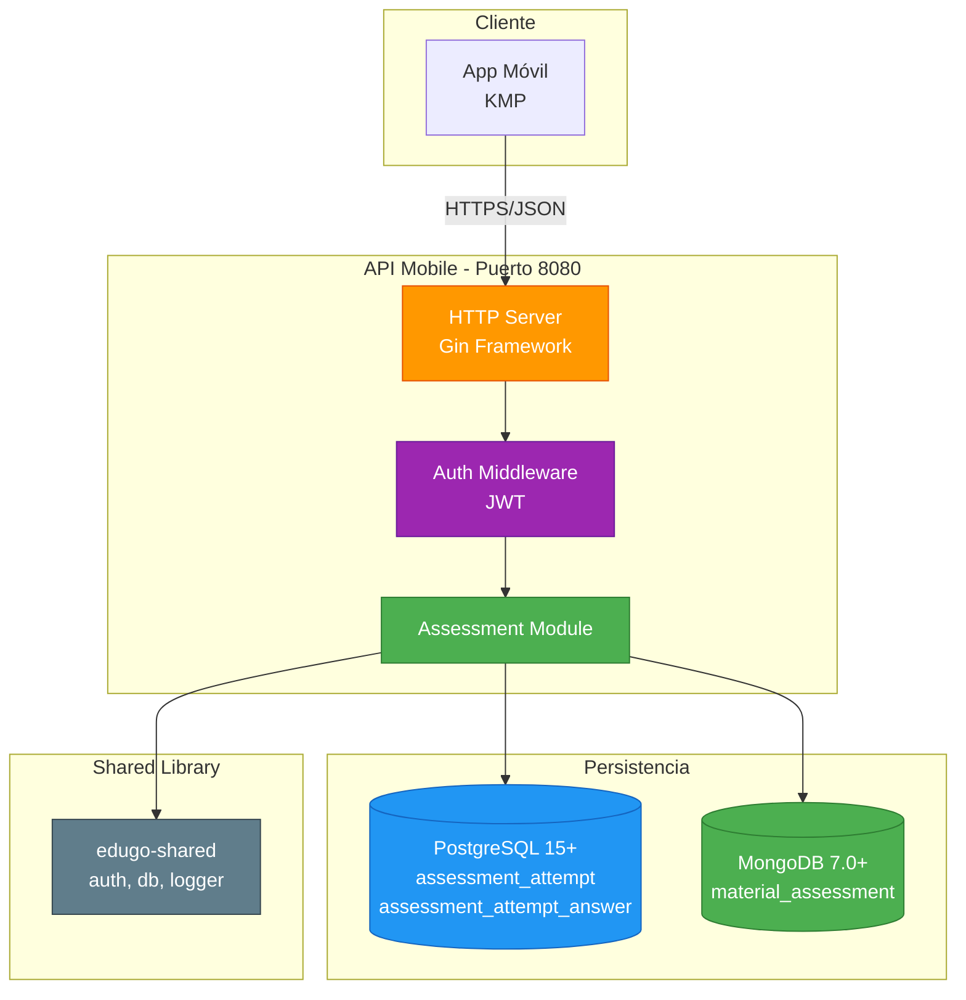
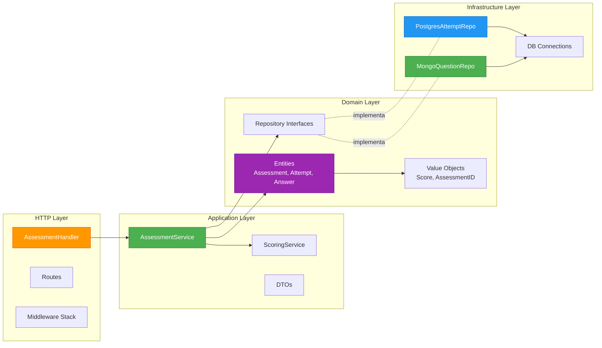
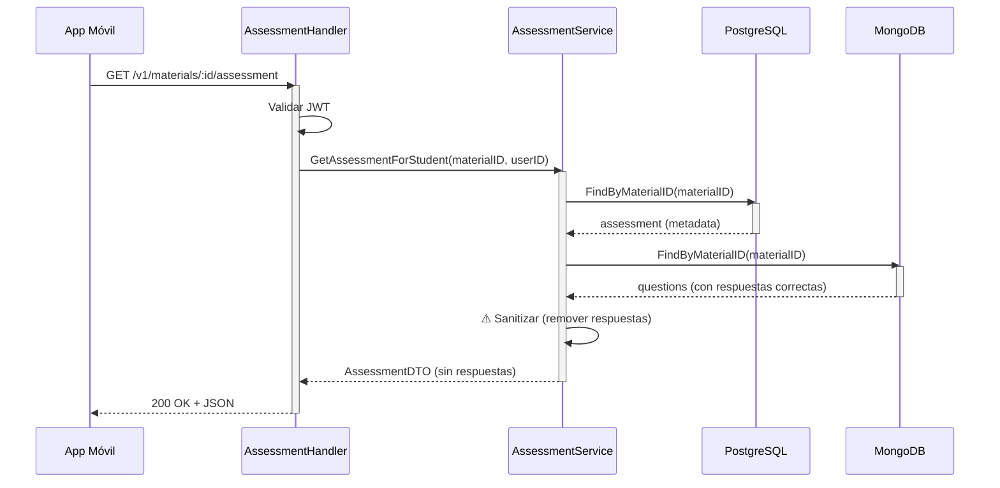
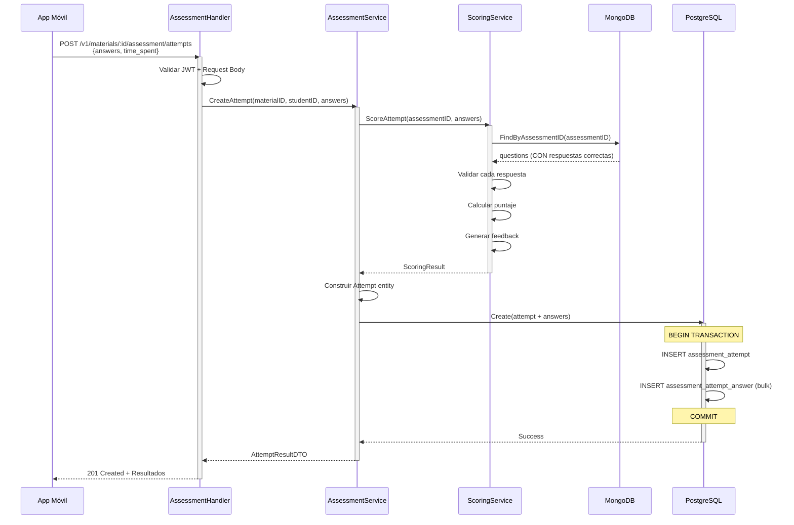
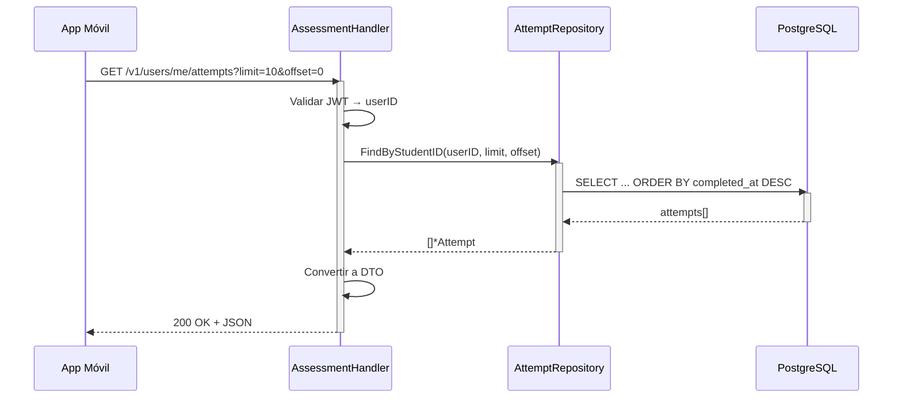

# Diseño Arquitectónico
# Sistema de Evaluaciones - EduGo

**Versión:** 1.0.0  
**Fecha:** 14 de Noviembre, 2025  
**Proyecto:** edugo-api-mobile - Sistema de Evaluaciones

---

## 1. MODELO C4 - ARQUITECTURA EN CAPAS

### 1.1 Nivel 1: Contexto del Sistema



**Descripción:**
- **Estudiantes** interactúan con API Mobile para obtener quizzes y enviar respuestas
- **API Mobile** es el punto central, lee preguntas de MongoDB y persiste intentos en PostgreSQL
- **Worker** (proceso separado) genera assessments mediante IA y los almacena en MongoDB

---

### 1.2 Nivel 2: Contenedores (Containers)



**Comunicación:**
- App Móvil → API Mobile: REST/JSON sobre HTTPS
- API Mobile → PostgreSQL: Driver nativo Go (lib/pq)
- API Mobile → MongoDB: Driver oficial (mongo-driver)
- API Mobile → Shared: Import directo de paquetes Go

---

### 1.3 Nivel 3: Componentes (Components)



**Flujo de Dependencias:**
1. HTTP Layer depende de Application Layer
2. Application Layer depende de Domain Layer
3. Infrastructure Layer implementa interfaces de Domain Layer
4. Domain Layer NO depende de nadie (núcleo aislado)

---

## 2. CLEAN ARCHITECTURE - DISEÑO DETALLADO

### 2.1 Estructura de Capas

```
┌─────────────────────────────────────────────────────────┐
│                    HTTP/Presentation                     │
│  • Handlers                                             │
│  • Middleware                                           │
│  • Routes                                               │
│  • DTOs (Request/Response)                              │
└────────────────────┬────────────────────────────────────┘
                     │ depende de ↓
┌─────────────────────────────────────────────────────────┐
│                   Application Layer                      │
│  • Services (Use Cases)                                 │
│  • Application DTOs                                     │
│  • Orchestration Logic                                  │
└────────────────────┬────────────────────────────────────┘
                     │ depende de ↓
┌─────────────────────────────────────────────────────────┐
│                     Domain Layer                         │
│  • Entities (Assessment, Attempt, Answer)               │
│  • Value Objects (Score, AssessmentID)                  │
│  • Repository Interfaces                                │
│  • Business Rules                                       │
│  ⚠️ NO depende de nada externo                          │
└─────────────────────────────────────────────────────────┘
                     ↑ implementa │
┌─────────────────────────────────────────────────────────┐
│                 Infrastructure Layer                     │
│  • Repository Implementations (Postgres, MongoDB)       │
│  • External Services Adapters                           │
│  • DB Connections                                       │
│  • Framework-specific code                              │
└─────────────────────────────────────────────────────────┘
```

---

### 2.2 Domain Layer - Entidades y Value Objects

#### Entity: Assessment
```go
// internal/domain/entities/assessment.go
package entities

import (
    "time"
    "github.com/google/uuid"
)

type Assessment struct {
    ID                uuid.UUID
    MaterialID        uuid.UUID
    MongoDocumentID   string    // ObjectId de MongoDB
    Title             string
    TotalQuestions    int
    PassThreshold     int       // 0-100
    MaxAttempts       *int      // NULL = ilimitado
    CreatedAt         time.Time
    UpdatedAt         time.Time
}

// Business Rules
func (a *Assessment) CanAttempt(currentAttempts int) bool {
    if a.MaxAttempts == nil {
        return true // Ilimitado
    }
    return currentAttempts < *a.MaxAttempts
}

func (a *Assessment) Validate() error {
    if a.TotalQuestions <= 0 {
        return errors.New("total_questions must be > 0")
    }
    if a.PassThreshold < 0 || a.PassThreshold > 100 {
        return errors.New("pass_threshold must be 0-100")
    }
    return nil
}
```

#### Entity: Attempt
```go
// internal/domain/entities/attempt.go
package entities

type Attempt struct {
    ID               uuid.UUID
    AssessmentID     uuid.UUID
    StudentID        uuid.UUID
    Score            int       // 0-100
    MaxScore         int       // Siempre 100
    TimeSpentSeconds int
    StartedAt        time.Time
    CompletedAt      time.Time
    CreatedAt        time.Time
    
    // Relaciones
    Answers          []Answer
}

// Business Logic
func (a *Attempt) CalculateScore(correctAnswers int, totalQuestions int) {
    a.Score = (correctAnswers * 100) / totalQuestions
}

func (a *Attempt) Passed(passThreshold int) bool {
    return a.Score >= passThreshold
}

func (a *Attempt) Duration() time.Duration {
    return a.CompletedAt.Sub(a.StartedAt)
}

func (a *Attempt) Validate() error {
    if a.CompletedAt.Before(a.StartedAt) {
        return errors.New("completed_at must be after started_at")
    }
    if a.TimeSpentSeconds <= 0 {
        return errors.New("time_spent must be > 0")
    }
    if a.Score < 0 || a.Score > 100 {
        return errors.New("score must be 0-100")
    }
    return nil
}
```

#### Entity: Answer
```go
// internal/domain/entities/answer.go
package entities

type Answer struct {
    AttemptID      uuid.UUID
    QuestionID     string    // ID de pregunta en MongoDB
    SelectedOption string    // 'a', 'b', 'c', 'd'
    IsCorrect      bool
    CreatedAt      time.Time
}
```

#### Value Object: Score
```go
// internal/domain/value_objects/score.go
package value_objects

type Score struct {
    value int
}

func NewScore(val int) (Score, error) {
    if val < 0 || val > 100 {
        return Score{}, errors.New("score must be between 0 and 100")
    }
    return Score{value: val}, nil
}

func (s Score) Value() int {
    return s.value
}

func (s Score) Passed(threshold int) bool {
    return s.value >= threshold
}

func (s Score) Grade() string {
    switch {
    case s.value >= 90:
        return "A"
    case s.value >= 80:
        return "B"
    case s.value >= 70:
        return "C"
    case s.value >= 60:
        return "D"
    default:
        return "F"
    }
}
```

---

### 2.3 Repository Interfaces (Domain Layer)

```go
// internal/domain/repositories/assessment_repository.go
package repositories

type AssessmentRepository interface {
    Create(ctx context.Context, assessment *entities.Assessment) error
    FindByID(ctx context.Context, id uuid.UUID) (*entities.Assessment, error)
    FindByMaterialID(ctx context.Context, materialID uuid.UUID) (*entities.Assessment, error)
    Update(ctx context.Context, assessment *entities.Assessment) error
}

// internal/domain/repositories/attempt_repository.go
type AttemptRepository interface {
    Create(ctx context.Context, attempt *entities.Attempt) error
    FindByID(ctx context.Context, id uuid.UUID) (*entities.Attempt, error)
    FindByStudentID(ctx context.Context, studentID uuid.UUID, limit, offset int) ([]*entities.Attempt, error)
    FindByAssessmentAndStudent(ctx context.Context, assessmentID, studentID uuid.UUID) ([]*entities.Attempt, error)
    CountAttempts(ctx context.Context, assessmentID, studentID uuid.UUID) (int, error)
}

// internal/domain/repositories/question_repository.go
type QuestionRepository interface {
    FindByMaterialID(ctx context.Context, materialID string) ([]Question, error)
    FindByAssessmentID(ctx context.Context, assessmentID string) ([]Question, error)
}
```

---

### 2.4 Application Layer - Services

#### AssessmentService
```go
// internal/application/services/assessment_service.go
package services

type AssessmentService struct {
    assessmentRepo repositories.AssessmentRepository
    questionRepo   repositories.QuestionRepository
    attemptRepo    repositories.AttemptRepository
    logger         logger.Logger
}

func (s *AssessmentService) GetAssessmentForStudent(
    ctx context.Context,
    materialID string,
    studentID string,
) (*dto.AssessmentDTO, error) {
    // 1. Validar que material existe
    materialUUID, err := uuid.Parse(materialID)
    if err != nil {
        return nil, errors.New("invalid material_id")
    }
    
    // 2. Buscar assessment en PostgreSQL
    assessment, err := s.assessmentRepo.FindByMaterialID(ctx, materialUUID)
    if err != nil {
        return nil, err
    }
    
    // 3. Obtener preguntas de MongoDB
    questions, err := s.questionRepo.FindByMaterialID(ctx, materialID)
    if err != nil {
        return nil, err
    }
    
    // 4. ⚠️ CRÍTICO: Sanitizar respuestas correctas
    sanitizedQuestions := sanitizeQuestions(questions)
    
    // 5. Construir DTO de respuesta
    return &dto.AssessmentDTO{
        AssessmentID:         assessment.ID.String(),
        MaterialID:           materialID,
        Title:                assessment.Title,
        TotalQuestions:       assessment.TotalQuestions,
        EstimatedTimeMinutes: estimateTime(assessment.TotalQuestions),
        Questions:            sanitizedQuestions,
    }, nil
}

func sanitizeQuestions(questions []Question) []dto.QuestionDTO {
    result := make([]dto.QuestionDTO, len(questions))
    for i, q := range questions {
        result[i] = dto.QuestionDTO{
            ID:      q.ID,
            Text:    q.Text,
            Type:    q.Type,
            Options: q.Options,
            // ⚠️ NO incluir: CorrectAnswer, Feedback
        }
    }
    return result
}
```

#### ScoringService
```go
// internal/application/services/scoring_service.go
package services

type ScoringService struct {
    questionRepo repositories.QuestionRepository
    logger       logger.Logger
}

func (s *ScoringService) ScoreAttempt(
    ctx context.Context,
    assessmentID string,
    answers []dto.AnswerDTO,
) (*ScoringResult, error) {
    // 1. Obtener preguntas CON respuestas correctas de MongoDB
    questions, err := s.questionRepo.FindByAssessmentID(ctx, assessmentID)
    if err != nil {
        return nil, err
    }
    
    // 2. Validar que todas las preguntas tienen respuesta
    if len(answers) != len(questions) {
        return nil, errors.New("incomplete answers")
    }
    
    // 3. Calcular puntaje
    correctCount := 0
    feedback := make([]FeedbackDTO, len(answers))
    
    for i, answer := range answers {
        question := findQuestion(questions, answer.QuestionID)
        if question == nil {
            return nil, errors.New("invalid question_id")
        }
        
        isCorrect := answer.SelectedOption == question.CorrectAnswer
        if isCorrect {
            correctCount++
        }
        
        feedback[i] = FeedbackDTO{
            QuestionID:     answer.QuestionID,
            QuestionText:   question.Text,
            SelectedOption: answer.SelectedOption,
            CorrectAnswer:  question.CorrectAnswer,
            IsCorrect:      isCorrect,
            Message:        getFeedbackMessage(question, isCorrect),
        }
    }
    
    score := (correctCount * 100) / len(questions)
    
    return &ScoringResult{
        Score:          score,
        CorrectAnswers: correctCount,
        TotalQuestions: len(questions),
        Feedback:       feedback,
    }, nil
}
```

---

### 2.5 Infrastructure Layer - Implementaciones

#### PostgresAttemptRepository
```go
// internal/infrastructure/persistence/postgres/attempt_repository.go
package postgres

type PostgresAttemptRepository struct {
    db *gorm.DB
}

func NewPostgresAttemptRepository(db *gorm.DB) *PostgresAttemptRepository {
    return &PostgresAttemptRepository{db: db}
}

func (r *PostgresAttemptRepository) Create(
    ctx context.Context,
    attempt *entities.Attempt,
) error {
    // Iniciar transacción
    tx := r.db.WithContext(ctx).Begin()
    defer func() {
        if r := recover(); r != nil {
            tx.Rollback()
        }
    }()
    
    // 1. Insertar intento
    attemptModel := toAttemptModel(attempt)
    if err := tx.Create(&attemptModel).Error; err != nil {
        tx.Rollback()
        return err
    }
    
    // 2. Insertar respuestas individuales
    answerModels := toAnswerModels(attempt.Answers, attempt.ID)
    if err := tx.Create(&answerModels).Error; err != nil {
        tx.Rollback()
        return err
    }
    
    // 3. Commit
    return tx.Commit().Error
}

func (r *PostgresAttemptRepository) FindByID(
    ctx context.Context,
    id uuid.UUID,
) (*entities.Attempt, error) {
    var attemptModel AttemptModel
    
    err := r.db.WithContext(ctx).
        Preload("Answers").
        First(&attemptModel, "id = ?", id).Error
    
    if err != nil {
        if errors.Is(err, gorm.ErrRecordNotFound) {
            return nil, ErrNotFound
        }
        return nil, err
    }
    
    return toAttemptEntity(&attemptModel), nil
}
```

#### MongoQuestionRepository
```go
// internal/infrastructure/persistence/mongodb/question_repository.go
package mongodb

type MongoQuestionRepository struct {
    client     *mongo.Client
    database   string
    collection string
}

func (r *MongoQuestionRepository) FindByMaterialID(
    ctx context.Context,
    materialID string,
) ([]Question, error) {
    coll := r.client.Database(r.database).Collection(r.collection)
    
    filter := bson.M{"material_id": materialID}
    
    var result AssessmentDocument
    err := coll.FindOne(ctx, filter).Decode(&result)
    if err != nil {
        if err == mongo.ErrNoDocuments {
            return nil, ErrNotFound
        }
        return nil, err
    }
    
    return result.Questions, nil
}
```

---

## 3. FLUJOS DE DATOS PRINCIPALES

### 3.1 Flujo: Obtener Cuestionario



**Tiempo estimado:** <200ms (p95)

---

### 3.2 Flujo: Crear Intento de Evaluación



**Tiempo estimado:** <1.5s (p95)

---

### 3.3 Flujo: Consultar Historial de Intentos



**Tiempo estimado:** <300ms (p95)

---

## 4. PATRONES DE DISEÑO APLICADOS

### 4.1 Repository Pattern
**Propósito:** Abstraer acceso a datos  
**Implementación:**
- Interfaces en Domain Layer
- Implementaciones concretas en Infrastructure Layer
- Permite cambiar BD sin afectar lógica de negocio

```go
// Domain
type AttemptRepository interface {
    Create(ctx context.Context, attempt *entities.Attempt) error
}

// Infrastructure
type PostgresAttemptRepository struct { ... }
type MockAttemptRepository struct { ... } // Para tests
```

---

### 4.2 Service Layer Pattern
**Propósito:** Encapsular lógica de aplicación  
**Implementación:**
- Services orquestan repositorios y dominios
- Coordinan transacciones y flujos complejos

```go
type AssessmentService struct {
    assessmentRepo repositories.AssessmentRepository
    attemptRepo    repositories.AttemptRepository
    questionRepo   repositories.QuestionRepository
}
```

---

### 4.3 DTO Pattern (Data Transfer Object)
**Propósito:** Separar representación externa de interna  
**Implementación:**
- DTOs para request/response HTTP
- Entities para lógica de negocio
- Conversión explícita entre ambos

```go
// DTO (HTTP)
type AssessmentDTO struct {
    AssessmentID string `json:"assessment_id"`
    Questions    []QuestionDTO `json:"questions"`
}

// Entity (Domain)
type Assessment struct {
    ID        uuid.UUID
    Questions []Question
}

// Conversión
func ToDTO(entity *entities.Assessment) *AssessmentDTO { ... }
```

---

### 4.4 Dependency Injection
**Propósito:** Inversión de control  
**Implementación:**
- Inyección por constructor
- Facilita testing con mocks

```go
func NewAssessmentService(
    assessmentRepo repositories.AssessmentRepository,
    questionRepo repositories.QuestionRepository,
    logger logger.Logger,
) *AssessmentService {
    return &AssessmentService{
        assessmentRepo: assessmentRepo,
        questionRepo:   questionRepo,
        logger:         logger,
    }
}
```

---

### 4.5 Unit of Work (Transacciones ACID)
**Propósito:** Operaciones atómicas  
**Implementación:**
- Transacciones PostgreSQL para intento + respuestas
- Rollback automático en caso de error

```go
tx := db.Begin()
defer func() {
    if r := recover(); r != nil {
        tx.Rollback()
    }
}()

// Operaciones
tx.Create(&attempt)
tx.Create(&answers)

tx.Commit()
```

---

## 5. MANEJO DE ESTADO Y CONCURRENCIA

### 5.1 Stateless API
- Sin sesiones en memoria
- JWT contiene toda la información necesaria
- Escalado horizontal sin problemas

### 5.2 Idempotencia
- Usar `Idempotency-Key` header para POST /attempts (Post-MVP)
- Prevenir doble envío accidental

```go
func (s *AssessmentService) CreateAttempt(
    ctx context.Context,
    idempotencyKey string,
    req CreateAttemptRequest,
) (*Attempt, error) {
    // Verificar si ya existe intento con este key
    existing := s.attemptRepo.FindByIdempotencyKey(ctx, idempotencyKey)
    if existing != nil {
        return existing, nil // Retornar existente
    }
    
    // Crear nuevo
    attempt := buildAttempt(req)
    attempt.IdempotencyKey = idempotencyKey
    s.attemptRepo.Create(ctx, attempt)
    
    return attempt, nil
}
```

### 5.3 Conexiones a BD
- Pool de conexiones PostgreSQL (max 100)
- Pool de conexiones MongoDB (max 50)
- Timeouts configurables

```go
// PostgreSQL
db, err := gorm.Open(postgres.Open(dsn), &gorm.Config{})
sqlDB, _ := db.DB()
sqlDB.SetMaxOpenConns(100)
sqlDB.SetMaxIdleConns(10)
sqlDB.SetConnMaxLifetime(time.Hour)
```

---

## 6. DECISIONES ARQUITECTÓNICAS (ADRs)

### ADR-001: Clean Architecture con Hexagonal
**Decisión:** Implementar Clean Architecture (Hexagonal) con capas Domain, Application, Infrastructure

**Contexto:**
- api-mobile ya usa Clean Architecture
- Necesitamos alta testabilidad
- Separación de concerns crítica

**Consecuencias:**
- ✅ Testeable (mock de interfaces)
- ✅ Independiente de frameworks
- ✅ Mantenible a largo plazo
- ❌ Más código boilerplate
- ❌ Curva de aprendizaje

---

### ADR-002: Transacciones ACID para Intentos
**Decisión:** Usar transacciones PostgreSQL para persistir intento + respuestas atómicamente

**Contexto:**
- Intento y respuestas deben ser consistentes
- Rollback necesario si falla cualquier inserción

**Consecuencias:**
- ✅ Consistencia garantizada
- ✅ No hay intentos huérfanos
- ❌ Latencia ligeramente mayor
- ❌ Requiere manejo cuidadoso de transacciones

---

### ADR-003: Sanitización de Respuestas en Servidor
**Decisión:** NUNCA enviar respuestas correctas al cliente antes de enviar respuestas

**Contexto:**
- Seguridad: Cliente puede ser modificado
- Prevenir trampas

**Consecuencias:**
- ✅ Seguro por diseño
- ✅ Validación server-side única fuente de verdad
- ❌ Doble consulta a MongoDB (GET assessment + POST attempt)

**Alternativas rechazadas:**
- Encriptar respuestas en cliente (cliente puede desencriptar)
- Validación en cliente (inseguro)

---

### ADR-004: MongoDB para Preguntas, PostgreSQL para Intentos
**Decisión:** Almacenar preguntas en MongoDB y intentos en PostgreSQL

**Contexto:**
- Worker genera preguntas con estructura variable
- Intentos requieren transacciones ACID

**Consecuencias:**
- ✅ Flexibilidad de schema (MongoDB)
- ✅ Consistencia de intentos (PostgreSQL)
- ❌ Dos bases de datos a mantener
- ❌ Joins complejos (resolución en código)

---

## 7. ESCALABILIDAD Y PERFORMANCE

### 7.1 Estrategias de Escalado

#### Horizontal Scaling (API)
```
Load Balancer
    ↓
┌─────────┬─────────┬─────────┐
│ API-1   │ API-2   │ API-3   │ Stateless instances
└─────────┴─────────┴─────────┘
    ↓         ↓         ↓
┌──────────────────────────────┐
│       PostgreSQL (RDS)        │ Managed, auto-scaling
└──────────────────────────────┘
```

#### Caching (Post-MVP)
```go
// Redis para assessments (raramente cambian)
func (s *AssessmentService) GetAssessment(ctx context.Context, id string) (*Assessment, error) {
    // 1. Verificar cache
    cached := s.cache.Get("assessment:" + id)
    if cached != nil {
        return cached, nil
    }
    
    // 2. Query BD
    assessment := s.repo.FindByID(ctx, id)
    
    // 3. Guardar en cache (TTL 1 hora)
    s.cache.Set("assessment:"+id, assessment, time.Hour)
    
    return assessment, nil
}
```

### 7.2 Índices de Base de Datos

**PostgreSQL:**
```sql
-- Búsqueda de assessment por material_id
CREATE INDEX idx_assessment_material_id ON assessment(material_id);

-- Búsqueda de intentos por estudiante
CREATE INDEX idx_attempt_student_id ON assessment_attempt(student_id);

-- Búsqueda de intentos recientes
CREATE INDEX idx_attempt_completed_at ON assessment_attempt(completed_at DESC);

-- Query común: intentos de un estudiante en un assessment
CREATE INDEX idx_attempt_student_assessment ON assessment_attempt(student_id, assessment_id);
```

**MongoDB:**
```javascript
// Búsqueda por material_id (único)
db.material_assessment.createIndex({ "material_id": 1 }, { unique: true });

// Búsqueda por fecha (reportes)
db.material_assessment.createIndex({ "created_at": -1 });
```

---

## 8. RESILIENCIA Y MANEJO DE ERRORES

### 8.1 Circuit Breaker (Post-MVP)
```go
type MongoQuestionRepository struct {
    client        *mongo.Client
    circuitBreaker *CircuitBreaker
}

func (r *MongoQuestionRepository) FindByMaterialID(ctx context.Context, id string) ([]Question, error) {
    return r.circuitBreaker.Execute(func() (interface{}, error) {
        return r.queryMongo(ctx, id)
    })
}
```

### 8.2 Retry con Backoff Exponencial
```go
func (r *PostgresAttemptRepository) Create(ctx context.Context, attempt *Attempt) error {
    backoff := time.Second
    maxRetries := 3
    
    for i := 0; i < maxRetries; i++ {
        err := r.db.Create(attempt).Error
        if err == nil {
            return nil
        }
        
        if !isRetryable(err) {
            return err
        }
        
        time.Sleep(backoff)
        backoff *= 2 // Exponencial: 1s, 2s, 4s
    }
    
    return errors.New("max retries exceeded")
}
```

### 8.3 Timeouts
```go
// Timeout en requests HTTP
func (h *AssessmentHandler) CreateAttempt(c *gin.Context) {
    ctx, cancel := context.WithTimeout(c.Request.Context(), 5*time.Second)
    defer cancel()
    
    attempt, err := h.service.CreateAttempt(ctx, req)
    // ...
}
```

---

## 9. OBSERVABILIDAD

### 9.1 Tracing Distribuido (Post-MVP)
```go
import "go.opentelemetry.io/otel/trace"

func (s *AssessmentService) CreateAttempt(ctx context.Context, req CreateAttemptRequest) error {
    ctx, span := tracer.Start(ctx, "AssessmentService.CreateAttempt")
    defer span.End()
    
    span.SetAttributes(
        attribute.String("student_id", req.StudentID),
        attribute.String("assessment_id", req.AssessmentID),
    )
    
    // Business logic
}
```

### 9.2 Métricas Prometheus
```go
var (
    attemptDuration = prometheus.NewHistogramVec(
        prometheus.HistogramOpts{
            Name: "assessment_attempt_duration_seconds",
            Buckets: []float64{0.1, 0.5, 1, 2, 5},
        },
        []string{"status"},
    )
    
    attemptTotal = prometheus.NewCounterVec(
        prometheus.CounterOpts{
            Name: "assessment_attempt_total",
        },
        []string{"status", "passed"},
    )
)

func recordAttempt(duration time.Duration, passed bool, err error) {
    status := "success"
    if err != nil {
        status = "error"
    }
    
    attemptDuration.WithLabelValues(status).Observe(duration.Seconds())
    attemptTotal.WithLabelValues(status, strconv.FormatBool(passed)).Inc()
}
```

---

## 10. DIAGRAMA COMPLETO DE ARQUITECTURA

```
┌──────────────────────────────────────────────────────────────────────┐
│                            App Móvil (KMP)                            │
│                         HTTPS/REST + JWT                              │
└────────────────────────────┬─────────────────────────────────────────┘
                             │
┌────────────────────────────┴─────────────────────────────────────────┐
│                        API Mobile - Puerto 8080                       │
│  ┌─────────────────────────────────────────────────────────────────┐ │
│  │ HTTP Layer: Handlers + Middleware + Routes                      │ │
│  └───────────────────────┬─────────────────────────────────────────┘ │
│                          │                                            │
│  ┌───────────────────────┴─────────────────────────────────────────┐ │
│  │ Application Layer: Services + DTOs                              │ │
│  │  • AssessmentService                                            │ │
│  │  • ScoringService                                               │ │
│  └───────────────────────┬─────────────────────────────────────────┘ │
│                          │                                            │
│  ┌───────────────────────┴─────────────────────────────────────────┐ │
│  │ Domain Layer: Entities + Value Objects + Interfaces            │ │
│  │  • Assessment, Attempt, Answer                                  │ │
│  │  • Score, AssessmentID                                          │ │
│  │  • Repository Interfaces                                        │ │
│  └───────────────────────┬─────────────────────────────────────────┘ │
│                          │                                            │
│  ┌───────────────────────┴─────────────────────────────────────────┐ │
│  │ Infrastructure Layer: Repositories + Adapters                   │ │
│  │  • PostgresAttemptRepository                                    │ │
│  │  • MongoQuestionRepository                                      │ │
│  └─────────────────────┬───────────────────┬───────────────────────┘ │
└────────────────────────┼───────────────────┼─────────────────────────┘
                         │                   │
            ┌────────────┴────────┐   ┌──────┴──────────┐
            │  PostgreSQL 15+     │   │  MongoDB 7.0+   │
            │  ┌────────────────┐ │   │  ┌────────────┐ │
            │  │ assessment     │ │   │  │ material_  │ │
            │  │ assessment_    │ │   │  │ assessment │ │
            │  │   attempt      │ │   │  └────────────┘ │
            │  │ assessment_    │ │   └─────────────────┘
            │  │   attempt_     │ │
            │  │   answer       │ │
            │  └────────────────┘ │
            └─────────────────────┘
```

---

**Generado con:** Claude Code  
**Última actualización:** 2025-11-14  
**Próxima revisión:** Tras Sprint 1
