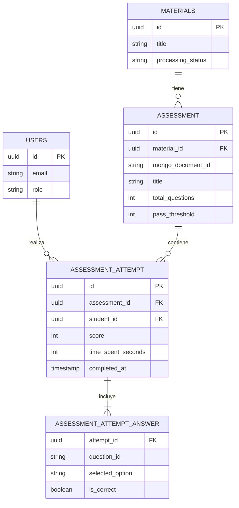

# Modelo de Datos
# Sistema de Evaluaciones - EduGo

**Versión:** 1.0.0  
**Fecha:** 14 de Noviembre, 2025  
**Proyecto:** edugo-api-mobile - Sistema de Evaluaciones

---

## 1. OVERVIEW DEL MODELO

### 1.1 Bases de Datos Utilizadas

| Base de Datos | Propósito | Tablas/Colecciones | Tamaño Estimado |
|---------------|-----------|-------------------|-----------------|
| **PostgreSQL 15+** | Datos relacionales (intentos, respuestas) | 4 tablas nuevas | ~100K intentos/año |
| **MongoDB 7.0+** | Documentos (preguntas, feedback) | 1 colección (existente) | ~10K assessments |

### 1.2 Distribución de Datos

```
PostgreSQL (Relacional)
├── assessment (Metadatos de evaluaciones)
├── assessment_attempt (Intentos de estudiantes)
├── assessment_attempt_answer (Respuestas individuales)
└── material_summary_link (Enlaces a MongoDB - Opcional)

MongoDB (Documental)
└── material_assessment (Preguntas, opciones, respuestas correctas, feedback)
```

---

## 2. POSTGRESQL - SCHEMA DETALLADO

### 2.1 Tabla: `assessment`

#### Descripción
Almacena metadatos de evaluaciones asociadas a materiales educativos. Enlace entre PostgreSQL y MongoDB.

#### Schema SQL
```sql
CREATE TABLE assessment (
    -- Primary Key
    id UUID PRIMARY KEY DEFAULT gen_uuid_v7(),
    
    -- Foreign Keys
    material_id UUID NOT NULL,
    
    -- MongoDB Reference
    mongo_document_id VARCHAR(24) NOT NULL,
    
    -- Metadatos
    title VARCHAR(255) NOT NULL,
    total_questions INTEGER NOT NULL CHECK (total_questions > 0 AND total_questions <= 100),
    pass_threshold INTEGER NOT NULL DEFAULT 70 CHECK (pass_threshold >= 0 AND pass_threshold <= 100),
    
    -- Configuración (Post-MVP)
    max_attempts INTEGER DEFAULT NULL, -- NULL = ilimitado
    time_limit_minutes INTEGER DEFAULT NULL, -- NULL = sin límite
    
    -- Timestamps
    created_at TIMESTAMP NOT NULL DEFAULT NOW(),
    updated_at TIMESTAMP NOT NULL DEFAULT NOW(),
    
    -- Constraints
    CONSTRAINT fk_assessment_material 
        FOREIGN KEY (material_id) 
        REFERENCES materials(id) 
        ON DELETE CASCADE,
    
    CONSTRAINT unique_material_assessment 
        UNIQUE (material_id)
);

COMMENT ON TABLE assessment IS 'Metadatos de evaluaciones asociadas a materiales educativos';
COMMENT ON COLUMN assessment.mongo_document_id IS 'ObjectId del documento en MongoDB collection material_assessment';
COMMENT ON COLUMN assessment.pass_threshold IS 'Porcentaje mínimo para aprobar (0-100)';
COMMENT ON COLUMN assessment.max_attempts IS 'Máximo de intentos permitidos (NULL = ilimitado)';
```

#### Índices
```sql
-- Búsqueda por material_id (query más frecuente)
CREATE INDEX idx_assessment_material_id ON assessment(material_id);

-- Búsqueda por mongo_document_id (join con MongoDB)
CREATE INDEX idx_assessment_mongo_document_id ON assessment(mongo_document_id);

-- Assessments creados recientemente (reportes)
CREATE INDEX idx_assessment_created_at ON assessment(created_at DESC);
```

#### Estimación de Tamaño
- **Filas:** ~10,000 (1 assessment por material)
- **Tamaño por fila:** ~250 bytes
- **Tamaño total:** ~2.5 MB
- **Crecimiento:** +1,000 assessments/año

#### Ejemplo de Datos
```sql
INSERT INTO assessment (
    id,
    material_id,
    mongo_document_id,
    title,
    total_questions,
    pass_threshold,
    max_attempts
) VALUES (
    '01936d9a-7f8e-7e4c-9d3f-123456789abc',
    '01936d9a-7f8e-7e4c-9d3f-987654321cba',
    '507f1f77bcf86cd799439011',
    'Cuestionario: Introducción a Pascal',
    5,
    70,
    NULL -- Ilimitado
);
```

---

### 2.2 Tabla: `assessment_attempt`

#### Descripción
Registra cada intento de un estudiante en una evaluación. Inmutable después de creación.

#### Schema SQL
```sql
CREATE TABLE assessment_attempt (
    -- Primary Key
    id UUID PRIMARY KEY DEFAULT gen_uuid_v7(),
    
    -- Foreign Keys
    assessment_id UUID NOT NULL,
    student_id UUID NOT NULL,
    
    -- Resultados
    score INTEGER NOT NULL CHECK (score >= 0 AND score <= 100),
    max_score INTEGER NOT NULL DEFAULT 100,
    
    -- Métricas
    time_spent_seconds INTEGER NOT NULL CHECK (time_spent_seconds > 0 AND time_spent_seconds <= 7200),
    
    -- Timestamps
    started_at TIMESTAMP NOT NULL,
    completed_at TIMESTAMP NOT NULL,
    created_at TIMESTAMP NOT NULL DEFAULT NOW(),
    
    -- Idempotencia (Post-MVP)
    idempotency_key VARCHAR(255) DEFAULT NULL,
    
    -- Constraints
    CONSTRAINT fk_attempt_assessment 
        FOREIGN KEY (assessment_id) 
        REFERENCES assessment(id) 
        ON DELETE CASCADE,
    
    CONSTRAINT fk_attempt_student 
        FOREIGN KEY (student_id) 
        REFERENCES users(id) 
        ON DELETE CASCADE,
    
    CONSTRAINT check_completed_after_started 
        CHECK (completed_at >= started_at),
    
    CONSTRAINT unique_idempotency_key 
        UNIQUE (idempotency_key)
);

COMMENT ON TABLE assessment_attempt IS 'Intentos de evaluación por estudiantes (INMUTABLE)';
COMMENT ON COLUMN assessment_attempt.score IS 'Puntaje obtenido (0-100)';
COMMENT ON COLUMN assessment_attempt.time_spent_seconds IS 'Tiempo total del intento en segundos';
COMMENT ON COLUMN assessment_attempt.idempotency_key IS 'Clave para prevenir duplicados (opcional)';
```

#### Índices
```sql
-- Búsqueda por assessment_id (analytics)
CREATE INDEX idx_attempt_assessment_id ON assessment_attempt(assessment_id);

-- Búsqueda por student_id (historial del estudiante)
CREATE INDEX idx_attempt_student_id ON assessment_attempt(student_id);

-- Ordenamiento por fecha (intentos recientes)
CREATE INDEX idx_attempt_completed_at ON assessment_attempt(completed_at DESC);

-- Query común: intentos de un estudiante en un assessment específico
CREATE INDEX idx_attempt_student_assessment ON assessment_attempt(student_id, assessment_id);

-- Query común: contar intentos por estudiante y assessment
CREATE INDEX idx_attempt_count ON assessment_attempt(assessment_id, student_id) 
    WHERE completed_at IS NOT NULL;

-- Idempotencia (Post-MVP)
CREATE UNIQUE INDEX idx_attempt_idempotency_key ON assessment_attempt(idempotency_key) 
    WHERE idempotency_key IS NOT NULL;
```

#### Particionamiento (Post-MVP - Escalabilidad)
```sql
-- Particionar por mes (cuando >10M intentos)
CREATE TABLE assessment_attempt (
    ...
) PARTITION BY RANGE (completed_at);

CREATE TABLE assessment_attempt_2025_11 PARTITION OF assessment_attempt
    FOR VALUES FROM ('2025-11-01') TO ('2025-12-01');

CREATE TABLE assessment_attempt_2025_12 PARTITION OF assessment_attempt
    FOR VALUES FROM ('2025-12-01') TO ('2026-01-01');
```

#### Estimación de Tamaño
- **Filas:** ~100,000 intentos/año
- **Tamaño por fila:** ~150 bytes
- **Tamaño total año 1:** ~15 MB
- **Crecimiento:** +100K intentos/año (~15 MB/año)

#### Ejemplo de Datos
```sql
INSERT INTO assessment_attempt (
    id,
    assessment_id,
    student_id,
    score,
    max_score,
    time_spent_seconds,
    started_at,
    completed_at
) VALUES (
    '01936d9b-1234-7e4c-9d3f-abcdef123456',
    '01936d9a-7f8e-7e4c-9d3f-123456789abc',
    '01936d9a-aaaa-7e4c-9d3f-student11111',
    80,
    100,
    420, -- 7 minutos
    '2025-11-14 10:00:00',
    '2025-11-14 10:07:00'
);
```

---

### 2.3 Tabla: `assessment_attempt_answer`

#### Descripción
Almacena las respuestas individuales de cada intento. Relación 1:N con `assessment_attempt`.

#### Schema SQL
```sql
CREATE TABLE assessment_attempt_answer (
    -- Composite Primary Key
    attempt_id UUID NOT NULL,
    question_id VARCHAR(100) NOT NULL,
    
    -- Respuesta del estudiante
    selected_option VARCHAR(10) NOT NULL,
    is_correct BOOLEAN NOT NULL,
    
    -- Timestamps
    created_at TIMESTAMP NOT NULL DEFAULT NOW(),
    
    -- Primary Key Constraint
    PRIMARY KEY (attempt_id, question_id),
    
    -- Foreign Key
    CONSTRAINT fk_answer_attempt 
        FOREIGN KEY (attempt_id) 
        REFERENCES assessment_attempt(id) 
        ON DELETE CASCADE
);

COMMENT ON TABLE assessment_attempt_answer IS 'Respuestas individuales de cada intento';
COMMENT ON COLUMN assessment_attempt_answer.question_id IS 'ID de la pregunta en MongoDB (ejemplo: "q1", "q2")';
COMMENT ON COLUMN assessment_attempt_answer.selected_option IS 'Opción seleccionada (ejemplo: "a", "b", "c", "d")';
COMMENT ON COLUMN assessment_attempt_answer.is_correct IS 'Si la respuesta fue correcta o no';
```

#### Índices
```sql
-- Búsqueda por attempt_id (obtener todas las respuestas de un intento)
CREATE INDEX idx_answer_attempt_id ON assessment_attempt_answer(attempt_id);

-- Analytics: respuestas por pregunta (identificar preguntas difíciles)
CREATE INDEX idx_answer_question_id ON assessment_attempt_answer(question_id);

-- Analytics: tasa de error por pregunta
CREATE INDEX idx_answer_question_correctness ON assessment_attempt_answer(question_id, is_correct);
```

#### Estimación de Tamaño
- **Filas:** ~500,000 respuestas/año (100K intentos × 5 preguntas promedio)
- **Tamaño por fila:** ~100 bytes
- **Tamaño total año 1:** ~50 MB
- **Crecimiento:** +500K respuestas/año (~50 MB/año)

#### Ejemplo de Datos
```sql
INSERT INTO assessment_attempt_answer (
    attempt_id,
    question_id,
    selected_option,
    is_correct
) VALUES 
    ('01936d9b-1234-7e4c-9d3f-abcdef123456', 'q1', 'a', true),
    ('01936d9b-1234-7e4c-9d3f-abcdef123456', 'q2', 'c', false),
    ('01936d9b-1234-7e4c-9d3f-abcdef123456', 'q3', 'b', true),
    ('01936d9b-1234-7e4c-9d3f-abcdef123456', 'q4', 'd', true),
    ('01936d9b-1234-7e4c-9d3f-abcdef123456', 'q5', 'a', false);
```

---

### 2.4 Tabla: `material_summary_link` (Opcional - Mejor Práctica)

#### Descripción
Enlace explícito entre materiales y sus resúmenes en MongoDB. Facilita auditoría y versionado.

#### Schema SQL
```sql
CREATE TABLE material_summary_link (
    -- Primary Key
    material_id UUID PRIMARY KEY,
    
    -- MongoDB Reference
    mongo_document_id VARCHAR(24) NOT NULL,
    
    -- Versionado
    summary_version INTEGER NOT NULL DEFAULT 1,
    
    -- Timestamps
    created_at TIMESTAMP NOT NULL DEFAULT NOW(),
    updated_at TIMESTAMP NOT NULL DEFAULT NOW(),
    
    -- Foreign Key
    CONSTRAINT fk_summary_link_material 
        FOREIGN KEY (material_id) 
        REFERENCES materials(id) 
        ON DELETE CASCADE
);

COMMENT ON TABLE material_summary_link IS 'Enlaces a resúmenes en MongoDB (opcional, mejor práctica)';
COMMENT ON COLUMN material_summary_link.mongo_document_id IS 'ObjectId del resumen en MongoDB';
COMMENT ON COLUMN material_summary_link.summary_version IS 'Versión del resumen (si se regenera)';
```

#### Índices
```sql
CREATE INDEX idx_summary_link_mongo_id ON material_summary_link(mongo_document_id);
CREATE INDEX idx_summary_link_updated_at ON material_summary_link(updated_at DESC);
```

---

## 3. MONGODB - SCHEMA DETALLADO

### 3.1 Colección: `material_assessment`

#### Descripción
Almacena preguntas de evaluación generadas por IA, incluyendo opciones, respuestas correctas y feedback educativo.

#### Schema JSON
```javascript
{
  "_id": ObjectId("507f1f77bcf86cd799439011"),
  "material_id": "01936d9a-7f8e-7e4c-9d3f-987654321cba",
  "title": "Cuestionario: Introducción a Pascal",
  "questions": [
    {
      "id": "q1",
      "text": "¿Qué es un compilador?",
      "type": "multiple_choice",
      "options": [
        {
          "id": "a",
          "text": "Un programa que traduce código fuente a código máquina"
        },
        {
          "id": "b",
          "text": "Un tipo de variable en Pascal"
        },
        {
          "id": "c",
          "text": "Una estructura de control"
        },
        {
          "id": "d",
          "text": "Un editor de texto"
        }
      ],
      "correct_answer": "a",
      "feedback": {
        "correct": "¡Correcto! Un compilador traduce código fuente a código máquina ejecutable.",
        "incorrect": "Incorrecto. Revisa la sección 'Herramientas de Desarrollo' en el resumen."
      },
      "difficulty": "easy", // Post-MVP
      "tags": ["compiladores", "herramientas"] // Post-MVP
    },
    {
      "id": "q2",
      "text": "¿Cuál es la principal ventaja de la tipificación fuerte?",
      "type": "multiple_choice",
      "options": [
        {
          "id": "a",
          "text": "Hace el código más rápido"
        },
        {
          "id": "b",
          "text": "Previene errores en tiempo de compilación"
        },
        {
          "id": "c",
          "text": "Reduce el tamaño del ejecutable"
        },
        {
          "id": "d",
          "text": "Permite usar menos memoria"
        }
      ],
      "correct_answer": "b",
      "feedback": {
        "correct": "¡Exacto! La tipificación fuerte detecta errores antes de ejecutar el programa.",
        "incorrect": "No es correcto. Piensa en qué sucede durante la compilación con tipos estrictos."
      },
      "difficulty": "medium"
    }
  ],
  "metadata": {
    "generated_by": "openai-gpt4",
    "generation_date": ISODate("2025-11-14T12:30:00Z"),
    "prompt_version": "v2.1",
    "total_questions": 5,
    "estimated_time_minutes": 10
  },
  "version": 1,
  "created_at": ISODate("2025-11-14T12:30:00Z"),
  "updated_at": ISODate("2025-11-14T12:30:00Z")
}
```

#### Validación de Schema
```javascript
db.createCollection("material_assessment", {
  validator: {
    $jsonSchema: {
      bsonType: "object",
      required: ["material_id", "title", "questions", "version", "created_at"],
      properties: {
        material_id: {
          bsonType: "string",
          description: "UUID del material en PostgreSQL"
        },
        title: {
          bsonType: "string",
          minLength: 1,
          maxLength: 255,
          description: "Título del cuestionario"
        },
        questions: {
          bsonType: "array",
          minItems: 1,
          maxItems: 50,
          items: {
            bsonType: "object",
            required: ["id", "text", "type", "options", "correct_answer"],
            properties: {
              id: {
                bsonType: "string",
                pattern: "^q[0-9]+$",
                description: "ID de la pregunta (q1, q2, ...)"
              },
              text: {
                bsonType: "string",
                minLength: 10,
                maxLength: 500,
                description: "Texto de la pregunta"
              },
              type: {
                enum: ["multiple_choice", "true_false", "short_answer"],
                description: "Tipo de pregunta"
              },
              options: {
                bsonType: "array",
                minItems: 2,
                maxItems: 6,
                description: "Opciones de respuesta"
              },
              correct_answer: {
                bsonType: "string",
                description: "ID de la opción correcta"
              },
              feedback: {
                bsonType: "object",
                required: ["correct", "incorrect"],
                properties: {
                  correct: { bsonType: "string" },
                  incorrect: { bsonType: "string" }
                }
              }
            }
          }
        },
        version: {
          bsonType: "int",
          minimum: 1,
          description: "Versión del assessment"
        }
      }
    }
  },
  validationLevel: "strict",
  validationAction: "error"
});
```

#### Índices
```javascript
// Búsqueda por material_id (único, más frecuente)
db.material_assessment.createIndex(
  { "material_id": 1 }, 
  { unique: true, name: "idx_material_id" }
);

// Búsqueda por fecha de creación (reportes)
db.material_assessment.createIndex(
  { "created_at": -1 },
  { name: "idx_created_at" }
);

// Text search en títulos y preguntas (Post-MVP)
db.material_assessment.createIndex(
  { 
    "title": "text", 
    "questions.text": "text" 
  },
  { 
    name: "idx_text_search",
    default_language: "spanish"
  }
);

// Búsqueda por metadata.generated_by (analytics)
db.material_assessment.createIndex(
  { "metadata.generated_by": 1 },
  { name: "idx_generated_by" }
);
```

#### Estimación de Tamaño
- **Documentos:** ~10,000 assessments
- **Tamaño por documento:** ~5 KB (promedio)
- **Tamaño total:** ~50 MB
- **Crecimiento:** +1,000 assessments/año (~5 MB/año)

---

## 4. RELACIONES ENTRE TABLAS

### 4.1 Diagrama Entidad-Relación



### 4.2 Cardinalidades

| Relación | Cardinalidad | Descripción |
|----------|--------------|-------------|
| Material → Assessment | 1:1 | Un material tiene máximo un assessment |
| Assessment → Attempt | 1:N | Un assessment puede tener múltiples intentos |
| Student → Attempt | 1:N | Un estudiante puede tener múltiples intentos |
| Attempt → Answer | 1:N | Un intento tiene múltiples respuestas |

---

## 5. MIGRACIONES

### 5.1 Migración: 06_assessments.sql

```sql
-- ============================================================================
-- Migración: 06_assessments.sql
-- Descripción: Crear schema completo para Sistema de Evaluaciones
-- Autor: Claude Code
-- Fecha: 2025-11-14
-- Versión: 1.0.0
-- ============================================================================

BEGIN;

-- ----------------------------------------------------------------------------
-- 1. Crear tabla assessment
-- ----------------------------------------------------------------------------
CREATE TABLE IF NOT EXISTS assessment (
    id UUID PRIMARY KEY DEFAULT gen_uuid_v7(),
    material_id UUID NOT NULL,
    mongo_document_id VARCHAR(24) NOT NULL,
    title VARCHAR(255) NOT NULL,
    total_questions INTEGER NOT NULL CHECK (total_questions > 0 AND total_questions <= 100),
    pass_threshold INTEGER NOT NULL DEFAULT 70 CHECK (pass_threshold >= 0 AND pass_threshold <= 100),
    max_attempts INTEGER DEFAULT NULL,
    time_limit_minutes INTEGER DEFAULT NULL,
    created_at TIMESTAMP NOT NULL DEFAULT NOW(),
    updated_at TIMESTAMP NOT NULL DEFAULT NOW(),
    
    CONSTRAINT fk_assessment_material 
        FOREIGN KEY (material_id) 
        REFERENCES materials(id) 
        ON DELETE CASCADE,
    
    CONSTRAINT unique_material_assessment 
        UNIQUE (material_id)
);

-- Índices
CREATE INDEX IF NOT EXISTS idx_assessment_material_id ON assessment(material_id);
CREATE INDEX IF NOT EXISTS idx_assessment_mongo_document_id ON assessment(mongo_document_id);
CREATE INDEX IF NOT EXISTS idx_assessment_created_at ON assessment(created_at DESC);

-- Comentarios
COMMENT ON TABLE assessment IS 'Metadatos de evaluaciones asociadas a materiales educativos';
COMMENT ON COLUMN assessment.mongo_document_id IS 'ObjectId del documento en MongoDB collection material_assessment';

-- ----------------------------------------------------------------------------
-- 2. Crear tabla assessment_attempt
-- ----------------------------------------------------------------------------
CREATE TABLE IF NOT EXISTS assessment_attempt (
    id UUID PRIMARY KEY DEFAULT gen_uuid_v7(),
    assessment_id UUID NOT NULL,
    student_id UUID NOT NULL,
    score INTEGER NOT NULL CHECK (score >= 0 AND score <= 100),
    max_score INTEGER NOT NULL DEFAULT 100,
    time_spent_seconds INTEGER NOT NULL CHECK (time_spent_seconds > 0 AND time_spent_seconds <= 7200),
    started_at TIMESTAMP NOT NULL,
    completed_at TIMESTAMP NOT NULL,
    created_at TIMESTAMP NOT NULL DEFAULT NOW(),
    idempotency_key VARCHAR(255) DEFAULT NULL,
    
    CONSTRAINT fk_attempt_assessment 
        FOREIGN KEY (assessment_id) 
        REFERENCES assessment(id) 
        ON DELETE CASCADE,
    
    CONSTRAINT fk_attempt_student 
        FOREIGN KEY (student_id) 
        REFERENCES users(id) 
        ON DELETE CASCADE,
    
    CONSTRAINT check_completed_after_started 
        CHECK (completed_at >= started_at),
    
    CONSTRAINT unique_idempotency_key 
        UNIQUE (idempotency_key)
);

-- Índices
CREATE INDEX IF NOT EXISTS idx_attempt_assessment_id ON assessment_attempt(assessment_id);
CREATE INDEX IF NOT EXISTS idx_attempt_student_id ON assessment_attempt(student_id);
CREATE INDEX IF NOT EXISTS idx_attempt_completed_at ON assessment_attempt(completed_at DESC);
CREATE INDEX IF NOT EXISTS idx_attempt_student_assessment ON assessment_attempt(student_id, assessment_id);
CREATE UNIQUE INDEX IF NOT EXISTS idx_attempt_idempotency_key ON assessment_attempt(idempotency_key) 
    WHERE idempotency_key IS NOT NULL;

-- Comentarios
COMMENT ON TABLE assessment_attempt IS 'Intentos de evaluación por estudiantes (INMUTABLE)';

-- ----------------------------------------------------------------------------
-- 3. Crear tabla assessment_attempt_answer
-- ----------------------------------------------------------------------------
CREATE TABLE IF NOT EXISTS assessment_attempt_answer (
    attempt_id UUID NOT NULL,
    question_id VARCHAR(100) NOT NULL,
    selected_option VARCHAR(10) NOT NULL,
    is_correct BOOLEAN NOT NULL,
    created_at TIMESTAMP NOT NULL DEFAULT NOW(),
    
    PRIMARY KEY (attempt_id, question_id),
    
    CONSTRAINT fk_answer_attempt 
        FOREIGN KEY (attempt_id) 
        REFERENCES assessment_attempt(id) 
        ON DELETE CASCADE
);

-- Índices
CREATE INDEX IF NOT EXISTS idx_answer_attempt_id ON assessment_attempt_answer(attempt_id);
CREATE INDEX IF NOT EXISTS idx_answer_question_id ON assessment_attempt_answer(question_id);
CREATE INDEX IF NOT EXISTS idx_answer_question_correctness ON assessment_attempt_answer(question_id, is_correct);

-- Comentarios
COMMENT ON TABLE assessment_attempt_answer IS 'Respuestas individuales de cada intento';

-- ----------------------------------------------------------------------------
-- 4. Crear tabla material_summary_link (Opcional)
-- ----------------------------------------------------------------------------
CREATE TABLE IF NOT EXISTS material_summary_link (
    material_id UUID PRIMARY KEY,
    mongo_document_id VARCHAR(24) NOT NULL,
    summary_version INTEGER NOT NULL DEFAULT 1,
    created_at TIMESTAMP NOT NULL DEFAULT NOW(),
    updated_at TIMESTAMP NOT NULL DEFAULT NOW(),
    
    CONSTRAINT fk_summary_link_material 
        FOREIGN KEY (material_id) 
        REFERENCES materials(id) 
        ON DELETE CASCADE
);

-- Índices
CREATE INDEX IF NOT EXISTS idx_summary_link_mongo_id ON material_summary_link(mongo_document_id);
CREATE INDEX IF NOT EXISTS idx_summary_link_updated_at ON material_summary_link(updated_at DESC);

-- Comentarios
COMMENT ON TABLE material_summary_link IS 'Enlaces a resúmenes en MongoDB (opcional)';

-- ----------------------------------------------------------------------------
-- 5. Función para actualizar updated_at automáticamente
-- ----------------------------------------------------------------------------
CREATE OR REPLACE FUNCTION update_updated_at_column()
RETURNS TRIGGER AS $$
BEGIN
    NEW.updated_at = NOW();
    RETURN NEW;
END;
$$ LANGUAGE plpgsql;

-- Triggers
CREATE TRIGGER update_assessment_updated_at
    BEFORE UPDATE ON assessment
    FOR EACH ROW
    EXECUTE FUNCTION update_updated_at_column();

CREATE TRIGGER update_material_summary_link_updated_at
    BEFORE UPDATE ON material_summary_link
    FOR EACH ROW
    EXECUTE FUNCTION update_updated_at_column();

COMMIT;

-- ============================================================================
-- Fin de migración
-- ============================================================================
```

### 5.2 Rollback Script

```sql
-- ============================================================================
-- Rollback: 06_assessments_rollback.sql
-- ============================================================================

BEGIN;

-- Drop triggers
DROP TRIGGER IF EXISTS update_assessment_updated_at ON assessment;
DROP TRIGGER IF EXISTS update_material_summary_link_updated_at ON material_summary_link;

-- Drop function
DROP FUNCTION IF EXISTS update_updated_at_column();

-- Drop tables (orden inverso por FK)
DROP TABLE IF EXISTS assessment_attempt_answer CASCADE;
DROP TABLE IF EXISTS assessment_attempt CASCADE;
DROP TABLE IF EXISTS material_summary_link CASCADE;
DROP TABLE IF EXISTS assessment CASCADE;

COMMIT;
```

---

## 6. SEEDS DE DATOS

### 6.1 Seeds PostgreSQL

```sql
-- ============================================================================
-- Seeds: assessment_seeds.sql
-- Datos de prueba para desarrollo y testing
-- ============================================================================

BEGIN;

-- Seed 1: Assessment básico
INSERT INTO assessment (
    id,
    material_id,
    mongo_document_id,
    title,
    total_questions,
    pass_threshold
) VALUES (
    '01936d9a-0001-7e4c-9d3f-111111111111',
    '01936d9a-mat1-7e4c-9d3f-987654321abc',  -- Referenciar material existente
    '507f1f77bcf86cd799439011',
    'Cuestionario: Introducción a Pascal',
    5,
    70
);

-- Seed 2: Intento exitoso (aprobado)
INSERT INTO assessment_attempt (
    id,
    assessment_id,
    student_id,
    score,
    time_spent_seconds,
    started_at,
    completed_at
) VALUES (
    '01936d9b-0001-7e4c-9d3f-222222222222',
    '01936d9a-0001-7e4c-9d3f-111111111111',
    '01936d9a-stud-7e4c-9d3f-student11111',  -- Referenciar estudiante existente
    80,
    420,  -- 7 minutos
    '2025-11-14 10:00:00',
    '2025-11-14 10:07:00'
);

-- Seed 3: Respuestas del intento (4 de 5 correctas)
INSERT INTO assessment_attempt_answer (attempt_id, question_id, selected_option, is_correct) VALUES
    ('01936d9b-0001-7e4c-9d3f-222222222222', 'q1', 'a', true),
    ('01936d9b-0001-7e4c-9d3f-222222222222', 'q2', 'c', false),
    ('01936d9b-0001-7e4c-9d3f-222222222222', 'q3', 'b', true),
    ('01936d9b-0001-7e4c-9d3f-222222222222', 'q4', 'd', true),
    ('01936d9b-0001-7e4c-9d3f-222222222222', 'q5', 'a', true);

-- Seed 4: Intento fallido (reprobado)
INSERT INTO assessment_attempt (
    id,
    assessment_id,
    student_id,
    score,
    time_spent_seconds,
    started_at,
    completed_at
) VALUES (
    '01936d9b-0002-7e4c-9d3f-333333333333',
    '01936d9a-0001-7e4c-9d3f-111111111111',
    '01936d9a-stud-7e4c-9d3f-student22222',
    40,
    300,  -- 5 minutos
    '2025-11-14 11:00:00',
    '2025-11-14 11:05:00'
);

-- Respuestas del intento fallido (2 de 5 correctas)
INSERT INTO assessment_attempt_answer (attempt_id, question_id, selected_option, is_correct) VALUES
    ('01936d9b-0002-7e4c-9d3f-333333333333', 'q1', 'b', false),
    ('01936d9b-0002-7e4c-9d3f-333333333333', 'q2', 'b', true),
    ('01936d9b-0002-7e4c-9d3f-333333333333', 'q3', 'a', false),
    ('01936d9b-0002-7e4c-9d3f-333333333333', 'q4', 'd', true),
    ('01936d9b-0002-7e4c-9d3f-333333333333', 'q5', 'c', false);

COMMIT;
```

### 6.2 Seeds MongoDB

```javascript
// ============================================================================
// Seeds: material_assessment_seeds.js
// Ejecutar con: mongosh < material_assessment_seeds.js
// ============================================================================

use edugo;

db.material_assessment.insertOne({
  "_id": ObjectId("507f1f77bcf86cd799439011"),
  "material_id": "01936d9a-mat1-7e4c-9d3f-987654321abc",
  "title": "Cuestionario: Introducción a Pascal",
  "questions": [
    {
      "id": "q1",
      "text": "¿Qué es un compilador?",
      "type": "multiple_choice",
      "options": [
        {"id": "a", "text": "Un programa que traduce código fuente a código máquina"},
        {"id": "b", "text": "Un tipo de variable en Pascal"},
        {"id": "c", "text": "Una estructura de control"},
        {"id": "d", "text": "Un editor de texto"}
      ],
      "correct_answer": "a",
      "feedback": {
        "correct": "¡Correcto! Un compilador traduce código fuente a código máquina ejecutable.",
        "incorrect": "Incorrecto. Revisa la sección 'Herramientas de Desarrollo' en el resumen."
      }
    },
    {
      "id": "q2",
      "text": "¿Cuál es la principal ventaja de la tipificación fuerte?",
      "type": "multiple_choice",
      "options": [
        {"id": "a", "text": "Hace el código más rápido"},
        {"id": "b", "text": "Previene errores en tiempo de compilación"},
        {"id": "c", "text": "Reduce el tamaño del ejecutable"},
        {"id": "d", "text": "Permite usar menos memoria"}
      ],
      "correct_answer": "b",
      "feedback": {
        "correct": "¡Exacto! La tipificación fuerte detecta errores antes de ejecutar el programa.",
        "incorrect": "No es correcto. Piensa en qué sucede durante la compilación con tipos estrictos."
      }
    },
    {
      "id": "q3",
      "text": "¿Qué palabra clave se usa para declarar variables en Pascal?",
      "type": "multiple_choice",
      "options": [
        {"id": "a", "text": "declare"},
        {"id": "b", "text": "var"},
        {"id": "c", "text": "dim"},
        {"id": "d", "text": "let"}
      ],
      "correct_answer": "b",
      "feedback": {
        "correct": "¡Perfecto! 'var' es la palabra clave para declarar variables.",
        "incorrect": "Incorrecto. Revisa la sintaxis básica de Pascal."
      }
    },
    {
      "id": "q4",
      "text": "¿Cuál es el operador de asignación en Pascal?",
      "type": "multiple_choice",
      "options": [
        {"id": "a", "text": "="},
        {"id": "b", "text": "=="},
        {"id": "c", "text": "<-"},
        {"id": "d", "text": ":="}
      ],
      "correct_answer": "d",
      "feedback": {
        "correct": "¡Correcto! Pascal usa ':=' para asignación.",
        "incorrect": "Incorrecto. Pascal tiene un operador de asignación único."
      }
    },
    {
      "id": "q5",
      "text": "¿Qué estructura se usa para repetir código un número conocido de veces?",
      "type": "multiple_choice",
      "options": [
        {"id": "a", "text": "for"},
        {"id": "b", "text": "while"},
        {"id": "c", "text": "repeat"},
        {"id": "d", "text": "loop"}
      ],
      "correct_answer": "a",
      "feedback": {
        "correct": "¡Exacto! 'for' se usa cuando conocemos el número de iteraciones.",
        "incorrect": "Incorrecto. Piensa en cuál estructura tiene un contador definido."
      }
    }
  ],
  "metadata": {
    "generated_by": "openai-gpt4",
    "generation_date": new Date("2025-11-14T12:30:00Z"),
    "prompt_version": "v2.1",
    "total_questions": 5,
    "estimated_time_minutes": 10
  },
  "version": 1,
  "created_at": new Date("2025-11-14T12:30:00Z"),
  "updated_at": new Date("2025-11-14T12:30:00Z")
});

print("✅ Seed data inserted successfully");
```

---

## 7. QUERIES COMUNES

### 7.1 Consultas de Lectura

```sql
-- Query 1: Obtener assessment de un material
SELECT 
    a.id,
    a.mongo_document_id,
    a.title,
    a.total_questions,
    a.pass_threshold,
    m.title as material_title
FROM assessment a
INNER JOIN materials m ON a.material_id = m.id
WHERE m.id = '01936d9a-mat1-7e4c-9d3f-987654321abc';

-- Query 2: Obtener historial de intentos de un estudiante
SELECT 
    aa.id as attempt_id,
    aa.score,
    aa.completed_at,
    a.title as assessment_title,
    m.title as material_title,
    CASE WHEN aa.score >= a.pass_threshold THEN 'Aprobado' ELSE 'Reprobado' END as status
FROM assessment_attempt aa
INNER JOIN assessment a ON aa.assessment_id = a.id
INNER JOIN materials m ON a.material_id = m.id
WHERE aa.student_id = '01936d9a-stud-7e4c-9d3f-student11111'
ORDER BY aa.completed_at DESC
LIMIT 10;

-- Query 3: Estadísticas de un assessment
SELECT 
    COUNT(DISTINCT student_id) as total_students,
    COUNT(*) as total_attempts,
    AVG(score) as average_score,
    MIN(score) as min_score,
    MAX(score) as max_score,
    COUNT(CASE WHEN score >= pass_threshold THEN 1 END) * 100.0 / COUNT(*) as pass_rate
FROM assessment_attempt aa
INNER JOIN assessment a ON aa.assessment_id = a.id
WHERE a.id = '01936d9a-0001-7e4c-9d3f-111111111111';

-- Query 4: Preguntas problemáticas (alta tasa de error)
SELECT 
    aaa.question_id,
    COUNT(*) as total_answers,
    SUM(CASE WHEN is_correct THEN 1 ELSE 0 END) as correct_count,
    ROUND(100.0 * SUM(CASE WHEN NOT is_correct THEN 1 ELSE 0 END) / COUNT(*), 2) as error_rate
FROM assessment_attempt_answer aaa
INNER JOIN assessment_attempt aa ON aaa.attempt_id = aa.id
INNER JOIN assessment a ON aa.assessment_id = a.id
WHERE a.id = '01936d9a-0001-7e4c-9d3f-111111111111'
GROUP BY aaa.question_id
HAVING error_rate > 50
ORDER BY error_rate DESC;

-- Query 5: Contar intentos de un estudiante en un assessment
SELECT COUNT(*) as attempt_count
FROM assessment_attempt
WHERE assessment_id = '01936d9a-0001-7e4c-9d3f-111111111111'
  AND student_id = '01936d9a-stud-7e4c-9d3f-student11111';
```

### 7.2 Consultas de Escritura

```sql
-- Insert 1: Crear nuevo assessment
INSERT INTO assessment (
    id,
    material_id,
    mongo_document_id,
    title,
    total_questions,
    pass_threshold
) VALUES (
    gen_uuid_v7(),
    '01936d9a-mat2-7e4c-9d3f-987654321xyz',
    '507f1f77bcf86cd799439022',
    'Cuestionario: Estructuras de Datos',
    10,
    75
);

-- Insert 2: Crear intento con transacción
BEGIN;

INSERT INTO assessment_attempt (
    id,
    assessment_id,
    student_id,
    score,
    time_spent_seconds,
    started_at,
    completed_at
) VALUES (
    gen_uuid_v7(),
    '01936d9a-0001-7e4c-9d3f-111111111111',
    '01936d9a-stud-7e4c-9d3f-student33333',
    90,
    600,
    NOW() - INTERVAL '10 minutes',
    NOW()
) RETURNING id;

-- Usar el id retornado para insertar respuestas
INSERT INTO assessment_attempt_answer (attempt_id, question_id, selected_option, is_correct) VALUES
    ('<id-del-paso-anterior>', 'q1', 'a', true),
    ('<id-del-paso-anterior>', 'q2', 'b', true),
    ('<id-del-paso-anterior>', 'q3', 'b', true),
    ('<id-del-paso-anterior>', 'q4', 'd', true),
    ('<id-del-paso-anterior>', 'q5', 'c', false);

COMMIT;
```

---

## 8. OPTIMIZACIÓN Y PERFORMANCE

### 8.1 Análisis de Query Performance

```sql
-- Activar timing
\timing on

-- Analizar plan de ejecución
EXPLAIN ANALYZE
SELECT 
    aa.id,
    aa.score,
    a.title
FROM assessment_attempt aa
INNER JOIN assessment a ON aa.assessment_id = a.id
WHERE aa.student_id = '01936d9a-stud-7e4c-9d3f-student11111'
ORDER BY aa.completed_at DESC
LIMIT 10;

-- Verificar uso de índices
SELECT 
    schemaname,
    tablename,
    indexname,
    idx_scan as index_scans,
    idx_tup_read as tuples_read,
    idx_tup_fetch as tuples_fetched
FROM pg_stat_user_indexes
WHERE tablename IN ('assessment', 'assessment_attempt', 'assessment_attempt_answer')
ORDER BY idx_scan DESC;
```

### 8.2 Estadísticas de Tablas

```sql
-- Ver tamaño de tablas
SELECT 
    tablename,
    pg_size_pretty(pg_total_relation_size(schemaname||'.'||tablename)) AS size,
    n_tup_ins as inserts,
    n_tup_upd as updates,
    n_tup_del as deletes
FROM pg_stat_user_tables
WHERE tablename LIKE 'assessment%'
ORDER BY pg_total_relation_size(schemaname||'.'||tablename) DESC;

-- Actualizar estadísticas
ANALYZE assessment;
ANALYZE assessment_attempt;
ANALYZE assessment_attempt_answer;
```

---

**Generado con:** Claude Code  
**Total Tablas PostgreSQL:** 4  
**Total Colecciones MongoDB:** 1  
**Última actualización:** 2025-11-14
