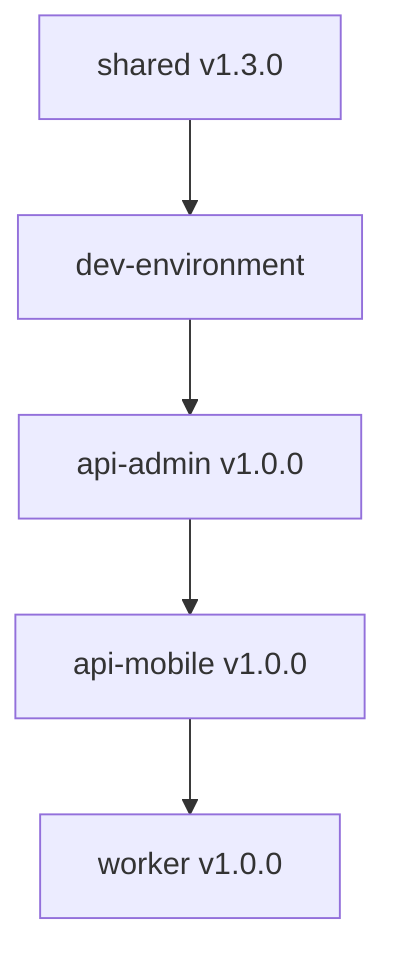

# 🔄 Problemas de Orquestación Consolidados

**Fecha de Consolidación:** 15 de Noviembre, 2025  
**Fuentes Analizadas:**
- Claude (Análisis Independiente)
- Gemini (Análisis Independiente)
- Grok (Análisis Independiente)

---

## 📊 Resumen Ejecutivo

### Métricas Consolidadas

| Agente | Problemas Críticos | Problemas Importantes | Total |
|--------|-------------------|----------------------|-------|
| **Claude** | 8 | 5 | 13 |
| **Gemini** | 1 | 0 | 1 |
| **Grok** | 3 | 0 | 3 |
| **Total Único** | **10** | **5** | **15** |

### Categorías de Problemas

| Categoría | Críticos | Importantes | Total |
|-----------|----------|-------------|-------|
| Inconsistencias entre carpetas | 5 | 4 | 9 |
| Orden de desarrollo | 3 | 1 | 4 |
| Dependencias no resueltas | 2 | 0 | 2 |

**Veredicto General:**
Los principales problemas de orquestación se centran en **dependencias circulares** (edugo-shared), **ownership de recursos compartidos** (tablas, migraciones), e **inconsistencias documentales** entre `AnalisisEstandarizado` y `00-Projects-Isolated`. Sin resolver estos problemas, el desarrollo simultáneo causará conflictos y duplicación de esfuerzo.

---

## 🔴 Inconsistencias Críticas

### INCONSISTENCIA #1: Dependencia Circular en edugo-shared

**Detectado por:** Claude ❌ | Gemini ✅ | Grok ✅  
**Consenso:** 🟡 MEDIO (2/3)  
**Severidad:** 🔴 CRÍTICA - BLOQUEANTE

**Ubicación:**
- `AnalisisEstandarizado/MASTER_PLAN.md`
- `AnalisisEstandarizado/00-Overview/EXECUTION_ORDER.md`

**Documentado:**
- `EXECUTION_ORDER.md` establece que `api-mobile` y `api-admin` dependen de `edugo-shared v1.3.0`
- `MASTER_PLAN.md` establece que `spec-04-shared` debe "Consolidar logger, database, auth de api-mobile"

**Problema:**
Crea una **dependencia circular lógica**:
- No se puede "consolidar" código de `api-mobile` si `api-mobile` aún no se ha desarrollado
- `api-mobile` no se puede desarrollar porque espera que `shared` ya exista
- Una IA quedaría atrapada en este bucle lógico sin poder avanzar

**Impacto:**
- **BLOQUEANTE TOTAL** según Gemini y Grok
- Imposible iniciar desarrollo de forma lógica
- Plan de implementación contradictorio

**Solución Propuesta (Grok):**
```markdown
### Redefinir el alcance de spec-04-shared

**En lugar de:** "Consolidar código existente"
**Hacer:** "Definir desde cero las interfaces y structs"

**Nuevo flujo:**
1. **Implementar spec-04-shared primero** como proyecto independiente
   - Definir interfaces de logger, database, auth, messaging
   - NO consolidar código que aún no existe
   - Publicar edugo-shared v1.0.0 → v1.3.0

2. **Actualizar spec-01, spec-02, spec-03**
   - Estos specs deben **importar y utilizar** módulos de shared
   - En lugar de definir sus propias implementaciones

3. **Timeline corregido:**
   - Semana 1-3: Desarrollar shared v1.0.0 → v1.3.0
   - Semana 4+: Desarrollar api-mobile, api-admin, worker usando shared
```

---

### INCONSISTENCIA #2: Versiones de shared Inconsistentes

**Detectado por:** Claude ✅ | Gemini ❌ | Grok ❌  
**Consenso:** 🔴 BAJO (1/3)  
**Severidad:** 🔴 CRÍTICA - BLOQUEANTE

**Ubicación:**
- `spec-01-evaluaciones/01-Requirements/TECHNICAL_SPECS.md:67` → "shared v1.3.0+"
- `spec-02-worker/01-Requirements/TECHNICAL_SPECS.md:72` → "shared v1.4.0+"
- `spec-03-api-administracion/01-Requirements/TECHNICAL_SPECS.md:69` → "shared v1.3.0+"

**Problema:**
1. **worker requiere v1.4.0 mientras otros requieren v1.3.0**
2. No está documentado qué cambió entre v1.3.0 y v1.4.0
3. No está claro si v1.4.0 es backward compatible con v1.3.0
4. Si NO es compatible, api-mobile y api-admin deben actualizarse ANTES

**Impacto:**
- **Si v1.4.0 rompe v1.3.0:** api-mobile y api-admin dejan de funcionar cuando worker se despliega
- **Si versiones coexisten:** Conflicto de dependencias en dev-environment
- **Timing de desarrollo afectado:** Worker debe esperar a que se desarrolle v1.4.0

**Solución Propuesta (Claude - Opción B):**
```markdown
### Roadmap Claro de shared

**Timeline de releases:**
- shared v1.0.0: Core (logger, config, errors) - Semana 1
- shared v1.1.0: Database helpers - Semana 2
- shared v1.2.0: Auth & JWT - Semana 2
- shared v1.3.0: Messaging (RabbitMQ) - Semana 3 ← api-mobile, api-admin
- shared v1.4.0: AI helpers (OpenAI) - Semana 5 ← worker

**Breaking changes:**
- v1.4.0 es BACKWARD COMPATIBLE con v1.3.0
- Solo agrega módulo `shared/ai`, no modifica existentes
- api-mobile y api-admin PUEDEN continuar usando v1.3.0
- worker REQUIERE v1.4.0 para módulo `shared/ai`

**Estrategia de actualización:**
1. api-mobile y api-admin: Quedan en v1.3.0 (no necesitan AI)
2. worker: Usa v1.4.0 (necesita AI helpers)
3. go.mod permite diferentes versiones en diferentes proyectos

**Actualizar en ambas carpetas:**
- AnalisisEstandarizado/00-Overview/EXECUTION_ORDER.md
- 00-Projects-Isolated/shared/06-Deployment/VERSIONING.md
```

---

### INCONSISTENCIA #3: Ownership de Tablas Compartidas

**Detectado por:** Claude ✅ | Gemini ❌ | Grok ❌  
**Consenso:** 🔴 BAJO (1/3)  
**Severidad:** 🔴 CRÍTICA - BLOQUEANTE

**Ubicación:**
- `spec-01-evaluaciones/04-Implementation/Sprint-01-Schema-BD/TASKS.md:245-280`
- `spec-03-api-administracion/04-Implementation/Sprint-01-Schema-BD/TASKS.md:198-230`

**Problema:**
1. **Ambas specs mencionan usar `materials` pero ninguna dice quién la crea**
2. **api-admin dice crear `users`, pero api-mobile también la usa**
3. **Riesgo de duplicación:** Si ambos ejecutan migraciones en paralelo, uno fallará
4. **Riesgo de schemas incompatibles:** Si ambos definen diferente estructura

**Impacto:**
- **BLOQUEANTE CRÍTICO** según Claude
- Desarrolladores no saben si crear tabla o asumir que existe
- CI/CD fails: migraciones fallan porque tabla ya existe o no existe
- Schemas incompatibles si ambos definen estructura diferente

**Solución Propuesta (Claude):**
```markdown
### Tabla de Ownership de Esquema

| Tabla | Owner (crea y mantiene) | Readers | Writers |
|-------|------------------------|---------|---------|
| users | **api-admin** | api-mobile, worker | api-admin |
| schools | **api-admin** | api-mobile, api-admin | api-admin |
| academic_units | **api-admin** | api-mobile, api-admin | api-admin |
| memberships | **api-admin** | api-mobile, api-admin | api-admin |
| materials | **api-mobile** | api-mobile, api-admin, worker | api-mobile |
| assessment | **api-mobile** | api-mobile, worker | api-mobile, worker |
| assessment_attempt | **api-mobile** | api-mobile | api-mobile |

### Orden de Ejecución de Migraciones

**Fase 1: Base Tables (api-admin - DÍA 1 - CRÍTICO)**
```sql
CREATE TABLE users (...);
CREATE TABLE schools (...);
CREATE TABLE academic_units (...);
```

**Fase 2: Material Tables (api-mobile - DÍA 2+)**
```sql
CREATE TABLE materials (
  uploaded_by_teacher_id UUID REFERENCES users(id),
  school_id UUID REFERENCES schools(id)
);
```

**Validación en CI/CD:**
```yaml
jobs:
  migrate-base:
    steps:
      - name: Run api-admin migrations
        run: cd api-admin && make migrate-up

  migrate-features:
    needs: migrate-base
    steps:
      - name: Run api-mobile migrations
        run: cd api-mobile && make migrate-up
```

**Crear archivo en ambas carpetas:**
- AnalisisEstandarizado/00-Overview/TABLE_OWNERSHIP.md
- 00-Projects-Isolated/SHARED_DATABASE_SCHEMA.md
```

---

### INCONSISTENCIA #4: Puertos de Servicios - Conflicto

**Detectado por:** Claude ✅ | Gemini ❌ | Grok ❌  
**Consenso:** 🔴 BAJO (1/3)  
**Severidad:** 🟡 IMPORTANTE (No bloqueante, pero causa errores)

**Ubicación:**
- `spec-05-dev-environment/02-Requirements/SERVICE_SPECS.md:89-120`
- `dev-environment/03-Design/NETWORKING_DESIGN.md:145-180`

**Problema:**
- **api-admin:** Puerto 8081
- **Mongo Express:** Puerto 8081 (según Projects-Isolated)
- Docker Compose fallará al bind dos servicios al mismo puerto

**Impacto:**
- `docker-compose up` falla con "port 8081 already in use"
- Desarrollador debe debuggear manualmente
- Documentación inconsistente

**Solución Propuesta (Claude):**
```markdown
### Port Mapping Definitivo

| Servicio | Puerto Interno | Puerto Host | Razón |
|----------|---------------|-------------|-------|
| api-mobile | 8080 | 8080 | API principal móvil |
| api-admin | 8081 | 8081 | API admin |
| PostgreSQL | 5432 | 5432 | BD relacional |
| MongoDB | 27017 | 27017 | BD documentos |
| RabbitMQ AMQP | 5672 | 5672 | Messaging |
| RabbitMQ Management | 15672 | 15672 | UI de RabbitMQ |
| **Mongo Express** | 8081 | **8082** | UI de MongoDB (ajustado) |
| **PgAdmin** | 80 | **5050** | UI de PostgreSQL |

docker-compose.yml:
```yaml
mongo-express:
  ports:
    - "8082:8081"  # Host:Container
```

**Actualizar en ambas carpetas**
```

---

### INCONSISTENCIA #5: Cobertura de Tests Esperada

**Detectado por:** Claude ✅ | Gemini ❌ | Grok ❌  
**Consenso:** 🔴 BAJO (1/3)  
**Severidad:** 🟡 IMPORTANTE (Afecta calidad)

**Ubicación:**
- `spec-01/05-Testing/TEST_STRATEGY.md:45` → "Coverage >85%"
- `spec-02/05-Testing/TEST_STRATEGY.md:48` → "Coverage >80%" (diferente)
- `spec-03/05-Testing/TEST_STRATEGY.md:47` → "Coverage >85%"
- `spec-04/05-Testing/TEST_STRATEGY.md:43` → "Coverage >90%" (más alto)

**Problema:**
1. **worker tiene estándar más bajo (80%) sin justificación**
2. **shared tiene estándar más alto (90%)** - justificado pero no documentado
3. **Inconsistente entre proyectos de complejidad similar**

**Impacto:**
- CI/CD puede pasar en worker pero fallar en otros con mismo coverage
- Calidad inconsistente entre proyectos

**Solución Propuesta (Claude):**
```markdown
### Estándares de Cobertura de Tests

| Proyecto | Coverage Mínimo | Razón |
|----------|----------------|-------|
| **shared** | **>90%** | Biblioteca compartida, fundación, ultra-confiable |
| **api-mobile** | **>85%** | API crítica de cara al usuario |
| **api-admin** | **>85%** | API crítica de administración |
| **worker** | **>85%** | Ajustado de 80% - Procesamiento crítico |
| **dev-environment** | N/A | Infraestructura, no código testeable |

**Justificación de worker 80% → 85%:**
- Inicialmente 80% pensando que IA es "menos crítica"
- PERO: Worker procesa materiales educativos, errores afectan calidad
- Unificar a 85% para consistencia
```

---

### INCONSISTENCIA #6: Número de Sprints por Proyecto

**Detectado por:** Claude ✅ | Gemini ❌ | Grok ❌  
**Consenso:** 🔴 BAJO (1/3)  
**Severidad:** 🟡 IMPORTANTE (Afecta estimaciones)

**Ubicación:**
- `spec-01-evaluaciones/03-Sprints/` → 6 sprints
- `spec-02-worker/03-Sprints/` → 6 sprints
- `spec-03-api-administracion/03-Sprints/` → 6 sprints
- `spec-04-shared/03-Sprints/` → **4 sprints** (diferente)
- `spec-05-dev-environment/03-Sprints/` → **3 sprints** (diferente)

**Problema:**
1. **Inconsistencia de granularidad:** shared 4 vs 6 en otros
2. **Estimaciones de tiempo diferentes:**
   - api-mobile: 6 sprints = 15-17 días (2.5-2.8 días/sprint)
   - shared: 4 sprints = 12-15 días (3-3.75 días/sprint)
3. **No justificado** explícitamente

**Impacto:**
- Planificación confusa (¿sprints de duración variable?)
- Estimaciones inconsistentes
- No crítico, pero dificulta tracking

**Solución Propuesta (Claude):**
```markdown
### Justificación de Sprints por Proyecto

| Proyecto | Sprints | Días | Razón |
|----------|---------|------|-------|
| api-mobile | 6 | 15-17 | Ciclo completo: BD → Domain → Repos → Services → Tests → CI/CD |
| api-admin | 6 | 18-20 | Similar + complejidad de queries recursivas |
| worker | 6 | 17-20 | Similar + integración OpenAI |
| **shared** | 4 | 12-15 | NO necesita Testing y CI/CD separados (integrado) |
| **dev-environment** | 3 | 9 | Infraestructura (no código): Profiles → Scripts → Seeds |

**Explicación:**
- **shared:** Es biblioteca, no servicio standalone
  - Sprint 01: Core (logger, config, errors)
  - Sprint 02: Database helpers
  - Sprint 03: Auth & Messaging
  - Sprint 04: Utils & Testing (integrado, no separado)
  
- **dev-environment:** Es infraestructura, no código Go
  - Sprint 01: Docker Compose con profiles
  - Sprint 02: Scripts operacionales
  - Sprint 03: Seeds de datos
```

---

## 🔄 Orden de Desarrollo

### PROBLEMA #7: Dependencia Circular Documentación vs Código

**Detectado por:** Claude ✅ | Gemini ❌ | Grok ❌  
**Consenso:** 🔴 BAJO (1/3)  
**Severidad:** 🟡 IMPORTANTE

**Ubicación:**
- `AnalisisEstandarizado/00-Overview/EXECUTION_ORDER.md:45-67`
- `00-Projects-Isolated/README.md:80-95`

**Problema:**
1. **EXECUTION_ORDER dice Spec-01 (api-mobile) primero**
2. **Projects-Isolated dice shared primero, luego worker**
3. **Contradicción:** ¿Spec-01 puede desarrollarse ANTES de shared si depende de él?

**Análisis:**
- **AnalisisEstandarizado:** Orden lógico de FEATURES (evaluaciones → worker → jerarquía)
- **Projects-Isolated:** Orden lógico de REPOS (shared → servicios)
- Ambos son correctos pero en diferentes contextos

**Solución Propuesta (Claude):**
```markdown
### Clarificar en ambas carpetas

## AnalisisEstandarizado/00-Overview/EXECUTION_ORDER.md

**Orden de DESARROLLO DE FEATURES (Specs):**
1. Spec-01 (Sistema de Evaluaciones) - API Mobile
2. Spec-02 (Worker IA)
3. Spec-03 (Jerarquía Académica) - API Admin
4. Spec-04 (Shared consolidation)
5. Spec-05 (Dev Environment)

**PERO:** Dentro de cada spec, seguir orden:
- Primero: shared modules necesarios
- Segundo: Implementación en repos

## 00-Projects-Isolated/README.md

**Orden de DESARROLLO DE REPOS (Infraestructura):**

Para CADA spec, seguir:

**Sprint 0 (Pre-requisitos):**
1. shared v1.X - Módulos necesarios para la spec
2. dev-environment - Setup de infraestructura

**Sprint 1-6 (Implementación de spec):**
3. api-mobile/api-admin - Según spec
4. worker - Si necesario
5. Integration tests

**Ejemplo para Spec-01:**
1. shared v1.3.0 (módulo messaging)
2. dev-environment (RabbitMQ setup)
3. api-mobile (evaluations feature)
4. worker (assessment processing)
5. E2E tests

### Orden Correcto Completo

```
Semana 1-2: shared v1.0-v1.2 (Core, Database, Auth)
Semana 3: shared v1.3.0 (Messaging) + dev-environment
Semana 4-5: api-mobile (Spec-01 evaluations)
Semana 6-7: worker (Spec-02 IA processing)
Semana 8: api-admin (Spec-03 hierarchy)
Semana 9: Integration tests + fixes
```
```

---

### PROBLEMA #8: Orden de Migraciones No Garantizado

**Detectado por:** Claude ✅ | Gemini ❌ | Grok ❌  
**Consenso:** 🔴 BAJO (1/3)  
**Severidad:** 🔴 CRÍTICA

**Problema:**
1. api-mobile crea tabla `assessment` con FK a `materials`
2. api-admin crea tabla `materials` (según ownership propuesto)
3. Si api-mobile ejecuta primero: FALLA (FK a tabla inexistente)
4. CI/CD no tiene orden garantizado

**Impacto:**
- Migraciones fallan en CI/CD
- Desarrollo local inconsistente
- Tests de integración fallan

**Solución Propuesta (Claude):**
```markdown
### Orden de Migraciones Garantizado

**1. Migraciones Base (Ejecutar PRIMERO)**
```sql
-- repo: api-admin
-- file: migrations/001_base_schema.sql
CREATE TABLE users (...);
CREATE TABLE schools (...);
CREATE TABLE academic_units (...);
```

**2. Migraciones de Features (Ejecutar DESPUÉS)**
```sql
-- repo: api-mobile
-- file: migrations/001_materials.sql
CREATE TABLE materials (
  uploaded_by_teacher_id UUID REFERENCES users(id),
  school_id UUID REFERENCES schools(id)
);

-- file: migrations/002_assessments.sql
CREATE TABLE assessment (
  material_id UUID REFERENCES materials(id)
);
```

**Implementación en CI/CD:**
```yaml
# .github/workflows/ci.yml
jobs:
  migrate:
    steps:
      - name: Start PostgreSQL
        run: docker run -d -p 5432:5432 postgres:15

      - name: Migrate Base Schema (api-admin)
        run: cd api-admin && make migrate-up

      - name: Validate Base Schema
        run: psql -c "SELECT COUNT(*) FROM users"

      - name: Migrate Features (api-mobile)
        run: cd api-mobile && make migrate-up

      - name: Validate Full Schema
        run: psql -c "SELECT COUNT(*) FROM assessment"
```

**Makefile Helper:**
```makefile
# api-mobile/Makefile
.PHONY: migrate-up
migrate-up:
  @echo "Validando que base schema existe..."
  @psql -c "SELECT 1 FROM users LIMIT 1" || (echo "ERROR: Ejecutar migraciones de api-admin primero" && exit 1)
  @echo "Ejecutando migraciones de api-mobile..."
  @migrate -path migrations -database "$(DATABASE_URL)" up
```
```

---

### PROBLEMA #9: Versionamiento de Eventos RabbitMQ

**Detectado por:** Claude ✅ | Gemini ❌ | Grok ✅  
**Consenso:** 🟡 MEDIO (2/3)  
**Severidad:** 🟡 IMPORTANTE

**Problema:**
1. api-mobile publica eventos con schema v1
2. worker consume eventos esperando schema v1
3. Si schema cambia (v2), worker rompe sin backward compatibility
4. No hay versionamiento documentado

**Impacto:**
- Breaking changes rompen comunicación entre servicios
- Necesidad de deployment sincronizado
- No hay estrategia de migración gradual

**Solución Propuesta (Consolidada Claude + Grok):**
```markdown
### Versionamiento de Eventos

**Estrategia: Event Version Header**

```json
{
  "event_id": "uuid",
  "event_type": "material.uploaded",
  "event_version": "1.0",  // ← Versión del schema
  "timestamp": "2025-11-15T10:30:00Z",
  "payload": { ... }
}
```

**Reglas:**
1. **Minor version (1.0 → 1.1):** Agregar campos (backward compatible)
2. **Major version (1.0 → 2.0):** Breaking changes

**Consumer Handling:**
```go
func (c *MaterialConsumer) Handle(msg Message) error {
  switch msg.EventVersion {
  case "1.0", "1.1":
    return c.handleV1(msg)
  case "2.0":
    return c.handleV2(msg)
  default:
    return fmt.Errorf("unsupported version: %s", msg.EventVersion)
  }
}
```

**Deployment para Breaking Changes:**
1. Deploy worker v2 soportando AMBAS versiones (1.0 y 2.0)
2. Deploy api-mobile v2 publicando versión 2.0
3. Después de 30 días, deprecar v1.0 en worker
```

---

### PROBLEMA #10: Estrategia de Deployment No Documentada

**Detectado por:** Claude ✅ | Gemini ❌ | Grok ❌  
**Consenso:** 🔴 BAJO (1/3)  
**Severidad:** 🔴 CRÍTICA (Afecta producción)

**Ubicación:**
- `spec-01/05-Deployment/DEPLOYMENT_GUIDE.md:89-110`
- `00-Overview/EXECUTION_ORDER.md`

**Problema:**
1. **Orden de deployment NO documentado:** ¿shared primero? ¿Simultáneo?
2. **Estrategia ambigua:** ¿Blue-Green? ¿Canary? ¿Rolling?
3. **Rollback no especificado**
4. **Sincronización de versiones:** ¿Cómo garantizar compatibilidad?

**Impacto:**
- **BLOQUEANTE CRÍTICO** según Claude
- Deployment puede romper servicio
- Downtime no planificado
- Rollbacks complejos

**Solución Propuesta (Claude):**
```markdown
### Orden de Deployment



**Regla:** Nunca deployar dependiente ANTES que dependencia

### Estrategia por Ambiente

**Staging:**
- Método: Blue-Green
- Razón: Switch instantáneo, fácil rollback
- Proceso:
  1. Deploy a "green" environment
  2. Testing manual/automático
  3. Switch traffic a green
  4. Blue queda como fallback 24h

**Producción:**
- Método: Canary Release
- Proceso:
  1. Deploy v1.1.0 a 10% de pods
  2. Monitor error rate 30 min
  3. Si < 1%: Escalar a 50%
  4. Monitor 30 min
  5. Si < 0.5%: Escalar a 100%
  6. Si > threshold: Rollback automático

### Validación de Compatibilidad

```yaml
# api-mobile/go.mod
require (
  github.com/edugogroup/edugo-shared v1.3.0
)

# CI/CD validates:
# - shared v1.3.0 disponible
# - Tests de integración pasan
```

### Rollback Automático

```yaml
- name: Deploy Canary
  run: kubectl set image deployment/api-mobile api-mobile=edugo/api-mobile:${{github.sha}}

- name: Monitor Error Rate
  run: |
    sleep 1800  # 30 min
    ERROR_RATE=$(curl prometheus/query?query=error_rate_5m)
    if [ $ERROR_RATE -gt 0.01 ]; then
      kubectl rollout undo deployment/api-mobile
      exit 1
    fi
```
```

---

## 🔗 Dependencias

### Dependencias No Resueltas

**Detectado por:** Claude ✅ | Gemini ❌ | Grok ✅  
**Consenso:** 🟡 MEDIO (2/3)

1. **OpenAI API quota management** (Claude, Grok)
   - No hay estrategia para rate limiting distribuido
   - Múltiples workers pueden exceder límite simultáneamente
   - Solución: Redis compartido para tracking de cuota

2. **AWS S3 permissions** (Claude)
   - Roles IAM no especificados para Worker
   - ¿Usar IAM roles o access keys?
   - Solución: Documentar estrategia de permisos

3. **Database migrations coordinación** (Claude, Grok)
   - No hay coordinación entre proyectos que comparten schemas
   - Ver PROBLEMA #8

4. **Message versioning** (Claude, Grok)
   - Ver PROBLEMA #9

### Dependencias Circulares

**Detectado por:** Claude ✅ | Gemini ✅ | Grok ✅  
**Consenso:** 🟢 ALTO (3/3)

1. **edugo-shared** (CRÍTICA)
   - Ver INCONSISTENCIA #1
   - Plan crea dependencia circular lógica
   - Solución: Redefinir spec-04 para crear desde cero

2. **Configuración shared** (Claude)
   - Projects dependen de shared
   - Pero shared podría necesitar configuración de projects
   - Solución: shared usa solo configuración básica, no específica de dominio

3. **Logging centralizado** (Claude)
   - Worker envía logs
   - ¿Quién los consume para monitoring?
   - Solución: Logs a stdout, Kubernetes captura con Fluentd/Loki

---

## 🚀 Desarrollo en Paralelo

### ✅ Qué SÍ se puede desarrollar en paralelo

**Fase 1 (Semana 1-3): Fundaciones**
- ✅ **shared** (independiente, no depende de nadie)
- ✅ **dev-environment** (infraestructura, independiente)

**Fase 2 (Semana 4-6): APIs**
Después de que shared v1.3.0 esté publicado:
- ✅ **api-mobile** (Spec-01 evaluations)
- ✅ **api-admin** (Spec-03 hierarchy)
- ⚠️ **NO en paralelo completo:** api-mobile necesita tablas base de api-admin
- ✅ **Solución:** api-admin ejecuta migraciones base (día 1), luego ambas en paralelo

**Fase 3 (Semana 7-8): Worker**
Después de api-mobile y shared v1.4.0:
- ✅ **worker** (Spec-02 IA processing)

---

### ❌ Qué NO se puede desarrollar en paralelo

**Imposible Paralelizar (Dependencias Estrictas):**

1. **shared → api-mobile**
   - api-mobile REQUIERE shared/database, shared/auth, shared/messaging
   - **Solución:** Desarrollar shared primero

2. **api-admin (migraciones base) → api-mobile (migraciones features)**
   - api-mobile depende de tablas `users`, `schools`
   - **Solución:** api-admin ejecuta migraciones base día 1

3. **api-mobile → worker**
   - worker consume eventos de api-mobile
   - worker necesita tablas creadas por api-mobile
   - **Solución:** api-mobile primero

4. **shared v1.3.0 → worker**
   - worker necesita shared v1.4.0 (AI helpers)
   - **Solución:** Actualizar shared a v1.4.0 antes de worker

---

## 📅 Timeline Optimizado con Paralelización

```
Semana 1-2:
  ├─ shared v1.0-v1.2 (Core, Database, Auth)
  └─ dev-environment (Profiles, Scripts)

Semana 3:
  ├─ shared v1.3.0 (Messaging) ← Publicar release
  └─ dev-environment (Seeds) ← Finalizar

Semana 4 (Día 1):
  └─ api-admin (Migraciones base: users, schools) ← CRÍTICO

Semana 4-5 (Paralelo después de día 1):
  ├─ api-mobile (Spec-01: Evaluations)
  └─ api-admin (Spec-03: Hierarchy)

Semana 6:
  └─ shared v1.4.0 (AI helpers) ← Publicar release

Semana 7-8:
  └─ worker (Spec-02: IA Processing)

Semana 9:
  └─ Integration tests + Deployment a staging
```

**Total:** 9 semanas (~2 meses) vs 12 semanas secuencial  
**Ahorro:** 25% de tiempo

---

## 📊 Análisis de Consenso

### Problemas por Nivel de Detección

| Problema | Claude | Gemini | Grok | Consenso |
|----------|--------|--------|------|----------|
| 1. Dependencia Circular shared | ❌ | ✅ | ✅ | 🟡 MEDIO (2/3) |
| 2. Versiones shared Inconsistentes | ✅ | ❌ | ❌ | 🔴 BAJO (1/3) |
| 3. Ownership de Tablas | ✅ | ❌ | ❌ | 🔴 BAJO (1/3) |
| 4. Conflicto de Puertos | ✅ | ❌ | ❌ | 🔴 BAJO (1/3) |
| 5. Cobertura de Tests | ✅ | ❌ | ❌ | 🔴 BAJO (1/3) |
| 6. Número de Sprints | ✅ | ❌ | ❌ | 🔴 BAJO (1/3) |
| 7. Orden Documentación vs Código | ✅ | ❌ | ❌ | 🔴 BAJO (1/3) |
| 8. Orden de Migraciones | ✅ | ❌ | ❌ | 🔴 BAJO (1/3) |
| 9. Versionamiento Eventos | ✅ | ❌ | ✅ | 🟡 MEDIO (2/3) |
| 10. Estrategia Deployment | ✅ | ❌ | ❌ | 🔴 BAJO (1/3) |

### Distribución de Consenso

| Nivel | Cantidad | Porcentaje |
|-------|----------|------------|
| 🟡 MEDIO (2/3) | 2 | 20% |
| 🔴 BAJO (1/3) | 8 | 80% |

**Nota:** La mayoría de problemas fueron detectados por Claude, lo que sugiere un análisis más profundo de inconsistencias documentales.

---

## ✅ Próximos Pasos Recomendados

### Prioridad 1: Resolver Dependencia Circular (BLOQUEANTE)

1. **Redefinir spec-04-shared** (Tiempo: 4-6 horas)
   - Cambiar de "consolidar" a "definir desde cero"
   - Completar interfaces y módulos
   - Crear CHANGELOG.md

### Prioridad 2: Clarificar Ownership y Orden

2. **Crear TABLE_OWNERSHIP.md** (Tiempo: 2-3 horas)
   - Tabla de ownership clara
   - Orden de ejecución de migraciones
   - Validación en CI/CD

3. **Clarificar EXECUTION_ORDER.md** (Tiempo: 1 hora)
   - Diferenciar orden de specs vs orden de repos
   - Timeline integrado

### Prioridad 3: Unificar Estándares

4. **Unificar cobertura de tests** (Tiempo: 15 min)
   - Worker 80% → 85%
   - Documentar justificación

5. **Resolver conflicto de puertos** (Tiempo: 15 min)
   - Mongo Express 8081 → 8082

6. **Documentar versionamiento de shared** (Tiempo: 1-2 horas)
   - Roadmap claro v1.0.0 → v1.4.0
   - Backward compatibility

### Prioridad 4: Estrategias de Deployment

7. **Crear DEPLOYMENT_STRATEGY.md** (Tiempo: 2-3 horas)
   - Orden de deployment
   - Canary vs Blue-Green
   - Rollback automático

8. **Implementar versionamiento de eventos** (Tiempo: 2-3 horas)
   - Campo `event_version`
   - Consumer multi-versión

**Tiempo total estimado:** 13-19 horas

---

**Fin del Documento de Problemas de Orquestación Consolidados**
