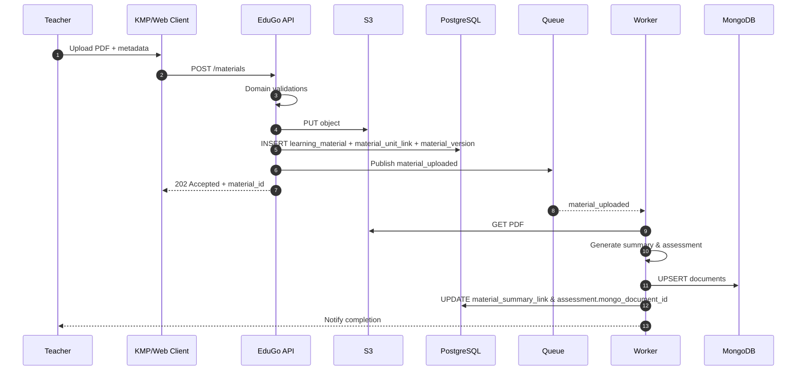

# API EduGo (Go)

[Volver a Componentes](../README.md) · [Volver a Detalle de Persistencia Híbrida](../../README.md)

La API gestiona autenticación, jerarquías académicas, materiales y evaluaciones. Los servicios siguen arquitectura hexagonal y utilizan adaptadores para PostgreSQL, MongoDB, S3 y la cola de mensajes.

## Casos de Uso Clave

| Código | Descripción | Actores | Persistencia |
|--------|-------------|---------|--------------|
| CU-API-01 | Registro/autenticación de usuarios | Docente, Estudiante, Admin, Tutor | PostgreSQL (`app_user`, `teacher_profile`, `student_profile`, `guardian_profile`) |
| CU-API-02 | Gestión de unidades académicas | Admin, Docente | PostgreSQL (`academic_unit`, `unit_membership`) |
| CU-API-03 | Publicación y versionado de materiales | Docente | PostgreSQL (`learning_material`, `material_version`, `material_unit_link`), S3 |
| CU-API-04 | Obtención de resúmenes y evaluaciones | Estudiante, Docente | PostgreSQL (`material_summary_link`, `assessment`), MongoDB |
| CU-API-05 | Registro de progreso y resultados | Estudiante | PostgreSQL (`reading_log`, `assessment_attempt`, `assessment_attempt_answer`), MongoDB |

## Diagrama de Secuencia (Publicar Material)



## Endpoints Propuestos

| Método | Ruta | Descripción | Auth | Estado |
|--------|------|-------------|------|--------|
| `POST` | `/v1/auth/login` | Genera JWT tras validar credenciales | Público | MVP |
| `POST` | `/v1/users` | Invitar usuario (docente/admin) | Admin | Post-MVP |
| `GET` | `/v1/units` | Lista jerarquía académica | JWT (roles varios) | MVP |
| `POST` | `/v1/units` | Crea unidad académica (año, sección, academia) | JWT Admin/Docente owner | MVP |
| `PATCH` | `/v1/units/{unitId}` | Actualiza metadatos o vigencia | JWT Admin/Docente owner | MVP |
| `POST` | `/v1/units/{unitId}/members` | Asigna usuario a la unidad | JWT Admin/Docente owner | MVP |
| `GET` | `/v1/materials` | Lista materiales filtrados por unidad/materia | JWT | MVP |
| `POST` | `/v1/materials` | Crea material y entrega URL firmada de subida | JWT Docente | MVP |
| `PATCH` | `/v1/materials/{materialId}` | Actualiza metadatos/estado | JWT Docente | MVP |
| `GET` | `/v1/materials/{materialId}` | Detalle + URLs firmadas | JWT | MVP |
| `GET` | `/v1/materials/{materialId}/summary` | Resumen desde MongoDB | JWT | Post-MVP (generación on-demand) |
| `GET` | `/v1/materials/{materialId}/assessment` | Cuestionario desde MongoDB | JWT | Post-MVP |
| `POST` | `/v1/materials/{materialId}/assessment/attempts` | Registra intento y respuestas | JWT Estudiante | Post-MVP |

> Los endpoints Post-MVP requieren la puesta en marcha de los workers y colecciones MongoDB; en MVP el contenido flexible puede residir temporalmente en columnas `jsonb`.

## Contratos Destacados

- **DTO creación de material**
  ```json
  {
    "title": "Pascal Introduction",
    "description": "Material base para 5.º año",
    "subject_id": "uuid",
    "unit_ids": ["uuid"],
    "metadata": {
      "level": "intermediate",
      "keywords": ["programming", "history"]
    }
  }
  ```

- **Evento `material_uploaded`**
  ```json
  {
    "event_type": "material_uploaded",
    "material_id": "uuid",
    "author_id": "uuid",
    "s3_key": "source/20240201_original.pdf",
    "preferred_language": "es"
  }
  ```

- **Respuesta resumen (Post-MVP)**
  ```json
  {
    "material_id": "uuid",
    "sections": [
      {"title": "Context", "content": "...", "difficulty": "medium"}
    ],
    "glossary": [{"term": "Compiler", "definition": "..."}],
    "reflection_questions": ["What advantages..."]
  }
  ```

## Consideraciones

- **Idempotencia y reintentos:** `material_id` + `Idempotency-Key` aseguran que las operaciones de subida sean seguras frente a duplicados.
- **Rate limiting contextual:** Límites diferenciados por rol; docentes tienen cuotas superiores para cargas masivas.
- **Pruebas contractuales:** Pactos entre API y app KMP para mantener DTOs sincronizados, especialmente en la transición de `jsonb` hacia MongoDB.
- **Seguridad:** JWT con scopes, URLs firmadas en S3 con expiración corta (≤15 min), auditoría de cambios en `material_version`.
