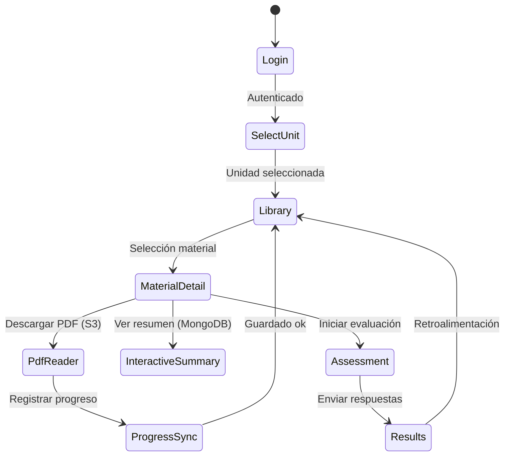

# App EduGo (Kotlin Multiplatform)

[Volver a Componentes](../README.md) · [Volver a Detalle de Persistencia Híbrida](../../README.md)

La app KMP ofrece experiencias nativas (Android, iOS, desktop) sincronizadas con la API. Consume datos de PostgreSQL, MongoDB y S3 a través de los endpoints descritos.

## Flujos Principales

## Casos de Uso

| Código | Nombre | Descripción | Interacciones |
|--------|--------|-------------|---------------|
| CU-KMP-01 | Autenticación | OAuth implícito + refresh tokens | `/v1/auth/login` |
| CU-KMP-02 | Explorar materiales | Filtros por unidad y materia | `/v1/materials` |
| CU-KMP-03 | Descarga offline | PDFs y resúmenes para uso sin conexión | URLs firmadas S3, caché local |
| CU-KMP-04 | Registro de progreso | Sincroniza porcentaje leído y último acceso | `/v1/materials/{id}` + PATCH progreso |
| CU-KMP-05 | Evaluaciones | Obtiene preguntas y envía respuestas | `/v1/materials/{id}/assessment`, `/assessment/attempts` |

## Pantallas Clave

- **Selector de unidad/materia:** lista con chips filtrables y etiquetas jerárquicas (colegio, año, sesión, academia).
- **Biblioteca:** grid/lista con estados (nuevo, en progreso, completado) y agrupación por `academic_unit`.
- **Detalle de material:** pestañas `Overview`, `Summary`, `Assessment`, `Notes`.
- **Lector PDF:** motor nativo por plataforma con marcadores y notas personales.
- **Resumen interactivo:** bloques colapsables, glosario contextual y opción “Solicitar actualización”.
- **Evaluación:** tarjetas con feedback inmediato y resumen final.

## Persistencia Local

- **SQLDelight caches**
  * `local_material` replica campos clave de `learning_material` + timestamps.
  * `local_summary` almacena JSON comprimido de resúmenes (provenientes de `material_summary_link` + MongoDB).
  * `local_progress` guarda progreso offline (`progress`, `last_access_at`) para reconciliación.

- **Workflow de sincronización**
  1. Pull inicial (`/materials`) según `unit_id`.
  2. Descarga diferida de PDFs (control tamaño/límite LRU).
  3. Cola local de eventos de progreso -> envío batch al recuperar conectividad.

## Consideraciones

- **Estados claros:** mostrar chips “Procesando resumen” cuando `material_summary_link` aún no está disponible; permitir solicitar reprocesos.
- **Accesibilidad:** compatibilidad con tamaños dinámicos de fuente y lectura asistida por voz.
- **Telemetría:** eventos clave a futuro (`/v1/analytics`) o integración con servicio de métricas.
- **Seguridad:** tokens en Keychain/Keystore; PDFs cifrados en disco con claves derivadas del usuario.
