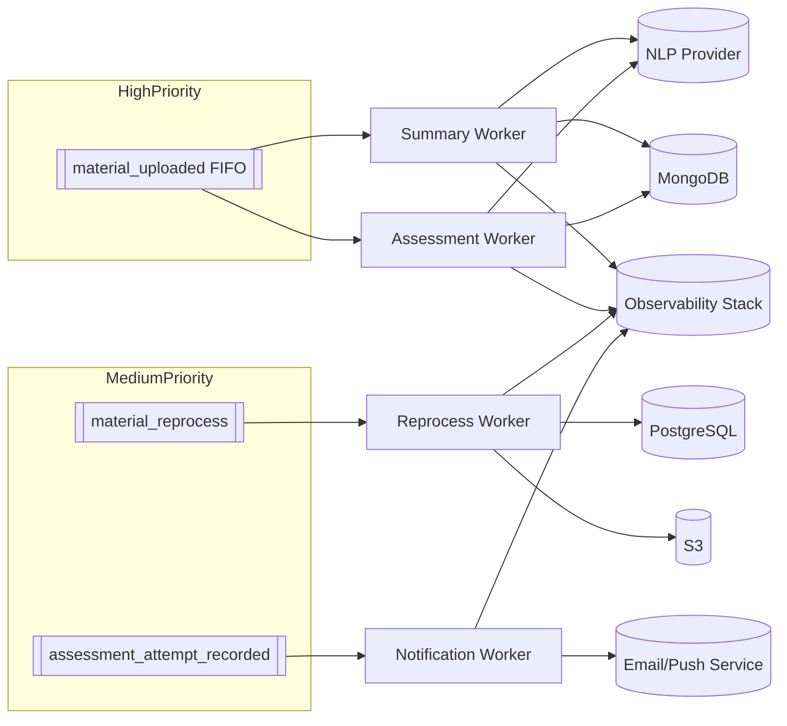

# Procesamiento Asíncrono y Colas

[Volver a Componentes](../README.md) · [Volver a Detalle de Persistencia Híbrida](../../README.md)

Los trabajos asíncronos garantizan que operaciones costosas (NLP, generación de cuestionarios, notificaciones) no bloqueen la API.

## Eventos y Cargas Útiles

| Evento | Disparador | Payload mínimo | Objetivo |
|--------|-----------|----------------|----------|
| `material_uploaded` | `POST /v1/materials` exitoso | `material_id`, `author_id`, `s3_key`, `preferred_language` | Generar resumen (`material_summary`) y evaluación (`material_assessment`). |
| `material_reprocess` | Solicitud de docente/admin | `material_id`, `reason`, `force` | Regenerar artefactos conservando histórico. |
| `assessment_attempt_recorded` | Estudiante finaliza evaluación | `attempt_id`, `material_id`, `user_id`, `score` | Notificar docentes, actualizar métricas. |
| `integration_error` | Fallo en servicios externos | `origin`, `code`, `detail` | Reintentos o alerta manual. |

Broker recomendado: Amazon SQS/SNS (simplicidad) o RabbitMQ/NATS (si se requiere multi-tenant). `material_uploaded` idealmente usa colas FIFO con deduplicación.

## Arquitectura de Workers

## Flujo de Generación

1. Worker recibe `material_uploaded`.
2. Descarga PDF desde S3 (`getObject` con firma temporal).
3. Extrae texto y llama al proveedor NLP con prompts definidos.
4. Valida longitud, PII y consistencia.
5. Upsert en MongoDB (`material_summary`, `material_assessment`).
6. Actualiza PostgreSQL (`material_summary_link`, `assessment.mongo_document_id`, estado del material).
7. Publica métricas y emite notificaciones a docentes.

## Reintentos y Monitoreo

- Backoff exponencial: 1 min, 5 min, 15 min, 1 h, 6 h (máx. 5 intentos).
- Dead Letter Queue para revisión manual cuando se agotan los reintentos.
- Métricas clave: tiempo medio de procesamiento, tasa de errores por worker, divergencias SQL ↔ MongoDB.
- Alertas (PagerDuty/Slack) cuando la DLQ supera umbrales o el tiempo medio supera 10 min.

## Seguridad

- Roles IAM específicos para cada worker, limitados a los prefijos S3 y recursos necesarios.
- Datos temporales en disco cifrados; eliminación segura al finalizar.
- Auditoría de prompts/respuestas para trazabilidad académica y cumplimiento.
