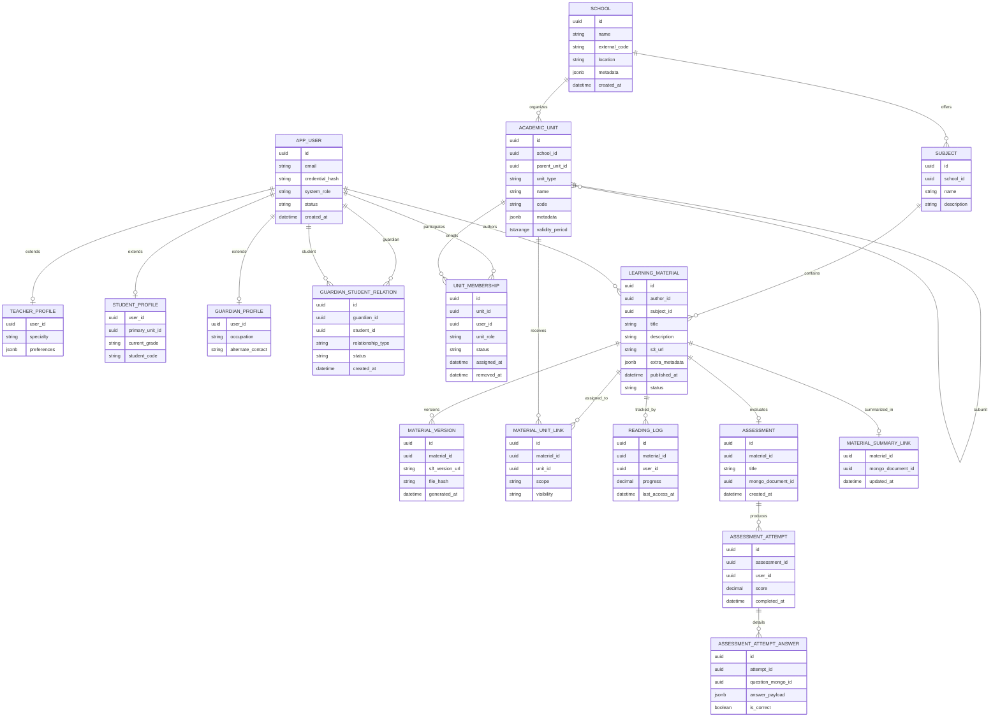

# Diagrama Entidad–Relación

[Volver a Diagramas](./README.md) · [Volver a Detalle de Persistencia Híbrida](../README.md)



## Claves del Modelo

- **Jerarquía flexible:** `academic_unit` con `parent_unit_id` soporta colegios, años, sesiones y academias externas; los CTE recursivos permiten recorrer la estructura.
- **Roles polimórficos:** `unit_membership.unit_role` permite que un usuario tenga responsabilidades distintas en cada unidad (owner, teacher, assistant, student, guardian).
- **Relaciones familiares:** `guardian_student_relation` habilita permisos delegados y seguimiento del progreso por los tutores.
- **Asignación granular de recursos:** `material_unit_link` comparte materiales entre múltiples unidades sin duplicarlos.
- **Integración con MongoDB:** campos `mongo_document_id` conectan resúmenes y evaluaciones almacenados como documentos flexibles.

## Organización en S3

```
s3://edugo-materials/{school_id}/{unit_id}/{material_id}/
  ├─ source/
  │   └─ {timestamp}_original.pdf
  ├─ processed/
  │   ├─ {material_version_id}.pdf
  │   └─ {material_version_id}.json
  └─ assets/
      └─ cover_{material_version_id}.png
```

- El prefijo incluye `school_id` y `unit_id` para aplicar políticas de acceso diferenciadas.
- `material_version.file_hash` permite deduplicar cargas antes de lanzar workflows de procesamiento.
