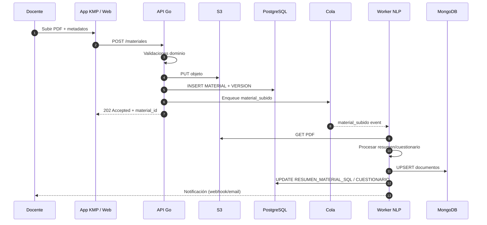

# API EduGo (Go)

[Volver a Componentes](../README.md) · [Volver a Detalle del Enfoque Híbrido](../../README.md)

La API unifica el acceso a datos relacionales, documentos y archivos, aplicando principios de arquitectura hexagonal. Implementada en Go, expone controladores REST (extensibles a GraphQL) y delega la lógica a servicios de dominio.

## Casos de Uso Clave

| Código | Descripción | Actores | Persistencia afectada |
|--------|-------------|---------|-----------------------|
| CU-API-01 | Registrar y autenticar usuarios (docente/alumno/admin) | Docente, Alumno, Admin | SQL (`USUARIO`, `PERFIL_*`) |
| CU-API-02 | Gestionar materiales (crear, actualizar, publicar) | Docente | SQL (`MATERIAL`, `MATERIAL_VERSION`), S3 |
| CU-API-03 | Obtención de resúmenes y cuestionarios | Alumno, Docente | SQL (`CUESTIONARIO`, `RESUMEN_MATERIAL_SQL`), MongoDB |
| CU-API-04 | Registrar interacción estudiantil (lecturas, intentos) | Alumno | SQL (`REGISTRO_LECTURA`, `INTENTO_CUESTIONARIO`), MongoDB |
| CU-API-05 | Gestión de unidades académicas (colegio → año → sesión) y asignaciones | Docente, Admin | SQL (`UNIDAD_ACADEMICA`, `UNIDAD_MIEMBRO`) |

## Diagrama de Secuencia (Carga de Material y Generación de Contenido)



## Endpoints Propuestos (REST)

| Método | Ruta | Descripción | Autenticación | Estado |
|--------|------|-------------|---------------|--------|
| `POST` | `/v1/auth/login` | Emite JWT tras verificar credenciales | Pública | MVP |
| `POST` | `/v1/users` | Registro de usuario (docente/admin) vía invitación | Admin | Post-MVP |
| `GET` | `/v1/materials` | Listado paginado filtrado por materia/unidad | JWT Docente/Alumno | MVP |
| `POST` | `/v1/materials` | Alta de material + metadatos + URL subida firmada | JWT Docente | MVP |
| `PATCH` | `/v1/materials/{id}` | Actualiza metadatos/estado | JWT Docente | MVP |
| `GET` | `/v1/materials/{id}` | Obtiene detalle + URLs S3 firmadas | JWT | MVP |
| `GET` | `/v1/materials/{id}/summary` | Devuelve resumen (MongoDB) | JWT | Post-MVP (generación on-demand) |
| `GET` | `/v1/materials/{id}/quiz` | Devuelve cuestionario (MongoDB) | JWT | Post-MVP |
| `POST` | `/v1/materials/{id}/quiz/attempts` | Registra intento y respuestas | JWT Alumno | Post-MVP |
| `POST` | `/v1/units` | Crea una unidad académica (año, sesión, grupo extracurricular) | JWT Admin/Docente con permiso | MVP |
| `PATCH` | `/v1/units/{id}` | Actualiza metadatos o vigencia de la unidad | JWT Admin/Docente con permiso | MVP |
| `POST` | `/v1/units/{id}/members` | Añade usuario a la unidad con rol específico | JWT Docente/Admin | MVP |

> Los endpoints expuestos en Post-MVP requieren que la cola y los workers estén activos; en MVP se persisten resúmenes y cuestionarios en columnas `jsonb`.

## Modelos y Contratos

- **DTO Entrada Material**  
  ```json
  {
    "titulo": "Introducción a Pascal",
    "descripcion": "Material base para 5to semestre",
    "materia_id": "uuid",
    "unidad_ids": ["uuid"],
    "metadata": {
      "nivel": "intermedio",
      "palabras_clave": ["programación", "historia"]
    }
  }
  ```
  - Validaciones: tamaño título ≤ 150, URL S3 generada por la API (`PUT` prefirmado).

- **DTO Resumen** (Post-MVP, desde MongoDB)  
  ```json
  {
    "material_id": "uuid",
    "secciones": [
      {"titulo": "Contexto", "contenido": "...", "nivel_dificultad": "medio"}
    ],
    "glosario": [{"termino": "Compilador", "definicion": "..."}],
    "preguntas_reflexion": ["¿Qué ventajas... ?"]
  }
  ```

- **Eventos de Dominio (Cola)**  
  ```json
  {
    "event_type": "material_subido",
    "material_id": "uuid",
    "docente_id": "uuid",
    "s3_key": "source/20240201_original.pdf",
    "preferencias": {"idioma": "es"}
  }
  ```

## Subprocesos y Consideraciones

- **Reintentos automáticos:** Fallos en S3 o SQL deben disparar rollbacks y reintentos con política exponencial (Idempotency-Key por petición).
- **Rate limiting multi-rol:** Docentes tienen límites superiores para cargas masivas; alumnos se limitan para evitar scraping.
- **Pruebas contractuales:** Pactos de API con App KMP garantizan compatibilidad en entrega de DTOs (especialmente cuando los resúmenes migren de SQL a MongoDB).
- **Seguridad:** JWT + scopes por rol; URLs S3 firmadas expiran en 15 minutos; auditoría de cambios en `MATERIAL_VERSION`.
