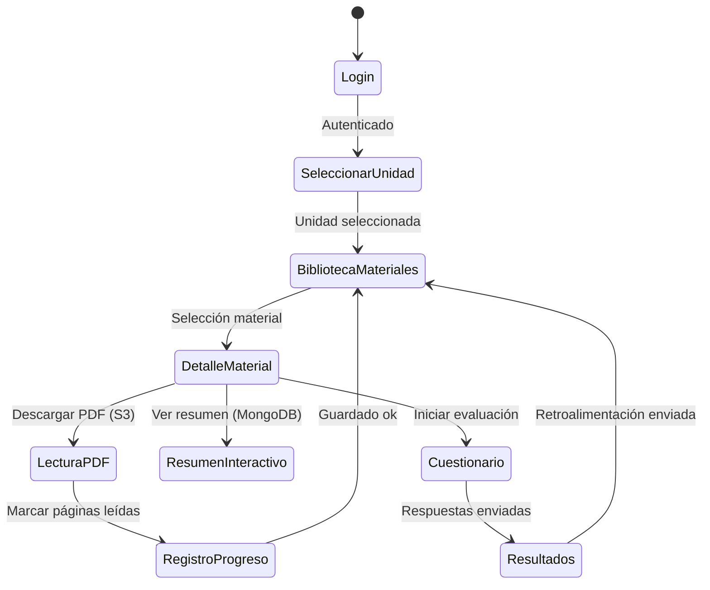

# App EduGo (Kotlin Multiplatform)

[Volver a Componentes](../README.md) · [Volver a Detalle del Enfoque Híbrido](../../README.md)

La app KMP ofrece experiencias nativas en Android, iOS y escritorio, sincronizando datos clave con la API y permitiendo consumo offline controlado.

## Flujos Principales

## Casos de Uso (App)

| Código | Nombre | Descripción | Interacciones |
|--------|--------|-------------|---------------|
| CU-KMP-01 | Autenticación | Inicia sesión mediante OAuth implicito + refresh | Endpoint `/v1/auth/login` |
| CU-KMP-02 | Explorar materiales | Lista por unidad/materia, aplica filtros | Endpoint `/v1/materials` |
| CU-KMP-03 | Consumo offline | Descarga PDF y resumen para lectura sin conexión | S3 (URL firmada), caché local |
| CU-KMP-04 | Registro de progreso | Sincroniza porcentaje leído y último acceso | Endpoint `/v1/materials/{id}` + PATCH progreso |
| CU-KMP-05 | Resolución de cuestionarios | Sincroniza preguntas y envía respuestas | Endpoints `/v1/materials/{id}/quiz`, `/v1/materials/{id}/quiz/attempts` |

## Pantallas y Componentes UI

- **Login:** formulario minimalista, incluye recuperación de contraseña (deep link a web).  
- **Selector de Unidad/Materia:** lista con chips filtrables; muestra conteo de materiales nuevos y etiquetas de jerarquía (colegio, año, sesión).  
- **Biblioteca de Materiales:** grid/lista con estados (nuevo, en progreso, completado). Actualiza cada vez que se abre y vía push (opcional).  
- **Detalle de Material:** pestañas `Descripción`, `Resumen`, `Evaluación`, `Notas personales`.  
- **Lector PDF:** usa motor nativo (Android PdfRenderer / iOS PDFKit) con marcadores y notas.  
- **Resumen Interactivo:** bloques colapsables, glosario contextual, botón “Solicitar actualización”.  
- **Cuestionario:** UI tipo cards con retroalimentación inmediata y resumen final.

## Sincronización y Estructuras de Datos Locales

- **Cache SQLDelight (KMP):**
  - `local_material`: espeja campos clave de `MATERIAL` + fecha de sincronización.
  - `local_resumen`: almacena JSON comprimido (Brotli) de resúmenes.
  - `local_progreso`: guarda progreso offline (timestamp, porcentaje) para reconciliar.

- **Workflow de sincronización:**
  1. Pull inicial (`/materials`) → actualiza caché.
  2. Descarga diferida de PDFs con control de tamaño (<50 MB) y purga LRU.
  3. Progreso local → cola interna; al recuperar conexión se hace PATCH batched.

## Consideraciones de UX y Técnicas

- **Estados claros:** mostrar chips “Procesando resumen” cuando aún no existe documento en MongoDB, con opción de solicitar regeneración (POST `/reprocess` futuro).
- **Accesibilidad:** manejo de tamaños de fuente, lector en voz opcional (delegado a OS).
- **Telemetría:** eventos clave enviados a API (`/v1/analytics` futuro) o a un servicio de métricas anónimo.
- **Seguridad:** almacenar tokens en llaveros seguros (Keychain/Keystore); PDFs cifrados en disco con claves derivadas del usuario.
