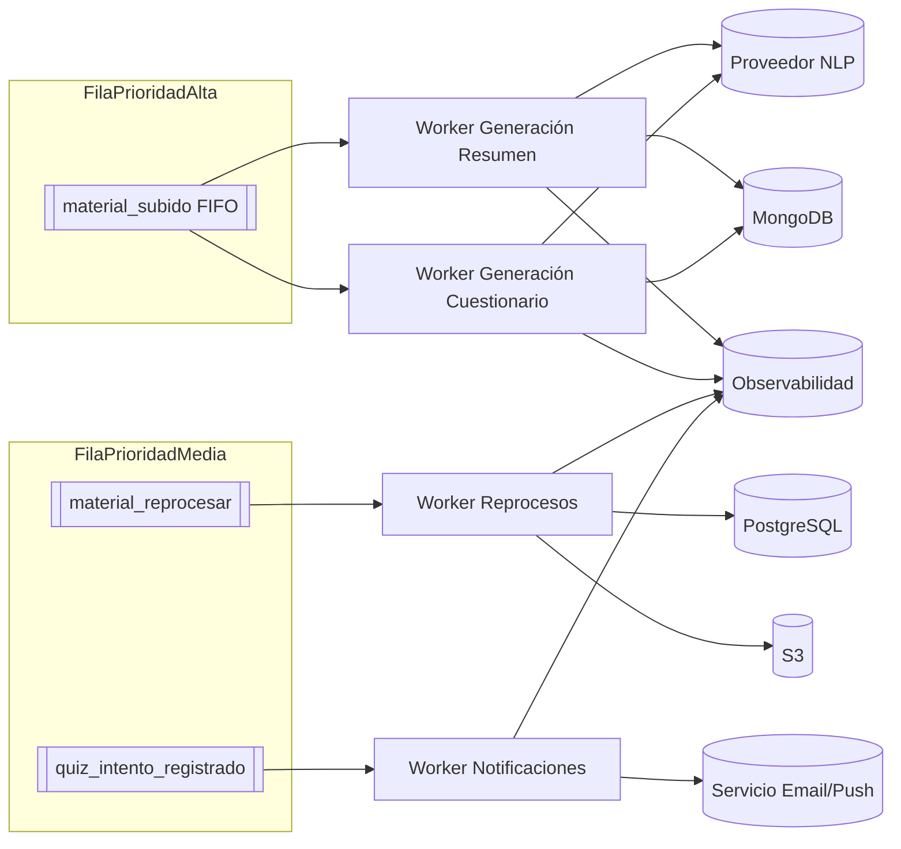

# Procesamiento Asíncrono y Colas

[Volver a Componentes](../README.md) · [Volver a Detalle del Enfoque Híbrido](../../README.md)

Los trabajos asíncronos garantizan que operaciones costosas (NLP, extracción de preguntas, notificaciones) no bloqueen la API. Se proponen colas priorizadas y workers especializados.

## Cola y Tipos de Mensajes

| Tipo de evento | Disparador | Payload mínimo | Objetivo |
|----------------|-----------|----------------|----------|
| `material_subido` | POST `/materials` exitoso | `material_id`, `docente_id`, `s3_key`, `idioma` | Generar resumen y cuestionario inicial |
| `material_reprocesar` | Solicitud docente / inconsistencia | `material_id`, `motivo`, `forzar` | Regenerar artefactos manteniendo histórico |
| `quiz_intento_registrado` | Alumno finaliza cuestionario | `intento_id`, `material_id`, `usuario_id`, `puntaje` | Notificar docente, actualizar métricas |
| `webhook_error` | Fallo en integraciones externas | `origen`, `codigo`, `detalle` | Reintentos o fallback manual |

- **Broker recomendado:** Amazon SQS + SNS (simplicidad) o RabbitMQ (requiere multi-tenant). `material_subido` con deduplicación FIFO.

## Arquitectura de Workers

## Flujo de Generación de Resumen/Quiz

1. Worker obtiene evento (`material_subido`).
2. Descarga PDF desde S3 y normaliza a texto (`pdfminer`, `textract`).
3. Invoca servicio NLP (propio o SaaS) con prompts específicos:
   - Resumen estructurado (título, ideas clave, glosario).
   - Preguntas con dificultad incremental.
4. Valida contenido (longitud, detección de PII).
5. Persiste documentos en MongoDB (`upsert`).
6. Actualiza SQL con referencias (`doc_mongo`, estado).
7. Emite notificación al docente y métrica de rastreo (`Prometheus counter`).

## Reglas de Reintento y Monitoreo

- Reintentos exponenciales (máx. 5) con backoff: 1 min, 5 min, 15 min, 1 h, 6 h.
- Mensajes fallidos persistentes en `DLQ` (Dead Letter Queue) para revisión manual.
- Métricas clave:
  - Tiempo medio de generación (`material_subido` → `estado=disponible`).
  - Tasa de errores por tipo de worker.
  - Documentos desincronizados (SQL vs Mongo).
- Alertas (PagerDuty/Slack) cuando DLQ supera umbral o el tiempo medio >10 min.

## Seguridad y Cumplimiento

- Workers con roles IAM mínimos (solo lectura en bucket `source`, escritura en `processed`).
- Datos temporales en disco cifrados; se purgan tras completar la tarea.
- Registro exhaustivo de prompts y respuestas para auditoría (cumplimiento académico).
