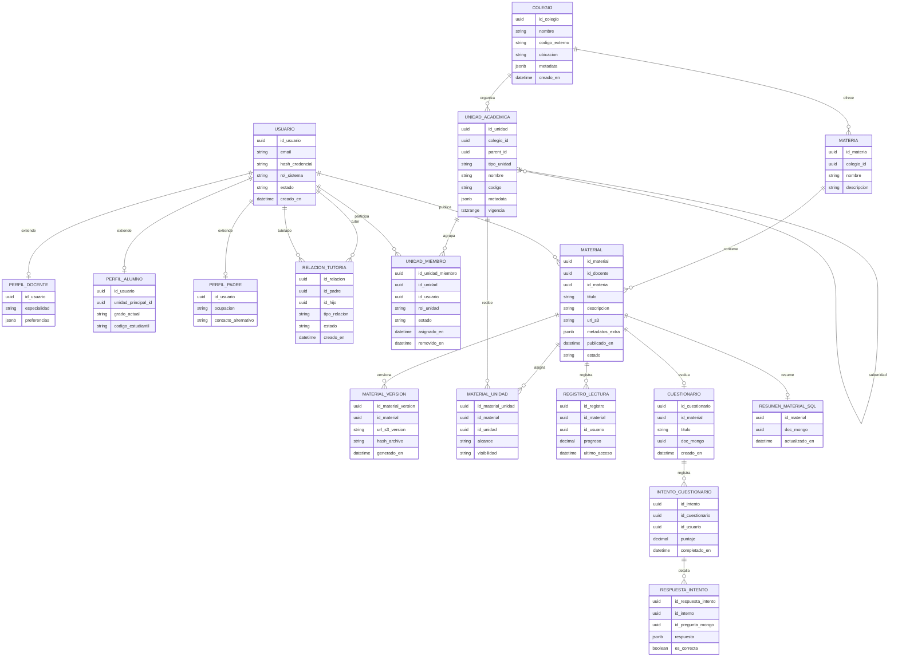

# Diagrama Entidad–Relación (SQL + Referencias NoSQL)

[Volver a Diagramas](./README.md) · [Volver a Detalle del Enfoque Híbrido](../README.md)



## Jerarquía Académica Flexible

- **Unidades escalables:** `UNIDAD_ACADEMICA` modela cualquier nivel (colegio → año escolar → sesión → subgrupos), con `parent_id` recursivo y metadatos `jsonb` para adaptar atributos específicos sin migraciones masivas.
- **Participación polimórfica:** `UNIDAD_MIEMBRO` permite que un usuario tenga múltiples roles simultáneos (docente titular en un año, co-docente en varias sesiones, alumno con sesiones optativas), preservando historial mediante `asignado_en` y `removido_en`.
- **Relaciones familiares:** `RELACION_TUTORIA` soporta que padres/tutores se vinculen a uno o varios alumnos, habilitando vistas familiares y permisos delegados.
- **Materiales reutilizables:** `MATERIAL_UNIDAD` conecta recursos con varias unidades (por ejemplo, compartir un material entre distintas sesiones o incluso entre colegios aliados).

## Claves del Modelo Relacional

- **Consultas jerárquicas eficientes:** PostgreSQL maneja árboles con CTE recursivos o extensiones como `ltree`, manteniendo integridad y buen rendimiento para navegar niveles verticales y horizontales.
- **Control de integridad:** Constraints (`CHECK tipo_unidad`, claves foráneas, `EXCLUDE` para vigencias superpuestas) garantizan consistencia ante la expansión de relaciones.
- **Históricos nativos:** Campos temporales (`tstzrange`, `asignado_en`, `removido_en`) facilitan auditoría y reportes evolutivos sin duplicar tablas.

## Documentos en MongoDB (NoSQL)

| Colección | Clave primaria | Contenido | Origen SQL relacionado |
|-----------|----------------|-----------|------------------------|
| `resumen_material` | `_id` (`doc_mongo`) | Secciones, glosario, tareas sugeridas, métricas de calidad | `RESUMEN_MATERIAL_SQL.doc_mongo` |
| `cuestionario_material` | `_id` (`doc_mongo`) | Preguntas, opciones, respuestas, retroalimentación | `CUESTIONARIO.doc_mongo` + `RESPUESTA_INTENTO.id_pregunta_mongo` |
| `evento_material` | `_id` autogenerado | Logs de actividades (visitas, descargas, errores IA) | `MATERIAL.id_material` |
| `unidad_social_feed` | `_id` autogenerado | Publicaciones, comentarios y reacciones por unidad académica | `UNIDAD_ACADEMICA.id_unidad` |
| `relacion_usuario_grafo` | `_id` (`uuid`) | Representación flexible de conexiones sociales (seguimientos, afinidades) | Complementa a `RELACION_TUTORIA` y futuros vínculos |

Las colecciones sociales permiten evolucionar hacia funcionalidades tipo red social sin comprometer la normalización del esquema SQL; se indexan por `unidad_id` y `usuario_id` para lecturas rápidas de feed.

## Organización en S3 (Almacenamiento de Objetos)

```
s3://edugo-materiales/{id_colegio}/{id_unidad}/{id_material}/
  ├─ source/
  │   ├─ {timestamp}_original.pdf
  ├─ processed/
  │   ├─ {id_material_version}.pdf
  │   └─ {id_material_version}.json   # resultados NLP opcionales
  └─ assets/
      └─ portada_{id_material_version}.png
```

- El prefijo ahora incluye `id_unidad` para aislar materiales por sesión o año escolar.
- `MATERIAL_UNIDAD.alcance` define si un recurso es público en todo el colegio, limitado a una sesión o compartido entre aliados externos.
- Eventos de subida disparan trabajos en cola para generar resúmenes y cuestionarios, manteniendo trazabilidad entre S3, SQL y MongoDB.
