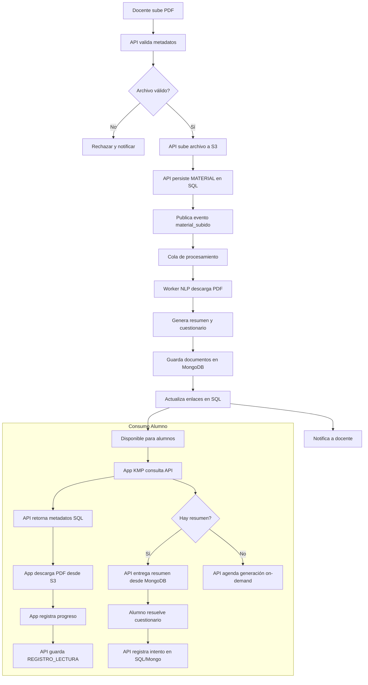

# Diagrama de Procesos Clave

[Volver a Diagramas](./README.md) · [Volver a Detalle del Enfoque Híbrido](../README.md)

## Puntos de Control

- **Validaciones tempranas:** La API bloquea archivos sin metadatos completos y escribe en S3 solamente tras validar tamaño, tipo MIME y permisos.
- **Procesamiento asíncrono desacoplado:** Los workers consumen de la cola `material_subido`, evitando saturar la API y permitiendo escalado horizontal.
- **Actualización incremental:** Una vez generado un resumen, se mantiene en MongoDB; regeneraciones futuras usan banderas en SQL (`MATERIAL.estado`).
- **Feedback inmediato:** Notificaciones al docente (email/webhook) tras finalizar cada etapa ayudan a detectar fallos tempranos.
- **Trazabilidad estudiantil:** `REGISTRO_LECTURA` e `INTENTO_CUESTIONARIO` permiten seguimiento del aprendizaje y auditoría.
