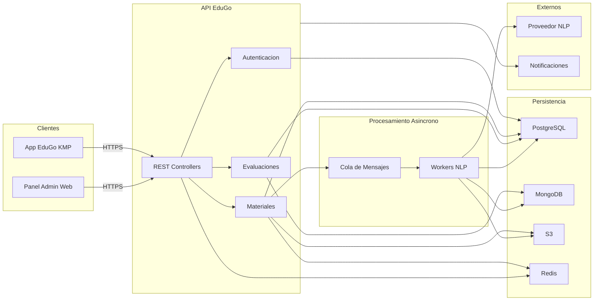

# Diagrama de Arquitectura de Referencia

[Volver a Diagramas](./README.md) · [Volver a Detalle del Enfoque Híbrido](../README.md)

## Capas y Responsabilidades

- **Clientes (KMP / Admin Web):** Consumen la API mediante OAuth 2.0 + JWT. La app KMP usa descargas directas de S3 autenticadas por URL firmada.
- **API EduGo (Go):** Arquitectura hexagonal: controladores ligeros, servicios de dominio desacoplados, adaptadores de persistencia específicos por tecnología.
- **Persistencia:** PostgreSQL para datos relacionales; MongoDB para contenido flexible; S3 para binarios; Redis mejora caché de sesiones, resúmenes recientes y rate limiting.
- **Procesamiento asíncrono:** Workers en Go/Python especializados en tareas NLP, ejecutados sobre colas (SQS, RabbitMQ o NATS JetStream). Pueden escalar independientemente de la API.
- **Integraciones externas:** Servicios NLP generativos y notificaciones se aíslan tras un orquestador para facilitar sustituciones futuras sin afectar la API.

## Supuestos Tecnológicos

- Despliegue en contenedores (Kubernetes o ECS) con observabilidad centralizada (Prometheus + Grafana + ELK).
- Secretos gestionados vía AWS Secrets Manager / Vault.
- Pipelines CI/CD automatizados para validar migraciones SQL y pruebas de contratos de API.
