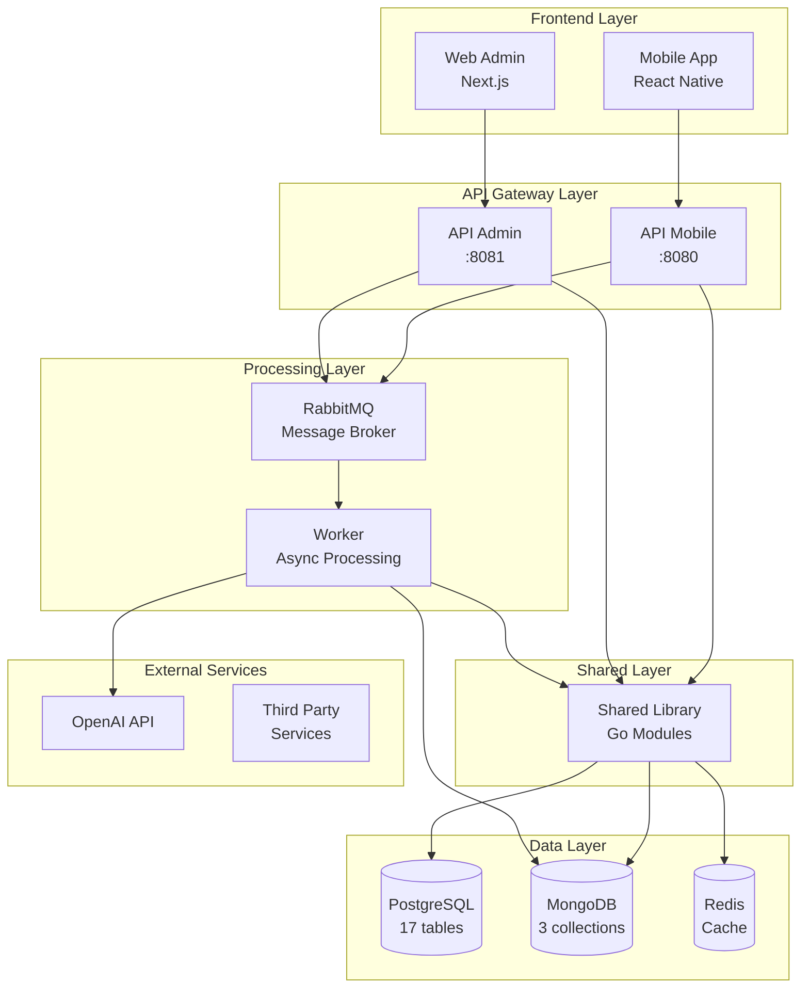

# 🌍 Ecosistema EduGo - Vista General

## 📋 Resumen Ejecutivo

EduGo es una plataforma educativa integral compuesta por 5 repositorios independientes que trabajan en conjunto para ofrecer una solución completa de gestión educativa con capacidades de IA.

### Estado Actual del Ecosistema
```
Completitud Global:     45%  █████████░░░░░░░░░░░
Proyectos Activos:      5 repositorios
Timeline Total:         Q2 2026 (6 meses para 100%)
Inversión Estimada:     $29,500 USD
```

## 🏗️ Arquitectura de Microservicios



## 📦 Repositorios del Ecosistema

### 1. edugo-shared (80% completado)
**Propósito**: Biblioteca compartida con funcionalidades core  
**Stack**: Go 1.21+, GORM, Viper  
**Estado**: Parcialmente publicado como módulos Go

**Módulos Principales**:
- `pkg/config`: Gestión de configuración multi-ambiente ✅
- `pkg/database`: Conexiones y modelos ✅
- `pkg/auth`: JWT y autenticación ✅
- `pkg/messaging`: RabbitMQ publisher/consumer ✅
- `pkg/logger`: Logging estructurado ✅
- `pkg/testing`: Utilidades de testing ⚠️ (60%)
- `pkg/evaluation`: Sistema de evaluaciones ❌ (0%)

### 2. edugo-api-mobile (60% completado)
**Propósito**: API REST para aplicación móvil  
**Stack**: Go, Gin Framework, Swagger  
**Puerto**: 8080  
**Estado**: Funcional pero incompleto

**Endpoints Implementados**:
- `/auth/*`: Autenticación completa ✅
- `/users/*`: Gestión de usuarios ✅
- `/schools/*`: Gestión de escuelas ✅
- `/materials/*`: CRUD de materiales ✅
- `/progress/*`: Tracking de progreso ✅
- `/evaluations/*`: Sistema de evaluaciones ❌ (0%)
- `/analytics/*`: Dashboard analytics ❌ (0%)

### 3. edugo-api-administracion (100% completado)
**Propósito**: API REST para panel administrativo  
**Stack**: Go, Gin Framework, Swagger  
**Puerto**: 8081  
**Estado**: Completamente funcional

**Módulos Completos**:
- Jerarquía académica completa ✅
- Gestión de instituciones ✅
- Administración de usuarios ✅
- Reportes y estadísticas ✅
- Configuración del sistema ✅

### 4. edugo-worker (48% completado)
**Propósito**: Procesamiento asíncrono y tareas con IA  
**Stack**: Go, RabbitMQ, OpenAI SDK  
**Estado**: Parcialmente implementado

**Procesadores Implementados**:
- `MaterialProcessor`: Resúmenes básicos ✅
- `QuizGenerator`: Generación simple ⚠️ (50%)
- `EvaluationProcessor`: No implementado ❌ (0%)
- `NotificationProcessor`: No implementado ❌ (0%)
- `AnalyticsProcessor`: No implementado ❌ (0%)

### 5. edugo-dev-environment (40% completado)
**Propósito**: Entorno Docker para desarrollo local  
**Stack**: Docker Compose, Scripts Bash  
**Estado**: Funcional pero desactualizado

**Servicios Configurados**:
- PostgreSQL 15 ✅
- MongoDB 7.0 ✅
- RabbitMQ 3.12 ✅
- Redis 7.2 ⚠️ (configurado pero no usado)
- Nginx ❌ (no configurado)

## 🔄 Flujos de Datos Críticos

### Flujo 1: Creación de Material Educativo
```
1. Admin crea material → API-Admin
2. API-Admin → PostgreSQL (guardar)
3. API-Admin → RabbitMQ (evento: material.created)
4. Worker consume evento
5. Worker → OpenAI API (generar resumen)
6. Worker → MongoDB (guardar resumen)
7. Worker → RabbitMQ (evento: summary.ready)
8. API-Mobile notifica usuarios
```

### Flujo 2: Evaluación de Estudiante
```
1. Estudiante inicia quiz → API-Mobile
2. API-Mobile → PostgreSQL (crear sesión)
3. Estudiante envía respuestas → API-Mobile
4. API-Mobile → RabbitMQ (evento: evaluation.submitted)
5. Worker procesa respuestas
6. Worker → PostgreSQL (guardar resultados)
7. Worker → MongoDB (analytics)
8. Worker → RabbitMQ (evento: evaluation.completed)
```

## 💾 Modelo de Datos

### PostgreSQL (Datos Relacionales)
**17 Tablas Principales**:
- `users`: Usuarios del sistema
- `schools`: Instituciones educativas
- `academic_levels`: Niveles académicos
- `subjects`: Materias
- `materials`: Contenido educativo
- `evaluations`: Evaluaciones y quizzes
- `student_progress`: Progreso individual
- `evaluation_results`: Resultados de evaluaciones
- ... (9 tablas adicionales de soporte)

### MongoDB (Datos No Estructurados)
**3 Colecciones**:
- `material_summaries`: Resúmenes generados por IA
- `material_assessments`: Evaluaciones generadas
- `material_events`: Log de eventos del sistema

## 🔐 Modelo de Seguridad

### Autenticación
- JWT tokens con refresh tokens
- Duración access: 15 minutos
- Duración refresh: 7 días
- Almacenamiento seguro en PostgreSQL

### Autorización
- RBAC con 4 roles principales:
  - `super_admin`: Control total
  - `school_admin`: Gestión de escuela
  - `teacher`: Gestión de contenido
  - `student`: Consumo de contenido

### Encriptación
- Passwords: bcrypt (cost 10)
- Tokens: HS256
- Datos sensibles: AES-256
- Comunicación: HTTPS obligatorio

## 🚀 Stack Tecnológico Global

### Backend
- **Lenguaje**: Go 1.21+
- **Framework Web**: Gin
- **ORM**: GORM v2
- **Validación**: go-playground/validator
- **Documentación**: Swagger/OpenAPI 3.0

### Bases de Datos
- **PostgreSQL 15**: Datos relacionales
- **MongoDB 7.0**: Documentos y analytics
- **Redis 7.2**: Cache y sesiones (opcional)

### Mensajería
- **RabbitMQ 3.12**: Eventos asíncronos
- **Protocolo**: AMQP
- **Exchanges**: Topic-based routing

### Infraestructura
- **Docker**: Contenedores
- **Docker Compose**: Orquestación local
- **GitHub Actions**: CI/CD principal
- **GitLab CI**: Mirror y backup

### Herramientas
- **SOPS + Age**: Gestión de secretos
- **Viper**: Configuración multi-ambiente
- **Make**: Automatización de tareas
- **golangci-lint**: Calidad de código

## 📈 Métricas del Ecosistema

### Cobertura de Tests
```
edugo-shared:           75% (objetivo: 85%)
edugo-api-mobile:       65% (objetivo: 80%)
edugo-api-admin:        82% (objetivo: 85%)
edugo-worker:           45% (objetivo: 80%)
```

### Performance
- API Response Time: <200ms (p95)
- Worker Processing: <5s por tarea
- Database Queries: <50ms
- Cache Hit Rate: >80%

### Disponibilidad
- Uptime objetivo: 99.9%
- RTO: 1 hora
- RPO: 15 minutos
- Backup: Diario

## 🎯 Objetivos Q1-Q2 2026

### Q1 2026 (Enero-Marzo)
1. **Sistema de Evaluaciones** (3 semanas)
2. **Procesamiento IA Completo** (3 semanas)
3. **Integración Cross-API** (2 semanas)
4. **Sistema de Notificaciones** (2 semanas)

### Q2 2026 (Abril-Junio)
5. **Analytics Dashboard** (3 semanas)
6. **Optimización Performance** (2 semanas)
7. **Migración de Datos** (2 semanas)
8. **Auditoría y Logs** (1 semana)

## 🔄 Dependencias Críticas

### Orden de Desarrollo Obligatorio
1. `shared/evaluation` → Módulo base para evaluaciones
2. `api-mobile/evaluations` → Endpoints de evaluación
3. `worker/evaluation-processor` → Procesamiento de resultados
4. `api-admin/reports` → Reportes de evaluaciones

### Dependencias Técnicas
- PostgreSQL debe estar activo para cualquier servicio
- RabbitMQ requerido para worker
- MongoDB requerido para analytics
- Redis opcional pero recomendado para performance

## 📊 Estimación de Recursos

### Equipo Requerido
- 2 Backend Developers Senior (Go)
- 1 DevOps Engineer
- 1 QA Engineer
- 0.5 Project Manager

### Timeline
- **Fase 1**: 8 semanas (Evaluaciones + IA)
- **Fase 2**: 6 semanas (Integración + Notificaciones)
- **Fase 3**: 4 semanas (Analytics + Optimización)
- **Total**: 18 semanas (4.5 meses)

### Presupuesto Estimado
- Desarrollo: $25,000
- Infraestructura: $2,500
- Licencias y servicios: $2,000
- **Total**: $29,500 USD

## ⚠️ Riesgos Identificados

### Alto Riesgo
1. **Dependencia de OpenAI API**: Costos variables y latencia
2. **Complejidad de evaluaciones**: Modelo de datos complejo

### Medio Riesgo
3. **Integración multi-repo**: Coordinación de cambios
4. **Performance con volumen**: No probado a escala

### Mitigaciones
- Implementar cache agresivo para OpenAI
- Tests de carga tempranos
- Feature flags para rollback rápido
- Versionado semántico estricto

## ✅ Criterios de Éxito

1. **Funcionalidad**: 100% features críticas implementadas
2. **Performance**: <200ms response time (p95)
3. **Calidad**: >80% cobertura de tests
4. **Disponibilidad**: 99.9% uptime
5. **Adopción**: 1000+ usuarios activos mensuales

---

**Última actualización**: 2025-11-14  
**Próxima revisión**: 2025-12-01  
**Documento generado para**: Ejecución desatendida por IA