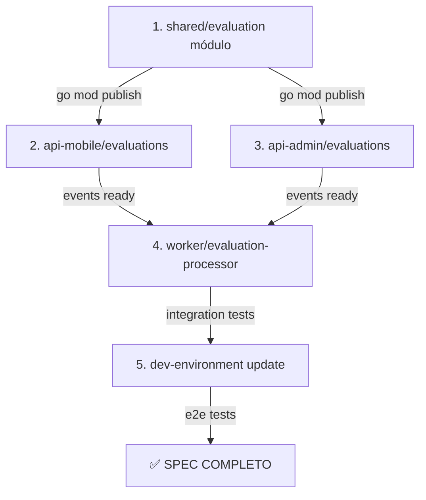
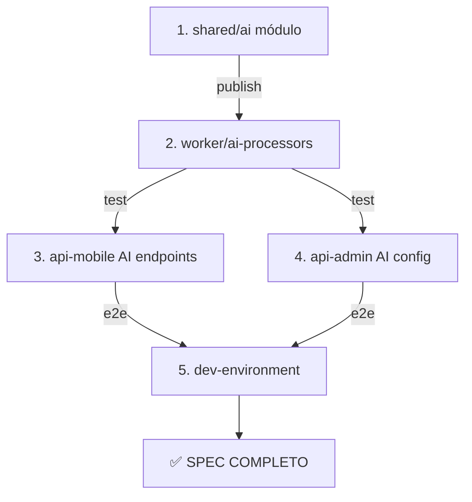
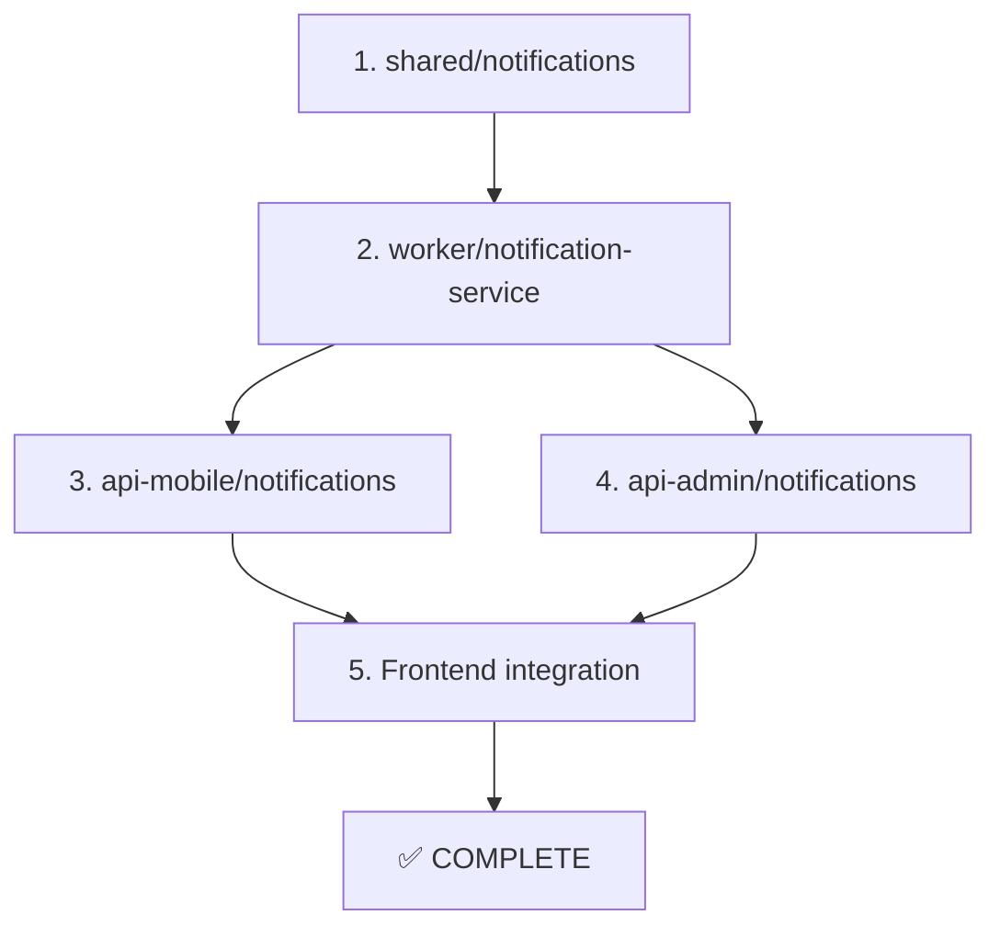

# 🔄 Orden de Ejecución Obligatorio - EduGo

## ⚠️ IMPORTANTE
Este documento define el **orden estricto** que DEBE seguirse al implementar funcionalidades. Violar este orden resultará en errores de compilación, dependencias faltantes o funcionalidades rotas.

## 📋 Reglas Fundamentales

1. **NUNCA** saltar pasos en el orden definido
2. **SIEMPRE** completar y validar un paso antes de continuar
3. **VERIFICAR** que las dependencias estén publicadas antes de usarlas
4. **TESTEAR** integración después de cada paso completado
5. **DOCUMENTAR** cualquier desviación del plan (debe ser aprobada)

## 🎯 Orden de Ejecución por Especificación

### 📦 Spec-01: Sistema de Evaluaciones

**Orden OBLIGATORIO de implementación**:



#### Detalle de Pasos:

**Paso 1: edugo-shared - Módulo de Evaluaciones**
```bash
# Repositorio: edugo-shared
# Branch: feature/evaluation-module
# Tiempo estimado: 3 días

Tareas en orden:
1.1. Crear pkg/evaluation/models.go - Modelos base
1.2. Crear pkg/evaluation/interfaces.go - Contratos
1.3. Crear pkg/evaluation/repository.go - Acceso a datos
1.4. Crear pkg/evaluation/service.go - Lógica de negocio
1.5. Crear pkg/evaluation/validators.go - Validaciones
1.6. Escribir tests unitarios (>85% cobertura)
1.7. Actualizar go.mod con nueva versión
1.8. Publicar módulo: v1.3.0
```

**Paso 2: api-mobile - Endpoints de Evaluaciones**
```bash
# Repositorio: edugo-api-mobile
# Branch: feature/evaluation-endpoints
# Tiempo estimado: 4 días
# PREREQUISITO: shared v1.3.0 publicado

Tareas en orden:
2.1. Actualizar go.mod: require edugo-shared v1.3.0
2.2. Crear internal/handlers/evaluation_handler.go
2.3. Crear internal/routes/evaluation_routes.go
2.4. Implementar endpoints:
     - POST /evaluations - Crear evaluación
     - GET /evaluations/:id - Obtener evaluación
     - POST /evaluations/:id/submit - Enviar respuestas
     - GET /evaluations/:id/results - Ver resultados
2.5. Actualizar Swagger documentation
2.6. Escribir tests de integración
2.7. Publicar eventos a RabbitMQ
```

**Paso 3: api-admin - Gestión de Evaluaciones**
```bash
# Repositorio: edugo-api-administracion
# Branch: feature/evaluation-management
# Tiempo estimado: 3 días
# PREREQUISITO: shared v1.3.0 publicado
# PUEDE ejecutarse en PARALELO con Paso 2

Tareas en orden:
3.1. Actualizar go.mod: require edugo-shared v1.3.0
3.2. Crear internal/handlers/admin_evaluation_handler.go
3.3. Implementar endpoints admin:
     - POST /admin/evaluations - Crear evaluación
     - PUT /admin/evaluations/:id - Editar evaluación
     - DELETE /admin/evaluations/:id - Eliminar evaluación
     - GET /admin/evaluations/reports - Reportes
3.4. Crear internal/services/reports_service.go
3.5. Tests y documentación
```

**Paso 4: worker - Procesador de Evaluaciones**
```bash
# Repositorio: edugo-worker
# Branch: feature/evaluation-processor
# Tiempo estimado: 4 días
# PREREQUISITO: Pasos 2 y 3 completados (eventos definidos)

Tareas en orden:
4.1. Actualizar go.mod: require edugo-shared v1.3.0
4.2. Crear processors/evaluation_processor.go
4.3. Implementar consumers:
     - evaluation.submitted -> Procesar respuestas
     - evaluation.grading -> Calificar con IA
4.4. Implementar publishers:
     - evaluation.completed -> Notificar resultado
4.5. Integración con OpenAI para análisis
4.6. Guardar resultados en MongoDB
4.7. Tests con RabbitMQ
```

**Paso 5: dev-environment - Actualización**
```bash
# Repositorio: edugo-dev-environment
# Branch: feature/evaluation-support
# Tiempo estimado: 1 día
# PREREQUISITO: Todos los pasos anteriores

Tareas:
5.1. Actualizar docker-compose.yml
5.2. Agregar scripts de inicialización
5.3. Crear datos de prueba
5.4. Ejecutar tests E2E completos
```

### 📦 Spec-02: Procesamiento IA Completo

**Orden OBLIGATORIO de implementación**:



#### Detalle de Pasos:

**Paso 1: edugo-shared - Módulo IA**
```bash
# Repositorio: edugo-shared
# Branch: feature/ai-module
# Tiempo estimado: 2 días

Tareas:
1.1. Crear pkg/ai/interfaces.go
1.2. Crear pkg/ai/openai_client.go
1.3. Crear pkg/ai/prompts.go
1.4. Crear pkg/ai/cache.go
1.5. Tests y mocks
1.6. Publicar v1.4.0
```

**Paso 2: worker - Procesadores IA**
```bash
# Repositorio: edugo-worker
# Branch: feature/ai-processors
# Tiempo estimado: 5 días
# PREREQUISITO: shared v1.4.0

Tareas:
2.1. Actualizar go.mod
2.2. Refactorizar processors con nuevo módulo
2.3. Implementar nuevos processors:
     - summary_processor.go (mejorado)
     - quiz_generator.go (completo)
     - content_analyzer.go (nuevo)
2.4. Optimizar prompts
2.5. Implementar cache
2.6. Tests con OpenAI
```

### 📦 Spec-03: Sistema de Notificaciones

**Orden OBLIGATORIO**:



## 🔐 Validaciones Entre Pasos

### Checkpoint después de cada módulo shared:
```bash
# En shared, después de publicar nueva versión:
git tag v1.X.0
git push origin v1.X.0
go list -m github.com/EduGoGroup/edugo-shared@v1.X.0

# Verificar que el módulo es accesible:
go get github.com/EduGoGroup/edugo-shared@v1.X.0
```

### Checkpoint después de APIs:
```bash
# Verificar endpoints:
curl -X GET http://localhost:8080/health
curl -X GET http://localhost:8080/swagger/index.html

# Verificar eventos en RabbitMQ:
rabbitmqctl list_exchanges
rabbitmqctl list_queues
```

### Checkpoint después de worker:
```bash
# Verificar consumers activos:
docker logs edugo-worker | grep "Consumer started"

# Verificar procesamiento:
# Publicar evento de test y verificar logs
```

## 🚫 Errores Comunes y Cómo Evitarlos

### Error 1: Dependencia no encontrada
```bash
# ❌ MALO: Actualizar go.mod antes de publicar shared
go get github.com/EduGoGroup/edugo-shared@v1.3.0
# Error: module not found

# ✅ BUENO: Primero publicar, luego actualizar
cd edugo-shared
git tag v1.3.0 && git push origin v1.3.0
cd ../edugo-api-mobile
go get github.com/EduGoGroup/edugo-shared@v1.3.0
```

### Error 2: Eventos no definidos
```bash
# ❌ MALO: Worker consume eventos antes de que APIs los publiquen
# worker/config.yml
consumers:
  - evaluation.submitted  # API aún no publica este evento

# ✅ BUENO: Primero implementar publishers, luego consumers
# 1. Implementar en api-mobile
# 2. Verificar evento en RabbitMQ
# 3. Entonces implementar consumer en worker
```

### Error 3: Modelos incompatibles
```bash
# ❌ MALO: Diferentes estructuras en diferentes repos
// api-mobile
type Evaluation struct {
    ID   int
    Name string
}

// worker  
type Evaluation struct {
    ID    string  // Tipo diferente!
    Title string  // Campo diferente!
}

# ✅ BUENO: Usar modelos de shared
import "github.com/EduGoGroup/edugo-shared/pkg/evaluation"
// Usar evaluation.Evaluation en todos lados
```

## 📊 Matriz de Tiempos Estimados

| Especificación | Shared | API-Mobile | API-Admin | Worker | Dev-Env | TOTAL |
|---------------|--------|------------|-----------|--------|---------|-------|
| Spec-01: Evaluaciones | 3 días | 4 días | 3 días | 4 días | 1 día | **15 días** |
| Spec-02: IA Completa | 2 días | 2 días | 1 día | 5 días | 1 día | **11 días** |
| Spec-03: Notificaciones | 2 días | 2 días | 1 día | 3 días | 1 día | **9 días** |
| Spec-04: Analytics | 3 días | 3 días | 4 días | 3 días | 1 día | **14 días** |

## 🔄 Proceso de Rollback

Si algo sale mal en cualquier paso:

### Rollback Inmediato (< 1 hora)
```bash
# 1. Detener servicios afectados
docker-compose stop api-mobile worker

# 2. Revertir a versión anterior en go.mod
go mod edit -require=github.com/EduGoGroup/edugo-shared@v1.2.0
go mod download

# 3. Revertir código
git reset --hard HEAD~1

# 4. Reiniciar servicios
docker-compose up -d api-mobile worker
```

### Rollback Complejo (> 1 hora en producción)
```bash
# 1. Activar feature flag para deshabilitar feature
curl -X POST http://api-admin:8081/admin/features/disable \
  -d '{"feature": "evaluations"}'

# 2. Crear hotfix branch
git checkout -b hotfix/rollback-evaluations

# 3. Revertir cambios manteniendo historia
git revert <commit-hash>

# 4. Deploy hotfix
# 5. Planificar fix forward
```

## ✅ Checklist de Validación Final

Antes de marcar un Spec como completo:

- [ ] Todos los tests unitarios pasando (>85% cobertura)
- [ ] Tests de integración ejecutados exitosamente
- [ ] Tests E2E completos sin errores
- [ ] Documentación actualizada (README, Swagger, CHANGELOG)
- [ ] Sin errores en logs de producción por 24 horas
- [ ] Métricas de performance dentro de SLA
- [ ] Feature flag probado (on/off)
- [ ] Plan de rollback documentado y probado
- [ ] Code review aprobado por 2+ developers
- [ ] QA sign-off completo

## 📅 Calendario de Ejecución Sugerido

### Semana 1-2: Spec-01 (Evaluaciones)
- Lunes-Miércoles: shared/evaluation
- Jueves-Lunes: api-mobile + api-admin (paralelo)
- Martes-Viernes: worker
- Viernes: dev-environment + testing

### Semana 3-4: Spec-02 (IA)
- Lunes-Martes: shared/ai
- Miércoles-Domingo: worker processors
- Lunes-Martes: APIs integration
- Miércoles: Testing completo

### Semana 5: Spec-03 (Notificaciones)
- Lunes-Martes: shared/notifications
- Miércoles-Jueves: worker service
- Viernes: APIs + testing

---

**⚠️ RECORDATORIO FINAL**: Este orden NO es sugerencia, es OBLIGATORIO. Desviarse causará problemas de integración, retrasos y posibles bugs en producción.

**Última actualización**: 2025-11-14  
**Próxima revisión**: Al completar Spec-01  
**Contacto ante dudas**: Revisar logs de cada paso antes de continuar