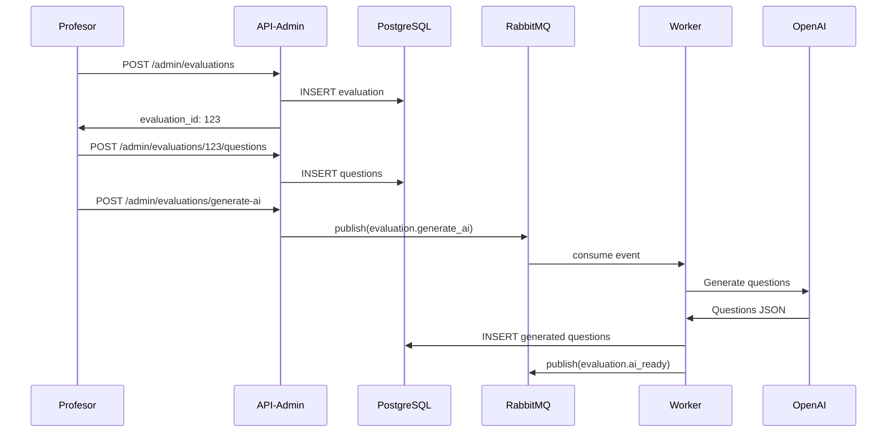
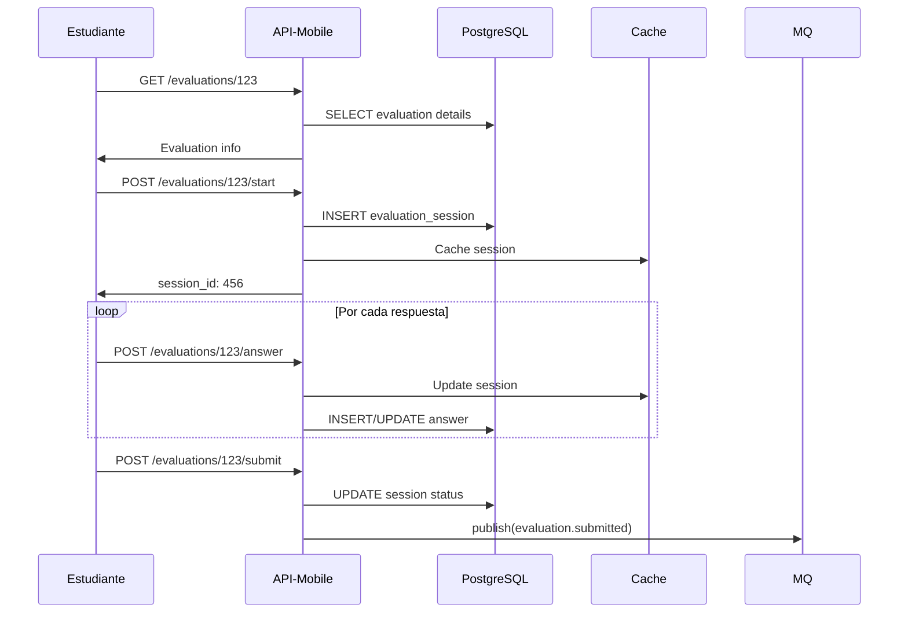
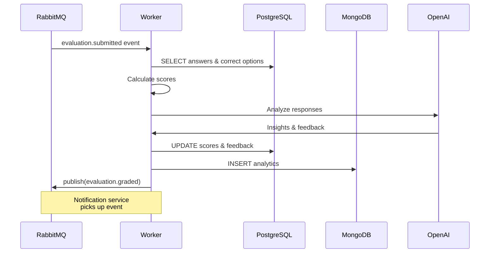

# 📝 Spec-01: Sistema de Evaluaciones

## 📋 Overview

### Descripción
Implementación completa del sistema de evaluaciones para EduGo, incluyendo creación, toma, calificación automática y análisis de resultados con IA.

### Estado Actual
```
Completitud:        0%   ⬜⬜⬜⬜⬜⬜⬜⬜⬜⬜
Proyectos Afectados: 4 (shared, api-mobile, api-admin, worker)
Timeline Estimado:   15 días laborables
Prioridad:          🔴 CRÍTICA (bloqueante para MVP)
```

### Objetivos
1. ✅ Permitir a profesores crear evaluaciones personalizadas
2. ✅ Generar evaluaciones automáticamente con IA
3. ✅ Proveer interfaz intuitiva para estudiantes
4. ✅ Calificación automática con feedback detallado
5. ✅ Analytics de resultados en tiempo real

## 🎯 Alcance Funcional

### Features a Implementar
```
✅ Incluido en este Spec:
├── Modelos de datos para evaluaciones
├── CRUD de evaluaciones y preguntas
├── Motor de toma de evaluaciones
├── Sistema de calificación automática
├── Generación de evaluaciones con IA
├── API endpoints completos
├── Procesamiento asíncrono de resultados
├── Dashboard de resultados básico
└── Tests unitarios e integración

❌ NO incluido (futuras iteraciones):
├── Evaluaciones adaptativas
├── Proctoring/anti-trampa avanzado
├── Banco de preguntas compartido
├── Análisis predictivo de desempeño
└── Gamificación de evaluaciones
```

## 📦 Componentes por Proyecto

### 1. edugo-shared (3 días)
**Objetivo**: Crear módulo base reutilizable
```go
pkg/evaluation/
├── models.go          // Estructuras de datos
├── interfaces.go      // Contratos
├── repository.go      // Acceso a datos
├── service.go         // Lógica de negocio
├── validators.go      // Validaciones
└── constants.go       // Enums y constantes
```

### 2. edugo-api-mobile (4 días)
**Objetivo**: Endpoints para estudiantes
```
Endpoints:
├── GET    /evaluations           // Listar disponibles
├── GET    /evaluations/:id       // Detalle evaluación
├── POST   /evaluations/:id/start // Iniciar evaluación
├── POST   /evaluations/:id/submit// Enviar respuestas
├── GET    /evaluations/:id/results// Ver resultados
└── GET    /evaluations/history   // Historial personal
```

### 3. edugo-api-administracion (3 días)
**Objetivo**: Gestión administrativa
```
Endpoints:
├── POST   /admin/evaluations     // Crear evaluación
├── PUT    /admin/evaluations/:id // Editar evaluación
├── DELETE /admin/evaluations/:id // Eliminar
├── POST   /admin/evaluations/:id/questions // Agregar preguntas
├── GET    /admin/evaluations/:id/results   // Ver todos resultados
├── GET    /admin/evaluations/reports       // Reportes generales
└── POST   /admin/evaluations/generate-ai   // Generar con IA
```

### 4. edugo-worker (4 días)
**Objetivo**: Procesamiento asíncrono
```
Processors:
├── evaluation_submitted_processor.go  // Procesar envíos
├── evaluation_grader.go              // Calificar respuestas
├── ai_evaluator.go                   // Análisis con IA
├── result_aggregator.go              // Agregar estadísticas
└── notification_dispatcher.go        // Notificar resultados
```

### 5. edugo-dev-environment (1 día)
**Objetivo**: Ambiente de desarrollo
```
Updates:
├── docker-compose.yml     // Agregar configuraciones
├── init-scripts/          // Datos de prueba
├── test-data/             // Evaluaciones ejemplo
└── e2e-tests/            // Tests end-to-end
```

## 💾 Modelo de Datos

### PostgreSQL - Nuevas Tablas
```sql
-- Tabla principal de evaluaciones
CREATE TABLE evaluations (
    id SERIAL PRIMARY KEY,
    title VARCHAR(255) NOT NULL,
    description TEXT,
    material_id INTEGER REFERENCES materials(id),
    subject_id INTEGER REFERENCES subjects(id),
    academic_level_id INTEGER REFERENCES academic_levels(id),
    created_by INTEGER REFERENCES users(id),
    duration_minutes INTEGER,
    passing_score DECIMAL(5,2),
    max_attempts INTEGER DEFAULT 1,
    shuffle_questions BOOLEAN DEFAULT false,
    show_results_immediately BOOLEAN DEFAULT true,
    status VARCHAR(20) DEFAULT 'draft',
    created_at TIMESTAMP DEFAULT NOW(),
    updated_at TIMESTAMP DEFAULT NOW()
);

-- Preguntas de la evaluación
CREATE TABLE evaluation_questions (
    id SERIAL PRIMARY KEY,
    evaluation_id INTEGER REFERENCES evaluations(id) ON DELETE CASCADE,
    question_text TEXT NOT NULL,
    question_type VARCHAR(20) NOT NULL, -- multiple_choice, true_false, short_answer, essay
    points DECIMAL(5,2) DEFAULT 1,
    order_index INTEGER,
    required BOOLEAN DEFAULT true,
    explanation TEXT,
    created_at TIMESTAMP DEFAULT NOW()
);

-- Opciones para preguntas de opción múltiple
CREATE TABLE question_options (
    id SERIAL PRIMARY KEY,
    question_id INTEGER REFERENCES evaluation_questions(id) ON DELETE CASCADE,
    option_text TEXT NOT NULL,
    is_correct BOOLEAN DEFAULT false,
    order_index INTEGER
);

-- Sesiones de evaluación (intentos)
CREATE TABLE evaluation_sessions (
    id SERIAL PRIMARY KEY,
    evaluation_id INTEGER REFERENCES evaluations(id),
    student_id INTEGER REFERENCES users(id),
    started_at TIMESTAMP DEFAULT NOW(),
    submitted_at TIMESTAMP,
    time_spent_seconds INTEGER,
    status VARCHAR(20) DEFAULT 'in_progress', -- in_progress, submitted, graded
    attempt_number INTEGER DEFAULT 1,
    ip_address INET,
    user_agent TEXT
);

-- Respuestas de los estudiantes
CREATE TABLE student_answers (
    id SERIAL PRIMARY KEY,
    session_id INTEGER REFERENCES evaluation_sessions(id) ON DELETE CASCADE,
    question_id INTEGER REFERENCES evaluation_questions(id),
    answer_text TEXT,
    selected_option_id INTEGER REFERENCES question_options(id),
    is_correct BOOLEAN,
    points_earned DECIMAL(5,2),
    graded_at TIMESTAMP,
    ai_feedback TEXT
);

-- Resultados agregados
CREATE TABLE evaluation_results (
    id SERIAL PRIMARY KEY,
    session_id INTEGER REFERENCES evaluation_sessions(id) ON DELETE CASCADE,
    total_score DECIMAL(5,2),
    percentage DECIMAL(5,2),
    passed BOOLEAN,
    ranking INTEGER,
    strengths JSONB,
    weaknesses JSONB,
    ai_analysis TEXT,
    created_at TIMESTAMP DEFAULT NOW()
);
```

### MongoDB - Colecciones
```javascript
// Colección: evaluation_analytics
{
  "_id": ObjectId,
  "evaluation_id": 123,
  "session_id": 456,
  "student_id": 789,
  "detailed_metrics": {
    "time_per_question": [30, 45, 20, ...],
    "confidence_scores": [0.8, 0.9, 0.6, ...],
    "difficulty_perception": [3, 5, 2, ...],
    "navigation_pattern": ["q1", "q2", "back_q1", "q2", "q3", ...],
    "hesitation_points": [{"question": 5, "changes": 3}, ...]
  },
  "ai_insights": {
    "learning_gaps": ["algebra básica", "gramática"],
    "recommended_topics": ["ecuaciones lineales", "uso de comas"],
    "predicted_performance": 0.75,
    "engagement_level": "high"
  },
  "timestamp": ISODate("2025-11-14T10:00:00Z")
}

// Colección: generated_evaluations
{
  "_id": ObjectId,
  "material_id": 123,
  "generation_prompt": "Create 10 questions about...",
  "generated_questions": [...],
  "ai_model": "gpt-4-turbo",
  "generation_time_ms": 3500,
  "quality_score": 0.92,
  "used_count": 5,
  "feedback_score": 4.5,
  "created_at": ISODate("2025-11-14T10:00:00Z")
}
```

## 🔄 Flujos de Trabajo

### Flujo 1: Creación de Evaluación


### Flujo 2: Toma de Evaluación


### Flujo 3: Calificación y Análisis


## 🎯 Criterios de Aceptación

### Funcionales
- [ ] Profesor puede crear evaluación con mínimo 5 preguntas
- [ ] Soporte para 4 tipos de preguntas diferentes
- [ ] Estudiante puede tomar evaluación sin interrupciones
- [ ] Calificación automática en <5 segundos
- [ ] Generación IA produce mínimo 10 preguntas válidas
- [ ] Resultados muestran análisis detallado
- [ ] Sistema soporta 100 evaluaciones concurrentes

### Técnicos
- [ ] Response time <200ms para endpoints GET
- [ ] Response time <500ms para endpoints POST
- [ ] Processing time <60s para generación IA
- [ ] Cobertura de tests >85%
- [ ] Zero downtime deployment
- [ ] Logs estructurados para debugging

### Seguridad
- [ ] Validación de permisos por rol
- [ ] Prevención de múltiples intentos no autorizados
- [ ] Sanitización de inputs para evitar XSS
- [ ] Rate limiting en endpoints públicos
- [ ] Encriptación de respuestas sensibles

## 📊 Métricas de Éxito

### KPIs Técnicos
| Métrica | Target | Medición |
|---------|--------|----------|
| API Latency (p95) | <200ms | Prometheus |
| Error Rate | <1% | Sentry |
| Test Coverage | >85% | SonarQube |
| Code Quality | A rating | SonarQube |
| Uptime | 99.9% | StatusPage |

### KPIs de Negocio
| Métrica | Target Semana 1 | Target Mes 1 |
|---------|-----------------|--------------|
| Evaluaciones creadas | 50 | 500 |
| Evaluaciones completadas | 200 | 2000 |
| Satisfacción usuarios | >4.0/5 | >4.5/5 |
| Tiempo promedio creación | <10 min | <7 min |
| Tasa de completitud | >80% | >85% |

## 🚀 Plan de Implementación

### Semana 1 (Días 1-5)
```
Lunes-Miércoles: edugo-shared
├── Día 1: Modelos y interfaces
├── Día 2: Repository y service
└── Día 3: Validators, tests y publicación v1.3.0

Jueves-Viernes: Inicio API-Mobile + API-Admin
├── Día 4: Setup y estructura base
└── Día 5: Primeros endpoints
```

### Semana 2 (Días 6-10)
```
Lunes-Martes: Completar APIs
├── Día 6: API-Mobile endpoints restantes
├── Día 7: API-Admin endpoints restantes

Miércoles-Viernes: Worker
├── Día 8: Processors básicos
├── Día 9: Integración IA
└── Día 10: Tests y optimización
```

### Semana 3 (Días 11-15)
```
Lunes-Jueves: Integración y Testing
├── Día 11: Integration tests
├── Día 12: E2E tests
├── Día 13: Bug fixes
└── Día 14: Performance tuning

Viernes: Deployment
├── Dev-environment update
├── Documentation
└── Demo preparation
```

## 🔄 Dependencias

### Dependencias Técnicas
- [ ] PostgreSQL 15+ operativo
- [ ] MongoDB 7.0+ operativo
- [ ] RabbitMQ 3.12+ operativo
- [ ] OpenAI API key configurada
- [ ] edugo-shared v1.2.0 disponible

### Dependencias de Negocio
- [ ] Definición de tipos de evaluación aprobada
- [ ] Política de calificación definida
- [ ] Templates de preguntas validados
- [ ] Presupuesto OpenAI aprobado

## ⚠️ Riesgos y Mitigaciones

### Riesgos Identificados
| Riesgo | Probabilidad | Impacto | Mitigación |
|--------|--------------|---------|------------|
| Latencia OpenAI alta | Media | Alto | Cache agresivo de respuestas |
| Modelo de datos insuficiente | Baja | Alto | Diseño extensible con JSONB |
| Concurrencia en evaluaciones | Media | Medio | Optimistic locking + queues |
| Costos OpenAI excesivos | Media | Medio | Rate limiting + quotas |

## ✅ Checklist de Completitud

### Por Proyecto
- [ ] **shared**: Módulo publicado como v1.3.0
- [ ] **api-mobile**: 6 endpoints funcionando
- [ ] **api-admin**: 7 endpoints funcionando
- [ ] **worker**: 5 processors operativos
- [ ] **dev-env**: Docker-compose actualizado

### Global
- [ ] Tests unitarios >85% cobertura
- [ ] Tests integración pasando
- [ ] Tests E2E completos
- [ ] Documentación actualizada
- [ ] Code review aprobado
- [ ] Demo exitoso con stakeholders

## 📝 Notas de Implementación

### Para Desarrolladores
1. Usar transacciones para operaciones críticas
2. Implementar idempotencia en processors
3. Cache responses de OpenAI por 24 horas
4. Logs estructurados con correlation IDs
5. Feature flags para rollback rápido

### Para QA
1. Casos de prueba para cada tipo de pregunta
2. Tests de concurrencia (100+ usuarios)
3. Validación de cálculo de puntajes
4. Pruebas de timeout y reconexión
5. Validación de permisos por rol

### Para DevOps
1. Configurar auto-scaling para workers
2. Monitoring de queue depth RabbitMQ
3. Alertas para error rate >1%
4. Backup antes de deployment
5. Plan de rollback documentado

---

**Spec Status**: 🟡 READY TO START  
**Last Updated**: 2025-11-14  
**Owner**: Development Team  
**Next Review**: At 50% completion

Este spec está listo para ejecución. Proceder con el orden definido en EXECUTION_ORDER.md