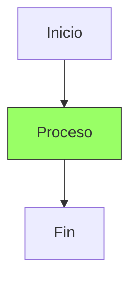

# Test Mermaid

## Diagrama Simple

```mermaid
graph LR
    A[Cliente] --> B[API]
    B --> C[Base de Datos]
```

## Diagrama con Colores

```mermaid
graph TB
    A[Inicio] --> B[Proceso]
    B --> C[Fin]

    classDef green fill:#9f6,stroke:#333
    class B green
```
