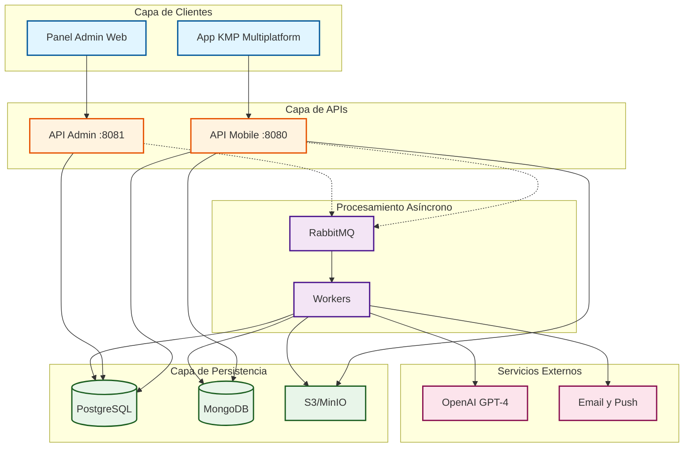

# Arquitectura General de EduGo

## Descripción
Este diagrama muestra la arquitectura general del sistema EduGo en capas, con la separación de responsabilidades entre clientes, APIs, procesamiento, y persistencia.

## Diagrama de Arquitectura en Capas

## Descripción de Capas

### 1. Capa de Clientes
**Responsabilidad**: Interfaces de usuario para diferentes actores

- **Aplicación KMP (Kotlin Multiplatform)**:
  - Plataformas: Android, iOS, Desktop
  - Usuarios: Estudiantes, Docentes, Tutores
  - Funcionalidades principales:
    - Autenticación y perfiles
    - Exploración y búsqueda de materiales
    - Lectura de PDFs y resúmenes
    - Realización de evaluaciones
    - Seguimiento de progreso
  - Comunicación: REST API sobre HTTPS
  - Persistencia local: SQLDelight para modo offline (Post-MVP)

- **Panel de Administración**:
  - Plataforma: Web (React/Vue)
  - Usuarios: Administradores del sistema
  - Funcionalidades principales:
    - Gestión de usuarios (crear, editar, eliminar)
    - Gestión de jerarquía académica (escuelas, unidades)
    - Gestión de relaciones familiares
    - Estadísticas globales del sistema
  - Comunicación: REST API sobre HTTPS

### 2. Capa de APIs
**Responsabilidad**: Lógica de negocio, orquestación y autorización

- **API Mobile** (Puerto 8080):
  - **Propósito**: Operaciones de alta frecuencia y uso diario
  - **Características**:
    - Autenticación con JWT
    - Rate limiting por rol
    - Validación de permisos granulares
    - Generación de URLs firmadas para S3
  - **Tecnología**: Go + Gin + Swaggo
  - **Endpoints principales**: Auth, Materials, Assessments, Progress

- **API Administración** (Puerto 8081):
  - **Propósito**: Operaciones CRUD y estadísticas administrativas
  - **Características**:
    - Autenticación con JWT (rol admin requerido)
    - Auditoría de todas las operaciones
    - Validación estricta de integridad
  - **Tecnología**: Go + Gin + Swaggo
  - **Endpoints principales**: Users, Units, Materials Admin, Stats

### 3. Capa de Procesamiento Asíncrono
**Responsabilidad**: Tareas de larga duración y procesamiento de IA

- **Cola de Mensajes (RabbitMQ)**:
  - **Colas con prioridades**:
    - Alta: `material_uploaded` (FIFO)
    - Media: `material_reprocess`, `assessment_attempt_recorded`
    - Baja: `material_deleted`, `student_enrolled`
  - **Dead Letter Queue**: Para mensajes fallidos tras 5 reintentos
  - **Patrones**: Pub/Sub con exchange topic

- **Workers**:
  - **Worker de Resumen y Quiz**:
    - Descarga PDF de S3
    - Extrae texto (OCR si es necesario)
    - Llama API NLP para generar resumen y preguntas
    - Almacena resultados en MongoDB
    - Actualiza referencias en PostgreSQL
  - **Worker de Notificaciones**:
    - Procesa eventos de evaluación
    - Envía emails/push notifications
  - **Worker de Limpieza**:
    - Elimina archivos S3 cuando se borra material
    - Limpia documentos MongoDB huérfanos

### 4. Capa de Persistencia
**Responsabilidad**: Almacenamiento de datos según su naturaleza

- **PostgreSQL** (Datos Relacionales):
  - **Contenido**: Usuarios, perfiles, jerarquía académica, materiales (metadatos), progreso, evaluaciones (intentos y respuestas)
  - **Total**: 17 tablas relacionales
  - **Características**: Integridad referencial, transacciones ACID, consultas complejas con CTEs recursivos
  - **Claves**: UUIDv7 para orden cronológico
  - **Índices**: Compuestos, GIN (JSONB), parciales

- **MongoDB** (Datos Documentales):
  - **Contenido**: Resúmenes generados por IA, bancos de preguntas, eventos de procesamiento
  - **Total**: 3 colecciones MVP + 2 Post-MVP
  - **Características**: Esquema flexible, escalado horizontal, versionado interno
  - **Validación**: `$jsonSchema` para estructura mínima
  - **Índices**: Compuestos, text search

- **S3/MinIO** (Almacenamiento de Objetos):
  - **Contenido**: PDFs, videos, audios, assets procesados
  - **Estructura**: `{school_id}/{unit_id}/{material_id}/`
  - **Características**: URLs firmadas (15 min expiración), deduplicación por hash
  - **Políticas**: Ciclo de vida (Glacier para archivos antiguos)

### 5. Servicios Externos
**Responsabilidad**: Funcionalidades especializadas externalizadas

- **Proveedor NLP**:
  - **Opciones**: OpenAI GPT-4, Google Gemini, Cohere
  - **Uso**: Generación de resúmenes educativos y cuestionarios
  - **Estrategia**: Capa de abstracción para cambio de proveedor

- **Servicio de Notificaciones**:
  - **Canales**: Email (SMTP), Push (FCM/APNs)
  - **Eventos**: Material listo, evaluación completada, nueva asignación

## Flujos Principales

### Flujo de Publicación (Síncrono + Asíncrono)
1. Docente sube PDF via **KMP** → **API Mobile**
2. API valida y guarda en **S3**
3. API persiste metadatos en **PostgreSQL**
4. API publica evento `material_uploaded` en **RabbitMQ**
5. API responde 202 Accepted al docente
6. **Worker** consume evento, descarga PDF, llama **NLP**
7. Worker guarda resumen en **MongoDB**
8. Worker actualiza referencias en **PostgreSQL**
9. Worker notifica docente via **Servicio de Notificaciones**

### Flujo de Consumo (Síncrono)
1. Estudiante busca material via **KMP** → **API Mobile**
2. API consulta metadatos en **PostgreSQL** (con validación de permisos)
3. API genera URL firmada de **S3**
4. API obtiene resumen desde **MongoDB**
5. API responde con datos combinados
6. KMP descarga PDF directamente desde **S3**
7. Estudiante registra progreso → API actualiza **PostgreSQL**

### Flujo de Evaluación (Síncrono)
1. Estudiante solicita quiz via **KMP** → **API Mobile**
2. API obtiene preguntas desde **MongoDB**
3. Estudiante completa quiz, envía respuestas
4. API valida respuestas contra **MongoDB**
5. API calcula puntaje y guarda en **PostgreSQL**
6. API publica evento `assessment_attempt_recorded` (asíncrono)

## Decisiones Arquitectónicas

### ¿Por qué separar API Mobile y Admin?
- **Escalado independiente**: Mobile requiere más recursos (alta concurrencia)
- **Rate limiting diferenciado**: Límites más altos para operaciones frecuentes
- **Despliegue independiente**: Actualizar admin sin afectar usuarios finales
- **Seguridad**: Admin requiere autenticación más estricta

### ¿Por qué procesamiento asíncrono?
- **Tiempos de respuesta**: Generación de IA puede tomar 30-120 segundos
- **Resiliencia**: Reintentos automáticos ante fallos de NLP
- **Escalabilidad**: Workers horizontales según carga
- **Desacoplamiento**: APIs no dependen de disponibilidad de NLP

### ¿Por qué persistencia híbrida?
- **PostgreSQL**: Ideal para datos relacionales con integridad crítica
- **MongoDB**: Ideal para documentos con esquema variable (contenido IA)
- **S3**: Ideal para archivos binarios (costo/escalabilidad)
- **Especialización**: Cada tecnología para su caso de uso óptimo

## Tecnologías Seleccionadas

| Componente | Tecnología | Justificación |
|------------|-----------|---------------|
| API Mobile/Admin | Go 1.21+ | Rendimiento, concurrencia nativa, ecosistema maduro |
| Framework Web | Gin | Más rápido, middleware robusto, ampliamente usado |
| Documentación API | Swaggo | Genera OpenAPI desde anotaciones Go |
| Workers | Go 1.21+ | Reutilización de código con APIs |
| Cola de Mensajes | RabbitMQ | Routing flexible, DLQ nativo, alta disponibilidad |
| Base de Datos Relacional | PostgreSQL 15+ | JSONB, CTEs recursivos, extensiones (ltree) |
| Base de Datos Documental | MongoDB 6+ | Validación de schema, sharding, Atlas managed |
| Almacenamiento Objetos | MinIO (dev) / S3 (prod) | Compatible S3, URLs firmadas |
| Cliente KMP | Kotlin 1.9+ | Compartición máxima de código |
| UI KMP | Compose Multiplatform | UI declarativa multiplataforma |

## Consideraciones de Seguridad

### Autenticación y Autorización
- **OAuth 2.0 + JWT**: Tokens con expiración (15 min access, 7 días refresh)
- **Scopes por rol**: `teacher:write`, `student:read`, `admin:all`
- **Validación de permisos**: Verificación de `unit_membership` en cada request

### Protección de Datos
- **Encriptación en tránsito**: HTTPS/TLS 1.3 obligatorio
- **Encriptación en reposo**: PostgreSQL con pgcrypto, S3 con KMS
- **URLs firmadas**: S3 con expiración máxima de 15 minutos
- **Sanitización**: Validación de inputs contra SQL injection, XSS

### Rate Limiting
- **Por rol**:
  - Estudiantes: 100 req/min
  - Docentes: 200 req/min
  - Admins: 500 req/min
- **Por IP**: 1000 req/hora (anti-DDoS básico)

### Auditoría
- **Logs estructurados**: JSON con timestamp, user_id, action, resource
- **Versionado**: `material_version` registra todos los cambios
- **Inmutabilidad**: `assessment_attempt` no se puede editar

## Escalabilidad y Alta Disponibilidad

### Componentes Stateless
- **APIs**: Sin sesión en memoria, JWT stateless
- **Workers**: Procesamiento idempotente, múltiples instancias

### Componentes Stateful (Managed)
- **PostgreSQL**: Réplicas read-only, failover automático (RDS/Cloud SQL)
- **MongoDB**: Replica Set 3 nodos, sharding por `unit_id` (Atlas)
- **RabbitMQ**: Cluster con mirroring de colas

### Estrategias de Escalado
- **Horizontal**: Load balancer → N instancias de API/Workers
- **Vertical**: Escalar DBs según métricas (CPU, memoria)
- **Auto-scaling**: Basado en métricas (requests/seg, tamaño de cola)

## Monitoreo y Observabilidad

### Métricas Clave
- **APIs**: Latencia p50/p95/p99, tasa de errores, throughput
- **Workers**: Tiempo de procesamiento, tasa de éxito/fallo, tamaño de cola
- **Bases de Datos**: Queries lentas, conexiones activas, tamaño

### Logging
- **Niveles**: DEBUG (dev), INFO (prod), ERROR (alertas)
- **Formato**: JSON estructurado con trace_id para correlación
- **Destino**: CloudWatch / Elasticsearch

### Alertas
- **Críticas**: APIs caídas, DBs inaccesibles, cola > 1000 mensajes
- **Advertencias**: Latencia > 500ms, tasa de error > 5%, workers lentos

---

**Documento**: Arquitectura General de EduGo
**Versión**: 1.0
**Fecha**: 2025-01-29
**Autor**: Equipo EduGo
