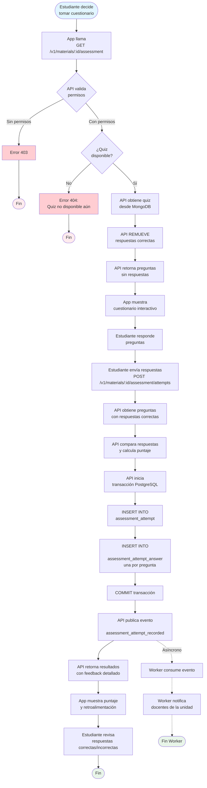

# Proceso: Evaluación (Cuestionario)

## Descripción
Proceso mediante el cual un estudiante realiza un cuestionario autogenerado por IA sobre un material educativo, recibiendo retroalimentación inmediata.

## Actores
- **Estudiante**: Realiza el cuestionario
- **API Mobile**: Provee preguntas y valida respuestas
- **MongoDB**: Almacena preguntas y respuestas correctas
- **PostgreSQL**: Almacena intentos y respuestas de estudiantes
- **Worker**: Procesa evento para notificaciones

## Diagrama de Flujo



## Fases del Proceso

### Fase 1: Obtención del Cuestionario
**Duración estimada**: 0.5-1 segundo

#### 1.1 Petición
```http
GET /v1/materials/{material_id}/assessment
Authorization: Bearer {jwt_token}
```

#### 1.2 Validación de Existencia
```sql
SELECT a.id, a.mongo_document_id, a.total_questions
FROM assessment a
WHERE a.material_id = $1
```

#### 1.3 Obtención desde MongoDB
```javascript
db.material_assessment.findOne({
  _id: ObjectId("mongo_document_id")
})
```

**Documento original**:
```json
{
  "_id": ObjectId("..."),
  "material_id": "uuid",
  "title": "Cuestionario: Introducción a Pascal",
  "questions": [
    {
      "id": "q1",
      "text": "¿Qué es un compilador?",
      "type": "multiple_choice",
      "options": [
        {"id": "a", "text": "Un programa que traduce código fuente a código máquina"},
        {"id": "b", "text": "Un tipo de variable en Pascal"},
        {"id": "c", "text": "Una estructura de control"},
        {"id": "d", "text": "Un editor de texto"}
      ],
      "correct_answer": "a",
      "feedback": {
        "correct": "¡Correcto! Un compilador traduce código fuente a código máquina ejecutable.",
        "incorrect": "Incorrecto. Revisa la sección 'Herramientas de Desarrollo' en el resumen."
      }
    },
    {
      "id": "q2",
      "text": "¿Cuál es la principal ventaja de la tipificación fuerte?",
      "type": "multiple_choice",
      "options": [
        {"id": "a", "text": "Hace el código más rápido"},
        {"id": "b", "text": "Previene errores en tiempo de compilación"},
        {"id": "c", "text": "Reduce el tamaño del ejecutable"},
        {"id": "d", "text": "Permite usar menos memoria"}
      ],
      "correct_answer": "b",
      "feedback": {
        "correct": "¡Exacto! La tipificación fuerte detecta errores antes de ejecutar el programa.",
        "incorrect": "No es correcto. Piensa en qué sucede durante la compilación con tipos estrictos."
      }
    }
  ],
  "version": 1,
  "created_at": ISODate("2025-01-15T12:30:00Z")
}
```

#### 1.4 Sanitización (CRÍTICO)
API **DEBE** remover campos sensibles antes de enviar al cliente:
```go
// Remover respuestas correctas y feedback completo
for i := range questions {
    questions[i].CorrectAnswer = ""
    questions[i].Feedback = nil
}
```

#### 1.5 Respuesta al Cliente
```json
{
  "assessment_id": "uuid",
  "material_id": "uuid",
  "title": "Cuestionario: Introducción a Pascal",
  "total_questions": 5,
  "estimated_time_minutes": 10,
  "questions": [
    {
      "id": "q1",
      "text": "¿Qué es un compilador?",
      "type": "multiple_choice",
      "options": [
        {"id": "a", "text": "Un programa que traduce código fuente a código máquina"},
        {"id": "b", "text": "Un tipo de variable en Pascal"},
        {"id": "c", "text": "Una estructura de control"},
        {"id": "d", "text": "Un editor de texto"}
      ]
    }
  ]
}
```

---

### Fase 2: Respuesta del Estudiante
**Duración estimada**: 5-15 minutos (lado del usuario)

#### 2.1 UI del Cuestionario
**Componentes**:
- **Indicador de progreso**: "Pregunta 1 de 5"
- **Timer** (opcional): Cuenta tiempo transcurrido
- **Pregunta**: Texto claro con numeración
- **Opciones**: Radio buttons (una sola respuesta) o checkboxes (múltiples - Post-MVP)
- **Navegación**: Botones "Anterior" / "Siguiente"
- **Revisión**: Pantalla resumen antes de enviar

#### 2.2 Validación Cliente
- Verificar que todas las preguntas tienen respuesta
- Mostrar advertencia si falta alguna
- Confirmación antes de enviar: "¿Enviar cuestionario? No podrás modificar respuestas."

---

### Fase 3: Validación y Calificación
**Duración estimada**: 1-2 segundos

#### 3.1 Envío de Respuestas
```http
POST /v1/materials/{material_id}/assessment/attempts
Authorization: Bearer {jwt_token}
Content-Type: application/json

{
  "answers": [
    {"question_id": "q1", "selected_option": "a"},
    {"question_id": "q2", "selected_option": "c"},
    {"question_id": "q3", "selected_option": "b"},
    {"question_id": "q4", "selected_option": "a"},
    {"question_id": "q5", "selected_option": "d"}
  ],
  "time_spent_seconds": 720
}
```

#### 3.2 Validación de Respuestas
```go
// 1. Obtener preguntas originales con respuestas correctas
questions := mongoRepo.GetAssessmentQuestions(assessmentID)

// 2. Comparar cada respuesta
results := []QuestionResult{}
correctCount := 0

for _, answer := range studentAnswers {
    question := findQuestion(questions, answer.QuestionID)

    isCorrect := answer.SelectedOption == question.CorrectAnswer
    if isCorrect {
        correctCount++
    }

    results = append(results, QuestionResult{
        QuestionID:      answer.QuestionID,
        SelectedOption:  answer.SelectedOption,
        CorrectAnswer:   question.CorrectAnswer,
        IsCorrect:       isCorrect,
        Feedback:        getFeedback(question, isCorrect),
    })
}

// 3. Calcular puntaje
score := (correctCount * 100) / len(questions)
```

#### 3.3 Persistencia en PostgreSQL
```sql
BEGIN;

-- Registrar intento
INSERT INTO assessment_attempt (
    id,
    assessment_id,
    student_id,
    score,
    max_score,
    time_spent_seconds,
    started_at,
    completed_at
)
VALUES (
    gen_uuid_v7(),
    $1, -- assessment_id
    $2, -- student_id
    $3, -- score calculado
    100,
    $4, -- time_spent
    NOW() - INTERVAL '1 second' * $4, -- Restar tiempo transcurrido
    NOW()
)
RETURNING id;

-- Registrar respuestas individuales
INSERT INTO assessment_attempt_answer (
    attempt_id,
    question_id,
    selected_option,
    is_correct
)
VALUES
    ($1, 'q1', 'a', true),
    ($1, 'q2', 'c', false),
    ($1, 'q3', 'b', true),
    ($1, 'q4', 'a', true),
    ($1, 'q5', 'd', false);

COMMIT;
```

#### 3.4 Publicación de Evento
```json
{
  "event_type": "assessment_attempt_recorded",
  "event_id": "uuid",
  "attempt_id": "uuid",
  "material_id": "uuid",
  "student_id": "uuid",
  "score": 60,
  "max_score": 100,
  "timestamp": "2025-01-29T11:30:00Z"
}
```

Publicado a cola `material_processing_medium` con routing key `assessment.attempt_recorded`.

#### 3.5 Respuesta al Cliente
```json
{
  "attempt_id": "uuid",
  "score": 60,
  "max_score": 100,
  "correct_answers": 3,
  "total_questions": 5,
  "pass_threshold": 70,
  "passed": false,
  "feedback": [
    {
      "question_id": "q1",
      "question_text": "¿Qué es un compilador?",
      "selected_option": "a",
      "correct_answer": "a",
      "is_correct": true,
      "message": "¡Correcto! Un compilador traduce código fuente a código máquina ejecutable."
    },
    {
      "question_id": "q2",
      "question_text": "¿Cuál es la principal ventaja de la tipificación fuerte?",
      "selected_option": "c",
      "correct_answer": "b",
      "is_correct": false,
      "message": "Incorrecto. Piensa en qué sucede durante la compilación con tipos estrictos."
    }
  ],
  "can_retake": true,
  "previous_best_score": null
}
```

---

### Fase 4: Visualización de Resultados
**Duración estimada**: Variable (estudiante revisa)

#### 4.1 Pantalla de Resultados
**Componentes**:

1. **Header con puntaje**:
   - Puntaje grande y visual: "60 / 100"
   - Indicador de aprobado/reprobado
   - Mensaje motivacional según puntaje

2. **Resumen**:
   - Correctas: 3 / 5
   - Tiempo: 12 minutos
   - Intento: #1

3. **Detalle por pregunta**:
   - Pregunta original
   - Tu respuesta (con ícono ✓ o ✗)
   - Respuesta correcta (si fallaste)
   - Retroalimentación personalizada

4. **Acciones**:
   - Botón "Reintentar" (si está permitido)
   - Botón "Ver material nuevamente" (volver a PDF/resumen)
   - Botón "Siguiente material" (continuar aprendiendo)

#### 4.2 Guardar Resultado Localmente (Offline - Post-MVP)
```kotlin
// Guardar en SQLDelight local
localDb.assessmentAttemptDao.insert(
    AttemptEntity(
        id = attemptId,
        materialId = materialId,
        score = 60,
        maxScore = 100,
        completedAt = Clock.System.now(),
        synced = true
    )
)
```

---

### Fase 5: Notificación Asíncrona a Docentes
**Duración estimada**: 5-30 segundos (asíncrono)

#### 5.1 Worker Consume Evento
Worker escucha cola `material_processing_medium` y procesa evento `assessment_attempt_recorded`.

#### 5.2 Obtención de Datos
```sql
SELECT
    m.title as material_title,
    au_student.name as student_name,
    aa.score,
    aa.max_score,
    aa.completed_at
FROM assessment_attempt aa
INNER JOIN assessment a ON aa.assessment_id = a.id
INNER JOIN learning_material m ON a.material_id = m.id
INNER JOIN app_user au_student ON aa.student_id = au_student.id
WHERE aa.id = $1;
```

#### 5.3 Identificación de Docentes
```sql
SELECT DISTINCT u.id, u.email, u.name
FROM unit_membership um
INNER JOIN app_user u ON um.user_id = u.id
WHERE um.unit_id IN (
    SELECT unit_id
    FROM material_unit_link
    WHERE material_id = $1
)
AND um.role IN ('teacher', 'owner');
```

#### 5.4 Construcción y Envío de Notificación
**Email**:
```
Asunto: Evaluación completada - Introducción a Pascal

Hola Prof. García,

El estudiante Juan Pérez ha completado el cuestionario "Introducción a Pascal".

Resultado: 60 / 100 (3 de 5 correctas)
Tiempo: 12 minutos
Fecha: 29 de enero, 2025 - 11:30 AM

Puedes ver el detalle completo en la app.

Saludos,
EduGo
```

**Push Notification** (si docente tiene app):
```json
{
  "title": "Evaluación completada",
  "body": "Juan Pérez: 60/100 en Introducción a Pascal",
  "data": {
    "type": "assessment_completed",
    "material_id": "uuid",
    "attempt_id": "uuid"
  }
}
```

---

## Funcionalidades Post-MVP

### Tipos de Preguntas Adicionales
1. **Verdadero/Falso**: Respuesta binaria
2. **Selección Múltiple**: Varias respuestas correctas
3. **Respuesta Corta**: Input de texto libre (validación automática con NLP)
4. **Emparejamiento**: Conectar términos con definiciones

### Intentos Múltiples
- Configuración por material: permitir N reintentos
- Mostrar mejor puntaje histórico
- Análisis de mejora entre intentos

### Banco de Preguntas Aleatorias
- MongoDB almacena 15-20 preguntas por material
- API selecciona 5 aleatorias por intento
- Previene memorización de respuestas

### Retroalimentación Adaptativa
- Feedback diferente según magnitud del error
- Sugerencias de secciones específicas del material para repasar
- Explicaciones más profundas para preguntas críticas

---

## Indicadores de Éxito (KPIs)

1. **Tasa de Completitud de Quiz**
   - Objetivo: > 60% de estudiantes completan quiz tras leer material
   - Medición: `COUNT(assessment_attempt) / COUNT(DISTINCT reading_log.student_id WHERE progress = 100)`

2. **Puntaje Promedio**
   - Objetivo: > 70% (umbral de aprobación)
   - Medición: `AVG(score)` de `assessment_attempt`

3. **Tiempo Promedio de Completitud**
   - Objetivo: 8-12 minutos para 5 preguntas
   - Medición: `AVG(time_spent_seconds) WHERE completed_at IS NOT NULL`

4. **Tasa de Abandono**
   - Objetivo: < 10% de estudiantes inician pero no terminan
   - Medición: Comparar eventos `quiz_started` vs `quiz_completed`

---

## Consideraciones de Seguridad

### Prevención de Trampa

1. **No exponer respuestas correctas**:
   - Sanitizar SIEMPRE antes de enviar preguntas
   - Validar en servidor, nunca confiar en cliente

2. **Límite de reintentos** (Post-MVP):
   - Máximo 3 intentos por día
   - Cooldown de 24 horas entre intentos

3. **Detección de patrones sospechosos**:
   - Tiempo de respuesta < 5 segundos por pregunta (alerta)
   - Múltiples intentos con puntaje perfecto (alerta)
   - Respuestas idénticas entre estudiantes (alerta - Post-MVP)

### Validación de Integridad

1. **Idempotencia**:
   - Header `Idempotency-Key` para prevenir doble envío accidental
   - Verificar que no existe intento duplicado en últimos 5 segundos

2. **Validación de preguntas**:
   - Verificar que todos los `question_id` existen en el quiz
   - Rechazar si hay preguntas faltantes o adicionales

---

**Documento**: Proceso de Evaluación (Cuestionario)
**Versión**: 1.0
**Fecha**: 2025-01-29
**Autor**: Equipo EduGo
