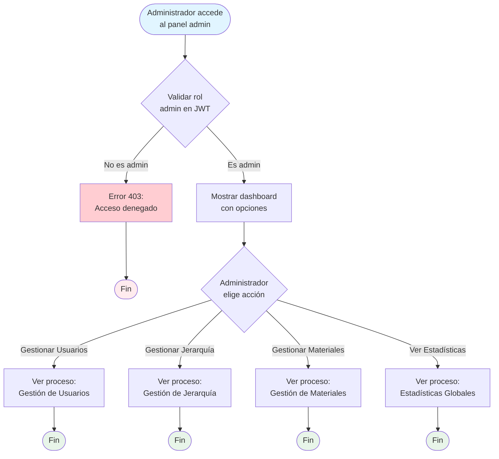
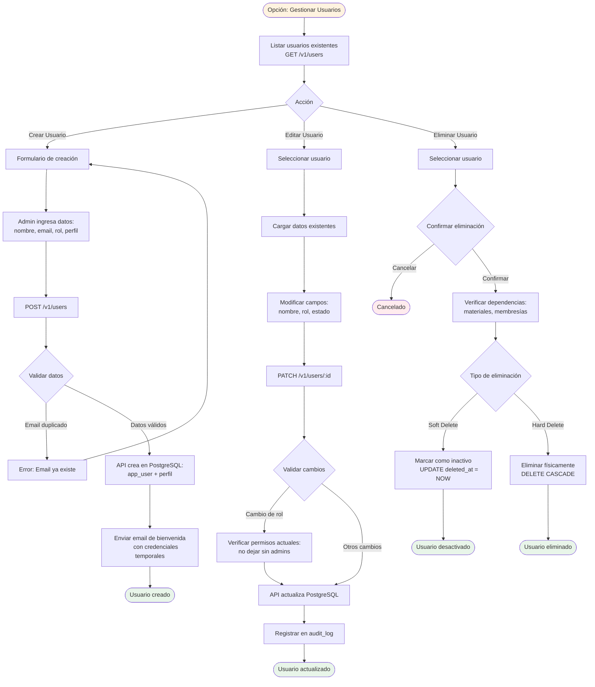
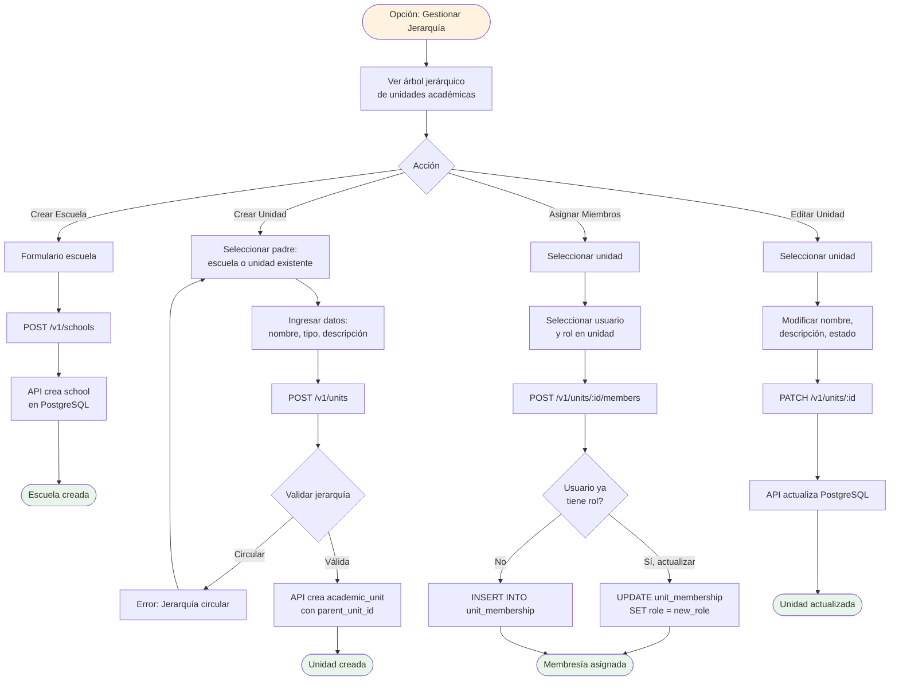

# Proceso: Administración del Sistema

## Descripción
Conjunto de procesos administrativos para gestionar usuarios, jerarquía académica, y configuración del sistema por parte de administradores.

## Actores
- **Administrador**: Gestiona el sistema
- **API Administración**: Provee endpoints CRUD
- **PostgreSQL**: Almacena datos maestros

## Diagrama de Flujo General



---

## Subproceso 1: Gestión de Usuarios

### Diagrama de Flujo



### Operaciones Detalladas

#### Crear Usuario

**Endpoint**: `POST /v1/users`

**Request**:
```json
{
  "name": "María González",
  "email": "maria.gonzalez@ejemplo.com",
  "system_role": "teacher",
  "profile_type": "teacher",
  "profile_data": {
    "specialization": "Matemáticas",
    "preferred_language": "es"
  },
  "school_id": "uuid"
}
```

**Validaciones**:
- Email único en el sistema
- Rol válido: admin, teacher, student
- profile_type coincide con system_role (excepto admin)
- School exists si no es admin

**Implementación**:
```sql
BEGIN;

-- Crear usuario
INSERT INTO app_user (id, name, email, system_role, created_at)
VALUES (gen_uuid_v7(), $1, $2, $3, NOW())
RETURNING id;

-- Crear perfil según tipo
INSERT INTO teacher_profile (user_id, specialization, preferred_language)
VALUES ($1, $2, $3);

COMMIT;
```

**Respuesta**:
```json
{
  "user_id": "uuid",
  "name": "María González",
  "email": "maria.gonzalez@ejemplo.com",
  "system_role": "teacher",
  "temporary_password": "random_secure_string",
  "password_reset_required": true
}
```

---

#### Editar Usuario

**Endpoint**: `PATCH /v1/users/{user_id}`

**Request**:
```json
{
  "name": "María González Pérez",
  "system_role": "admin"
}
```

**Validaciones especiales**:
- Si cambia rol a/desde admin:
  - Verificar que hay al menos 2 admins en el sistema
  - No permitir auto-degradación si es el único admin

**Implementación**:
```sql
-- Verificación de admins
SELECT COUNT(*) FROM app_user WHERE system_role = 'admin' AND id != $1;
-- Si count = 1 y se intenta cambiar rol, rechazar

UPDATE app_user
SET name = COALESCE($2, name),
    system_role = COALESCE($3, system_role),
    updated_at = NOW()
WHERE id = $1;

-- Registrar en auditoría
INSERT INTO audit_log (user_id, action, entity_type, entity_id, changes, created_at)
VALUES ($admin_id, 'update', 'user', $1, $changes_json, NOW());
```

---

#### Eliminar Usuario

**Soft Delete** (Recomendado):
```sql
UPDATE app_user
SET deleted_at = NOW()
WHERE id = $1;

-- Los queries deben filtrar por deleted_at IS NULL
```

**Hard Delete** (Solo si no tiene dependencias críticas):
```sql
BEGIN;

-- Eliminar membresías
DELETE FROM unit_membership WHERE user_id = $1;

-- Reasignar materiales (opcional)
UPDATE learning_material
SET author_id = $admin_id  -- Transferir a admin
WHERE author_id = $1;

-- Eliminar perfil
DELETE FROM teacher_profile WHERE user_id = $1;

-- Eliminar usuario
DELETE FROM app_user WHERE id = $1;

COMMIT;
```

---

## Subproceso 2: Gestión de Jerarquía Académica

### Diagrama de Flujo



### Operaciones Detalladas

#### Crear Escuela

**Endpoint**: `POST /v1/schools`

**Request**:
```json
{
  "name": "Colegio San José",
  "code": "CSJ",
  "address": "Av. Principal 123",
  "contact_email": "contacto@sanjose.edu",
  "contact_phone": "+52 123 456 7890"
}
```

**Implementación**:
```sql
INSERT INTO school (id, name, code, address, contact_email, contact_phone, created_at)
VALUES (gen_uuid_v7(), $1, $2, $3, $4, $5, NOW())
RETURNING id;
```

---

#### Crear Unidad Académica

**Endpoint**: `POST /v1/units`

**Request**:
```json
{
  "parent_unit_id": "uuid",  // null si es hijo directo de school
  "school_id": "uuid",
  "unit_type": "grade",  // grade, section, club, department
  "display_name": "5.º Año",
  "code": "5A",
  "description": "Quinto año de secundaria - Sección A"
}
```

**Validaciones**:
- parent_unit_id debe existir y pertenecer a la misma escuela
- No crear ciclos (unidad no puede ser padre de sí misma)
- Validación de jerarquía típica: school → grade → section

**Implementación**:
```sql
-- Trigger o función para validar jerarquía circular
CREATE OR REPLACE FUNCTION prevent_circular_hierarchy()
RETURNS TRIGGER AS $$
DECLARE
    ancestor_id UUID;
BEGIN
    ancestor_id := NEW.parent_unit_id;

    -- Recorrer hacia arriba hasta encontrar ciclo o llegar a root
    WHILE ancestor_id IS NOT NULL LOOP
        IF ancestor_id = NEW.id THEN
            RAISE EXCEPTION 'Jerarquía circular detectada';
        END IF;

        SELECT parent_unit_id INTO ancestor_id
        FROM academic_unit
        WHERE id = ancestor_id;
    END LOOP;

    RETURN NEW;
END;
$$ LANGUAGE plpgsql;

CREATE TRIGGER check_circular_hierarchy
BEFORE INSERT OR UPDATE ON academic_unit
FOR EACH ROW EXECUTE FUNCTION prevent_circular_hierarchy();
```

```sql
INSERT INTO academic_unit (
    id,
    parent_unit_id,
    school_id,
    unit_type,
    display_name,
    code,
    description,
    created_at
)
VALUES (gen_uuid_v7(), $1, $2, $3, $4, $5, $6, NOW())
RETURNING id;
```

---

#### Asignar Membresía a Unidad

**Endpoint**: `POST /v1/units/{unit_id}/members`

**Request**:
```json
{
  "user_id": "uuid",
  "role": "teacher",  // owner, teacher, assistant, student, guardian
  "valid_from": "2025-01-29",
  "valid_until": "2025-12-31"
}
```

**Implementación**:
```sql
INSERT INTO unit_membership (
    unit_id,
    user_id,
    role,
    valid_from,
    valid_until,
    created_at
)
VALUES ($1, $2, $3, $4, $5, NOW())
ON CONFLICT (unit_id, user_id)
DO UPDATE SET
    role = EXCLUDED.role,
    valid_from = EXCLUDED.valid_from,
    valid_until = EXCLUDED.valid_until,
    updated_at = NOW();
```

---

## Subproceso 3: Gestión de Materiales (Moderación)

### Operaciones

#### Eliminar Material Inapropiado

**Endpoint**: `DELETE /v1/materials/{material_id}`

**Flujo**:
1. Admin marca material como eliminado
2. API publica evento `material_deleted`
3. Worker limpia archivos S3 y documentos MongoDB
4. API notifica autor (opcional)

**Implementación**:
```sql
BEGIN;

-- Soft delete del material
UPDATE learning_material
SET deleted_at = NOW(), deleted_by = $admin_id
WHERE id = $1;

-- Publicar evento para limpieza asíncrona
-- (Worker se encargará de S3 y MongoDB)

COMMIT;
```

**Worker procesa evento**:
```javascript
// Eliminar archivos S3
const s3Keys = await getS3KeysForMaterial(materialId);
for (const key of s3Keys) {
    await s3Client.deleteObject({ Bucket: bucket, Key: key });
}

// Eliminar documentos MongoDB
await db.material_summary.deleteMany({ material_id: materialId });
await db.material_assessment.deleteMany({ material_id: materialId });
await db.material_event.deleteMany({ material_id: materialId });
```

---

## Subproceso 4: Estadísticas Globales

### Endpoint

`GET /v1/stats/global`

### Métricas Principales

```json
{
  "platform": {
    "total_users": 1250,
    "active_users_30d": 980,
    "total_schools": 15,
    "total_units": 127
  },
  "users_by_role": {
    "students": 1050,
    "teachers": 185,
    "admins": 15
  },
  "materials": {
    "total_published": 450,
    "total_this_month": 35,
    "average_per_teacher": 2.4,
    "top_subjects": [
      {"name": "Matemáticas", "count": 95},
      {"name": "Programación", "count": 78}
    ]
  },
  "engagement": {
    "materials_accessed_30d": 380,
    "average_progress": 65.5,
    "quizzes_completed_30d": 1250,
    "average_quiz_score": 73.8
  },
  "performance": {
    "average_processing_time_seconds": 85,
    "nlp_success_rate": 97.5,
    "average_cost_per_material_usd": 0.15
  }
}
```

### Queries

```sql
-- Usuarios por rol
SELECT system_role, COUNT(*)
FROM app_user
WHERE deleted_at IS NULL
GROUP BY system_role;

-- Materiales por mes
SELECT
    DATE_TRUNC('month', created_at) as month,
    COUNT(*) as count
FROM learning_material
WHERE deleted_at IS NULL
GROUP BY month
ORDER BY month DESC
LIMIT 12;

-- Engagement (últimos 30 días)
SELECT
    COUNT(DISTINCT material_id) as materials_accessed,
    AVG(progress) as avg_progress
FROM reading_log
WHERE last_access_at >= NOW() - INTERVAL '30 days';
```

---

## Consideraciones de Seguridad

### Autorización Estricta

1. **Middleware AdminOnly**:
```go
func AdminOnly() gin.HandlerFunc {
    return func(c *gin.Context) {
        role := c.GetString("role")
        if role != "admin" {
            c.AbortWithStatusJSON(403, gin.H{
                "error": "Acceso denegado. Solo administradores.",
            })
            return
        }
        c.Next()
    }
}
```

2. **Verificación en cada operación**:
- No confiar solo en middleware
- Validar rol en capa de servicio también

### Auditoría Completa

Todas las operaciones admin deben registrarse:

```sql
CREATE TABLE audit_log (
    id UUID PRIMARY KEY DEFAULT gen_uuid_v7(),
    admin_user_id UUID NOT NULL REFERENCES app_user(id),
    action VARCHAR(50) NOT NULL, -- create, update, delete
    entity_type VARCHAR(50) NOT NULL, -- user, unit, material
    entity_id UUID,
    changes JSONB, -- Antes y después
    ip_address INET,
    user_agent TEXT,
    created_at TIMESTAMPTZ NOT NULL DEFAULT NOW()
);

-- Ejemplo de registro
INSERT INTO audit_log (admin_user_id, action, entity_type, entity_id, changes, ip_address)
VALUES (
    $1,
    'delete',
    'material',
    $2,
    '{"reason": "Contenido inapropiado", "reported_by": "uuid"}'::jsonb,
    $3
);
```

---

## Funcionalidades Post-MVP

### Dashboard Avanzado

1. **Gráficos interactivos**:
   - Crecimiento de usuarios en el tiempo
   - Distribución geográfica de escuelas
   - Materias más populares

2. **Alertas automáticas**:
   - Usuarios inactivos > 30 días
   - Materiales reportados
   - Errores de procesamiento recurrentes

### Gestión Masiva

1. **Importación CSV**:
   - Crear múltiples usuarios desde archivo
   - Validación y preview antes de importar
   - Rollback en caso de error

2. **Operaciones batch**:
   - Asignar múltiples estudiantes a una unidad
   - Transferir materiales entre docentes

### Roles Granulares

1. **Super Admin**: Acceso total
2. **School Admin**: Solo su escuela
3. **Moderator**: Solo gestión de contenidos

---

## Indicadores de Éxito (KPIs)

1. **Tiempo de creación de usuario**
   - Objetivo: < 30 segundos (formulario + envío)

2. **Precisión de jerarquía**
   - Objetivo: 0 errores de ciclos o inconsistencias

3. **Tiempo de respuesta de stats globales**
   - Objetivo: < 3 segundos con 10,000 usuarios

4. **Auditoría completa**
   - Objetivo: 100% de operaciones registradas

---

**Documento**: Procesos de Administración del Sistema
**Versión**: 1.0
**Fecha**: 2025-01-29
**Autor**: Equipo EduGo
