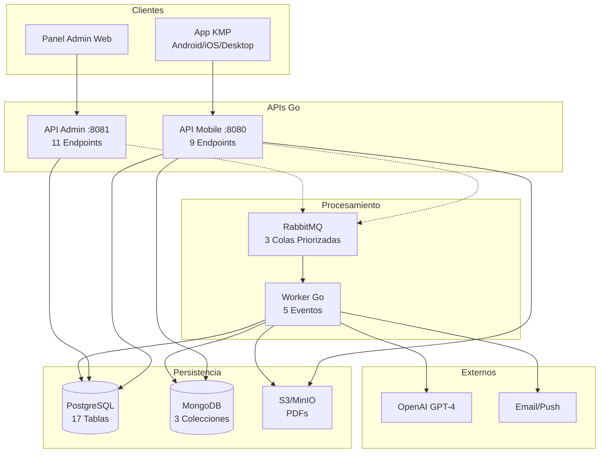

# Arquitectura Completa de EduGo

## Diagrama General

## Decisiones Clave

**PostgreSQL**: Usuarios, jerarquía, materiales (metadata), progreso
**MongoDB**: Resúmenes IA, quizzes, eventos  
**S3**: PDFs y archivos binarios
**RabbitMQ**: Eventos asíncronos con reintentos
**OpenAI**: Generación de contenido educativo

**Separación de APIs**:
- Mobile (8080): Alta frecuencia, uso diario
- Admin (8081): Baja frecuencia, CRUD maestro

Ver archivo [DISTRIBUCION_PROCESOS.md](../../DISTRIBUCION_PROCESOS.md) para detalles.
