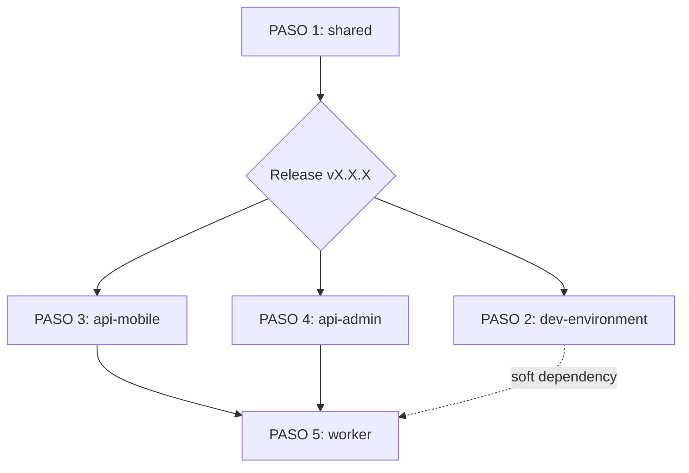

# 🎯 Prompt Maestro: Análisis Multi-Repositorio para Ecosistema EduGo

## 📋 Descripción
Este prompt transforma requerimientos en documentación profesional estandarizada para ecosistemas multi-repositorio, donde una funcionalidad puede afectar múltiples proyectos independientes. Optimizado para ejecución desatendida por IA siguiendo metodologías modernas (Kiro, GitHub Flow, CI/CD).

## 🔑 Diferencia Clave: Multi-Repositorio
A diferencia de proyectos monolíticos, este template maneja:
- **Múltiples repositorios independientes** con sus propias ramas, PRs y CI/CD
- **Dependencias entre repositorios** (ej: shared → api-mobile → worker)
- **Orden de ejecución crítico** (primero shared, luego consumidores)
- **Releases independientes** por repositorio
- **Specs separadas por repositorio** para navegación clara

## 🚀 Prompt de Transformación Multi-Repo

```markdown
# Transformación de Requisitos a Specs Multi-Repositorio con Ejecución Desatendida

## CONTEXTO DEL ECOSISTEMA
- **Ecosistema**: EduGo
- **Tipo**: Microservicios educativos en Go
- **Repositorios del Ecosistema**:
  - edugo-shared (biblioteca compartida)
  - edugo-api-mobile (API REST alta frecuencia)
  - edugo-api-administracion (API REST administrativa)
  - edugo-worker (procesamiento asíncrono)
  - edugo-dev-environment (infraestructura Docker)

- **Rutas Locales**:
  - Documentación: `/Users/jhoanmedina/source/EduGo/Analisys`
  - Repositorios: `/Users/jhoanmedina/source/EduGo/repos-separados/`

## DECISIONES ARQUITECTÓNICAS PREDEFINIDAS
- **Stack**: Go 1.21+, Gin, GORM, Viper
- **Bases de Datos**: PostgreSQL 15+, MongoDB 7.0+
- **Mensajería**: RabbitMQ 3.12+
- **Patrón**: Clean Architecture (Domain → Application → Infrastructure)
- **Testing**: Testcontainers (shared/testing v0.6.2)
- **Cobertura**: 80% mínimo CI/CD, 85% objetivo
- **CI/CD**: GitHub Actions
- **Workflow Git**: 
  - Rama `dev` para desarrollo
  - PRs a `dev` primero, luego `dev` → `main`
  - Releases desde `main` con tags semánticos
  - **Caso especial shared**: releases por módulo desde `dev`

## REQUISITO A ANALIZAR
[DESCRIPCIÓN_DEL_REQUISITO]

Ejemplo:
"Implementar sistema de notificaciones en tiempo real que permita enviar alertas 
educativas personalizadas a estudiantes, con soporte para múltiples canales 
(push, email, SMS) y gestión de preferencias por usuario."

## INSTRUCCIONES DE TRANSFORMACIÓN MULTI-REPO

### FASE 1: ANÁLISIS DE IMPACTO POR REPOSITORIO

Antes de crear specs, identifica qué repositorios se ven afectados:

#### 1.1 MATRIZ DE IMPACTO
Genera una tabla de análisis:

| Repositorio | ¿Afectado? | Tipo de Cambio | Prioridad | Dependencias |
|-------------|------------|----------------|-----------|--------------|
| edugo-shared | SÍ/NO | feature/refactor/fix | 1-5 | ninguna |
| edugo-api-mobile | SÍ/NO | feature/refactor/fix | 1-5 | shared@vX.X.X |
| edugo-api-administracion | SÍ/NO | feature/refactor/fix | 1-5 | shared@vX.X.X |
| edugo-worker | SÍ/NO | feature/refactor/fix | 1-5 | shared@vX.X.X |
| edugo-dev-environment | SÍ/NO | config/infrastructure | 1-5 | ninguna |

**Regla de Prioridad**:
1. = Bloqueante (otros repos esperan este)
2. = Alta (core del requisito)
3. = Media (importante pero no bloqueante)
4. = Baja (mejoras opcionales)
5. = Opcional (nice to have)

#### 1.2 ORDEN DE EJECUCIÓN
Basado en dependencias, define el orden:

```
ORDEN DE IMPLEMENTACIÓN:
1. edugo-shared (si aplica) → Release vX.X.X
2. edugo-dev-environment (si aplica infraestructura nueva)
3. edugo-api-* (consumidores de shared)
4. edugo-worker (último, consume APIs)
```

### FASE 2: ESTRUCTURA DE CARPETAS MULTI-REPO

Crea la estructura en `Analisys/specs/[NOMBRE-REQUISITO]/`:

```
specs/
└── [NOMBRE-REQUISITO]/          # Ej: "notificaciones-tiempo-real"
    ├── README.md                # Overview global del requisito
    ├── RULES.md                 # Reglas específicas del proyecto
    ├── ORDEN_EJECUCION.md       # Orden crítico de repos
    │
    ├── 00-Global/               # Documentación transversal
    │   ├── PRD.md              # Product Requirements global
    │   ├── ARCHITECTURE.md     # Arquitectura del ecosistema
    │   ├── DATA_MODEL.md       # Modelo de datos completo
    │   ├── API_CONTRACTS.md    # Contratos entre servicios
    │   └── DEPENDENCIES.md     # Matriz de dependencias
    │
    ├── 01-shared/              # ⭐ Spec para edugo-shared
    │   ├── README.md           # Overview de cambios en shared
    │   ├── TASKS.md            # Tareas ejecutables
    │   ├── DESIGN.md           # Diseño del módulo
    │   ├── USER_STORIES.md     # Historias técnicas
    │   ├── LOGS.md             # Log de ejecución
    │   └── VALIDATION.md       # Checklist de validación
    │
    ├── 02-dev-environment/     # Spec para infraestructura
    │   ├── README.md
    │   ├── TASKS.md
    │   ├── DOCKER_COMPOSE.md
    │   └── VALIDATION.md
    │
    ├── 03-api-mobile/          # ⭐ Spec para api-mobile
    │   ├── README.md
    │   ├── TASKS.md
    │   ├── DESIGN.md
    │   ├── USER_STORIES.md
    │   ├── LOGS.md
    │   └── VALIDATION.md
    │
    ├── 04-api-administracion/  # Spec para api-admin
    │   ├── README.md
    │   ├── TASKS.md
    │   ├── DESIGN.md
    │   ├── USER_STORIES.md
    │   ├── LOGS.md
    │   └── VALIDATION.md
    │
    ├── 05-worker/              # Spec para worker
    │   ├── README.md
    │   ├── TASKS.md
    │   ├── DESIGN.md
    │   ├── USER_STORIES.md
    │   ├── LOGS.md
    │   └── VALIDATION.md
    │
    ├── PROGRESS.json           # Estado global multi-repo
    └── ESTADO_FINAL_REPOS.md   # Resumen al completar
```

### FASE 3: CONTENIDO ESTANDARIZADO POR REPOSITORIO

Cada carpeta `XX-[nombre-repo]/` debe seguir el mismo patrón:

#### 3.1 README.md (por repositorio)

```markdown
# [Nombre Requisito] - [Nombre Repositorio]

**Repositorio:** [nombre-repo]  
**Ruta local:** `/Users/jhoanmedina/source/EduGo/repos-separados/[nombre-repo]`  
**Estado:** ⬜ Pendiente / 🔄 En progreso / ✅ Completado  
**Progreso:** X%

## 📊 Resumen de Cambios en Este Repo

### Componentes Afectados
- [ ] Domain (entities, value objects, repositories)
- [ ] Application (services, DTOs, use cases)
- [ ] Infrastructure (handlers, DB, external services)
- [ ] Config (variables de entorno, YAML)
- [ ] Tests (unitarios, integración, e2e)
- [ ] CI/CD (workflows, scripts)

### Dependencias
**Requiere completar antes:**
- [ ] [otro-repo] v[version] released

**Bloquea a:**
- [ ] [repo-consumidor] (espera este release)

## 📁 Archivos Modificados Estimados
- `internal/domain/entity/[nuevas-entities].go`
- `internal/application/service/[nuevos-services].go`
- `internal/infrastructure/http/handler/[nuevos-handlers].go`
- `scripts/postgresql/XX_[migration].sql`
- `test/integration/[nuevos-tests]_test.go`

## 🎯 Criterios de Éxito Específicos
- [ ] Tests pasando con >80% coverage
- [ ] Linter sin errores
- [ ] Documentación actualizada (README, Swagger si aplica)
- [ ] PR a dev aprobado y mergeado
- [ ] Release vX.X.X publicado (si es shared)

## 📚 Documentos de Este Repo
- [TASKS.md](TASKS.md) - Tareas ejecutables paso a paso
- [DESIGN.md](DESIGN.md) - Diseño técnico específico
- [USER_STORIES.md](USER_STORIES.md) - Historias de usuario técnicas
- [VALIDATION.md](VALIDATION.md) - Checklist de validación
- [LOGS.md](LOGS.md) - Log de ejecución (actualizado en tiempo real)
```

#### 3.2 TASKS.md (por repositorio)

```markdown
# Plan de Tareas - [Nombre Requisito] en [Nombre Repo]

**Repositorio:** [nombre-repo]  
**Duración Estimada:** X días  
**Branch:** `feature/[nombre-requisito]`

---

## ⚠️ PREREQUISITOS

Antes de iniciar, verificar:

```bash
# 1. Repo actualizado
cd /Users/jhoanmedina/source/EduGo/repos-separados/[nombre-repo]
git checkout dev
git pull origin dev

# 2. Dependencias actualizadas (si consume shared)
go get github.com/EduGoGroup/edugo-shared/[modulo]@v[version]
go mod tidy

# 3. Tests pasando
make test
```

---

## 📋 FASES Y TAREAS

### FASE 1: [Nombre Fase] (X días)

**Objetivo:** [Descripción clara del objetivo]

**Branch:** `feature/[nombre-requisito]-fase1`

---

#### Día 1: [Nombre del día]

##### TASK-001: [Nombre de la tarea]
**Tipo:** feature | fix | refactor | test | docs  
**Estimación:** Xh  
**Archivos:** `path/to/file1.go`, `path/to/file2.go`

**Descripción:**
[Descripción detallada sin ambigüedades]

**Pasos de Implementación:**

1. **Crear archivo** `internal/domain/entity/notification.go`:
   ```go
   package entity
   
   import "time"
   
   type Notification struct {
       ID        NotificationID
       UserID    UserID
       Channel   NotificationChannel
       Message   string
       Status    NotificationStatus
       CreatedAt time.Time
   }
   
   func (n *Notification) Send() error {
       // Validaciones
       if err := n.Validate(); err != nil {
           return err
       }
       
       // Cambiar estado
       n.Status = StatusSent
       return nil
   }
   ```

2. **Crear tests** `internal/domain/entity/notification_test.go`:
   ```go
   package entity_test
   
   import (
       "testing"
       "github.com/stretchr/testify/assert"
   )
   
   func TestNotification_Send_Success(t *testing.T) {
       // Arrange
       notif := &Notification{...}
       
       // Act
       err := notif.Send()
       
       // Assert
       assert.NoError(t, err)
       assert.Equal(t, StatusSent, notif.Status)
   }
   ```

3. **Compilar y verificar**:
   ```bash
   go build ./internal/domain/entity
   go test ./internal/domain/entity -v
   ```

**Criterios de Aceptación:**
- [ ] Archivo `notification.go` creado con struct completa
- [ ] Método `Send()` implementado con validaciones
- [ ] Tests unitarios con cobertura >85%
- [ ] Sin errores de compilación
- [ ] Sin warnings de linter

**Comandos de Validación:**
```bash
# Compilar
go build ./internal/domain/entity

# Tests
go test ./internal/domain/entity -v -cover

# Linter
golangci-lint run ./internal/domain/entity

# Cobertura detallada
go test ./internal/domain/entity -coverprofile=coverage.out
go tool cover -html=coverage.out -o coverage.html
```

**En caso de error:**
- Si falla compilación: verificar imports y sintaxis
- Si fallan tests: revisar lógica de negocio
- Si falla linter: ejecutar `gofmt -w .` y revisar errores

---

##### TASK-002: [Siguiente tarea]
[Mismo formato...]

---

### FASE 2: [Nombre Fase 2]
[Mismo formato...]

---

## 📊 CHECKPOINT DE FASE

Al final de cada fase, ejecutar:

```bash
# 1. Verificar que todos los tests pasan
make test

# 2. Verificar cobertura global
make coverage

# 3. Commit de fase
git add .
git commit -m "feat([scope]): completar FASE X - [descripción]

- Task-001: [resumen]
- Task-002: [resumen]
- Task-NNN: [resumen]

Tests: XX tests pasando
Coverage: XX%

Generated-by: Claude Code"

# 4. Push (SOLO si usuario autoriza)
# git push origin feature/[nombre-requisito]-fase1
```

---

## 🎯 RELEASE (solo para shared)

Si este repo es `edugo-shared`, al finalizar todas las fases:

```bash
# 1. Mergear a dev
git checkout dev
git merge feature/[nombre-requisito]
git push origin dev

# 2. Crear release desde dev
git tag [modulo]/v[version]
git push origin [modulo]/v[version]

# 3. Verificar release en GitHub
gh release view [modulo]/v[version]
```

---

## 📝 DOCUMENTACIÓN FINAL

Al completar todas las tareas:

1. Actualizar `README.md` del repo
2. Actualizar `CHANGELOG.md` (si existe)
3. Generar Swagger (si es API):
   ```bash
   make swagger
   ```
4. Actualizar `LOGS.md` en la spec

---

## ⚠️ REGLAS IMPORTANTES

1. **Orden estricto**: Seguir fases y tareas en orden secuencial
2. **Un commit por tarea**: Facilita rollback si es necesario
3. **Tests obligatorios**: No avanzar sin tests pasando
4. **No saltarse validaciones**: Ejecutar comandos de validación siempre
5. **Documentar bloqueos**: Si algo falla, documentar en LOGS.md

---

**Generado:** [Fecha]  
**Para ejecutar:** Leer README.md primero, luego seguir este archivo línea por línea
```

#### 3.3 VALIDATION.md (por repositorio)

```markdown
# Validación - [Nombre Requisito] en [Nombre Repo]

**Repositorio:** [nombre-repo]

---

## ✅ CHECKLIST PRE-EJECUCIÓN

Antes de iniciar implementación:

- [ ] Repositorio clonado localmente
- [ ] Rama `dev` actualizada con `origin/dev`
- [ ] Dependencias de shared actualizadas (si aplica)
- [ ] Tests baseline pasando
- [ ] Sin cambios uncommitted

**Comandos:**
```bash
cd /Users/jhoanmedina/source/EduGo/repos-separados/[nombre-repo]
git status
git checkout dev
git pull origin dev
make test
```

---

## ✅ CHECKLIST POST-TAREA

Después de cada tarea:

- [ ] Código compila sin errores
- [ ] Tests unitarios pasan
- [ ] Cobertura >80% en archivos nuevos
- [ ] Linter sin warnings
- [ ] Commit creado con mensaje estándar

**Comandos:**
```bash
go build ./...
go test ./... -v
go test ./... -cover
golangci-lint run ./...
git add .
git commit -m "feat([scope]): [descripción]"
```

---

## ✅ CHECKLIST POST-FASE

Después de cada fase:

- [ ] Todos los tests del proyecto pasan
- [ ] Cobertura global >80%
- [ ] Tests de integración pasan (si existen)
- [ ] Documentación actualizada
- [ ] Branch pusheado a origin (si autorizado)

**Comandos:**
```bash
make test
make test-integration  # Si aplica
make coverage
git push origin [branch-name]
```

---

## ✅ CHECKLIST PRE-PR

Antes de crear Pull Request:

- [ ] Todas las fases completadas
- [ ] README.md del repo actualizado
- [ ] CHANGELOG.md actualizado (si existe)
- [ ] Swagger regenerado (si es API)
- [ ] Sin TODOs ni FIXMEs en código
- [ ] Branch sincronizado con dev

**Comandos:**
```bash
git checkout dev
git pull origin dev
git checkout feature/[nombre-requisito]
git rebase dev
make swagger  # Si aplica
git push origin feature/[nombre-requisito] --force-with-lease
```

---

## ✅ CHECKLIST POST-MERGE

Después de mergear PR a dev:

- [ ] PR cerrado y mergeado
- [ ] Branch feature eliminado
- [ ] dev sincronizado localmente
- [ ] Tests en dev pasando
- [ ] LOGS.md actualizado con resultados

**Comandos:**
```bash
git checkout dev
git pull origin dev
git branch -d feature/[nombre-requisito]
make test
```

---

## ✅ CHECKLIST RELEASE (solo shared)

Si el repo es `edugo-shared`, después de mergear a dev:

- [ ] Versión decidida (major.minor.patch)
- [ ] Tag creado desde dev
- [ ] Release publicado en GitHub
- [ ] Otros repos notificados de nueva versión

**Comandos:**
```bash
git checkout dev
git pull origin dev
git tag [modulo]/v[version]
git push origin [modulo]/v[version]
gh release view [modulo]/v[version]
```

---

## 🔍 VALIDACIÓN AUTOMATIZADA

Script para validar estado del repo:

```bash
#!/bin/bash
# validate-repo.sh

set -e

echo "🔍 Validando estado de [nombre-repo]..."

# 1. Verificar rama
current_branch=$(git branch --show-current)
echo "✓ Rama actual: $current_branch"

# 2. Compilar
echo "🔨 Compilando..."
go build ./...
echo "✓ Compilación exitosa"

# 3. Tests
echo "🧪 Ejecutando tests..."
go test ./... -v
echo "✓ Tests pasando"

# 4. Cobertura
echo "📊 Verificando cobertura..."
coverage=$(go test ./... -cover | grep coverage | awk '{print $5}' | tr -d '%')
if [ $(echo "$coverage < 80" | bc) -eq 1 ]; then
    echo "❌ Cobertura insuficiente: ${coverage}%"
    exit 1
fi
echo "✓ Cobertura: ${coverage}%"

# 5. Linter
echo "🔍 Ejecutando linter..."
golangci-lint run ./...
echo "✓ Linter OK"

echo ""
echo "✅ Validación completada exitosamente"
```

**Uso:**
```bash
chmod +x validate-repo.sh
./validate-repo.sh
```

---

## 📝 REPORTE DE VALIDACIÓN

Al finalizar todas las validaciones, generar reporte:

```markdown
# Reporte de Validación - [Nombre Requisito] en [Nombre Repo]

**Fecha:** [YYYY-MM-DD HH:MM]
**Ejecutor:** Claude Code
**Resultado:** ✅ EXITOSO / ❌ FALLIDO

## Métricas
- **Tests ejecutados:** XX
- **Tests pasando:** XX
- **Cobertura:** XX%
- **Archivos modificados:** XX
- **LOC agregadas:** +XXX
- **LOC eliminadas:** -XXX

## Fases Completadas
- [x] FASE 1: [nombre]
- [x] FASE 2: [nombre]
- [x] FASE N: [nombre]

## PRs Creados
- PR#XX: feature/[nombre] → dev (MERGED)

## Releases Generados
- [modulo]/v[version] (si aplica)

## Problemas Encontrados
- Ninguno / [descripción de problemas]

## Tiempo Total
- **Estimado:** XX horas
- **Real:** XX horas
- **Eficiencia:** XX%
```

---

**Generado:** [Fecha]  
**Usar en conjunto con:** TASKS.md
```

### FASE 4: ORDEN_EJECUCION.md (Global)

```markdown
# Orden de Ejecución Multi-Repositorio

**Requisito:** [Nombre Requisito]

---

## 🔢 ORDEN CRÍTICO

### PASO 1: edugo-shared (si aplica)
**Prioridad:** BLOQUEANTE  
**Razón:** Otros repos dependen de esta release

1. Ir a `specs/[nombre-requisito]/01-shared/`
2. Ejecutar todas las tareas de `TASKS.md`
3. Crear PR a `dev`
4. Mergear PR
5. **CRÍTICO:** Crear release `[modulo]/vX.X.X` desde `dev`
6. Esperar a que release esté disponible en GitHub

**Validación antes de continuar:**
```bash
# Verificar que release existe
gh release view [modulo]/vX.X.X

# Verificar que se puede descargar
go get github.com/EduGoGroup/edugo-shared/[modulo]@vX.X.X
```

---

### PASO 2: edugo-dev-environment (si aplica)
**Prioridad:** ALTA (pero no bloqueante para código)  
**Razón:** Actualizar infraestructura antes de nuevos servicios

1. Ir a `specs/[nombre-requisito]/02-dev-environment/`
2. Ejecutar tareas de `TASKS.md`
3. Actualizar docker-compose.yml
4. Actualizar seeds si es necesario
5. Commit y push a `main` (dev-environment no tiene dev)

**Validación:**
```bash
cd /Users/jhoanmedina/source/EduGo/repos-separados/edugo-dev-environment
./scripts/setup.sh --profile full
docker-compose ps  # Verificar que servicios arrancan
```

---

### PASO 3: edugo-api-mobile (paralelo con api-admin)
**Prioridad:** ALTA  
**Dependencias:** shared@vX.X.X (del PASO 1)

1. Ir a `specs/[nombre-requisito]/03-api-mobile/`
2. Actualizar `go.mod` con versión de shared del PASO 1
3. Ejecutar todas las tareas de `TASKS.md`
4. Crear PR a `dev`
5. Mergear PR

**Nota:** Puede ejecutarse en paralelo con api-administracion si no tienen dependencias entre sí.

---

### PASO 4: edugo-api-administracion (paralelo con api-mobile)
**Prioridad:** ALTA  
**Dependencias:** shared@vX.X.X (del PASO 1)

1. Ir a `specs/[nombre-requisito]/04-api-administracion/`
2. Actualizar `go.mod` con versión de shared del PASO 1
3. Ejecutar todas las tareas de `TASKS.md`
4. Crear PR a `dev`
5. Mergear PR

**Nota:** Puede ejecutarse en paralelo con api-mobile si no tienen dependencias entre sí.

---

### PASO 5: edugo-worker (último)
**Prioridad:** MEDIA  
**Dependencias:** shared@vX.X.X, posiblemente APIs del PASO 3-4

1. Esperar a que PASO 3 y 4 estén completos si worker consume esas APIs
2. Ir a `specs/[nombre-requisito]/05-worker/`
3. Actualizar `go.mod` con versión de shared del PASO 1
4. Ejecutar todas las tareas de `TASKS.md`
5. Crear PR a `dev`
6. Mergear PR

---

## ⚠️ REGLAS CRÍTICAS

### 1. NUNCA Saltar el Orden
- Si PASO 1 (shared) está pendiente, NO iniciar PASO 3-5
- Si PASO 3 (api-mobile) tiene dependencia en PASO 4 (api-admin), esperar

### 2. Releases de shared
- **SIEMPRE** desde rama `dev`, no desde `main`
- Formato de tag: `[modulo]/vX.X.X`
- Ejemplo: `notifications/v0.1.0`
- Esperar a que release esté en GitHub antes de continuar

### 3. Versionado Semántico
- **MAJOR** (vX.0.0): Breaking changes
- **MINOR** (v0.X.0): Nuevas features compatibles
- **PATCH** (v0.0.X): Bug fixes

### 4. Actualización de Dependencias
Cuando se libera shared@vX.X.X, actualizar en consumidores:

```bash
# En cada repo consumidor
go get github.com/EduGoGroup/edugo-shared/[modulo]@vX.X.X
go mod tidy
```

### 5. Paralelización Segura
Pueden ejecutarse en paralelo si:
- No comparten archivos
- No tienen dependencias entre sí
- Usan diferentes branches

**Ejemplo seguro:**
```
PASO 3 (api-mobile/feature/notif) ║ PASO 4 (api-admin/feature/notif)
           ↓                       ║           ↓
    PR#45 → dev                    ║    PR#23 → dev
```

### 6. Sincronización de Branches
Antes de crear PR, sincronizar con dev:

```bash
git checkout dev
git pull origin dev
git checkout feature/[nombre-requisito]
git rebase dev
```

---

## 📊 MATRIZ DE DEPENDENCIAS

| Repo | Depende de | Bloquea a | Puede paralelizar con |
|------|------------|-----------|----------------------|
| shared | ninguno | TODOS | ninguno |
| dev-environment | ninguno | ninguno (soft) | TODOS |
| api-mobile | shared@vX.X.X | worker (si aplica) | api-admin |
| api-administracion | shared@vX.X.X | worker (si aplica) | api-mobile |
| worker | shared@vX.X.X, APIs | ninguno | ninguno |

---

## 🔄 FLUJO COMPLETO EJEMPLO



---

## 📝 TRACKING DE PROGRESO

Actualizar después de cada paso:

```markdown
- [x] PASO 1: shared completado - Release notifications/v0.1.0
- [x] PASO 2: dev-environment completado - Docker actualizado
- [x] PASO 3: api-mobile completado - PR#45 merged
- [x] PASO 4: api-admin completado - PR#23 merged
- [ ] PASO 5: worker en progreso - 60%
```

---

**Generado:** [Fecha]  
**CRÍTICO:** Seguir este orden estrictamente
```

### FASE 5: PROGRESS.json (Global Multi-Repo)

```json
{
  "requisito": "[NOMBRE-REQUISITO]",
  "fecha_inicio": "2025-11-14T10:00:00Z",
  "fecha_actualizacion": "2025-11-14T15:30:00Z",
  "estado_global": "en_progreso",
  "progreso_global": 45,
  
  "repositorios": {
    "edugo-shared": {
      "estado": "completado",
      "progreso": 100,
      "branch": "feature/notificaciones",
      "pr_numero": null,
      "pr_estado": "merged_to_dev",
      "release": "notifications/v0.1.0",
      "fecha_completado": "2025-11-14T12:00:00Z",
      "tareas_completadas": [
        "TASK-001",
        "TASK-002",
        "TASK-003"
      ],
      "tareas_fallidas": [],
      "bloqueado": false,
      "bloquea_a": [
        "edugo-api-mobile",
        "edugo-api-administracion",
        "edugo-worker"
      ]
    },
    
    "edugo-api-mobile": {
      "estado": "en_progreso",
      "progreso": 60,
      "branch": "feature/notificaciones",
      "pr_numero": 45,
      "pr_estado": "open",
      "release": null,
      "fecha_inicio": "2025-11-14T12:30:00Z",
      "tareas_completadas": [
        "TASK-001",
        "TASK-002"
      ],
      "tareas_fallidas": [],
      "tarea_actual": "TASK-003",
      "bloqueado": false,
      "depende_de": {
        "edugo-shared": "notifications/v0.1.0"
      }
    },
    
    "edugo-api-administracion": {
      "estado": "bloqueado",
      "progreso": 0,
      "branch": null,
      "pr_numero": null,
      "pr_estado": null,
      "release": null,
      "razon_bloqueo": "Esperando completar api-mobile (tiene dependencia mutua)",
      "bloqueado": true,
      "depende_de": {
        "edugo-shared": "notifications/v0.1.0",
        "edugo-api-mobile": "completar TASK-003"
      }
    },
    
    "edugo-worker": {
      "estado": "pendiente",
      "progreso": 0,
      "branch": null,
      "pr_numero": null,
      "pr_estado": null,
      "release": null,
      "bloqueado": true,
      "depende_de": {
        "edugo-shared": "notifications/v0.1.0",
        "edugo-api-mobile": "pr_merged",
        "edugo-api-administracion": "pr_merged"
      }
    },
    
    "edugo-dev-environment": {
      "estado": "completado",
      "progreso": 100,
      "branch": "main",
      "pr_numero": null,
      "pr_estado": "pushed_to_main",
      "release": null,
      "fecha_completado": "2025-11-14T13:00:00Z",
      "bloqueado": false
    }
  },
  
  "orden_ejecucion": [
    "edugo-shared",
    "edugo-dev-environment",
    "edugo-api-mobile",
    "edugo-api-administracion",
    "edugo-worker"
  ],
  
  "metricas_globales": {
    "total_repositorios": 5,
    "repositorios_completados": 2,
    "repositorios_en_progreso": 1,
    "repositorios_bloqueados": 1,
    "repositorios_pendientes": 1,
    "total_tareas": 45,
    "tareas_completadas": 20,
    "tareas_fallidas": 0,
    "prs_abiertos": 1,
    "prs_mergeados": 2,
    "releases_publicados": 1
  },
  
  "siguiente_accion": {
    "repositorio": "edugo-api-mobile",
    "tarea": "TASK-003",
    "descripcion": "Completar handlers de notificaciones",
    "prioridad": "alta",
    "bloqueantes": []
  },
  
  "warnings": [
    "edugo-api-administracion está bloqueado esperando api-mobile"
  ],
  
  "modo_ejecucion": "desatendido",
  "ai_executor": "claude-3.5-sonnet",
  "sesion_actual": "sesion-2025-11-14-001"
}
```

### FASE 6: ESTADO_FINAL_REPOS.md (Al Completar)

```markdown
# Estado Final de Repositorios - [Nombre Requisito]

**Fecha:** [YYYY-MM-DD]  
**Requisito:** [Nombre Requisito]  
**Estado:** ✅ COMPLETADO AL 100%

---

## 📦 Repositorios Afectados

### 1. edugo-shared

| Aspecto | Detalle |
|---------|---------|
| **Estado** | ✅ Completado |
| **Branch** | feature/[nombre] → dev (merged) |
| **PR** | #XX (merged) |
| **Release** | [modulo]/vX.X.X |
| **Fecha Release** | YYYY-MM-DD HH:MM |
| **LOC** | +XXX / -YYY |
| **Tests** | XX tests, ZZ% coverage |
| **Archivos** | XX modificados, YY creados |

**Cambios Principales:**
- Nuevo módulo `[modulo]/` creado
- Entities: NotificationService, NotificationConfig
- Interfaces: NotificationRepository, NotificationSender
- Tests: XX unitarios, YY integración

**Release Notes:**
```
[modulo]/vX.X.X

Features:
- [Feature 1]
- [Feature 2]

Breaking Changes:
- Ninguno

Migration Guide:
go get github.com/EduGoGroup/edugo-shared/[modulo]@vX.X.X
```

---

### 2. edugo-dev-environment

| Aspecto | Detalle |
|---------|---------|
| **Estado** | ✅ Completado |
| **Branch** | main (pushed direct) |
| **PR** | N/A |
| **LOC** | +XXX / -YYY |
| **Archivos** | docker-compose.yml, seeds/ |

**Cambios Principales:**
- Nuevo servicio en docker-compose: notification-service (opcional)
- Seeds actualizados: XX_notifications.sql
- Variables de entorno: NOTIFICATION_*

---

### 3. edugo-api-mobile

| Aspecto | Detalle |
|---------|---------|
| **Estado** | ✅ Completado |
| **Branch** | feature/[nombre] → dev (merged) |
| **PR** | #YY (merged) |
| **Release** | N/A (sin release propio) |
| **LOC** | +XXX / -YYY |
| **Tests** | XX tests, ZZ% coverage |
| **Archivos** | XX modificados, YY creados |

**Cambios Principales:**
- Dominio: NotificationPreference entity
- Aplicación: NotificationService
- Infraestructura: NotificationHandler (5 endpoints)
- Swagger: Actualizado con nuevos endpoints

**Endpoints Agregados:**
```
POST   /v1/notifications/preferences
GET    /v1/notifications/preferences
PUT    /v1/notifications/preferences/:id
POST   /v1/notifications/send
GET    /v1/notifications/history
```

---

### 4. edugo-api-administracion

| Aspecto | Detalle |
|---------|---------|
| **Estado** | ✅ Completado |
| **Branch** | feature/[nombre] → dev (merged) |
| **PR** | #ZZ (merged) |
| **Release** | N/A |
| **LOC** | +XXX / -YYY |
| **Tests** | XX tests, ZZ% coverage |

**Cambios Principales:**
- Aplicación: NotificationTemplateService
- Infraestructura: TemplateHandler (CRUD de templates)
- Schema BD: notification_template table

**Endpoints Agregados:**
```
POST   /v1/admin/notification-templates
GET    /v1/admin/notification-templates
PUT    /v1/admin/notification-templates/:id
DELETE /v1/admin/notification-templates/:id
```

---

### 5. edugo-worker

| Aspecto | Detalle |
|---------|---------|
| **Estado** | ✅ Completado |
| **Branch** | feature/[nombre] → dev (merged) |
| **PR** | #WW (merged) |
| **Release** | N/A |
| **LOC** | +XXX / -YYY |
| **Tests** | XX tests |

**Cambios Principales:**
- Nuevo consumer: NotificationQueueConsumer
- Integración con proveedores (SendGrid, Twilio, FCM)
- Retry logic y error handling

---

## 📊 Métricas Globales

| Métrica | Valor |
|---------|-------|
| **Repositorios afectados** | 5 |
| **PRs mergeados** | 4 |
| **Releases publicados** | 1 (shared) |
| **LOC totales agregadas** | +X,XXX |
| **LOC totales eliminadas** | -YYY |
| **LOC netas** | +Z,ZZZ |
| **Tests creados** | XXX |
| **Cobertura promedio** | ZZ% |
| **Endpoints nuevos** | 12 |
| **Tablas BD nuevas** | 3 |
| **Tiempo total** | XX horas |

---

## 🔗 PRs y Releases

| Repo | PR | Estado | Release |
|------|-----|--------|---------|
| shared | #XX | ✅ Merged to dev | notifications/vX.X.X |
| api-mobile | #YY | ✅ Merged to dev | - |
| api-administracion | #ZZ | ✅ Merged to dev | - |
| worker | #WW | ✅ Merged to dev | - |
| dev-environment | N/A | ✅ Pushed to main | - |

---

## ✅ Validaciones Finales

### Tests
```bash
# Todos los repos con tests pasando
✓ edugo-shared: 45 tests PASS
✓ edugo-api-mobile: 128 tests PASS
✓ edugo-api-administracion: 89 tests PASS
✓ edugo-worker: 12 tests PASS
```

### Cobertura
```bash
✓ edugo-shared/notifications: 92%
✓ edugo-api-mobile: 85%
✓ edugo-api-administracion: 83%
✓ edugo-worker: 78%
```

### CI/CD
```bash
✓ Todos los workflows de GitHub Actions pasando
✓ Linters sin errores
✓ Build exitoso en todos los repos
```

---

## 📝 Próximos Pasos (Post-Implementación)

1. **Actualizar docs/ESTADO_PROYECTO.md** en Analisys repo
2. **Monitorear métricas** de notificaciones en producción
3. **Considerar mejoras**:
   - Batch sending de notificaciones
   - Analytics de tasa de apertura
   - A/B testing de templates

---

## 🎓 Lecciones Aprendidas

1. **Orden crítico**: Respetar shared → dev-env → apis → worker fue clave
2. **Releases desde dev**: shared debe liberar desde dev, no main
3. **Paralelización**: api-mobile y api-admin pudieron ir en paralelo
4. **Testing**: Testcontainers facilitó tests de integración
5. **Estimación**: Plan de XX días se completó en YY días (ZZ% eficiencia)

---

**Generado:** [Fecha]  
**Estado:** ✅ REQUISITO COMPLETAMENTE IMPLEMENTADO

**💡 Ver contexto completo:** [docs/ESTADO_PROYECTO.md](../../docs/ESTADO_PROYECTO.md)
```

---

## ENTREGABLES ESPERADOS

1. **Estructura completa** `specs/[nombre-requisito]/` con carpetas por repo
2. **Documentación separada por repositorio** con mismo patrón
3. **Orden de ejecución claro** con dependencias explícitas
4. **PROGRESS.json** que trackea multi-repo
5. **Tareas ejecutables sin ambigüedad** por repo
6. **Validaciones automatizables** por repo
7. **Sistema de tracking** que maneja bloqueos entre repos

## MODO DE EJECUCIÓN DESATENDIDA MULTI-REPO

El sistema debe permitir que cualquier IA pueda:
1. Leer PROGRESS.json para identificar repo actual
2. Ir a la carpeta del repo correspondiente
3. Ejecutar tareas del TASKS.md del repo
4. Validar con VALIDATION.md del repo
5. Actualizar PROGRESS.json al completar
6. Detectar bloqueos por dependencias
7. Continuar con siguiente repo en orden
8. Crear PRs independientes por repo
9. Esperar releases de shared antes de continuar
10. Generar ESTADO_FINAL_REPOS.md al terminar

---

**Inicia el análisis:**
1. Analiza el requisito proporcionado
2. Identifica qué repositorios se afectan
3. Genera la estructura completa
4. Crea TASKS.md específico por repo
5. Define orden de ejecución
6. Genera PROGRESS.json inicial

```

## 📝 Ejemplo de Uso

### Requisito de Ejemplo
```
"Implementar sistema de notificaciones en tiempo real con soporte 
para push, email y SMS, con gestión de preferencias por usuario"
```

### Resultado Esperado
```
specs/notificaciones-tiempo-real/
├── README.md (overview global)
├── RULES.md
├── ORDEN_EJECUCION.md
├── 00-Global/
│   ├── PRD.md
│   ├── ARCHITECTURE.md
│   └── DATA_MODEL.md
├── 01-shared/
│   ├── README.md (cambios en shared)
│   ├── TASKS.md (crear notifications module)
│   ├── DESIGN.md
│   └── VALIDATION.md
├── 02-dev-environment/
│   └── TASKS.md (actualizar docker-compose)
├── 03-api-mobile/
│   ├── README.md (endpoints de preferencias)
│   ├── TASKS.md (handlers, services, BD)
│   └── VALIDATION.md
├── 04-api-administracion/
│   ├── README.md (gestión de templates)
│   └── TASKS.md
├── 05-worker/
│   ├── README.md (envío real de notificaciones)
│   └── TASKS.md (consumers, providers)
├── PROGRESS.json
└── ESTADO_FINAL_REPOS.md (al completar)
```

## 🎯 Diferencias con Template Original

| Aspecto | Template Original | Template Multi-Repo EduGo |
|---------|------------------|---------------------------|
| Estructura | Un solo proyecto | 5 repositorios separados |
| Sprints | Secuenciales en un repo | Por repositorio con dependencias |
| Orden | Lineal | Basado en dependencias |
| Releases | Al final del proyecto | Por repo (shared libera primero) |
| PRs | Un PR al final | Un PR por repo |
| Tracking | Un PROGRESS.json simple | PROGRESS.json multi-repo |
| Bloqueos | No aplica | Crítico (repos esperan shared) |

## 📄 Licencia
Este template es de uso libre para proyectos multi-repositorio educativos.

---

**Versión**: 2.0.0 Multi-Repo  
**Fecha**: 2025-11-14  
**Adaptado para**: Ecosistema EduGo  
**Basado en**: Template original Baileys-Go
