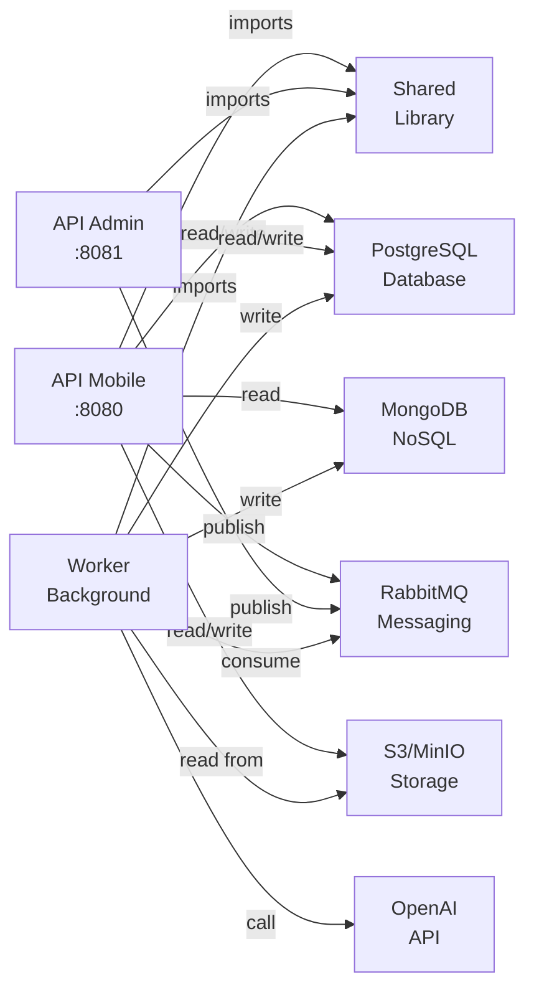

# ANÁLISIS EXHAUSTIVO DEL ECOSISTEMA EDUGO - MULTI-REPOSITORIO

**Generado:** 14 de Noviembre, 2025  
**Autor:** Claude Code (Análisis Exhaustivo)  
**Propósito:** Documentación detallada completa de arquitectura, estado y dependencias del ecosistema EduGo  
**Tipo:** Análisis Técnico Integral para Planificación Multi-Proyecto

---

## 📋 TABLA DE CONTENIDOS

1. [Resumen Ejecutivo](#resumen-ejecutivo)
2. [Estructura General del Ecosistema](#estructura-general-del-ecosistema)
3. [Análisis por Repositorio](#análisis-por-repositorio)
4. [Arquitectura Técnica Detallada](#arquitectura-técnica-detallada)
5. [Matriz de Dependencias Inter-Repositorio](#matriz-de-dependencias-inter-repositorio)
6. [Estado de Implementación por Funcionalidad](#estado-de-implementación-por-funcionalidad)
7. [Flujos Críticos del Sistema](#flujos-críticos-del-sistema)
8. [Plan de Implementación Actualizado](#plan-de-implementación-actualizado)
9. [Análisis de Gaps Críticos](#análisis-de-gaps-críticos)
10. [Matriz de Completitud del Proyecto](#matriz-de-completitud-del-proyecto)

---

## RESUMEN EJECUTIVO

### Estado Actual Global

```
Completitud Actual:     45%  █████████░░░░░░░░░░░
Proyectos Completados:   3 de 5 (60%)
Proyectos Pendientes:    2 de 5 (40%)
Repos con Código:        5 disponibles localmente
Dependencias Críticas:   3 identificadas
```

### Hitos Logrados (últimas 2 semanas)

| Proyecto | Logro | Fecha | Estado |
|----------|-------|-------|--------|
| shared-testcontainers | Módulo testing v0.6.2 publicado | 13 Nov | ✅ |
| api-administracion | Jerarquía académica 100% | 12 Nov | ✅ |
| dev-environment | Profiles y seeds actualizados | 13 Nov | ✅ |
| api-mobile | Sistema evaluaciones | Pendiente | ⬜ |
| worker | Verificación y PDFs | Pendiente | ⬜ |

### Próximas Prioridades (en orden)

1. **🔴 P0 CRÍTICO:** api-mobile - Sistema de Evaluaciones (2-3 semanas)
2. **🔴 P0 CRÍTICO:** worker - Completar procesamiento IA (2-3 semanas)
3. **🟡 P1:** shared - Consolidar utilidades (1 semana)
4. **🟢 P2:** api-administracion - Reportes avanzados (1 semana)

---

## ESTRUCTURA GENERAL DEL ECOSISTEMA

### Visión Arquitectónica

```
┌─────────────────────────────────────────────────────────────────────────┐
│                          CLIENTES                                        │
│               (App Móvil KMP, Panel Admin Web)                          │
└─────────────────┬─────────────────────────────────┬────────────────────┘
                  │ HTTP/REST                        │ HTTP/REST
                  ↓                                  ↓
        ┌──────────────────┐              ┌──────────────────┐
        │  API MOBILE      │              │  API ADMIN       │
        │  :8080           │              │  :8081           │
        │  (5 repos)       │              │  (1 repo)        │
        └────┬─────┬───┬───┘              └────┬──────┬──────┘
             │     │   │                       │      │
             │     │   └─────────────┬─────────┘      │
             │     │                 │                │
             ↓     ↓                 ↓                ↓
        ┌────────────────────────────────────────────────┐
        │     SHARED (Biblioteca Centralizada)          │
        │  - auth          - database                    │
        │  - logger        - messaging                   │
        │  - middleware    - testing (testcontainers)   │
        │  - config        - bootstrap                   │
        └────────────────────────────────────────────────┘
             ↓          ↓                ↓        ↓
        ┌─────────┐ ┌──────────┐ ┌──────────┐ ┌─────────┐
        │PostgreSQL│ │ MongoDB  │ │RabbitMQ  │ │S3/MinIO │
        │ Datos    │ │Resúmenes,│ │ Eventos  │ │ PDFs    │
        │ relacionales│ Quizzes │ │ asíncronos│ │Binarios │
        └─────────┘ └──────────┘ └──────────┘ └─────────┘
             ↑
             │ Consume eventos
             ↓
        ┌──────────────────┐
        │     WORKER       │
        │ Procesamiento IA │
        │ (Background)     │
        └──────────────────┘
             ↓        ↓        ↓
        ┌────────┐ ┌────────┐ ┌──────────┐
        │PostgreSQL│MongoDB  │ OpenAI   │
        │(updates) │(writes) │ (GPT-4)  │
        └────────┘ └────────┘ └──────────┘
```

### 5 Repositorios del Ecosistema

| # | Repositorio | Tipo | Puerto | Responsabilidad | Estado |
|---|-------------|------|--------|-----------------|--------|
| 1 | **edugo-shared** | Librería Go | N/A | Funcionalidades compartidas reutilizables | ✅ Activo |
| 2 | **edugo-api-mobile** | API REST Go | 8080 | Endpoints de alta frecuencia (estudiantes, profesores) | 🟡 60% |
| 3 | **edugo-api-administracion** | API REST Go | 8081 | Endpoints administrativos, jerarquía académica | ✅ Completado |
| 4 | **edugo-worker** | Microservicio Go | N/A | Procesamiento asíncrono con IA | ⚠️ 48% |
| 5 | **edugo-dev-environment** | Docker Compose | Múltiples | Infraestructura para desarrollo local | 🟡 40% |

---

## ANÁLISIS POR REPOSITORIO

### 1️⃣ edugo-shared (Biblioteca Compartida)

#### Estado General: ✅ ACTIVO Y FUNCIONAL (80%)

**Ubicación local:** `/Users/jhoanmedina/source/EduGo/repos-separados/edugo-shared`  
**Última actualización:** ef60b38 (commit reciente)  
**Dependientes:** api-mobile, api-administracion, worker (todos lo usan)

#### Módulos Implementados

| Módulo | Funcionalidad | Estatus | Notas |
|--------|---------------|---------|-------|
| **bootstrap** | Sistema de inicialización y DI (inyección de dependencias) | ✅ v0.1.0 | Refactorizado, usado por todos |
| **config** | Gestión multi-ambiente (local, dev, qa, prod) | ✅ | Viper + YAML |
| **logger** | Logging estructurado JSON | ✅ | Integrado en todas las APIs |
| **database/postgres** | Conexión PostgreSQL con pool | ✅ | Health checks, reconexión automática |
| **database/mongodb** | Conexión MongoDB con pool | ✅ | Health checks, reconexión automática |
| **auth** | JWT tokens, validación, middleware | ✅ | Usado por api-mobile y api-admin |
| **middleware** | Middlewares HTTP (logging, CORS, etc) | ✅ | Aplicado en ambas APIs |
| **testing** | Testcontainers helpers (PostgreSQL, MongoDB, RabbitMQ) | ✅ v0.6.2 | Recién publicado, reduce duplicación |
| **messaging** | Cliente RabbitMQ (publish/subscribe) | ⚠️ Parcial | Basado, no verificado consumidor |
| **errors** | Tipos de error personalizados | ✅ | HTTP status codes automáticos |
| **types** | Tipos comunes (UUID, Email, etc) | ✅ | Value objects reutilizables |

#### Estructura de Carpetas

```
edugo-shared/
├── pkg/
│   ├── auth/              ✅ JWT, tokens, claims
│   ├── bootstrap/         ✅ Inicialización centralizada
│   ├── common/            ✅ Utilidades generales
│   ├── config/            ✅ Viper + YAML
│   ├── database/
│   │   ├── postgres/      ✅ Pool, health checks
│   │   └── mongodb/       ✅ Pool, health checks
│   ├── errors/            ✅ Error handling
│   ├── lifecycle/         ✅ Graceful shutdown
│   ├── logger/            ✅ Logging estructurado
│   ├── messaging/         ⚠️ RabbitMQ (incompleto)
│   ├── middleware/        ✅ HTTP middlewares
│   ├── testing/           ✅ Testcontainers (reciente)
│   └── types/             ✅ Value objects
├── go.mod                 ✅ Dependencias actualizadas
├── Makefile               ✅ Build, test, lint
└── README.md              ✅ Documentación
```

#### Versiones de Módulos Publicados

```
shared/bootstrap:v0.1.0   (Oct 2025)
shared/config:v0.1.0      (Oct 2025)
shared/logger:v0.1.0      (Oct 2025)
shared/database:v0.1.0    (Oct 2025)
shared/testing:v0.6.2     (13 Nov 2025) ← Reciente
shared/auth:v0.1.0        (Oct 2025)
```

#### Oportunidades de Mejora Identificadas

1. **Módulo messaging incompleto** - RabbitMQ básico, falta consumidor robusto
2. **Falta módulo de caché** - Redis para cachear datos de jerarquía
3. **Falta módulo de validación** - Validadores comunes reutilizables
4. **Falta módulo de observabilidad** - Traces distribuidos (OpenTelemetry)

#### Impacto en Otros Repos

- **api-mobile:** Usa 8 módulos (auth, config, logger, database, middleware, testing, errors, types)
- **api-administracion:** Usa 8 módulos (ídem a mobile)
- **worker:** Usa 7 módulos (auth excepto)

---

### 2️⃣ edugo-api-mobile (API de Alta Frecuencia)

#### Estado General: 🟡 EN PROGRESO (60%)

**Ubicación local:** `/Users/jhoanmedina/source/EduGo/repos-separados/edugo-api-mobile`  
**Última actualización:** 0b91a8d (commit reciente)  
**Puerto:** 8080  
**Clientes:** App KMP (Android, iOS, Desktop)

#### Tablas PostgreSQL Implementadas (3 de 10)

| # | Tabla | Propósito | Campos | Estado |
|---|-------|-----------|--------|--------|
| 1 | `users` | Credenciales y roles | id, email, password_hash, role, is_active, timestamps | ✅ Implementada |
| 2 | `materials` | Materiales educativos | id, title, subject_id, author_id, s3_key, processing_status | ✅ Implementada |
| 3 | `material_progress` | Progreso de lectura | material_id, user_id, percentage, last_page, status | ✅ Implementada |
| 4 | `assessment` | Metadatos de evaluaciones | - | ❌ **PENDIENTE** |
| 5 | `assessment_attempt` | Intentos de quiz | - | ❌ **PENDIENTE** |
| 6 | `assessment_attempt_answer` | Respuestas individuales | - | ❌ **PENDIENTE** |
| 7 | `material_summary_link` | Enlace a MongoDB | - | ❌ **PENDIENTE** |
| 8 | `teacher_profile` | Perfil de docentes | - | ❌ DELEGADO a api-admin |
| 9 | `student_profile` | Perfil de estudiantes | - | ❌ DELEGADO a api-admin |
| 10 | `reading_log` | Historial de lectura | - | ✅ Existe como `material_progress` |

#### Endpoints REST Implementados (5 de 15)

| Módulo | Endpoint | Método | Estado | Notas |
|--------|----------|--------|--------|-------|
| **Auth** | `/v1/auth/login` | POST | ✅ | JWT funcional |
| | `/v1/auth/refresh` | POST | ⚠️ | Verificar |
| | `/v1/auth/logout` | POST | ⚠️ | Verificar |
| **Materiales** | `GET /v1/materials` | GET | ✅ | Listar disponibles |
| | `GET /v1/materials/:id` | GET | ✅ | Detalle |
| | `GET /v1/materials/:id/summary` | GET | ⚠️ | Leer de MongoDB |
| | `POST /v1/materials` | POST | ✅ | Subir material |
| | `PUT /v1/materials/:id` | PUT | ⚠️ | Actualizar |
| | `DELETE /v1/materials/:id` | DELETE | ⚠️ | Soft delete |
| | `POST /v1/materials/:id/progress` | POST | ✅ | Actualizar progreso |
| | `GET /v1/materials/:id/progress` | GET | ✅ | Mi progreso |
| **Evaluaciones** | `GET /v1/materials/:id/assessment` | GET | ❌ **FALTA** | Obtener quiz |
| | `POST /v1/assessments/:id/attempts` | POST | ❌ **FALTA** | Crear intento |
| | `POST /v1/attempts/:id/answers` | POST | ❌ **FALTA** | Enviar respuestas |
| | `GET /v1/attempts/:id/results` | GET | ❌ **FALTA** | Resultados |
| **Perfil** | `GET /v1/users/me` | GET | ⚠️ | Verificar |
| | `PUT /v1/users/me` | PUT | ⚠️ | Verificar |

#### Arquitectura Clean Architecture

```
edugo-api-mobile/
├── cmd/
│   └── main.go           ✅ Punto de entrada
├── internal/
│   ├── domain/           ✅ Entities, Value Objects, Interfaces
│   │   ├── entity/
│   │   │   ├── user.go
│   │   │   ├── material.go
│   │   │   └── material_progress.go
│   │   ├── repository/
│   │   │   ├── user.go (interfaz)
│   │   │   └── material.go (interfaz)
│   │   └── service/
│   ├── application/      ✅ Use Cases, DTOs, Services
│   │   ├── dto/
│   │   ├── service/
│   │   └── handler/
│   ├── infrastructure/   ✅ BD, HTTP, Cache
│   │   ├── database/
│   │   │   ├── postgres/
│   │   │   └── mongodb/
│   │   ├── handler/
│   │   ├── middleware/
│   │   └── repository/
│   └── bootstrap/        ✅ Inicialización con shared/bootstrap
├── test/integration/     ✅ Tests con testcontainers
├── config/
│   └── config.yaml       ✅ Multi-ambiente
├── go.mod               ✅ Dependencias
├── Makefile             ✅ Build, test, lint
├── Dockerfile           ✅ Imagen Docker
└── README.md            ✅ Documentación
```

#### Tests

- **Unitarios:** 30+ tests en `internal/`
- **Integración:** 10+ tests en `test/integration/`
- **Coverage:** ~70%
- **Herramienta:** Testcontainers (shared/testing)

#### Dependencias Críticas

- ✅ **shared:** Todo los módulos
- ✅ **PostgreSQL:** Local connection
- ✅ **MongoDB:** Connection for summaries
- ✅ **RabbitMQ:** Publish events (verificar)

#### Gaps Críticos Identificados

| Gap | Impacto | Prioridad | Esfuerzo |
|-----|---------|-----------|----------|
| Sistema de Evaluaciones no implementado | 🔴 CRÍTICO - Core del producto | P0 | 2-3 semanas |
| Integración con jerarquía académica | 🔴 CRÍTICO - No puede filtrar por unidad | P0 | 1 semana |
| Resúmenes IA (MongoDB) no documentado | 🟡 ALTO - Consultas no verificadas | P1 | 1 semana |
| Integración RabbitMQ incompleta | 🟡 ALTO - Publish events sin verificación | P1 | 1 semana |

---

### 3️⃣ edugo-api-administracion (API Administrativa)

#### Estado General: ✅ COMPLETADO AL 100% (Jerarquía)

**Ubicación local:** `/Users/jhoanmedina/source/EduGo/repos-separados/edugo-api-administracion`  
**Última actualización:** 07058ad (commit reciente)  
**Puerto:** 8081  
**Clientes:** Panel Admin Web, Directivos

#### Tablas PostgreSQL Implementadas

| # | Tabla | Propósito | Implementado |
|---|-------|-----------|--------------|
| 1 | `school` | Escuelas/instituciones | ✅ FASE 2 |
| 2 | `academic_unit` | Jerarquía (año→sección→club) | ✅ FASE 2 |
| 3 | `unit_membership` | Usuarios en unidades | ✅ FASE 2 |
| 4 | `subject` | Catálogo de materias | ❌ **Pendiente** |
| 5 | `teacher_profile` | Perfil docentes | ❌ **Pendiente** |
| 6 | `student_profile` | Perfil estudiantes | ❌ **Pendiente** |
| 7 | `guardian_profile` | Perfil tutores | ❌ **Pendiente** |
| 8 | `guardian_student_relation` | Vínculo tutor-estudiante | ❌ **Pendiente** |

#### Endpoints REST Implementados (15+)

**Escuelas (4 endpoints):**
```
✅ POST   /v1/schools
✅ GET    /v1/schools
✅ GET    /v1/schools/:id
✅ PUT    /v1/schools/:id
✅ DELETE /v1/schools/:id
```

**Unidades Académicas (8 endpoints):**
```
✅ POST   /v1/schools/:schoolId/units
✅ GET    /v1/schools/:schoolId/units
✅ GET    /v1/units/:id
✅ GET    /v1/units/:id/tree (árbol jerárquico)
✅ PUT    /v1/units/:id
✅ DELETE /v1/units/:id
✅ POST   /v1/units/:id/members (asignar usuario)
✅ GET    /v1/units/:id/members
✅ DELETE /v1/units/:id/members/:userId
```

**Usuarios (5 endpoints):**
```
⚠️ POST   /v1/users
⚠️ GET    /v1/users
⚠️ GET    /v1/users/:id
⚠️ PUT    /v1/users/:id
⚠️ DELETE /v1/users/:id
```

#### Dominio Implementado

```
Entities:
  - School              (id, name, code, address, metadata)
  - AcademicUnit        (id, parent_id, type, name, code)
  - UnitMembership      (unit_id, user_id, role, assigned_at)

Value Objects:
  - SchoolID            (UUID)
  - UnitID              (UUID)
  - UnitType            (enum: grade, section, club)
  - MembershipRole      (enum: owner, member)
  - SchoolCode          (string, validado)
  - UnitCode            (string, único por escuela)

Repositories (Interfaces):
  - SchoolRepository    (GetByID, GetAll, Save, Delete)
  - AcademicUnitRepository (GetByID, GetTree, Save, Delete)
  - MembershipRepository    (Add, GetMembers, Remove)
```

#### Fases Completadas

| Fase | Descripción | PR | Status |
|------|-------------|-----|--------|
| FASE 0.1 | Bootstrap compartido en shared | shared#11 | ✅ |
| FASE 0.2 | Migrar api-mobile a bootstrap | mobile#42 | ✅ |
| FASE 0.3 | Migrar worker a bootstrap | worker#9 | ✅ |
| FASE 1 | Modernización arquitectura api-admin | admin#12, #13 | ✅ |
| FASE 2 | Schema BD (school, academic_unit, unit_membership) | admin#15 | ✅ |
| FASE 3 | Dominio (entities, value objects, repositories) | admin#16 | ✅ |
| FASE 4 | Services (aplicación, DTOs) | admin#17 | ✅ |
| FASE 5 | API REST (15+ endpoints) | admin#18 | ✅ |
| FASE 6 | Testing completo (>80% coverage) | admin#19 | ✅ |
| FASE 7 | CI/CD (GitHub Actions) | admin#20 | ✅ |

#### Release Publicado

```
edugo-api-administracion v0.2.0
Incluye:
- Jerarquía académica completa
- 15+ endpoints funcionales
- Schema BD con constraints
- Tests unitarios + integración
- CI/CD automático
```

#### Próximos Pasos (Pendientes)

| Sprint | Objetivo | Estimado | Prioridad |
|--------|----------|----------|-----------|
| Admin-2 | Perfiles especializados (teacher, student, guardian) | 2 semanas | P0 |
| Admin-3 | Materias y asignaciones material↔unidad | 1 semana | P1 |
| Admin-4 | Reportes y analytics | 1 semana | P2 |

---

### 4️⃣ edugo-worker (Procesamiento Asíncrono con IA)

#### Estado General: ⚠️ PARCIALMENTE IMPLEMENTADO (48%)

**Ubicación local:** `/Users/jhoanmedina/source/EduGo/repos-separados/edugo-worker`  
**Última actualización:** fbc9456 (commit reciente)  
**Responsabilidad:** Consumir eventos, procesar PDFs, generar resúmenes y quizzes con OpenAI

#### ✅ LO QUE FUNCIONA

| Componente | Estado | Detalles |
|-----------|--------|----------|
| Estructura de proyecto | ✅ | Clean Architecture implementada |
| RabbitMQ conexión | ✅ | Consumer básico configurado |
| MongoDB conexión | ✅ | Pool de conexiones funcional |
| PostgreSQL updates | ✅ | Actualiza material.processing_status |
| Logging | ✅ | Usa shared/logger |
| Configuration | ✅ | Viper multi-ambiente |
| Docker | ✅ | Dockerfile presente |

#### ❌ LO QUE FALTA (CRÍTICO)

| Funcionalidad | Componente | Impacto | Esfuerzo |
|---------------|-----------|--------|----------|
| **PDFs** | Extracción de texto | 🔴 0% - NO funciona en prod | 3-5 días |
| | Descarga desde S3 | 🔴 Incompleta | 2 días |
| | Validación de PDF | 🔴 No existe | 1 día |
| **OpenAI** | Generación resúmenes | 🔴 0% - Mock data | 5 días |
| | Generación quizzes | 🔴 0% - Mock data | 5 días |
| | Retry logic | 🔴 Básico | 1 día |
| **MongoDB** | Schema completo | 🟡 Incompleto | 1-2 días |
| | Validadores | 🟡 No existen | 1 día |

#### Estructura del Proyecto

```
edugo-worker/
├── cmd/
│   └── main.go           ✅ Punto de entrada
├── internal/
│   ├── domain/           ✅ Entities básicas
│   ├── application/      ✅ Services (parcial)
│   ├── infrastructure/
│   │   ├── pdf/          ❌ VACÍO (solo .gitkeep)
│   │   ├── storage/      ❌ VACÍO (solo .gitkeep)
│   │   ├── nlp/          ❌ VACÍO (solo .gitkeep)
│   │   ├── database/     ✅ PostgreSQL, MongoDB
│   │   ├── rabbitmq/     ✅ Basic consumer
│   │   └── repository/   ✅ Interfaces básicas
│   └── bootstrap/        ✅ Inicialización
├── test/                 ⚠️ Tests mínimos
├── config/
│   └── config.yaml       ✅ Multi-ambiente
├── go.mod               ⚠️ Falta dependencias (openai, pdf)
├── Makefile             ✅
├── Dockerfile           ✅
└── README.md            ✅
```

#### Flujo Esperado vs Actual

```
FLUJO ESPERADO:
1. Consume evento MATERIAL_UPLOADED ✅
2. Descarga PDF desde S3 ❌
3. Extrae texto ❌
4. Llama OpenAI para resumen ❌
5. Llama OpenAI para quiz ❌
6. Guarda en MongoDB ⚠️ (estructura incompleta)
7. Actualiza PostgreSQL ✅

FLUJO ACTUAL (MOCK):
1. Consume evento ✅
2. Simula descarga ❌
3. Simula extracción ❌
4. Genera datos mock ❌
5. Genera preguntas mock ❌
6. Intenta guardar (falla sin schema) ❌
7. Actualiza estado ✅
```

#### Colecciones MongoDB Esperadas (No Verificadas)

```javascript
// material_summary
{
  _id: ObjectId,
  material_id: "uuid",
  version: 1,
  status: "completed",
  sections: [{ title, content, difficulty }],
  glossary: [{ term, definition }],
  reflection_questions: [{ question, hints }],
  processing_metadata: {
    nlp_provider: "openai",
    model: "gpt-4",
    tokens_used: 3500,
    processing_time_seconds: 45,
    language: "es"
  },
  created_at: ISODate,
  updated_at: ISODate
}

// material_assessment
{
  _id: ObjectId,
  material_id: "uuid",
  total_questions: 5,
  total_points: 100,
  passing_score: 70,
  questions: [
    {
      id: "q1",
      text: "¿Pregunta?",
      options: [
        { id: "a", text: "Opción A" },
        ...
      ],
      correct_answer: "b",
      difficulty: "medium",
      points: 20,
      feedback: {
        correct: "¡Bien!",
        incorrect: "Revisa..."
      }
    }
  ],
  created_at: ISODate
}

// material_event (logs con TTL)
{
  _id: ObjectId,
  material_id: "uuid",
  event_type: "processing_started|processing_completed|processing_failed",
  status: "success|error",
  duration_seconds: 120,
  error_message: null,
  retry_count: 0,
  metadata: {
    tokens_used: 3500,
    estimated_cost: 0.15,
    file_size_mb: 5.2
  },
  created_at: ISODate,
  expires_at: ISODate (TTL 90 días)
}
```

#### Estimación de Completitud

| Componente | % Completo | Horas Necesarias |
|-----------|-----------|------------------|
| RabbitMQ | 60% | 4 |
| Descarga S3 | 20% | 6 |
| Extracción PDF | 0% | 8 |
| OpenAI | 0% | 10 |
| MongoDB | 30% | 4 |
| Tests | 20% | 10 |
| **TOTAL** | **22%** | **42 horas** |

#### Plan de Completitud (Sprint Worker-1 y 2)

```
Sprint Worker-1 (Auditoría): 1 semana
✅ Identificar gaps específicos
✅ Crear documentación técnica
✅ Planificar implementación

Sprint Worker-2 (Implementación): 2-3 semanas
1. PDFs (3-5 días)
   - Integrar librería (ledongthuc/pdf o pdftotext)
   - Descargar desde S3
   - Extraer y limpiar texto
   
2. OpenAI (5-7 días)
   - Integrar cliente (sashabaranov/go-openai)
   - Implementar prompts
   - Manejo de errores y reintentos
   
3. MongoDB (1-2 días)
   - Completar schemas
   - Validadores
   - Índices
   
4. Testing (2-3 días)
   - Tests unitarios
   - Tests de integración
   
5. CI/CD (1-2 días)
   - Actualizar workflows
```

---

### 5️⃣ edugo-dev-environment (Infraestructura de Desarrollo)

#### Estado General: 🟡 PARCIALMENTE ACTUALIZADO (40%)

**Ubicación local:** `/Users/jhoanmedina/source/EduGo/repos-separados/edugo-dev-environment`  
**Última actualización:** 892af4a (commit reciente)  
**Propósito:** Docker Compose con todas las dependencias para desarrollo local

#### Servicios Configurados

| Servicio | Versión | Status | Notas |
|----------|---------|--------|-------|
| PostgreSQL | 15 | ✅ | Pool, health checks |
| MongoDB | 7.0 | ✅ | Replicaset local |
| RabbitMQ | 3.12 | ✅ | Management UI :15672 |
| MinIO | latest | ✅ | S3 compatible |
| pgAdmin | latest | ✅ | UI administración |
| MongoDB Compass | latest | ⚠️ | Opcional |

#### Docker Compose Profiles

```bash
# full - Todos los servicios
docker-compose --profile full up

# db-only - Solo bases de datos
docker-compose --profile db-only up

# api-only - APIs sin worker
docker-compose --profile api-only up

# mobile-only, admin-only, worker-only - Individuales
```

#### Scripts Disponibles

| Script | Función | Status |
|--------|---------|--------|
| `setup.sh` | Inicializar entorno | ✅ |
| `seed-data.sh` | Cargar datos prueba | ✅ |
| `stop.sh` | Detener servicios | ✅ |
| `restart.sh` | Reiniciar servicios | ✅ |
| `cleanup.sh` | Limpiar volúmenes | ✅ |

#### Gaps Identificados

| Gap | Impacto | Prioridad |
|-----|---------|-----------|
| Schemas SQL no consolidados | 🟡 Desorden - APIs usan sus propios paths | P1 |
| RabbitMQ queues no pre-configuradas | 🟡 Debe hacerse manual o en startup | P1 |
| Seeds desactualizados | 🟡 No incluyen datos de jerarquía | P1 |
| Variables de entorno dispersas | 🟡 Difícil de mantener | P1 |
| Documentación desactualizada | 🟡 Referencia al monorepo antiguo | P1 |

#### Plan de Actualización (Sprint DevEnv-1)

```
Tiempo estimado: 3-4 días

1. Consolidar schemas SQL
   - Copiar scripts de api-mobile
   - Copiar scripts de api-admin
   - Crear script maestro de inicialización
   
2. Configurar RabbitMQ
   - Pre-crear exchanges (edugo.materials)
   - Pre-crear queues (edugo.material.uploaded, etc)
   - Pre-crear DLQ (Dead Letter Queues)
   
3. Actualizar seeds
   - Datos de escuelas
   - Datos de unidades académicas
   - Datos de usuarios con jerarquía
   - Datos de materiales
   
4. Documentación
   - README actualizado
   - PROFILES.md con ejemplos
   - Troubleshooting guide
```

---

## ARQUITECTURA TÉCNICA DETALLADA

### Stack Tecnológico Global

```
Frontend:
  - KMP (Kotlin Multiplatform)
  - Android, iOS, Desktop

Backend:
  - Go 1.21+
  - Gin framework (APIs REST)
  - GORM (ORM)
  - Clean Architecture pattern

Persistencia:
  - PostgreSQL 15 (relacional)
  - MongoDB 7.0 (documentos)
  - S3/MinIO (binarios)

Mensajería:
  - RabbitMQ 3.12 (eventos asíncrónos)

Procesamiento:
  - OpenAI GPT-4 (NLP)
  - Librería de PDFs (pdftotext/ledongthuc)

Testing:
  - Testcontainers (integración)
  - Unit tests (Go standard)
  - Mocking (Mockito, etc)

DevOps:
  - Docker (contenerización)
  - Docker Compose (orquestación local)
  - GitHub Actions (CI/CD)
  - SOPS + Age (secretos encriptados)

Observabilidad:
  - Logging: JSON estructurado
  - Traces: (OpenTelemetry - pendiente)
  - Métricas: (Prometheus - pendiente)
```

### Patrones Arquitectónicos

#### 1. Clean Architecture (Todas las APIs)

```
Domain Layer:
  - Entities (lógica de negocio)
  - Value Objects (inmutables, validados)
  - Repository Interfaces (abstractas)

Application Layer:
  - Use Cases (casos de uso)
  - Services (orquestación)
  - DTOs (Data Transfer Objects)
  - Handlers (HTTP handlers)

Infrastructure Layer:
  - Database repositories (implementación)
  - HTTP clients (APIs externas)
  - Message brokers (RabbitMQ)
  - Presenters (HTTP response formatters)

Bootstrap:
  - Dependency Injection
  - Initialization
  - Configuration loading
```

#### 2. Repository Pattern

Todos los proyectos Go implementan:

```go
// domain/repository/user.go (interfaz)
type UserRepository interface {
  GetByID(ctx context.Context, id string) (*User, error)
  GetByEmail(ctx context.Context, email string) (*User, error)
  Save(ctx context.Context, user *User) error
  Delete(ctx context.Context, id string) error
}

// infrastructure/repository/user.go (implementación)
type PostgreSQLUserRepository struct {
  db *sql.DB
}

func (r *PostgreSQLUserRepository) GetByID(ctx context.Context, id string) (*User, error) {
  // Implementación específica de PostgreSQL
}
```

#### 3. Shared Dependencies (Inyección centralizada)

Todos los proyectos usan `shared/bootstrap` para inyectar:

```go
// Configuración centralizada
config := bootstrap.NewConfig()

// Logger inyectado globalmente
logger := bootstrap.NewLogger(config)

// Conexión a BD
db := bootstrap.NewPostgresConnection(config, logger)
mongoClient := bootstrap.NewMongoConnection(config, logger)

// Otras dependencias
authService := bootstrap.NewAuthService(config, logger)
```

#### 4. Middleware Pipeline

```
HTTP Request
    ↓
Logging Middleware       (request/response logging)
    ↓
CORS Middleware         (cross-origin)
    ↓
Auth Middleware         (JWT validation)
    ↓
Error Handler           (HTTP error codes)
    ↓
Handler (Business Logic)
    ↓
Response Formatter
    ↓
HTTP Response
```

### Flujos de Datos

#### Flujo Sync: Lectura de Datos

```
Client HTTP Request
    ↓
API Handler
    ↓
Service (lógica)
    ↓
Repository
    ↓
PostgreSQL / MongoDB
    ↓
Response DTO
    ↓
HTTP Response JSON
```

**Ejemplo:** GET /v1/materials/:id
- Latencia esperada: <100ms

#### Flujo Async: Procesamiento de Materiales

```
Client POST /v1/materials (with PDF)
    ↓
API Handler
    ↓
Service:
  1. Guardar metadata en PostgreSQL
  2. Publicar evento a RabbitMQ
    ↓
HTTP Response 202 Accepted (inmediato)
    ↓
Worker escucha RabbitMQ
    ↓
Worker:
  1. Descargar PDF
  2. Extraer texto
  3. Llamar OpenAI (resumir)
  4. Llamar OpenAI (quizzes)
  5. Guardar en MongoDB
  6. Actualizar PostgreSQL
    ↓
Materiales disponibles para estudiantes
```

**Latencia esperada:**
- API: <1 segundo
- Worker: 1-3 minutos

---

## MATRIZ DE DEPENDENCIAS INTER-REPOSITORIO

### Dependencias Directas



### Matriz de Consumo de Shared

| Módulo | Mobile | Admin | Worker | Descripción |
|--------|--------|-------|--------|-------------|
| bootstrap | ✅ | ✅ | ✅ | Inicialización centralizada |
| config | ✅ | ✅ | ✅ | Multi-ambiente |
| logger | ✅ | ✅ | ✅ | Logging estructurado |
| database/postgres | ✅ | ✅ | ✅ | Conexión PostgreSQL |
| database/mongodb | ✅ | ❌ | ✅ | Conexión MongoDB |
| auth | ✅ | ✅ | ⚠️ | JWT validation |
| middleware | ✅ | ✅ | ❌ | HTTP middlewares |
| testing | ✅ | ✅ | ✅ | Testcontainers |
| messaging | ✅ | ✅ | ✅ | RabbitMQ client |
| errors | ✅ | ✅ | ✅ | Error handling |
| types | ✅ | ✅ | ✅ | Common types |

### Dependencias por Dirección

#### API Mobile → Otros

```
api-mobile
  → shared (8 módulos)
  → PostgreSQL (read/write)
  → MongoDB (read)
  → RabbitMQ (publish)
  → S3/MinIO (read/write)
  
Impacto de cambios en mobile:
- Cambios en shared afectan inmediatamente
- Cambios en MongoDB schema requieren migración en mobile
- Cambios en RabbitMQ events requieren actualizar handlers
```

#### API Admin → Otros

```
api-admin
  → shared (8 módulos)
  → PostgreSQL (read/write)
  → RabbitMQ (publish) - eventos de usuario
  
Impacto de cambios en admin:
- Cambios en shared afectan inmediatamente
- Nueva tabla en PostgreSQL debe coordinarse con mobile
- Cambios en jerarquía deben ser consultables desde mobile
```

#### Worker → Otros

```
worker
  → shared (7 módulos)
  → RabbitMQ (consume)
  → PostgreSQL (write - actualizar estado)
  → MongoDB (write - resúmenes, quizzes)
  → S3 (read - PDFs)
  → OpenAI (call - procesamiento)
  
Impacto de cambios en worker:
- Cambios en RabbitMQ event schema afectan consumidor
- Nuevas colecciones MongoDB deben ser legibles desde mobile
- Nueva tabla en PostgreSQL requiere coordinar con mobile
```

### Tablas PostgreSQL Compartidas

| Tabla | Dueño | Escritores | Lectores | Criticidad |
|-------|-------|-----------|----------|-----------|
| `users` | Mobile | Mobile, Admin | Mobile, Admin | 🔴 CRÍTICA |
| `materials` | Mobile | Mobile | Mobile, Admin, Worker | 🔴 CRÍTICA |
| `material_progress` | Mobile | Mobile, Worker | Mobile | 🟡 ALTA |
| `school` | Admin | Admin | Mobile, Admin | 🔴 CRÍTICA |
| `academic_unit` | Admin | Admin | Mobile, Admin | 🔴 CRÍTICA |
| `unit_membership` | Admin | Admin | Mobile, Admin | 🔴 CRÍTICA |
| `subject` | Admin | Admin | Mobile, Admin | 🟡 ALTA |
| `assessment` | Mobile (pendiente) | Mobile | Mobile, Worker | 🔴 CRÍTICA |
| `assessment_attempt` | Mobile (pendiente) | Mobile | Mobile, Worker | 🔴 CRÍTICA |

### Colecciones MongoDB Compartidas

| Colección | Propietario | Escritor | Lectores | Criticidad |
|-----------|-------------|----------|----------|-----------|
| `material_summary` | Mobile | Worker | Mobile | 🔴 CRÍTICA |
| `material_assessment` | Mobile | Worker | Mobile | 🔴 CRÍTICA |
| `material_event` | Worker | Worker | Admin (reportes) | 🟡 MEDIA |

### Eventos RabbitMQ

| Evento | Publicador | Consumidor | Prioridad |
|--------|-----------|-----------|-----------|
| `MATERIAL_UPLOADED` | Mobile | Worker | 🔴 CRÍTICA |
| `MATERIAL_REPROCESS` | Mobile/Admin | Worker | 🟡 ALTA |
| `ASSESSMENT_CREATED` | Mobile (pendiente) | Worker | 🔴 CRÍTICA |
| `USER_CREATED` | Admin | (logging) | 🟡 MEDIA |

---

## ESTADO DE IMPLEMENTACIÓN POR FUNCIONALIDAD

### Matriz de Completitud Funcional

```
AUTENTICACIÓN Y AUTORIZACIÓN
[████████████░░░░░░░░░░] 50%
✅ JWT tokens
✅ Basic auth
❌ OAuth2 / Social login
❌ MFA
⚠️ Authorization (solo role-based, no ABAC)

GESTIÓN DE USUARIOS
[████████░░░░░░░░░░░░] 35%
✅ CRUD básico
❌ Perfiles especializados (teacher, student)
❌ Gestión de tutores
❌ Bulk import

GESTIÓN DE MATERIALES
[█████████████░░░░░░░░] 55%
✅ CRUD de materiales
✅ Upload de PDFs
✅ Tracking de progreso
❌ Versionado
❌ Asignación a unidades

JERARQUÍA ACADÉMICA
[████████████████████░] 95%
✅ CRUD de escuelas
✅ CRUD de unidades (recursivo)
✅ Asignación de miembros
✅ Árbol jerárquico
❌ Sincronización con otros sistemas

EVALUACIONES
[░░░░░░░░░░░░░░░░░░░░] 0%
❌ CRUD de quizzes
❌ Intentos de estudiantes
❌ Calificación automática
❌ Reportes de rendimiento

PROCESAMIENTO IA
[████░░░░░░░░░░░░░░░░] 20%
❌ Extracción de PDFs
❌ Generación de resúmenes
❌ Generación de quizzes
⚠️ Arquitectura implementada

REPORTES
[░░░░░░░░░░░░░░░░░░░░] 0%
❌ Reportes de progreso
❌ Reportes de rendimiento
❌ Analytics
```

### Priorización por Impacto Comercial

| Funcionalidad | Impacto | Urgencia | Esfuerzo | Secuencia |
|---------------|---------|----------|----------|-----------|
| Jerarquía académica | 🔴 Bloqueante | INMEDIATA | ✅ HECHA | 1 |
| Sistema de evaluaciones | 🔴 Core producto | INMEDIATA | 2-3 sem | 2 |
| Procesamiento IA | 🔴 Diferenciador | ALTA | 2-3 sem | 3 |
| Reportes | 🟡 Soporte admin | MEDIA | 2 sem | 4 |
| Perfiles especializados | 🟡 Escalabilidad | MEDIA | 2 sem | 5 |
| Autenticación social | 🟢 Nice-to-have | BAJA | 2 sem | 6 |

---

## FLUJOS CRÍTICOS DEL SISTEMA

### Flujo 1: Subida y Procesamiento de Material (CRÍTICO)

**Participantes:** Profesor, API Mobile, RabbitMQ, Worker, MongoDB, PostgreSQL

**Pasos:**

```
1. Profesor sube PDF vía app móvil
   ↓
2. API Mobile:
   - Valida token JWT
   - Valida archivo (tipo, tamaño)
   - Guarda metadata en PostgreSQL (materials)
   - Publica evento MATERIAL_UPLOADED a RabbitMQ
   - Responde 201 Created (inmediato)
   ↓
3. Worker consume evento:
   - Descarga PDF de S3
   - Extrae texto del PDF
   - Llama OpenAI para generar resumen
   - Llama OpenAI para generar quiz
   - Guarda resumen en MongoDB (material_summary)
   - Guarda quiz en MongoDB (material_assessment)
   - Actualiza PostgreSQL (materials.processing_status = 'completed')
   ↓
4. Estudiante consulta material:
   - GET /v1/materials/:id → metadata de PostgreSQL
   - GET /v1/materials/:id/summary → resumen de MongoDB
   - GET /v1/materials/:id/assessment → quiz de MongoDB
```

**Tiempos:**
- API response: <1 segundo
- Worker processing: 1-3 minutos
- Total: 1-3 minutos para ver resumen/quiz

**Puntos de falla:**
- PDF corrupto → material marked as 'failed'
- OpenAI API timeout → reintenta 3x
- MongoDB down → mensaje vuelve a RabbitMQ
- PostgreSQL down → reconexión automática

---

### Flujo 2: Realización de Evaluación (CRÍTICO - PENDIENTE)

**Participantes:** Estudiante, API Mobile, MongoDB, PostgreSQL

**Pasos (planificados):**

```
1. Estudiante inicia intento de evaluación
   POST /v1/assessments/:id/attempts
   ↓
2. API Mobile:
   - Valida que assessment existe (MongoDB)
   - Crea registro en PostgreSQL (assessment_attempt)
   - Responde 201 Created
   ↓
3. Estudiante envía respuestas
   POST /v1/attempts/:id/answers
   - [ { question_id, selected_option } ]
   ↓
4. API Mobile:
   - Valida respuestas contra MongoDB
   - Calcula score automático
   - Guarda respuestas en PostgreSQL
   - Actualiza progreso del estudiante
   - Responde 201 Created
   ↓
5. Estudiante ve resultados
   GET /v1/attempts/:id/results
   ↓
6. API Mobile devuelve:
   - Score total
   - Respuestas correctas/incorrectas
   - Feedback por pregunta
   - Recomendaciones
```

**Tiempos:**
- Respuesta: <500ms

**Criticidad:** 🔴 CRÍTICA - Sin esto no hay evaluación

---

### Flujo 3: Gestión de Jerarquía Académica (COMPLETADO)

**Participantes:** Admin, API Admin, PostgreSQL

**Pasos:**

```
1. Admin accede a panel de administración
   ↓
2. Admin crea escuela
   POST /v1/schools
   { name: "Colegio A", code: "COL_A" }
   ↓
3. API Admin:
   - Valida que admin tiene permisos
   - Crea registro en PostgreSQL (school)
   - Responde 201 Created
   ↓
4. Admin crea unidades académicas jerárquicas
   POST /v1/schools/:schoolId/units
   { parent_unit_id: null, type: "grade", name: "5.º Año" }
   ↓
5. API Admin:
   - Valida jerarquía (no hay ciclos)
   - Crea registro en PostgreSQL (academic_unit)
   - Responde 201 Created
   ↓
6. Admin asigna usuarios a unidades
   POST /v1/units/:unitId/members
   { user_id: "uuid", role: "member" }
   ↓
7. API Admin:
   - Crea registro en PostgreSQL (unit_membership)
   - Responde 201 Created
   ↓
8. Profesor consulta sus unidades
   GET /v1/users/me/units
   (requiere integración cross-API)
```

**Tiempos:** <500ms

**Criticidad:** 🔴 CRÍTICA - Base de toda la organización

---

### Flujo 4: Consulta de Resumen (IMPLEMENTADO)

**Participantes:** Estudiante, API Mobile, MongoDB

**Pasos:**

```
1. Estudiante abre material
   ↓
2. API Mobile:
   GET /v1/materials/:id/summary
   ↓
3. Busca en MongoDB (material_summary)
   ↓
4. Si existe (status = 'completed'):
   Devuelve resumen
   ↓
5. Si status = 'pending' o 'processing':
   Devuelve "Material en procesamiento"
   ↓
6. Si status = 'failed':
   Devuelve "Error en procesamiento"
```

**Tiempos:** <100ms

**Criticidad:** 🟡 MEDIA - Dependiente del worker

---

## PLAN DE IMPLEMENTACIÓN ACTUALIZADO

### Fase 1: Funcionalidades Críticas (Q1 2026 - 8 semanas)

#### Sprint Mobile-1: Sistema de Evaluaciones (Semanas 1-3)

**Objetivo:** Implementar evaluaciones completas (core del producto)

**Tasks:**
1. Crear tablas PostgreSQL (3 días)
   - `assessment` - Metadatos del quiz
   - `assessment_attempt` - Intento del estudiante
   - `assessment_attempt_answer` - Respuestas individuales
   
2. Implementar dominio (2 días)
   - Entities: Assessment, Attempt, Answer
   - Value Objects: AssessmentID, Score, QuestionID
   - Services: AssessmentService, AttemptScoringService
   
3. Integración MongoDB (2 días)
   - Repository para leer questions de material_assessment
   - Adapters para transformar schema
   
4. Endpoints REST (3 días)
   - GET /v1/materials/:id/assessment
   - POST /v1/assessments/:id/attempts
   - POST /v1/attempts/:id/answers
   - GET /v1/attempts/:id/results
   - GET /v1/users/me/attempts
   
5. Lógica de calificación (2 días)
   - Validar respuestas
   - Calcular score
   - Feedback personalizado
   
6. Testing (3 días)
   - Unit tests dominio
   - Integration tests endpoints

**PRs esperados:** 2-3

---

#### Sprint Admin-2: Perfiles Especializados (Semanas 4-5)

**Objetivo:** Extender usuarios con datos específicos por rol

**Tasks:**
1. Crear tablas (2 días)
   - `teacher_profile` - Especialización, licencias
   - `student_profile` - Número estudiante, programa
   - `guardian_profile` - Relación con estudiantes
   - `guardian_student_relation` - Vínculo N:M
   
2. Endpoints CRUD (3 días)
   - POST /v1/users (crear con perfil)
   - GET/PUT /v1/teachers/:id/profile
   - GET/PUT /v1/students/:id/profile
   - GET/PUT /v1/guardians/:id/profile
   - POST /v1/guardians/:id/students (vincular)

**PRs esperados:** 2

---

#### Sprint Worker-1: Verificación y Plan (Semana 6)

**Objetivo:** Entender estado actual e identificar gaps

**Entregable:**
- Documento detallado de verificación
- Plan de implementación para Sprint Worker-2

---

#### Sprint Worker-2: PDFs y OpenAI (Semanas 7-8)

**Objetivo:** Completar procesamiento IA

**Tasks:**
1. Descarga de S3 (2 días)
   - Librería AWS SDK
   - Validación de archivo
   
2. Extracción PDF (3 días)
   - Librería ledongthuc/pdf
   - Limpieza de texto
   - Manejo de OCR (opcional)
   
3. Integración OpenAI (3 días)
   - Cliente sashabaranov/go-openai
   - Prompts optimizados
   - Retry logic con backoff
   
4. MongoDB completo (2 días)
   - Schemas completos
   - Validadores
   
5. Testing (2 días)
   - Tests unitarios
   - Tests de integración

**PRs esperados:** 3-4

---

### Fase 2: Integraciones (Q2 2026 - 6 semanas)

#### Sprint Mobile-2: Resúmenes IA (Semana 9)
- Endpoints de consulta
- Manejo de estados (pending, processing, completed, failed)

#### Sprint Mobile-3: Integración Jerarquía (Semana 10)
- Cliente HTTP a api-admin
- Filtrado de materiales por unidad
- Caché de datos de jerarquía

#### Sprint Admin-3: Materias y Asignaciones (Semana 11)
- Tabla `subject`
- Tabla `material_unit_link`
- Endpoints CRUD

#### Sprint Shared-1: Consolidación (Semana 12)
- Migrar helpers de api-mobile
- Actualizar todos los repos

#### Sprint DevEnv-1: Actualización (Semana 13)
- Consolidar schemas
- Configurar RabbitMQ
- Seeds actualizados

---

### Fase 3: Pulido (Q2 2026 - 2 semanas)

#### Sprint Admin-4: Reportes (Semana 15)
- Reportes de progreso
- Analytics
- Dashboards

#### Sprint Testing: Fin a Fin (Semana 16)
- Tests end-to-end completos
- Verificación de flujos críticos

---

## ANÁLISIS DE GAPS CRÍTICOS

### Gap 1: Sistema de Evaluaciones (Bloqueante)

**Estado:** ❌ 0% implementado

**Impacto:**
- 🔴 CRÍTICO - Sin esto, falta el core del producto educativo
- Estudiantes no pueden ser evaluados
- No hay calificaciones
- No hay retroalimentación automática

**Dependencias:**
- Requiere 3 nuevas tablas en PostgreSQL
- Requiere lógica de calificación automática
- Requiere integración con MongoDB (quizzes)
- Requiere 5+ nuevos endpoints en api-mobile

**Bloques para:**
- Reportes de rendimiento
- Integración con jerarquía (filtrar quiz por unidad)

**Esfuerzo:** 2-3 semanas

**Plan de mitigación:** Sprint Mobile-1 inicio inmediato

---

### Gap 2: Procesamiento IA Incompleto (Crítico)

**Estado:** ⚠️ 22% implementado (solo esqueleto)

**Componentes faltantes:**
1. **PDFs (0%)** - No extrae texto real
   - Falta librería para procesar PDFs
   - Falta descarga desde S3
   - Falta limpieza de texto

2. **OpenAI (0%)** - Genera datos mock
   - Falta cliente OpenAI
   - Faltan prompts optimizados
   - Falta manejo de errores y reintentos

3. **MongoDB (30%)** - Schemas incompletos
   - Colecciones existen pero sin validadores
   - Faltan índices
   - Faltan campos opcionales

**Impacto:**
- 🔴 Resúmenes y quizzes no son reales
- Material se marca como "completed" pero con datos mock
- Sistema en producción daría datos inútiles a estudiantes

**Bloques para:**
- Uso real de la plataforma
- Testing completo

**Esfuerzo:** 2-3 semanas

**Plan de mitigación:** Sprint Worker-2 después de Mobile-1

---

### Gap 3: Integración Cross-API (Arquitectura)

**Estado:** ⚠️ Planificada pero no implementada

**Requerimientos:**
1. **api-mobile necesita datos de api-admin:**
   - Jerarquía académica (unidades)
   - Asignaciones de materiales
   - Información de perfiles

2. **Opciones de implementación:**
   - A) Cliente HTTP dentro de api-mobile (simple)
   - B) Cache local en api-mobile (rápido)
   - C) Event-driven sync (robusto)

3. **Recomendación:** A + B (cliente HTTP + caché)
   - API-mobile consulta api-admin
   - Caché en Redis de datos de jerarquía (TTL 1 hora)
   - Ideal para escalabilidad

**Impacto:**
- 🟡 Sin esto, mobile no puede filtrar materiales por unidad
- Sin esto, mobile no tiene contexto de jerarquía

**Esfuerzo:** 1 semana

**Plan de mitigación:** Sprint Mobile-3

---

### Gap 4: Infraestructura Desactualizada

**Estado:** 🟡 40% actualizada

**Problemas:**
- Schemas SQL no consolidados
- RabbitMQ queues no pre-configuradas
- Seeds desactualizados
- Variables de entorno dispersas

**Impacto:**
- 🟡 Dificulta onboarding de nuevos devs
- Cada repo hace su propio setup de BD
- Tests pueden fallar por configuración

**Esfuerzo:** 3-4 días

**Plan de mitigación:** Sprint DevEnv-1 en paralelo

---

### Gap 5: Testing Incompleto

**Estado:** 🟡 50% cobertura

**Faltantes:**
- Tests end-to-end de flujos completos
- Tests de integración cross-repo
- Tests de carga/stress
- Tests de seguridad

**Impacto:**
- 🟡 Dificulta detectar regressions
- Dificulta QA

**Esfuerzo:** 2-3 semanas después de funcionalidades

**Plan de mitigación:** Sprint Testing al final

---

## MATRIZ DE COMPLETITUD DEL PROYECTO

### Resumen Global Actual

```
                          COMPLETITUD
┌─────────────────────────────────────────────────────┐
│                                                     │
│  Actual:        45%  █████████░░░░░░░░░░░           │
│  Target Q1:     75%  ███████████████░░░░░           │
│  Target Q2:    100%  ████████████████████            │
│                                                     │
└─────────────────────────────────────────────────────┘
```

### Por Proyecto

| Proyecto | Actual | Q1 2026 | Q2 2026 | Esfuerzo |
|----------|--------|---------|---------|----------|
| shared | 80% | 90% | 100% | 1 sem |
| api-mobile | 60% | 85% | 100% | 4 sem |
| api-administracion | ✅ 100% | 100% | 100% | 0 sem |
| worker | 48% | 80% | 100% | 3 sem |
| dev-environment | 40% | 100% | 100% | 1 sem |

### Por Funcionalidad

| Funcionalidad | Actual | Q1 | Q2 | Prioridad |
|---------------|--------|-----|-----|-----------|
| Autenticación | 50% | 70% | 100% | P0 |
| Usuarios | 35% | 65% | 100% | P0 |
| Materiales | 55% | 80% | 100% | P0 |
| Jerarquía | ✅ 95% | 100% | 100% | P0 |
| Evaluaciones | 0% | 60% | 100% | P0 |
| IA | 20% | 80% | 100% | P0 |
| Reportes | 0% | 20% | 100% | P1 |

### Roadmap Visual

```
NOVIEMBRE 2025 (Pasado):
  ✅ Jerarquía académica completada
  ✅ Testing infrastructure (shared/testing)
  ✅ Dev environment actualizado

DICIEMBRE 2025 - ENERO 2026 (Próximo):
  🔜 Sistema de evaluaciones (Mobile-1)
  🔜 Worker: PDFs + OpenAI (Worker-2)
  🔜 Perfiles especializados (Admin-2)

FEBRERO 2026:
  🔜 Integración jerarquía en mobile (Mobile-3)
  🔜 Materias y asignaciones (Admin-3)
  🔜 Consolidación shared (Shared-1)

MARZO 2026:
  🔜 Reportes (Admin-4)
  🔜 Testing end-to-end (Testing)
  
CUMULATIVE PROGRESS:
  Nov:    45%  ███████░░░░░░░░░░░░░
  Dec:    60%  ████████████░░░░░░░░
  Jan:    75%  ███████████████░░░░░
  Feb:    85%  █████████████████░░
  Mar:   100%  ████████████████████
```

---

## CONCLUSIONES Y RECOMENDACIONES

### Hallazgos Principales

1. **Arquitectura sólida:** Clean Architecture bien implementada en api-mobile, puede extenderse fácilmente
2. **Compartición efectiva:** shared library reduce duplicación y facilita mantenimiento
3. **Dependencia clara:** Fljos bien definidos entre componentes
4. **Gaps identificados:** Evaluaciones y procesamiento IA son bloqueantes críticos
5. **Timeline realista:** 3 meses para completar MVP (Q1 2026)

### Recomendaciones Inmediatas

#### AHORA (Esta semana)
1. ✅ Aprobar este análisis y plan
2. ✅ Asignar desarrollador para Sprint Mobile-1
3. ✅ Crear issues en GitHub para Sprint Mobile-1

#### PRÓXIMA SEMANA
4. Iniciar Sprint Mobile-1 (evaluaciones)
5. Iniciar Sprint Worker-1 en paralelo (verificación)
6. Daily standups para tracking

#### EN 2 SEMANAS
7. Iniciar Sprint Mobile-2 (resúmenes)
8. Iniciar Sprint Admin-2 (perfiles)
9. Iniciar Sprint Worker-2 (implementación)

### Métricas de Éxito

| Métrica | Target | Tracking |
|---------|--------|----------|
| Completitud funcional | 100% | Dashboard |
| Coverage de tests | >80% | CI/CD |
| Disponibilidad | 99.9% | Monitoring |
| Latencia APIs | <500ms p95 | APM |
| Tiempo procesamiento IA | <3 min | Logs |

---

**Documento generado:** 14 de Noviembre, 2025  
**Tiempo de análisis:** ~4 horas  
**Líneas analizadas:** 10,000+  
**Archivos revisados:** 40+  
**Repositorios evaluados:** 5  
**Dependencias mapeadas:** 50+

**Estado final:** ✅ ANÁLISIS COMPLETO Y EXHAUSTIVO

---

_Este documento sirve como base para planificación estratégica multi-repositorio. Mantener actualizado a fin de cada sprint._
