# Arquitectura de Componentes de EduGo

## Descripción
Este diagrama detalla los componentes internos de cada servicio, sus responsabilidades, y las interacciones entre ellos.

## Diagrama de Componentes

```mermaid
graph TB
    subgraph "Cliente KMP"
        direction TB
        UI["UI Layer
        Compose Multiplatform"]
        VM["ViewModel
        State Management"]
        REPO_C[Repository Layer]
        LOCAL["SQLDelight
        Caché Local"]
        HTTP["Ktor Client
        HTTP"]

        UI --> VM
        VM --> REPO_C
        REPO_C --> LOCAL
        REPO_C --> HTTP
    end

    subgraph "API Mobile - Capa HTTP"
        direction TB
        ROUTER_M["Router
        Gin"]
        MW_M["Middleware
        Auth CORS Logging"]
        HANDLER_M[Handlers]

        ROUTER_M --> MW_M
        MW_M --> HANDLER_M
    end

    subgraph "API Mobile - Capa de Negocio"
        direction TB
        SVC_AUTH[Auth Service]
        SVC_MATERIAL[Material Service]
        SVC_ASSESS[Assessment Service]
        SVC_PROGRESS[Progress Service]

        HANDLER_M --> SVC_AUTH
        HANDLER_M --> SVC_MATERIAL
        HANDLER_M --> SVC_ASSESS
        HANDLER_M --> SVC_PROGRESS
    end

    subgraph "API Mobile - Capa de Datos"
        direction TB
        REPO_PG_M[PostgreSQL Repository]
        REPO_MONGO_M[MongoDB Repository]
        REPO_S3_M[S3 Repository]
        REPO_QUEUE_M[Queue Publisher]

        SVC_MATERIAL --> REPO_PG_M
        SVC_MATERIAL --> REPO_MONGO_M
        SVC_MATERIAL --> REPO_S3_M
        SVC_MATERIAL --> REPO_QUEUE_M

        SVC_ASSESS --> REPO_MONGO_M
        SVC_ASSESS --> REPO_PG_M

        SVC_PROGRESS --> REPO_PG_M

        SVC_AUTH --> REPO_PG_M
    end

    subgraph "API Admin - Capa HTTP"
        direction TB
        ROUTER_A["Router
        Gin"]
        MW_A["Middleware
        Auth Admin Audit"]
        HANDLER_A[Handlers]

        ROUTER_A --> MW_A
        MW_A --> HANDLER_A
    end

    subgraph "API Admin - Capa de Negocio"
        direction TB
        SVC_USER[User Service]
        SVC_UNIT[Unit Service]
        SVC_MAT_ADMIN[Material Admin Service]
        SVC_STATS[Stats Service]

        HANDLER_A --> SVC_USER
        HANDLER_A --> SVC_UNIT
        HANDLER_A --> SVC_MAT_ADMIN
        HANDLER_A --> SVC_STATS
    end

    subgraph "API Admin - Capa de Datos"
        direction TB
        REPO_PG_A[PostgreSQL Repository]
        REPO_MONGO_A[MongoDB Repository]
        REPO_S3_A[S3 Repository]
        REPO_QUEUE_A[Queue Publisher]

        SVC_USER --> REPO_PG_A
        SVC_UNIT --> REPO_PG_A
        SVC_MAT_ADMIN --> REPO_PG_A
        SVC_MAT_ADMIN --> REPO_MONGO_A
        SVC_MAT_ADMIN --> REPO_S3_A
        SVC_MAT_ADMIN --> REPO_QUEUE_A
        SVC_STATS --> REPO_PG_A
    end

    subgraph "Worker - Capa de Consumo"
        direction TB
        CONSUMER["RabbitMQ Consumer
        Multiple Queues"]
        DISPATCHER["Event Dispatcher
        Routes by Type"]

        CONSUMER --> DISPATCHER
    end

    subgraph "Worker - Capa de Procesamiento"
        direction TB
        PROC_SUMMARY["Summary Processor
        material_uploaded"]
        PROC_REPROCESS["Reprocess Processor
        material_reprocess"]
        PROC_NOTIF["Notification Processor
        assessment_attempt"]
        PROC_CLEANUP["Cleanup Processor
        material_deleted"]
        PROC_WELCOME["Welcome Processor
        student_enrolled"]

        DISPATCHER --> PROC_SUMMARY
        DISPATCHER --> PROC_REPROCESS
        DISPATCHER --> PROC_NOTIF
        DISPATCHER --> PROC_CLEANUP
        DISPATCHER --> PROC_WELCOME
    end

    subgraph "Worker - Capa de Servicios"
        direction TB
        SVC_NLP["NLP Service
        OpenAI Gemini Client"]
        SVC_S3_W["S3 Service
        Download Upload"]
        SVC_STORAGE["Storage Service
        PostgreSQL + MongoDB"]
        SVC_NOTIF_W["Notification Service
        Email Push"]

        PROC_SUMMARY --> SVC_S3_W
        PROC_SUMMARY --> SVC_NLP
        PROC_SUMMARY --> SVC_STORAGE

        PROC_REPROCESS --> SVC_S3_W
        PROC_REPROCESS --> SVC_NLP
        PROC_REPROCESS --> SVC_STORAGE

        PROC_NOTIF --> SVC_STORAGE
        PROC_NOTIF --> SVC_NOTIF_W

        PROC_CLEANUP --> SVC_S3_W
        PROC_CLEANUP --> SVC_STORAGE

        PROC_WELCOME --> SVC_NOTIF_W
    end

    subgraph "Capa de Persistencia"
        direction LR
        PG[(PostgreSQL)]
        MONGO[(MongoDB)]
        S3[S3/MinIO]
        RABBIT[RabbitMQ]
    end

    subgraph "Servicios Externos"
        direction TB
        NLP_EXT[OpenAI/Gemini API]
        SMTP[SMTP Server]
        FCM[Firebase Cloud Messaging]
    end

    %% Conexiones Cliente -> API Mobile
    HTTP -.->|HTTPS| ROUTER_M

    %% Conexiones API Mobile -> Persistencia
    REPO_PG_M --> PG
    REPO_MONGO_M --> MONGO
    REPO_S3_M --> S3
    REPO_QUEUE_M --> RABBIT

    %% Conexiones API Admin -> Persistencia
    REPO_PG_A --> PG
    REPO_MONGO_A --> MONGO
    REPO_S3_A --> S3
    REPO_QUEUE_A --> RABBIT

    %% Conexiones Worker -> Persistencia
    CONSUMER --> RABBIT
    SVC_STORAGE --> PG
    SVC_STORAGE --> MONGO
    SVC_S3_W --> S3

    %% Conexiones Worker -> Externos
    SVC_NLP --> NLP_EXT
    SVC_NOTIF_W --> SMTP
    SVC_NOTIF_W --> FCM

    %% Estilos
    classDef clientLayer fill:#e1f5ff,stroke:#01579b,stroke-width:2px
    classDef httpLayer fill:#fff3e0,stroke:#e65100,stroke-width:2px
    classDef businessLayer fill:#fff9c4,stroke:#f57f17,stroke-width:2px
    classDef dataLayer fill:#c8e6c9,stroke:#2e7d32,stroke-width:2px
    classDef workerLayer fill:#f3e5f5,stroke:#4a148c,stroke-width:2px
    classDef dbLayer fill:#e8f5e9,stroke:#1b5e20,stroke-width:2px
    classDef externalLayer fill:#fce4ec,stroke:#880e4f,stroke-width:2px

    class UI,VM,REPO_C,LOCAL,HTTP clientLayer
    class ROUTER_M,MW_M,HANDLER_M,ROUTER_A,MW_A,HANDLER_A httpLayer
    class SVC_AUTH,SVC_MATERIAL,SVC_ASSESS,SVC_PROGRESS,SVC_USER,SVC_UNIT,SVC_MAT_ADMIN,SVC_STATS businessLayer
    class REPO_PG_M,REPO_MONGO_M,REPO_S3_M,REPO_QUEUE_M,REPO_PG_A,REPO_MONGO_A,REPO_S3_A,REPO_QUEUE_A dataLayer
    class CONSUMER,DISPATCHER,PROC_SUMMARY,PROC_REPROCESS,PROC_NOTIF,PROC_CLEANUP,PROC_WELCOME,SVC_NLP,SVC_S3_W,SVC_STORAGE,SVC_NOTIF_W workerLayer
    class PG,MONGO,S3,RABBIT dbLayer
    class NLP_EXT,SMTP,FCM externalLayer
```



## Descripción Detallada de Componentes

---

## 1. Cliente KMP (Kotlin Multiplatform)

### UI Layer (Compose Multiplatform)
**Responsabilidad**: Presentación visual y captura de interacciones

**Componentes principales**:
- **Screens**: Login, UnitSelector, MaterialLibrary, MaterialDetail, PdfReader, AssessmentTaking
- **Components**: MaterialCard, AssessmentQuestion, ProgressIndicator, ErrorDialog
- **Navigation**: Compose Navigation compartido entre plataformas

**Tecnologías**:
- Compose Multiplatform 1.5+
- Material Design 3
- Coil (carga de imágenes)

---

### ViewModel (State Management)
**Responsabilidad**: Gestión de estado y lógica de presentación

**Características**:
- State flows para UI reactiva
- Manejo de eventos (loading, success, error)
- Validación de formularios
- Caché en memoria para datos frecuentes

**Patrón**: MVI (Model-View-Intent)

---

### Repository Layer
**Responsabilidad**: Abstracción de fuentes de datos

**Estrategia**:
```kotlin
// Ejemplo de Repository Pattern
interface MaterialRepository {
    suspend fun getMaterials(unitId: String): Result<List<Material>>
    suspend fun getMaterialDetail(id: String): Result<MaterialDetail>
    suspend fun downloadPdf(url: String): Result<File>
}

class MaterialRepositoryImpl(
    private val remoteDataSource: MaterialRemoteDataSource,
    private val localDataSource: MaterialLocalDataSource
) : MaterialRepository {
    override suspend fun getMaterials(unitId: String): Result<List<Material>> {
        return try {
            // Intenta red primero
            val materials = remoteDataSource.getMaterials(unitId)
            // Cachea localmente
            localDataSource.saveMaterials(materials)
            Result.success(materials)
        } catch (e: Exception) {
            // Fallback a caché local
            val cached = localDataSource.getMaterials(unitId)
            if (cached.isNotEmpty()) Result.success(cached)
            else Result.failure(e)
        }
    }
}
```

---

### SQLDelight (Caché Local - Post-MVP)
**Responsabilidad**: Persistencia local para modo offline

**Tablas**:
- `local_material`: Metadatos de materiales descargados
- `local_summary`: Resúmenes guardados offline
- `local_progress`: Progreso sincronizable

**Queries**:
```sql
-- Obtener materiales offline disponibles
SELECT * FROM local_material WHERE is_downloaded = 1;

-- Obtener progreso pendiente de sincronizar
SELECT * FROM local_progress WHERE synced_at IS NULL;
```

---

### Ktor Client (HTTP)
**Responsabilidad**: Comunicación HTTP con APIs

**Configuración**:
```kotlin
val httpClient = HttpClient {
    install(ContentNegotiation) {
        json(Json {
            ignoreUnknownKeys = true
            isLenient = true
        })
    }
    install(Auth) {
        bearer {
            loadTokens { /* JWT desde storage */ }
            refreshTokens { /* Refresh flow */ }
        }
    }
    install(Logging) {
        level = LogLevel.INFO
    }
}
```

**Endpoints consumidos**:
- `POST /v1/auth/login`
- `GET /v1/materials`
- `GET /v1/materials/:id/summary`
- `POST /v1/materials/:id/assessment/attempts`

---

## 2. API Mobile

### Router (Gin)
**Responsabilidad**: Enrutamiento de requests HTTP

**Configuración**:
```go
func SetupRouter() *gin.Engine {
    r := gin.Default()

    // Middleware global
    r.Use(middleware.CORS())
    r.Use(middleware.RequestLogger())
    r.Use(middleware.RateLimiter())

    // Rutas públicas
    r.POST("/v1/auth/login", handlers.Login)

    // Rutas protegidas
    protected := r.Group("/v1")
    protected.Use(middleware.AuthRequired())
    {
        protected.GET("/materials", handlers.GetMaterials)
        protected.POST("/materials", handlers.CreateMaterial)
        protected.POST("/materials/:id/upload", handlers.UploadMaterialFile)
        protected.GET("/materials/:id", handlers.GetMaterialDetail)
        protected.GET("/materials/:id/summary", handlers.GetMaterialSummary)
        protected.GET("/materials/:id/assessment", handlers.GetAssessment)
        protected.POST("/materials/:id/assessment/attempts", handlers.RecordAttempt)
        protected.PATCH("/materials/:id/progress", handlers.UpdateProgress)
    }

    return r
}
```

---

### Middleware
**Responsabilidad**: Procesamiento transversal de requests

**Componentes**:

1. **Auth Middleware**:
```go
func AuthRequired() gin.HandlerFunc {
    return func(c *gin.Context) {
        token := extractToken(c.GetHeader("Authorization"))
        claims, err := validateJWT(token)
        if err != nil {
            c.AbortWithStatusJSON(401, gin.H{"error": "Unauthorized"})
            return
        }
        c.Set("user_id", claims.UserID)
        c.Set("role", claims.Role)
        c.Next()
    }
}
```

2. **CORS Middleware**: Configuración para KMP web
3. **Logging Middleware**: Logs estructurados JSON
4. **Rate Limiting Middleware**: Redis-based con límites por rol

---

### Handlers
**Responsabilidad**: Procesamiento de requests y construcción de responses

**Estructura**:
```go
type MaterialHandler struct {
    materialService *services.MaterialService
}

// @Summary Obtener materiales
// @Description Obtiene lista de materiales filtrados por unidad y materia
// @Tags Materials
// @Accept json
// @Produce json
// @Param unit_id query string false "ID de unidad académica"
// @Param subject_id query string false "ID de materia"
// @Success 200 {object} response.MaterialListResponse
// @Failure 401 {object} response.ErrorResponse
// @Router /v1/materials [get]
func (h *MaterialHandler) GetMaterials(c *gin.Context) {
    unitID := c.Query("unit_id")
    subjectID := c.Query("subject_id")
    userID := c.GetString("user_id")

    materials, err := h.materialService.GetMaterials(c.Request.Context(), userID, unitID, subjectID)
    if err != nil {
        c.JSON(500, response.NewErrorResponse(err))
        return
    }

    c.JSON(200, response.NewMaterialListResponse(materials))
}
```

---

### Services (Capa de Negocio)
**Responsabilidad**: Lógica de negocio, orquestación, validaciones

**Componentes principales**:

1. **Auth Service**:
   - Validación de credenciales
   - Generación de JWT (access + refresh)
   - Renovación de tokens
   - Logout (invalidación de token)

2. **Material Service**:
   - Creación de material con validaciones
   - Upload de PDF a S3
   - Generación de URLs firmadas
   - Publicación de eventos a RabbitMQ
   - Obtención de resumen desde MongoDB

3. **Assessment Service**:
   - Obtención de quiz desde MongoDB
   - Validación de respuestas
   - Cálculo de puntaje
   - Registro de intento en PostgreSQL
   - Publicación de evento de evaluación completada

4. **Progress Service**:
   - Actualización de `reading_log`
   - Registro de tiempo de lectura
   - Marcado de material como completado

**Ejemplo de orquestación**:
```go
func (s *MaterialService) CreateMaterial(ctx context.Context, userID string, req *request.CreateMaterialRequest) (*response.MaterialResponse, error) {
    // 1. Validar permisos del docente
    if err := s.validateTeacherPermissions(ctx, userID, req.UnitIDs); err != nil {
        return nil, err
    }

    // 2. Validar asunto existe
    if err := s.validateSubject(ctx, req.SubjectID); err != nil {
        return nil, err
    }

    // 3. Crear material en PostgreSQL
    material, err := s.pgRepo.CreateMaterial(ctx, &models.Material{
        Title:       req.Title,
        Description: req.Description,
        SubjectID:   req.SubjectID,
        AuthorID:    userID,
    })
    if err != nil {
        return nil, err
    }

    // 4. Crear enlaces con unidades
    for _, unitID := range req.UnitIDs {
        if err := s.pgRepo.LinkMaterialToUnit(ctx, material.ID, unitID); err != nil {
            // Rollback
            s.pgRepo.DeleteMaterial(ctx, material.ID)
            return nil, err
        }
    }

    // 5. Generar URL firmada para upload (retorna al cliente)
    uploadURL, err := s.s3Repo.GeneratePresignedUploadURL(ctx, material.ID)
    if err != nil {
        return nil, err
    }

    return &response.MaterialResponse{
        Material:  material,
        UploadURL: uploadURL,
    }, nil
}
```

---

### Repositories (Capa de Datos)
**Responsabilidad**: Abstracción de acceso a datos, queries especializados

**Componentes**:

1. **PostgreSQL Repository**:
```go
type PostgreSQLRepository struct {
    db *sql.DB
}

func (r *PostgreSQLRepository) GetMaterialsByUnit(ctx context.Context, unitID string, userID string) ([]*models.Material, error) {
    query := `
        SELECT m.id, m.title, m.description, m.created_at, s.name as subject_name
        FROM learning_material m
        INNER JOIN material_unit_link mul ON m.id = mul.material_id
        INNER JOIN subject s ON m.subject_id = s.id
        WHERE mul.unit_id = $1
        AND EXISTS (
            SELECT 1 FROM unit_membership um
            WHERE um.unit_id = $2 AND um.user_id = $3
        )
        ORDER BY m.created_at DESC
    `

    rows, err := r.db.QueryContext(ctx, query, unitID, unitID, userID)
    if err != nil {
        return nil, err
    }
    defer rows.Close()

    var materials []*models.Material
    for rows.Next() {
        var m models.Material
        if err := rows.Scan(&m.ID, &m.Title, &m.Description, &m.CreatedAt, &m.SubjectName); err != nil {
            return nil, err
        }
        materials = append(materials, &m)
    }

    return materials, nil
}
```

2. **MongoDB Repository**:
```go
type MongoDBRepository struct {
    client   *mongo.Client
    database *mongo.Database
}

func (r *MongoDBRepository) GetMaterialSummary(ctx context.Context, materialID string) (*models.MaterialSummary, error) {
    collection := r.database.Collection("material_summary")

    var summary models.MaterialSummary
    err := collection.FindOne(ctx, bson.M{
        "material_id": materialID,
        "status":      "completed",
    }).Decode(&summary)

    if err == mongo.ErrNoDocuments {
        return nil, errors.New("resumen no disponible aún")
    }
    if err != nil {
        return nil, err
    }

    return &summary, nil
}
```

3. **S3 Repository**:
```go
type S3Repository struct {
    client *s3.Client
    bucket string
}

func (r *S3Repository) GeneratePresignedDownloadURL(ctx context.Context, materialID string, versionID string) (string, error) {
    key := fmt.Sprintf("%s/processed/%s.pdf", materialID, versionID)

    presignClient := s3.NewPresignClient(r.client)
    req, err := presignClient.PresignGetObject(ctx, &s3.GetObjectInput{
        Bucket: aws.String(r.bucket),
        Key:    aws.String(key),
    }, func(opts *s3.PresignOptions) {
        opts.Expires = time.Duration(15 * time.Minute)
    })

    if err != nil {
        return "", err
    }

    return req.URL, nil
}
```

4. **Queue Publisher**:
```go
type RabbitMQPublisher struct {
    channel *amqp.Channel
}

func (r *RabbitMQPublisher) PublishMaterialUploadedEvent(ctx context.Context, event *events.MaterialUploadedEvent) error {
    body, err := json.Marshal(event)
    if err != nil {
        return err
    }

    return r.channel.PublishWithContext(
        ctx,
        "edugo_events",      // exchange
        "material.uploaded", // routing key
        false,               // mandatory
        false,               // immediate
        amqp.Publishing{
            ContentType:  "application/json",
            Body:         body,
            DeliveryMode: amqp.Persistent,
            Priority:     9, // Alta prioridad
        },
    )
}
```

---

## 3. API Admin

*Estructura idéntica a API Mobile con los siguientes servicios especializados:*

### User Service
- Crear usuarios con validación de email único
- Asignar roles (teacher, student, admin)
- Gestionar relaciones tutor-estudiante
- Eliminar usuarios (soft/hard delete)

### Unit Service
- Crear jerarquía académica (escuelas, años, secciones)
- Validar jerarquía circular (prevención con trigger)
- Asignar membresías con roles (owner, teacher, student)
- Generar códigos de invitación

### Material Admin Service
- Eliminar materiales (con limpieza de S3/MongoDB)
- Reasignar materiales entre unidades
- Ver materiales reportados

### Stats Service
- Agregación de progreso por unidad
- Exportación de reportes CSV
- Métricas de uso del sistema

---

## 4. Worker

### RabbitMQ Consumer
**Responsabilidad**: Consumo de mensajes de múltiples colas con prioridades

**Configuración**:
```go
func SetupConsumers(conn *amqp.Connection) error {
    ch, err := conn.Channel()
    if err != nil {
        return err
    }

    // Declarar exchange
    if err := ch.ExchangeDeclare(
        "edugo_events", // nombre
        "topic",        // tipo
        true,           // durable
        false,          // auto-delete
        false,          // internal
        false,          // no-wait
        nil,            // args
    ); err != nil {
        return err
    }

    // Declarar colas con prioridades
    queues := []struct {
        name     string
        priority int
        bindings []string
    }{
        {
            name:     "material_processing_high",
            priority: 10,
            bindings: []string{"material.uploaded"},
        },
        {
            name:     "material_processing_medium",
            priority: 5,
            bindings: []string{"material.reprocess", "assessment.attempt_recorded"},
        },
        {
            name:     "material_processing_low",
            priority: 1,
            bindings: []string{"material.deleted", "student.enrolled"},
        },
    }

    for _, q := range queues {
        if _, err := ch.QueueDeclare(
            q.name,
            true,  // durable
            false, // delete when unused
            false, // exclusive
            false, // no-wait
            amqp.Table{
                "x-max-priority": q.priority,
                "x-dead-letter-exchange": "edugo_dlq",
            },
        ); err != nil {
            return err
        }

        for _, binding := range q.bindings {
            if err := ch.QueueBind(
                q.name,
                binding,
                "edugo_events",
                false,
                nil,
            ); err != nil {
                return err
            }
        }
    }

    return nil
}
```

---

### Event Dispatcher
**Responsabilidad**: Ruteo de eventos a procesadores específicos

**Implementación**:
```go
type EventDispatcher struct {
    processors map[string]EventProcessor
}

func (d *EventDispatcher) Dispatch(ctx context.Context, msg amqp.Delivery) error {
    var baseEvent events.BaseEvent
    if err := json.Unmarshal(msg.Body, &baseEvent); err != nil {
        return err
    }

    processor, ok := d.processors[baseEvent.EventType]
    if !ok {
        return fmt.Errorf("procesador no encontrado para evento: %s", baseEvent.EventType)
    }

    return processor.Process(ctx, msg.Body)
}
```

---

### Processors (Procesadores de Eventos)

#### 1. Summary Processor (`material_uploaded`)
**Flujo**:
1. Descarga PDF desde S3
2. Extrae texto (OCR si es imagen con Tesseract)
3. Construye prompt para NLP: "Genera resumen educativo con secciones, glosario, preguntas reflexivas"
4. Llama API NLP (OpenAI GPT-4)
5. Parsea respuesta JSON
6. Valida estructura (mínimo 3 secciones, 5 términos glosario)
7. Upsert en MongoDB (`material_summary`)
8. Actualiza `material_summary_link` en PostgreSQL
9. Genera quiz (reutiliza pipeline)
10. Registra evento en `material_event`
11. Notifica docente

**Reintentos**: Backoff exponencial (1min, 5min, 15min, 1h, 6h)

#### 2. Reprocess Processor (`material_reprocess`)
**Flujo**: Idéntico a Summary Processor, pero incrementa `version` en MongoDB

#### 3. Notification Processor (`assessment_attempt_recorded`)
**Flujo**:
1. Obtiene datos del intento desde PostgreSQL
2. Identifica docentes de la unidad (`unit_membership` con rol `teacher`)
3. Construye mensaje: "Estudiante X completó evaluación Y con puntaje Z%"
4. Envía emails via SMTP
5. Envía push notifications via FCM (si estudiante tiene dispositivo registrado)

#### 4. Cleanup Processor (`material_deleted`)
**Flujo**:
1. Elimina archivos S3 (source/, processed/, assets/)
2. Elimina documentos MongoDB (`material_summary`, `material_assessment`)
3. Registra evento de limpieza

#### 5. Welcome Processor (`student_enrolled`) - NUEVO
**Flujo**:
1. Obtiene datos de la unidad y estudiante
2. Construye mensaje de bienvenida personalizado
3. Envía email/push con información de primeros pasos
4. Registra notificación en base de datos

---

### Services (Worker)

#### NLP Service
**Responsabilidad**: Cliente para proveedores de IA

**Abstracción**:
```go
type NLPProvider interface {
    GenerateSummary(ctx context.Context, text string, language string) (*Summary, error)
    GenerateAssessment(ctx context.Context, text string, language string) (*Assessment, error)
}

type OpenAIProvider struct {
    client *openai.Client
    model  string
}

func (p *OpenAIProvider) GenerateSummary(ctx context.Context, text string, language string) (*Summary, error) {
    prompt := fmt.Sprintf(`
Eres un asistente educativo especializado. Genera un resumen del siguiente texto en formato JSON:

Texto:
%s

Formato de salida:
{
  "sections": [
    {"title": "...", "content": "...", "difficulty": "basic|medium|advanced"}
  ],
  "glossary": [
    {"term": "...", "definition": "..."}
  ],
  "reflection_questions": ["pregunta 1", "pregunta 2"]
}

Idioma: %s
Número de secciones: 5-7
Número de términos: 10-15
Número de preguntas: 5-7
`, text, language)

    resp, err := p.client.CreateChatCompletion(ctx, openai.ChatCompletionRequest{
        Model: p.model,
        Messages: []openai.ChatCompletionMessage{
            {Role: openai.ChatMessageRoleSystem, Content: "Eres un asistente educativo."},
            {Role: openai.ChatMessageRoleUser, Content: prompt},
        },
        ResponseFormat: &openai.ChatCompletionResponseFormat{
            Type: openai.ChatCompletionResponseFormatTypeJSONObject,
        },
    })
    if err != nil {
        return nil, err
    }

    var summary Summary
    if err := json.Unmarshal([]byte(resp.Choices[0].Message.Content), &summary); err != nil {
        return nil, err
    }

    return &summary, nil
}
```

**Proveedores soportados** (mediante Strategy Pattern):
- OpenAI (GPT-4)
- Google (Gemini Pro)
- Cohere (Command)

---

#### S3 Service
**Responsabilidad**: Operaciones avanzadas con S3

**Operaciones**:
- Descarga de archivos con reintentos
- Upload chunked para archivos grandes
- Eliminación recursiva de prefijos
- Cálculo de hash para deduplicación

---

#### Storage Service
**Responsabilidad**: Operaciones combinadas PostgreSQL + MongoDB

**Ejemplo**:
```go
func (s *StorageService) CompleteMaterialProcessing(ctx context.Context, materialID string, summaryID string, assessmentID string) error {
    // Iniciar transacción PostgreSQL
    tx, err := s.pgDB.BeginTx(ctx, nil)
    if err != nil {
        return err
    }
    defer tx.Rollback()

    // Actualizar enlaces en PostgreSQL
    if _, err := tx.ExecContext(ctx, `
        INSERT INTO material_summary_link (material_id, mongo_document_id, status)
        VALUES ($1, $2, 'completed')
        ON CONFLICT (material_id) DO UPDATE SET mongo_document_id = $2, status = 'completed', updated_at = NOW()
    `, materialID, summaryID); err != nil {
        return err
    }

    if _, err := tx.ExecContext(ctx, `
        INSERT INTO assessment (material_id, mongo_document_id, total_questions)
        VALUES ($1, $2, (SELECT COUNT(*) FROM ...))
    `, materialID, assessmentID); err != nil {
        return err
    }

    // Commit transacción
    return tx.Commit()
}
```

---

## Patrones de Diseño Aplicados

### 1. Repository Pattern
Abstracción de fuentes de datos para facilitar testing y cambio de implementación.

### 2. Service Layer Pattern
Lógica de negocio desacoplada de infraestructura (HTTP, BD).

### 3. Strategy Pattern
Intercambio de proveedores NLP sin cambiar procesadores.

### 4. Factory Pattern
Creación de procesadores y servicios según configuración.

### 5. Dependency Injection
Inyección de dependencias para testing y configuración flexible.

---

## Consideraciones de Testing

### Niveles de Testing

1. **Unitarios** (cada componente aislado):
   - Mocks de repositories
   - Validación de lógica de servicios
   - Parsing de responses

2. **Integración** (componentes + BD/externos):
   - Testcontainers para PostgreSQL/MongoDB
   - Wiremock para NLP API
   - Localstack para S3

3. **End-to-End** (flujo completo):
   - Cliente KMP → API → Worker → Persistencia
   - Validación de eventos y consistencia eventual

---

**Documento**: Arquitectura de Componentes de EduGo
**Versión**: 1.0
**Fecha**: 2025-01-29
**Autor**: Equipo EduGo
