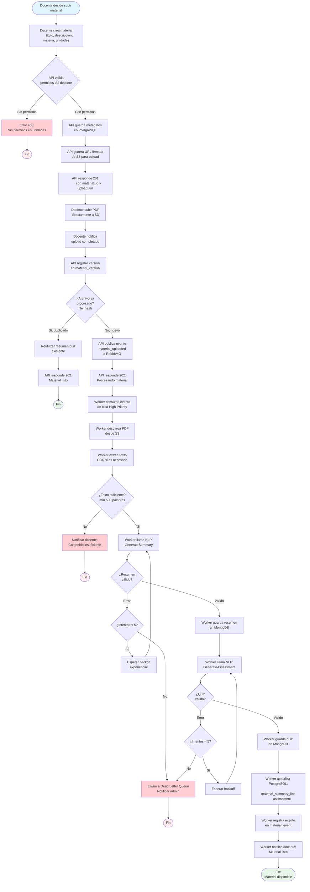

# Proceso: Publicación de Material

## Descripción
Proceso mediante el cual un docente sube un material educativo (PDF) al sistema, el cual es procesado automáticamente para generar resúmenes y cuestionarios mediante IA.

## Actores
- **Docente**: Carga el material y define metadatos
- **API Mobile**: Valida, persiste y orquesta el flujo
- **Worker**: Procesa el PDF de forma asíncrona
- **NLP Provider**: Genera contenido educativo con IA

## Diagrama de Flujo



## Fases del Proceso

### Fase 1: Creación de Material (Síncrona)
**Duración estimada**: 2-5 segundos

1. **Captura de Metadatos**
   - Docente ingresa en app KMP:
     - Título (requerido, 5-200 caracteres)
     - Descripción (opcional, máx 1000 caracteres)
     - Materia (selección de catálogo)
     - Unidades académicas (selección múltiple)
     - Metadata adicional (nivel, keywords)

2. **Validación de Permisos**
   - API verifica en `unit_membership` que docente tiene rol `teacher` o `owner` en cada unidad seleccionada
   - Si falta permiso en alguna unidad, se rechaza toda la operación (atomicidad)

3. **Persistencia de Metadatos**
   ```sql
   -- PostgreSQL
   BEGIN;
   INSERT INTO learning_material (id, title, description, subject_id, author_id, created_at)
   VALUES (gen_uuid_v7(), $1, $2, $3, $4, NOW())
   RETURNING id;

   INSERT INTO material_unit_link (material_id, unit_id)
   VALUES ($1, $2), ($1, $3), ...;
   COMMIT;
   ```

4. **Generación de URL Firmada**
   - S3 presigned URL con:
     - Operación: PUT
     - Expiración: 15 minutos
     - Restricciones: Content-Type = application/pdf, tamaño máx 100 MB
     - Prefijo: `{school_id}/{unit_id}/{material_id}/source/`

5. **Respuesta al Cliente**
   ```json
   {
     "status": "created",
     "material_id": "uuid",
     "upload_url": "https://s3.../presigned-url",
     "expires_at": "2025-01-29T10:45:00Z"
   }
   ```

---

### Fase 2: Upload de Archivo (Síncrona - Cliente a S3)
**Duración estimada**: 10-120 segundos (depende del tamaño y conexión)

1. **Upload Directo**
   - Cliente KMP sube PDF directamente a S3 usando URL firmada
   - Implementación con `multipart/form-data`
   - Progreso mostrado en UI

2. **Validaciones S3**
   - Tamaño máximo: 100 MB (configurable)
   - Tipo MIME: `application/pdf`
   - Si falla validación, S3 retorna error y cliente muestra mensaje

3. **Notificación de Completitud**
   - Cliente llama endpoint: `POST /v1/materials/:id/upload-complete`
   - API registra versión en `material_version` con:
     - `file_hash`: SHA-256 del PDF
     - `s3_key`: Ruta completa en S3
     - `file_size`: Tamaño en bytes

---

### Fase 3: Deduplicación (Síncrona)
**Duración estimada**: < 1 segundo

1. **Verificación de Hash**
   ```sql
   SELECT id, material_id
   FROM material_version
   WHERE file_hash = $1 AND id != $2
   LIMIT 1;
   ```

2. **Si existe duplicado**:
   - Copiar referencias de `material_summary_link` y `assessment`
   - No procesar nuevamente (ahorro de costo NLP)
   - Responder `202 Accepted` con mensaje: "Material listo (reutilizado)"

3. **Si es nuevo**:
   - Continuar con publicación de evento

---

### Fase 4: Publicación de Evento (Síncrona)
**Duración estimada**: < 500 ms

1. **Construcción de Evento**
   ```json
   {
     "event_type": "material_uploaded",
     "event_id": "uuid",
     "material_id": "uuid",
     "author_id": "uuid",
     "s3_key": "school-1/unit-5/material-123/source/original.pdf",
     "file_size": 2048576,
     "preferred_language": "es",
     "timestamp": "2025-01-29T10:30:00Z"
   }
   ```

2. **Publicación a RabbitMQ**
   - Exchange: `edugo_events`
   - Routing Key: `material.uploaded`
   - Cola destino: `material_processing_high` (prioridad 10)
   - Delivery mode: Persistent

3. **Respuesta al Cliente**
   ```json
   {
     "status": "processing",
     "message": "Material en procesamiento. Te notificaremos cuando esté listo.",
     "estimated_time_minutes": 2
   }
   ```

---

### Fase 5: Procesamiento Asíncrono (Worker)
**Duración estimada**: 60-180 segundos

#### 5.1 Descarga y Extracción (10-30 seg)

1. **Descarga desde S3**
   - Worker usa credenciales IAM con permisos de solo lectura
   - Descarga a directorio temporal `/tmp/{material_id}/`

2. **Extracción de Texto**
   - Herramientas: `pdftotext`, Apache Tika
   - Si PDF es imagen escaneada: Tesseract OCR
   - Fragmentación: Si texto > 50,000 palabras, dividir en chunks

3. **Validación de Contenido**
   - Mínimo 500 palabras de contenido útil
   - Filtrar headers/footers repetitivos
   - Si falla: Notificar docente y terminar

#### 5.2 Generación de Resumen (30-60 seg)

1. **Construcción de Prompt**
   ```
   Eres un asistente educativo especializado.

   Material: [TÍTULO]
   Contenido: [TEXTO_EXTRAÍDO]

   Genera un resumen estructurado en JSON con:
   - 5-7 secciones temáticas (título + contenido 100-200 palabras)
   - Clasificación de dificultad por sección (basic/medium/advanced)
   - 10-15 términos clave con definiciones
   - 5-7 preguntas reflexivas

   Idioma: español
   Nivel: secundaria/preparatoria
   ```

2. **Llamada a NLP**
   - Provider: OpenAI GPT-4
   - Temperature: 0.3 (consistencia)
   - Max tokens: 4000
   - Timeout: 60 segundos

3. **Validación de Respuesta**
   - Verificar estructura JSON válida
   - Mínimo 5 secciones, 10 términos, 5 preguntas
   - Si falla: Reintentar con backoff

4. **Persistencia**
   ```javascript
   // MongoDB
   db.material_summary.insertOne({
     _id: ObjectId(),
     material_id: "uuid",
     version: 1,
     status: "completed",
     sections: [...],
     glossary: [...],
     reflection_questions: [...],
     processing_metadata: {
       nlp_provider: "openai",
       model: "gpt-4",
       tokens_used: 3500,
       processing_time_seconds: 45
     },
     created_at: new Date()
   });
   ```

#### 5.3 Generación de Quiz (30-60 seg)

1. **Prompt específico**
   ```
   Basándote en el siguiente texto, genera 5 preguntas de opción múltiple.

   Cada pregunta debe:
   - Tener 4 opciones (solo 1 correcta)
   - Incluir retroalimentación para correcta e incorrecta
   - Variar tipos: recordación, comprensión, aplicación, análisis
   ```

2. **Persistencia**
   ```javascript
   db.material_assessment.insertOne({
     material_id: "uuid",
     title: "Cuestionario: Introducción a Pascal",
     questions: [
       {
         id: "q1",
         text: "¿Qué es un compilador?",
         type: "multiple_choice",
         options: [...],
         correct_answer: "a",
         feedback: { correct: "...", incorrect: "..." }
       }
     ],
     version: 1,
     created_at: new Date()
   });
   ```

#### 5.4 Actualización y Notificación (< 5 seg)

1. **Actualización PostgreSQL**
   ```sql
   INSERT INTO material_summary_link (material_id, mongo_document_id, status)
   VALUES ($1, $2, 'completed');

   INSERT INTO assessment (material_id, mongo_document_id, total_questions)
   VALUES ($1, $2, 5);
   ```

2. **Registro de Evento**
   ```javascript
   db.material_event.insertOne({
     material_id: "uuid",
     event_type: "processing_completed",
     worker_id: "worker-1",
     duration_seconds: 120,
     status: "success",
     metadata: {
       nlp_tokens_used: 7000,
       estimated_cost_usd: 0.14
     },
     created_at: new Date()
   });
   ```

3. **Notificación al Docente**
   - Email: "Tu material 'Introducción a Pascal' está listo para ser usado por tus estudiantes."
   - Push notification (si app instalada)
   - Link directo al material en la app

---

## Manejo de Errores

### Errores Síncronos (API)

| Código | Error | Acción |
|--------|-------|--------|
| 400 | Título vacío | Mostrar campo obligatorio |
| 403 | Sin permisos en unidad | Mostrar unidades donde sí tiene permiso |
| 404 | Materia no existe | Recargar catálogo de materias |
| 413 | PDF > 100 MB | Comprimir o dividir PDF |
| 500 | Error de servidor | Reintentar en 5 segundos |

### Errores Asíncronos (Worker)

| Error | Estrategia de Reintento | Notificación |
|-------|------------------------|--------------|
| PDF corrupto | No reintentar | Email docente: "PDF dañado, sube otro" |
| Texto insuficiente | No reintentar | Email docente: "Contenido muy breve" |
| NLP timeout | 5 reintentos (1min, 5min, 15min, 1h, 6h) | Email admin en DLQ |
| NLP rate limit | Esperar tiempo indicado, reintentar | - |
| MongoDB caído | Reintentar indefinidamente (backoff) | Alerta ops |
| S3 caído | Reintentar indefinidamente (backoff) | Alerta ops |

---

## Indicadores de Éxito (KPIs)

1. **Tiempo de Procesamiento**
   - Objetivo: < 3 minutos para 90% de materiales
   - Medición: `material_event.duration_seconds`

2. **Tasa de Éxito**
   - Objetivo: > 95% de materiales procesados sin error
   - Medición: `COUNT(status='success') / COUNT(*)` en `material_event`

3. **Calidad de Resúmenes**
   - Objetivo: < 5% de docentes solicitan reprocesamiento
   - Medición: Eventos `material_reprocess` / total materiales

4. **Costo NLP**
   - Objetivo: < $0.20 USD por material
   - Medición: `SUM(metadata.estimated_cost_usd)` en `material_event`

---

## Mejoras Post-MVP

1. **Preview de Resumen**: Mostrar resumen generado antes de publicar a estudiantes
2. **Edición Manual**: Permitir al docente editar resumen/quiz generado
3. **Múltiples Idiomas**: Detectar idioma del PDF y generar en ese idioma
4. **Formatos Adicionales**: Soportar DOCX, PPTX, videos (transcripción)
5. **Procesamiento Incremental**: Para PDFs muy largos, procesar por capítulos

---

**Documento**: Proceso de Publicación de Material
**Versión**: 1.0
**Fecha**: 2025-01-29
**Autor**: Equipo EduGo
