# Proceso: Consumo de Material

## Descripción
Proceso mediante el cual un estudiante busca, descarga y lee materiales educativos, incluyendo el PDF original y el resumen generado por IA.

## Actores
- **Estudiante**: Busca y consume materiales
- **API Mobile**: Provee datos y URLs firmadas
- **PostgreSQL**: Almacena metadatos y progreso
- **MongoDB**: Almacena resúmenes generados
- **S3**: Almacena PDFs

## Diagrama de Flujo

```mermaid
flowchart TD
    Start([Estudiante abre la app]) --> SelectUnit["Estudiante selecciona\n        unidad académica"]
    SelectUnit --> RequestMaterials["App llama\n        GET /v1/materials?unit_id=X"]

    RequestMaterials --> ValidateToken{"API valida\n        JWT token"}
    ValidateToken -->|"Token inválido"| ErrorAuth["Error 401:\n        Re-autenticar"]
    ErrorAuth --> End1([Fin])

    ValidateToken -->|"Token válido"| CheckMembership{"¿Estudiante\n        en unidad?"}
    CheckMembership -->|No| ErrorNoMembership["Error 403:\n        No perteneces a esta unidad"]
    ErrorNoMembership --> End2([Fin])

    CheckMembership -->|"Sí"| QueryMaterials["API consulta PostgreSQL:\n        materiales + progreso"]
    QueryMaterials --> ReturnList["API retorna lista\n        con metadatos y estado"]

    ReturnList --> DisplayList["App muestra lista\n        con badges: nuevo/en progreso/completado"]
    DisplayList --> SelectMaterial{"Estudiante\n        selecciona material"}

    SelectMaterial -->|No| End3([Fin])
    SelectMaterial -->|"Sí"| RequestDetail["App llama\n        GET /v1/materials/:id"]

    RequestDetail --> ValidatePermsMaterial{"API valida permisos\n        para este material"}
    ValidatePermsMaterial -->|"Sin permisos"| ErrorNoPerms["Error 403"]
    ErrorNoPerms --> End4([Fin])

    ValidatePermsMaterial -->|"Con permisos"| GetDetail["API obtiene metadatos\n        de PostgreSQL"]
    GetDetail --> GeneratePDFURL["API genera URL firmada\n        S3 para descarga PDF"]
    GeneratePDFURL --> CheckSummary{"¿Resumen\n        disponible?"}

    CheckSummary -->|No| ReturnDetailNoSummary["API retorna detalle\n        sin resumen"]
    ReturnDetailNoSummary --> DisplayDetailNoSummary["App muestra:\n        Solo PDF disponible"]

    CheckSummary -->|"Sí"| ReturnDetailWithSummary["API retorna detalle\n        con has_summary=true"]
    ReturnDetailWithSummary --> DisplayDetail["App muestra opciones:\n        Ver PDF | Ver Resumen | Quiz"]

    DisplayDetail --> StudentChoice{"Estudiante\n        elige opción"}

    StudentChoice -->|"Ver PDF"| DownloadPDF["App descarga PDF\n        desde S3 URL firmada"]
    DownloadPDF --> OpenPDFReader["App abre lector PDF\n        nativo por plataforma"]
    OpenPDFReader --> ReadPDF["Estudiante lee PDF"]

    ReadPDF --> TrackProgress["App registra progreso\n        cada 30 segundos"]
    TrackProgress --> SendProgress["PATCH /v1/materials/:id/progress\n        {progress: X, time_spent: Y}"]
    SendProgress --> UpdateReadingLog["API actualiza\n        reading_log en PostgreSQL"]
    UpdateReadingLog --> ContinueReading{"¿Seguir\n        leyendo?"}

    ContinueReading -->|"Sí"| ReadPDF
    ContinueReading -->|No| End5([Fin])

    StudentChoice -->|"Ver Resumen"| RequestSummary["App llama\n        GET /v1/materials/:id/summary"]
    RequestSummary --> FetchSummary["API obtiene resumen\n        desde MongoDB"]
    FetchSummary --> ReturnSummary["API retorna resumen\n        completo"]

    ReturnSummary --> DisplaySummary["App muestra resumen:\n        Secciones | Glosario | Preguntas"]
    DisplaySummary --> ReadSummary["Estudiante lee resumen\n        interactivo"]

    ReadSummary --> MarkAsRead["Estudiante marca\n        como leído"]
    MarkAsRead --> UpdateProgressSummary["PATCH /v1/materials/:id/progress\n        {progress: 100}"]
    UpdateProgressSummary --> End6([Fin])

    StudentChoice -->|"Ver Quiz"| GoToQuiz["Ver proceso:\n        03_evaluacion.md"]
    GoToQuiz --> End7([Fin])

    DisplayDetailNoSummary --> DownloadPDF

    style Start fill:#e1f5ff
    style End1 fill:#ffebee
    style End2 fill:#ffebee
    style End3 fill:#e8f5e9
    style End4 fill:#ffebee
    style End5 fill:#e8f5e9
    style End6 fill:#e8f5e9
    style End7 fill:#e8f5e9
    style ErrorAuth fill:#ffcdd2
    style ErrorNoMembership fill:#ffcdd2
    style ErrorNoPerms fill:#ffcdd2
```



## Fases del Proceso

### Fase 1: Búsqueda y Filtrado de Materiales
**Duración estimada**: 1-2 segundos

#### 1.1 Selección de Contexto
- **Estudiante** selecciona unidad académica en app:
  - Vista jerárquica: Colegio → Año → Sección
  - Opcionalmente puede filtrar por materia
  - Puede ver materiales de múltiples unidades si pertenece a varias

#### 1.2 Petición a API
```http
GET /v1/materials?unit_id={uuid}&subject_id={uuid}
Authorization: Bearer {jwt_token}
```

#### 1.3 Validación de Permisos
```sql
-- API verifica que estudiante pertenece a la unidad
SELECT EXISTS (
  SELECT 1 FROM unit_membership
  WHERE unit_id = $1 AND user_id = $2 AND role = 'student'
) as has_permission;
```

#### 1.4 Query de Materiales con Progreso
```sql
SELECT
  m.id,
  m.title,
  m.description,
  m.created_at,
  s.name as subject_name,
  au.display_name as unit_name,
  COALESCE(rl.progress, 0) as progress,
  rl.last_access_at,
  CASE
    WHEN rl.progress IS NULL THEN 'new'
    WHEN rl.progress = 100 THEN 'completed'
    ELSE 'in_progress'
  END as status,
  EXISTS(SELECT 1 FROM material_summary_link WHERE material_id = m.id AND status = 'completed') as has_summary,
  EXISTS(SELECT 1 FROM assessment WHERE material_id = m.id) as has_quiz
FROM learning_material m
INNER JOIN material_unit_link mul ON m.id = mul.material_id
INNER JOIN subject s ON m.subject_id = s.id
INNER JOIN academic_unit au ON mul.unit_id = au.id
LEFT JOIN reading_log rl ON rl.material_id = m.id AND rl.student_id = $2
WHERE mul.unit_id = $1
  AND ($3::uuid IS NULL OR m.subject_id = $3)
ORDER BY
  CASE
    WHEN rl.progress IS NULL THEN 0          -- Nuevos primero
    WHEN rl.progress < 100 THEN 1             -- En progreso segundo
    ELSE 2                                     -- Completados último
  END,
  m.created_at DESC
```

#### 1.5 Respuesta
```json
{
  "materials": [
    {
      "id": "uuid-1",
      "title": "Introducción a Pascal",
      "description": "Material base para 5.º año",
      "subject_name": "Programación",
      "unit_name": "5.º A - Programación",
      "created_at": "2025-01-15T12:00:00Z",
      "status": "new",
      "progress": 0,
      "has_summary": true,
      "has_quiz": true
    },
    {
      "id": "uuid-2",
      "title": "Estructuras de Control",
      "description": "Condicionales y bucles",
      "subject_name": "Programación",
      "unit_name": "5.º A - Programación",
      "created_at": "2025-01-20T10:30:00Z",
      "status": "in_progress",
      "progress": 45,
      "last_access_at": "2025-01-28T15:30:00Z",
      "has_summary": true,
      "has_quiz": false
    }
  ],
  "total": 9,
  "page": 1
}
```

#### 1.6 Visualización en App
- **Cards de materiales** con:
  - Título y descripción
  - Badge de estado (nuevo/en progreso/completado)
  - Progreso visual (barra de progreso)
  - Iconos indicando disponibilidad de resumen y quiz
  - Última fecha de acceso (si aplica)

---

### Fase 2: Obtención de Detalle de Material
**Duración estimada**: 0.5-1 segundo

#### 2.1 Petición
```http
GET /v1/materials/{material_id}
Authorization: Bearer {jwt_token}
```

#### 2.2 Validación de Permisos
```sql
SELECT EXISTS (
  SELECT 1
  FROM material_unit_link mul
  INNER JOIN unit_membership um ON mul.unit_id = um.unit_id
  WHERE mul.material_id = $1 AND um.user_id = $2
) as has_permission;
```

#### 2.3 Obtención de Datos
```sql
SELECT
  m.*,
  s.name as subject_name,
  au.name as author_name,
  mv.s3_key,
  mv.file_size,
  COALESCE(rl.progress, 0) as my_progress,
  sl.status as summary_status,
  sl.mongo_document_id as summary_id
FROM learning_material m
INNER JOIN subject s ON m.subject_id = s.id
INNER JOIN app_user au ON m.author_id = au.id
LEFT JOIN material_version mv ON m.id = mv.material_id
LEFT JOIN reading_log rl ON m.id = rl.material_id AND rl.student_id = $2
LEFT JOIN material_summary_link sl ON m.id = sl.material_id
WHERE m.id = $1
ORDER BY mv.created_at DESC
LIMIT 1;
```

#### 2.4 Generación de URL Firmada
```go
// Generar URL presignada de S3 para descarga
presignedURL := s3Client.GeneratePresignedDownloadURL(
    s3Key,
    15 * time.Minute, // Expiración
)
```

#### 2.5 Respuesta
```json
{
  "material": {
    "id": "uuid",
    "title": "Introducción a Pascal",
    "description": "Material base para 5.º año",
    "subject_name": "Programación",
    "author_name": "Prof. García",
    "created_at": "2025-01-15T12:00:00Z",
    "file_size": 2048576,
    "my_progress": 0
  },
  "pdf_url": "https://s3.amazonaws.com/.../presigned-url?expires=...",
  "pdf_url_expires_at": "2025-01-29T11:00:00Z",
  "has_summary": true,
  "has_quiz": true
}
```

---

### Fase 3a: Descarga y Lectura de PDF
**Duración estimada**: Variable (según tamaño de archivo y velocidad de conexión)

#### 3.1 Descarga Directa desde S3
- App usa URL firmada para descargar PDF
- Progreso mostrado en UI con barra de descarga
- Archivo guardado temporalmente en cache de la app
- **Post-MVP**: Opción "Guardar offline" para descarga persistente

#### 3.2 Apertura en Lector PDF
**Implementación por plataforma**:
- **Android**: PDFView library o Android built-in
- **iOS**: PDFKit nativo
- **Desktop**: MuPDF o PDF.js embedded

**Funcionalidades del lector**:
- Zoom in/out
- Navegación por páginas
- Búsqueda de texto
- Marcadores (Post-MVP)
- Anotaciones (Post-MVP)

#### 3.3 Registro de Progreso
**Tracker automático**:
```kotlin
// Código KMP en ViewModel
var progressTracker = ProgressTracker(
    materialId = materialId,
    onProgressUpdate = { progress, timeSpent ->
        viewModelScope.launch {
            materialRepository.updateProgress(
                materialId = materialId,
                progress = progress,
                timeSpent = timeSpent
            )
        }
    }
)

// Se ejecuta cada 30 segundos
progressTracker.start(intervalSeconds = 30)
```

**Cálculo de progreso**:
- `progress = (current_page / total_pages) * 100`
- `time_spent` acumulado en segundos

**Petición periódica**:
```http
PATCH /v1/materials/{material_id}/progress
Authorization: Bearer {jwt_token}
Content-Type: application/json

{
  "progress": 45,
  "time_spent": 1350,
  "last_page": 9
}
```

**Actualización en PostgreSQL**:
```sql
INSERT INTO reading_log (material_id, student_id, progress, time_spent, last_page, last_access_at)
VALUES ($1, $2, $3, $4, $5, NOW())
ON CONFLICT (material_id, student_id)
DO UPDATE SET
  progress = GREATEST(reading_log.progress, EXCLUDED.progress),
  time_spent = reading_log.time_spent + EXCLUDED.time_spent,
  last_page = EXCLUDED.last_page,
  last_access_at = NOW();
```

---

### Fase 3b: Lectura de Resumen Generado
**Duración estimada**: 1-2 segundos para obtener datos

#### 3.1 Petición de Resumen
```http
GET /v1/materials/{material_id}/summary
Authorization: Bearer {jwt_token}
```

#### 3.2 Obtención desde MongoDB
```javascript
db.material_summary.findOne({
  material_id: "uuid",
  status: "completed"
}, {
  sections: 1,
  glossary: 1,
  reflection_questions: 1,
  _id: 0
})
```

#### 3.3 Respuesta
```json
{
  "material_id": "uuid",
  "version": 1,
  "sections": [
    {
      "title": "Contexto Histórico",
      "content": "Pascal fue desarrollado por Niklaus Wirth en 1970...",
      "difficulty": "basic",
      "estimated_time_minutes": 5
    },
    {
      "title": "Sintaxis Básica",
      "content": "El lenguaje Pascal utiliza una estructura clara...",
      "difficulty": "medium",
      "estimated_time_minutes": 8
    }
  ],
  "glossary": [
    {
      "term": "Compilador",
      "definition": "Programa que traduce código fuente a código máquina"
    },
    {
      "term": "Variable",
      "definition": "Espacio en memoria para almacenar un valor que puede cambiar"
    }
  ],
  "reflection_questions": [
    "¿Qué ventajas aporta Pascal sobre lenguajes anteriores?",
    "¿Por qué es importante la tipificación fuerte en programación?",
    "¿En qué contextos se sigue usando Pascal actualmente?"
  ]
}
```

#### 3.4 Visualización en App
**Componentes UI**:

1. **Secciones colapsables**:
   - Título con icono de dificultad
   - Contenido expandible
   - Tiempo estimado de lectura
   - Opción "Marcar como leída"

2. **Glosario interactivo**:
   - Lista de términos alfabética
   - Al hacer clic en término, muestra definición
   - Búsqueda de términos

3. **Preguntas reflexivas**:
   - Lista numerada
   - Espacio para anotaciones (Post-MVP)
   - Opción de compartir con docente (Post-MVP)

#### 3.5 Registro de Lectura Completa
Cuando estudiante marca resumen como completado:
```http
PATCH /v1/materials/{material_id}/progress
{
  "progress": 100,
  "time_spent": 900
}
```

---

## Funcionalidades Post-MVP

### Modo Offline
1. **Descarga explícita**:
   - Botón "Guardar para leer offline"
   - Descarga PDF + resumen a SQLDelight local
   - Sincronización de progreso cuando recupera conexión

2. **Sincronización**:
   ```kotlin
   // Al recuperar conexión
   val pendingProgress = localDb.getPendingProgressUpdates()
   pendingProgress.forEach { update ->
       materialRepository.syncProgress(update)
       localDb.markAsSynced(update.id)
   }
   ```

### Búsqueda Avanzada
- Búsqueda de texto completo en títulos y descripciones
- Filtros combinados: unidad + materia + estado
- Ordenamiento: recientes, alfabético, progreso

### Recomendaciones
- "Materiales sugeridos según tus intereses"
- Basado en materias frecuentes y progreso histórico

---

## Indicadores de Éxito (KPIs)

1. **Tasa de Apertura de Materiales**
   - Objetivo: > 70% de materiales nuevos abiertos en primeras 48h
   - Medición: `COUNT(reading_log.created_at < material.created_at + INTERVAL '48 hours')`

2. **Tasa de Completitud**
   - Objetivo: > 50% de materiales completados (progress = 100)
   - Medición: `COUNT(progress = 100) / COUNT(DISTINCT material_id)`

3. **Tiempo Promedio de Lectura**
   - Objetivo: Alineado con extensión del material (ej: 5 min por página)
   - Medición: `AVG(time_spent) WHERE progress > 50`

4. **Uso de Resúmenes**
   - Objetivo: > 60% de estudiantes acceden a resumen
   - Medición: Logs de acceso a endpoint `/summary`

---

## Consideraciones de Rendimiento

### Caché de URLs Firmadas
- API puede cachear URLs firmadas por 14 minutos (1 min antes de expiración)
- Key de caché: `{material_id}:{user_id}`

### Paginación de Listas
- Máximo 20 materiales por página
- Lazy loading en app (cargar más al hacer scroll)

### Compresión de PDFs
- S3 puede servir PDFs comprimidos con `Content-Encoding: gzip`
- Ahorro de ancho de banda ~30-50%

---

**Documento**: Proceso de Consumo de Material
**Versión**: 1.0
**Fecha**: 2025-01-29
**Autor**: Equipo EduGo
