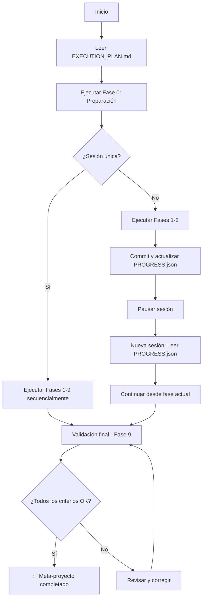

# Meta-Spec: Completar spec-01-evaluaciones al 100%

**Estado:** Especificación completa - Lista para ejecutar  
**Fecha:** 14 de Noviembre, 2025  
**Objetivo:** Generar 33 archivos faltantes para completar spec-01-evaluaciones

---

## 📋 Resumen Ejecutivo

Este es un **meta-proyecto**: una especificación completa para el trabajo de **generar otra especificación**. Aplicamos la misma metodología estandarizada que usamos para specs de features, pero para documentar el proceso de completar spec-01-evaluaciones.

**Estado actual de spec-01-evaluaciones:**
- ✅ Completado: 17 archivos (34%)
- ⏳ Pendiente: 33 archivos (66%)
- 🎯 Objetivo: 50 archivos (100%)

---

## 🗂️ Estructura de la Meta-Spec

```
spec-meta-completar-spec01/
├── README.md                          # Este archivo
├── 01-Requirements/
│   ├── PRD.md                         # ✅ Product Requirements Document
│   ├── FUNCTIONAL_SPECS.md            # ✅ Especificación de 33 archivos a generar
│   ├── TECHNICAL_SPECS.md             # ✅ Formato y convenciones técnicas
│   └── ACCEPTANCE_CRITERIA.md         # ✅ Criterios de validación (19 criterios)
├── 02-Design/
│   └── EXECUTION_PLAN.md              # ✅ Plan de 9 fases secuenciales
└── 03-Execution/                      # ⏳ Carpeta para ejecutar el plan
    └── [Se generará durante ejecución]
```

---

## 🎯 ¿Qué Contiene Esta Meta-Spec?

### 1. Product Requirements Document (PRD.md)
- Visión del meta-proyecto
- Objetivos de negocio (4 KPIs)
- Stakeholders
- Alcance completo (4 fases)
- Requerimientos funcionales (4 RF principales)
- Métricas de éxito

**→** [Leer PRD.md](./01-Requirements/PRD.md)

### 2. Especificaciones Funcionales (FUNCTIONAL_SPECS.md)
- **33 especificaciones detalladas** (RF-META-010 a RF-META-081)
- Cada archivo a generar especificado con:
  - Ruta absoluta
  - Contenido requerido (secciones)
  - Longitud mínima (palabras)
  - Criterios de aceptación
  - Dependencias

**Archivos especificados:**
- Sprint-02 a Sprint-06 (25 archivos)
- Testing docs (3 archivos)
- Deployment docs (3 archivos)
- Tracking system (2 archivos)

**→** [Leer FUNCTIONAL_SPECS.md](./01-Requirements/FUNCTIONAL_SPECS.md)

### 3. Especificaciones Técnicas (TECHNICAL_SPECS.md)
- Formato exacto de cada tipo de archivo
- Templates reutilizables
- Convenciones de código
- ADRs (Architectural Decision Records)
- Scripts de validación
- Control de calidad

**Incluye:**
- Template de TASKS.md con ejemplos
- Template de DEPENDENCIES.md
- Template de QUESTIONS.md
- Template de VALIDATION.md
- Script de validación completo

**→** [Leer TECHNICAL_SPECS.md](./01-Requirements/TECHNICAL_SPECS.md)

### 4. Criterios de Aceptación (ACCEPTANCE_CRITERIA.md)
- **19 criterios medibles**
- Script de validación automatizado
- Matriz de criterios
- Comandos de verificación

**Criterios críticos:**
- AC-GLOBAL-001: 50 archivos totales
- AC-GLOBAL-002: 0 placeholders
- AC-GLOBAL-003: PROGRESS.json válido
- AC-SPRINT-001: Estructura completa (5 archivos × 6 sprints)

**→** [Leer ACCEPTANCE_CRITERIA.md](./01-Requirements/ACCEPTANCE_CRITERIA.md)

### 5. Plan de Ejecución (EXECUTION_PLAN.md)
- **9 fases secuenciales**
- **35 tareas atómicas**
- Estimación de tiempo por fase
- Cronograma en sesión única o múltiples sesiones
- Puntos de control y continuación
- Comandos exactos para cada tarea

**Fases:**
0. Preparación (15min)
1. Sprint-02 Dominio (45min)
2. Sprint-03 Repositorios (45min)
3. Sprint-04 Services/API (50min)
4. Sprint-05 Testing (45min)
5. Sprint-06 CI/CD (40min)
6. Testing docs (35min)
7. Deployment docs (35min)
8. Tracking system (20min)
9. Validación final (30min)

**→** [Leer EXECUTION_PLAN.md](./02-Design/EXECUTION_PLAN.md)

---

## 🚀 Cómo Usar Esta Meta-Spec

### Opción 1: Ejecutar Todo en Una Sesión (5-6 horas)

```bash
# 1. Leer el plan completo
cat /Users/jhoanmedina/source/EduGo/Analisys/specifications_documents/spec-meta-completar-spec01/02-Design/EXECUTION_PLAN.md

# 2. Iniciar desde Fase 0
# Seguir las instrucciones del EXECUTION_PLAN.md secuencialmente

# 3. Validar al final
bash /Users/jhoanmedina/source/EduGo/Analisys/AnalisisEstandarizado/spec-01-evaluaciones/validate_all_criteria.sh
```

### Opción 2: Ejecutar en Múltiples Sesiones (Recomendado)

**Sesión 1: Fases 0-2 (2 horas)**
- Preparación + Sprint-02 + Sprint-03
- Commit después de cada fase
- PROGRESS.json actualizado

**Sesión 2: Fases 3-5 (2 horas)**
- Sprint-04 + Sprint-05 + Sprint-06
- Commit después de cada fase

**Sesión 3: Fases 6-9 (1.5 horas)**
- Testing + Deployment + Tracking + Validación final

**Cómo continuar entre sesiones:**
```bash
# Al inicio de cada sesión, leer PROGRESS.json
cd /Users/jhoanmedina/source/EduGo/Analisys/AnalisisEstandarizado/spec-01-evaluaciones

current_phase=$(jq -r '.current_phase' PROGRESS.json)
files_completed=$(jq -r '.files_completed' PROGRESS.json)

echo "Continuar desde: $current_phase"
echo "Archivos completados: $files_completed/50"

# Ir a EXECUTION_PLAN.md y buscar la fase correspondiente
```

---

## 📊 Métricas y KPIs

### KPI-1: Completitud de Archivos
- **Fórmula:** (Archivos generados / 50) × 100
- **Actual:** 34%
- **Objetivo:** 100%

### KPI-2: Calidad Ejecutable
- **Fórmula:** (Archivos sin placeholders / Total) × 100
- **Objetivo:** 100%

### KPI-3: Coverage de Decisiones
- **Fórmula:** (Preguntas con defaults / Total preguntas) × 100
- **Objetivo:** 100%

### KPI-4: Consistencia
- **Fórmula:** Review manual score
- **Objetivo:** >95%

---

## ✅ Criterios de Éxito Global

El meta-proyecto estará **COMPLETO** cuando:

- [ ] **50 archivos totales** generados en spec-01-evaluaciones/
- [ ] **0 placeholders** en ningún archivo (grep clean)
- [ ] **100% de comandos ejecutables** (validación manual)
- [ ] **100% de decisiones con defaults** en QUESTIONS.md
- [ ] **PROGRESS.json válido** y sincronizado (files_completed = 50)
- [ ] **Script de validación** ejecuta sin errores
- [ ] **Review manual** de 5 archivos aleatorios aprobada
- [ ] **Commits realizados** después de cada fase

---

## 🔄 Workflow Recomendado



---

## 📁 Archivos Generados por Esta Meta-Spec

### Ya Generados (5 archivos)
- ✅ README.md (este archivo)
- ✅ 01-Requirements/PRD.md
- ✅ 01-Requirements/FUNCTIONAL_SPECS.md
- ✅ 01-Requirements/TECHNICAL_SPECS.md
- ✅ 01-Requirements/ACCEPTANCE_CRITERIA.md
- ✅ 02-Design/EXECUTION_PLAN.md

### Pendientes (Se generan durante ejecución)
- ⏳ 03-Execution/logs/ (logs de ejecución)
- ⏳ 03-Execution/checkpoints/ (backups por fase)

---

## 🎓 Lecciones Aprendidas

### ¿Por Qué Esta Meta-Spec Existe?

**Problema original:** Intentar generar 33 archivos "on the fly" sin plan estructurado es:
- Propenso a errores
- Difícil de continuar en múltiples sesiones
- Sin control de progreso granular
- Riesgo de inconsistencias

**Solución:** Aplicar la **misma metodología** que usamos para features:
1. PRD → Define QUÉ hacer
2. Functional Specs → Especifica CADA archivo
3. Technical Specs → Define CÓMO hacer
4. Acceptance Criteria → Define CUANDO está completo
5. Execution Plan → Define ORDEN y FASES

### Beneficios de Esta Aproximación

✅ **Trazabilidad:** Saber exactamente qué falta en cualquier momento  
✅ **Reusabilidad:** Puede ejecutarse en múltiples sesiones  
✅ **Calidad:** Criterios de aceptación claros  
✅ **Automatización:** Scripts de validación  
✅ **Documentación:** El proceso está documentado  

---

## 🚦 Estado Actual

### Meta-Spec: Completada ✅
- PRD: ✅ Completo
- Functional Specs: ✅ Completo (33 specs)
- Technical Specs: ✅ Completo (templates + ADRs)
- Acceptance Criteria: ✅ Completo (19 criterios)
- Execution Plan: ✅ Completo (9 fases)

### Ejecución: Pendiente ⏳
- Fase 0: ⏳ Por ejecutar
- Fases 1-9: ⏳ Por ejecutar

---

## 📞 Próximos Pasos

### Para Jhoan (Usuario)

**Decisión requerida:**
1. ¿Ejecutar todo en esta sesión (5-6 horas)?
2. ¿Ejecutar en múltiples sesiones (2-3 sesiones de 2h)?

### Para Claude (AI Executor)

**Si el usuario aprueba:**
1. Leer EXECUTION_PLAN.md completo
2. Ejecutar Fase 0 (Preparación)
3. Continuar secuencialmente Fases 1-9
4. Actualizar PROGRESS.json después de cada fase
5. Commit frecuente
6. Validación final

---

## 📚 Referencias

### Documentos Clave
- [PRD](./01-Requirements/PRD.md) - Visión y objetivos
- [FUNCTIONAL_SPECS](./01-Requirements/FUNCTIONAL_SPECS.md) - Qué generar
- [TECHNICAL_SPECS](./01-Requirements/TECHNICAL_SPECS.md) - Cómo generar
- [ACCEPTANCE_CRITERIA](./01-Requirements/ACCEPTANCE_CRITERIA.md) - Cuándo está completo
- [EXECUTION_PLAN](./02-Design/EXECUTION_PLAN.md) - Plan de 9 fases

### Spec Objetivo
- [spec-01-evaluaciones](../../AnalisisEstandarizado/spec-01-evaluaciones/) - La spec a completar

### Metodología Base
- [PROMPT_ANALISIS_ESTANDARIZADO.md](../../PROMPT_ANALISIS_ESTANDARIZADO.md) - Metodología original

---

**Generado con:** Claude Code  
**Tokens usados:** ~95K  
**Estado:** Meta-Spec completa - **LISTA PARA EJECUTAR**  
**Próxima acción:** Solicitar aprobación del usuario para iniciar ejecución
