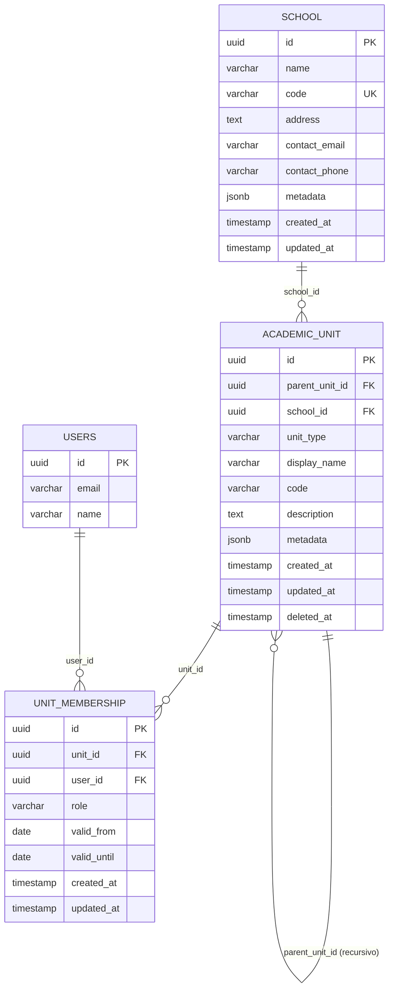

# Diseño Técnico - Jerarquía Académica

**Proyecto:** edugo-api-administracion  
**Epic:** Jerarquía Académica + Modernización

---

## 🏗️ ARQUITECTURA

### Clean Architecture (Hexagonal)

```
┌─────────────────────────────────────────────────────┐
│                   HTTP/REST API                      │
│              (Puerto 8081 - Gin Framework)           │
└────────────────────┬────────────────────────────────┘
                     │
┌────────────────────▼────────────────────────────────┐
│           INFRASTRUCTURE LAYER                       │
│  • HTTP Handlers (Controllers)                      │
│  • Router & Middleware                              │
│  • PostgreSQL Repository Implementations            │
└────────────────────┬────────────────────────────────┘
                     │
┌────────────────────▼────────────────────────────────┐
│           APPLICATION LAYER                          │
│  • Services (Casos de uso)                          │
│  • DTOs (Request/Response)                          │
│  • Mappers (Entity ↔ DTO)                           │
└────────────────────┬────────────────────────────────┘
                     │
┌────────────────────▼────────────────────────────────┐
│              DOMAIN LAYER                            │
│  • Entities (School, AcademicUnit, Membership)      │
│  • Value Objects (SchoolID, UnitType, Role)         │
│  • Repository Interfaces                            │
│  • Domain Logic & Business Rules                    │
└─────────────────────────────────────────────────────┘
```

---

## 📦 ESTRUCTURA DE PAQUETES

```
edugo-api-administracion/
├── cmd/
│   └── main.go                          # Entry point
│
├── internal/
│   ├── bootstrap/                       # ⭐ NUEVO (de shared)
│   │   ├── bootstrap.go                 # Inicialización
│   │   ├── config.go                    # Carga config
│   │   ├── lifecycle.go                 # Startup/Shutdown
│   │   └── factories.go                 # Factory functions
│   │
│   ├── config/                          # Configuración
│   │   ├── config.go                    # Struct de config
│   │   ├── loader.go                    # Viper loader
│   │   └── validator.go                 # ⭐ NUEVO (de shared)
│   │
│   ├── container/                       # Dependency Injection
│   │   ├── container.go                 # Container principal
│   │   ├── infrastructure.go            # Infra dependencies
│   │   ├── repositories.go              # Repo dependencies
│   │   ├── services.go                  # Service dependencies
│   │   └── handlers.go                  # Handler dependencies
│   │
│   ├── domain/                          # ⭐ CAPA DE DOMINIO
│   │   ├── entity/
│   │   │   ├── school.go                # Entity School
│   │   │   ├── school_test.go
│   │   │   ├── academic_unit.go         # Entity AcademicUnit
│   │   │   ├── academic_unit_test.go
│   │   │   ├── unit_membership.go       # Entity UnitMembership
│   │   │   └── unit_membership_test.go
│   │   │
│   │   ├── valueobject/
│   │   │   ├── school_id.go             # VO: SchoolID
│   │   │   ├── school_id_test.go
│   │   │   ├── unit_id.go               # VO: UnitID
│   │   │   ├── unit_type.go             # VO: UnitType (enum)
│   │   │   ├── membership_id.go         # VO: MembershipID
│   │   │   ├── membership_role.go       # VO: MembershipRole (enum)
│   │   │   └── user_id.go               # VO: UserID (compartido)
│   │   │
│   │   └── repository/
│   │       ├── school_repository.go     # Interface
│   │       ├── unit_repository.go       # Interface
│   │       └── membership_repository.go # Interface
│   │
│   ├── application/                     # ⭐ CAPA DE APLICACIÓN
│   │   ├── dto/
│   │   │   ├── school_dto.go            # Request/Response DTOs
│   │   │   ├── unit_dto.go
│   │   │   └── membership_dto.go
│   │   │
│   │   ├── service/
│   │   │   ├── school_service.go        # Casos de uso
│   │   │   ├── school_service_test.go
│   │   │   ├── unit_service.go
│   │   │   ├── unit_service_test.go
│   │   │   ├── membership_service.go
│   │   │   └── membership_service_test.go
│   │   │
│   │   └── mapper/
│   │       ├── school_mapper.go         # Entity ↔ DTO
│   │       ├── unit_mapper.go
│   │       └── membership_mapper.go
│   │
│   └── infrastructure/                  # ⭐ CAPA DE INFRAESTRUCTURA
│       ├── http/
│       │   ├── handler/
│       │   │   ├── school_handler.go
│       │   │   ├── unit_handler.go
│       │   │   └── membership_handler.go
│       │   ├── middleware/
│       │   │   ├── auth.go
│       │   │   └── admin_only.go
│       │   └── router/
│       │       └── router.go
│       │
│       └── persistence/
│           └── postgres/
│               ├── school_repository_impl.go
│               ├── unit_repository_impl.go
│               └── membership_repository_impl.go
│
├── scripts/
│   └── postgresql/
│       ├── 01_academic_hierarchy.sql    # ⭐ NUEVO
│       ├── 02_seeds_hierarchy.sql       # ⭐ NUEVO
│       └── 03_indexes.sql               # ⭐ NUEVO
│
├── test/
│   ├── integration/                     # ⭐ NUEVO
│   │   ├── setup_test.go
│   │   ├── school_repository_test.go
│   │   ├── unit_repository_test.go
│   │   └── membership_repository_test.go
│   └── e2e/                             # ⭐ NUEVO
│       └── hierarchy_flow_test.go
│
└── .github/
    └── workflows/                       # ⭐ ACTUALIZADO
        ├── pr-to-dev.yml
        ├── pr-to-main.yml
        ├── test.yml
        └── sync-main-to-dev.yml
```

**Total archivos nuevos:** ~50 archivos  
**Total LOC estimado:** ~5,000 líneas

---

## 🗄️ DISEÑO DE BASE DE DATOS

### Diagrama ER



### Queries Clave

#### Query 1: Obtener Árbol Jerárquico (CTE Recursivo)

```sql
WITH RECURSIVE unit_tree AS (
    -- Base: unidad raíz
    SELECT 
        id,
        parent_unit_id,
        school_id,
        display_name,
        unit_type,
        1 as level,
        ARRAY[id] as path
    FROM academic_unit
    WHERE id = $1 AND deleted_at IS NULL

    UNION ALL

    -- Recursión: hijos
    SELECT 
        au.id,
        au.parent_unit_id,
        au.school_id,
        au.display_name,
        au.unit_type,
        ut.level + 1,
        ut.path || au.id
    FROM academic_unit au
    INNER JOIN unit_tree ut ON au.parent_unit_id = ut.id
    WHERE au.deleted_at IS NULL
)
SELECT * FROM unit_tree 
ORDER BY level, display_name;
```

#### Query 2: Validar Ciclo (Trigger)

```sql
CREATE OR REPLACE FUNCTION prevent_circular_hierarchy()
RETURNS TRIGGER AS $$
DECLARE
    ancestor_id UUID;
    depth INT := 0;
    max_depth INT := 10;
BEGIN
    -- Validar que no sea su propio padre
    IF NEW.id = NEW.parent_unit_id THEN
        RAISE EXCEPTION 'Unit cannot be its own parent';
    END IF;
    
    -- Recorrer hacia arriba buscando ciclos
    ancestor_id := NEW.parent_unit_id;
    WHILE ancestor_id IS NOT NULL AND depth < max_depth LOOP
        IF ancestor_id = NEW.id THEN
            RAISE EXCEPTION 'Circular hierarchy detected';
        END IF;
        
        SELECT parent_unit_id INTO ancestor_id
        FROM academic_unit 
        WHERE id = ancestor_id;
        
        depth := depth + 1;
    END LOOP;
    
    RETURN NEW;
END;
$$ LANGUAGE plpgsql;

CREATE TRIGGER check_circular_hierarchy
BEFORE INSERT OR UPDATE ON academic_unit
FOR EACH ROW 
EXECUTE FUNCTION prevent_circular_hierarchy();
```

---

## 🎨 DISEÑO DE CLASES (Domain Layer)

### Entity: School

```go
package entity

import (
    "time"
    "github.com/EduGoGroup/edugo-api-administracion/internal/domain/valueobject"
)

type School struct {
    ID           valueobject.SchoolID
    Name         string
    Code         string
    Address      string
    ContactEmail valueobject.Email
    ContactPhone string
    Metadata     map[string]interface{}
    CreatedAt    time.Time
    UpdatedAt    time.Time
}

// NewSchool constructor con validación
func NewSchool(
    name string,
    code string,
    email string,
) (*School, error) {
    schoolID := valueobject.NewSchoolID()
    emailVO, err := valueobject.NewEmail(email)
    if err != nil {
        return nil, err
    }
    
    school := &School{
        ID:           schoolID,
        Name:         name,
        Code:         code,
        ContactEmail: emailVO,
        CreatedAt:    time.Now(),
        UpdatedAt:    time.Now(),
    }
    
    if err := school.Validate(); err != nil {
        return nil, err
    }
    
    return school, nil
}

// Validate reglas de negocio
func (s *School) Validate() error {
    if len(s.Name) < 3 {
        return errors.NewValidationError("school name too short")
    }
    if len(s.Code) < 2 {
        return errors.NewValidationError("school code too short")
    }
    return nil
}

// UpdateContactInfo método de negocio
func (s *School) UpdateContactInfo(email, phone string) error {
    emailVO, err := valueobject.NewEmail(email)
    if err != nil {
        return err
    }
    
    s.ContactEmail = emailVO
    s.ContactPhone = phone
    s.UpdatedAt = time.Now()
    
    return nil
}
```

---

### Entity: AcademicUnit

```go
type AcademicUnit struct {
    ID           valueobject.UnitID
    ParentUnitID *valueobject.UnitID        // nil si es raíz
    SchoolID     valueobject.SchoolID
    Type         valueobject.UnitType
    DisplayName  string
    Code         string
    Description  string
    Metadata     map[string]interface{}
    CreatedAt    time.Time
    UpdatedAt    time.Time
    DeletedAt    *time.Time                 // Soft delete
}

// NewAcademicUnit constructor
func NewAcademicUnit(
    schoolID valueobject.SchoolID,
    unitType valueobject.UnitType,
    displayName string,
    parentUnitID *valueobject.UnitID,
) (*AcademicUnit, error) {
    unit := &AcademicUnit{
        ID:           valueobject.NewUnitID(),
        SchoolID:     schoolID,
        Type:         unitType,
        DisplayName:  displayName,
        ParentUnitID: parentUnitID,
        CreatedAt:    time.Now(),
        UpdatedAt:    time.Now(),
    }
    
    if err := unit.Validate(); err != nil {
        return nil, err
    }
    
    return unit, nil
}

// Validate reglas de negocio
func (u *AcademicUnit) Validate() error {
    if len(u.DisplayName) < 3 {
        return errors.NewValidationError("display name too short")
    }
    
    // Validar jerarquía lógica
    if u.Type == valueobject.UnitTypeSchool && u.ParentUnitID != nil {
        return errors.NewValidationError("school type cannot have parent")
    }
    
    return nil
}

// CanHaveChildren lógica de negocio
func (u *AcademicUnit) CanHaveChildren() bool {
    return u.Type != valueobject.UnitTypeClub
}

// SetParent método de negocio
func (u *AcademicUnit) SetParent(parentID valueobject.UnitID) error {
    if u.Type == valueobject.UnitTypeSchool {
        return errors.NewValidationError("cannot set parent for school type")
    }
    
    u.ParentUnitID = &parentID
    u.UpdatedAt = time.Now()
    return nil
}

// SoftDelete método de negocio
func (u *AcademicUnit) SoftDelete() {
    now := time.Now()
    u.DeletedAt = &now
    u.UpdatedAt = now
}
```

---

### Value Object: UnitType

```go
package valueobject

type UnitType string

const (
    UnitTypeSchool     UnitType = "school"
    UnitTypeGrade      UnitType = "grade"
    UnitTypeSection    UnitType = "section"
    UnitTypeClub       UnitType = "club"
    UnitTypeDepartment UnitType = "department"
)

// Valid valida si el tipo es válido
func (ut UnitType) Valid() bool {
    switch ut {
    case UnitTypeSchool, UnitTypeGrade, UnitTypeSection, UnitTypeClub, UnitTypeDepartment:
        return true
    }
    return false
}

// String implementa Stringer
func (ut UnitType) String() string {
    return string(ut)
}

// FromString crea UnitType desde string
func UnitTypeFromString(s string) (UnitType, error) {
    ut := UnitType(s)
    if !ut.Valid() {
        return "", errors.NewValidationError("invalid unit type: " + s)
    }
    return ut, nil
}
```

---

## 🔄 FLUJOS DE DATOS

### Flujo 1: Crear Escuela

```
HTTP Request
    ↓
Handler.Create(gin.Context)
    ↓ Bind JSON → CreateSchoolRequest
    ↓ Validate DTO
    ↓
Service.Create(ctx, CreateSchoolRequest)
    ↓ Mapper: DTO → Entity
    ↓ Entity.Validate() (reglas de negocio)
    ↓ Repository.Create(ctx, School)
        ↓ SQL: INSERT INTO school (...)
        ↓ PostgreSQL
    ↓ Mapper: Entity → Response
    ↓
Handler responde 201 Created
```

**Tiempo estimado:** <200ms

---

### Flujo 2: Obtener Árbol Jerárquico

```
HTTP Request: GET /v1/units/{id}/tree
    ↓
Handler.GetTree(gin.Context)
    ↓ Extract & Validate ID
    ↓
Service.GetTree(ctx, UnitID)
    ↓ Repository.GetTree(ctx, UnitID)
        ↓ SQL: CTE Recursivo
        ↓ PostgreSQL (query compleja)
    ↓ BuildTreeStructure (lista → árbol anidado)
    ↓ Mapper: []Entity → TreeResponse
    ↓
Handler responde 200 OK con árbol JSON
```

**Tiempo estimado:** <500ms (query recursivo puede ser lento)

**Optimización:** Cachear árboles si no cambian frecuentemente.

---

### Flujo 3: Asignar Estudiante a Sección

```
HTTP Request: POST /v1/units/{unitId}/members
    ↓
Handler.Assign(gin.Context)
    ↓ Bind JSON → AssignMemberRequest
    ↓ Validate DTO
    ↓
Service.Assign(ctx, AssignRequest)
    ↓ Validar que unit existe (Repository.FindByID)
    ↓ Validar que user existe (llamada a users table)
    ↓ Validar que no esté duplicado
    ↓ Crear Entity: UnitMembership
    ↓ Repository.Create(ctx, UnitMembership)
        ↓ SQL: INSERT INTO unit_membership (...)
        ↓ PostgreSQL (con UNIQUE constraint)
    ↓
Handler responde 201 Created
```

**Manejo de Duplicados:**
- PostgreSQL UNIQUE constraint rechaza
- Capturar error y devolver 409 Conflict

---

## 🧪 TESTING STRATEGY

### Pirámide de Tests

```
        E2E Tests (10%)
       /            \
      /   Integration  \
     /    Tests (30%)    \
    /                     \
   /_______________________\
      Unit Tests (60%)
```

### Test Plan por Capa

| Capa | Tipo | Herramientas | Coverage Objetivo |
|------|------|--------------|-------------------|
| **Domain** | Unitarios | Go testing, testify | >90% |
| **Application** | Unitarios (mocks) | Go testing, testify, mockery | >85% |
| **Infrastructure** | Integración | Testcontainers | >75% |
| **HTTP Handlers** | E2E | httptest + testcontainers | Casos críticos |

---

### Ejemplo: Test Unitario de Entity

```go
func TestSchool_Validate(t *testing.T) {
    tests := []struct {
        name    string
        school  *School
        wantErr bool
        errMsg  string
    }{
        {
            name: "valid school",
            school: &School{
                Name: "Colegio San José",
                Code: "CSJ",
            },
            wantErr: false,
        },
        {
            name: "name too short",
            school: &School{
                Name: "AB",  // < 3 caracteres
                Code: "CSJ",
            },
            wantErr: true,
            errMsg:  "school name too short",
        },
    }
    
    for _, tt := range tests {
        t.Run(tt.name, func(t *testing.T) {
            err := tt.school.Validate()
            if tt.wantErr {
                assert.Error(t, err)
                assert.Contains(t, err.Error(), tt.errMsg)
            } else {
                assert.NoError(t, err)
            }
        })
    }
}
```

---

### Ejemplo: Test de Integración de Repository

```go
func TestSchoolRepository_Create_Integration(t *testing.T) {
    // Setup testcontainer
    container, err := containers.NewPostgresContainer(context.Background())
    require.NoError(t, err)
    defer container.Cleanup(context.Background())
    
    // Ejecutar migrations
    err = container.ExecSQL("scripts/postgresql/01_academic_hierarchy.sql")
    require.NoError(t, err)
    
    // Crear repository
    repo := NewSchoolRepository(container.DB())
    
    // Test: Create
    school := &entity.School{
        ID:   valueobject.NewSchoolID(),
        Name: "Test School",
        Code: "TST",
    }
    
    err = repo.Create(context.Background(), school)
    assert.NoError(t, err)
    
    // Test: FindByID
    found, err := repo.FindByID(context.Background(), school.ID)
    assert.NoError(t, err)
    assert.Equal(t, school.Name, found.Name)
    assert.Equal(t, school.Code, found.Code)
}
```

---

### Ejemplo: Test E2E de API

```go
func TestHierarchyAPI_CompleteFlow_E2E(t *testing.T) {
    // Setup: API + PostgreSQL
    app := setupTestAPI(t)
    defer app.Cleanup()
    
    // 1. Crear escuela
    resp := app.POST("/v1/schools", map[string]interface{}{
        "name": "Colegio Test",
        "code": "TEST",
        "contact_email": "admin@test.edu",
    })
    assert.Equal(t, 201, resp.StatusCode)
    
    schoolID := resp.JSON()["id"].(string)
    
    // 2. Crear año académico
    resp = app.POST(fmt.Sprintf("/v1/schools/%s/units", schoolID), map[string]interface{}{
        "type":         "grade",
        "display_name": "Quinto Año",
        "code":         "5º",
    })
    assert.Equal(t, 201, resp.StatusCode)
    
    gradeID := resp.JSON()["id"].(string)
    
    // 3. Crear sección
    resp = app.POST(fmt.Sprintf("/v1/schools/%s/units", schoolID), map[string]interface{}{
        "parent_unit_id": gradeID,
        "type":           "section",
        "display_name":   "5º A",
    })
    assert.Equal(t, 201, resp.StatusCode)
    
    sectionID := resp.JSON()["id"].(string)
    
    // 4. Obtener árbol
    resp = app.GET(fmt.Sprintf("/v1/units/%s/tree", schoolID))
    assert.Equal(t, 200, resp.StatusCode)
    
    tree := resp.JSON()
    assert.Equal(t, "Colegio Test", tree["display_name"])
    assert.Len(t, tree["children"], 1)  // 1 año
    
    year := tree["children"].([]interface{})[0].(map[string]interface{})
    assert.Len(t, year["children"], 1)  // 1 sección
}
```

---

## 🔐 SEGURIDAD

### Autenticación

Todos los endpoints requieren:
```go
middleware.RequireAuth()    // JWT válido
middleware.RequireAdmin()   // Role = admin
```

### Validación de Entrada

Usar `go-playground/validator`:
```go
type CreateSchoolRequest struct {
    Name         string `json:"name" validate:"required,min=3,max=255"`
    Code         string `json:"code" validate:"required,min=2,max=50,alphanum"`
    ContactEmail string `json:"contact_email" validate:"omitempty,email"`
}
```

### SQL Injection Prevention

✅ Usar prepared statements siempre:
```go
// ✅ CORRECTO
_, err := db.ExecContext(ctx,
    "INSERT INTO school (name, code) VALUES ($1, $2)",
    school.Name, school.Code,
)

// ❌ INCORRECTO (vulnerable)
query := fmt.Sprintf("INSERT INTO school (name) VALUES ('%s')", name)
db.ExecContext(ctx, query)
```

---

## 📊 PERFORMANCE

### Índices Críticos

```sql
-- Búsqueda de escuelas por código (login, validación)
CREATE UNIQUE INDEX idx_school_code ON school(code);

-- Listar unidades de una escuela (query frecuente)
CREATE INDEX idx_academic_unit_school 
    ON academic_unit(school_id) 
    WHERE deleted_at IS NULL;

-- Obtener hijos de una unidad (árbol jerárquico)
CREATE INDEX idx_academic_unit_parent 
    ON academic_unit(parent_unit_id)
    WHERE deleted_at IS NULL;

-- Listar miembros de una unidad (query MUY frecuente)
CREATE INDEX idx_unit_membership_unit 
    ON unit_membership(unit_id);

-- Obtener unidades de un usuario
CREATE INDEX idx_unit_membership_user 
    ON unit_membership(user_id)
    WHERE (valid_until IS NULL OR valid_until >= CURRENT_DATE);
```

### Caching Strategy (Futuro)

**Para considerar si queries son lentas:**
- Cachear árboles jerárquicos completos (cambian poco)
- TTL: 15 minutos
- Invalidar cache al crear/modificar/eliminar unidades

---

## 🔄 INTEGRACIÓN CON OTROS SERVICIOS

### api-mobile Consumirá api-admin

**Escenarios de integración:**

#### 1. Filtrar Materiales por Unidad del Usuario

```go
// En api-mobile

// 1. Obtener unidades del usuario
unitsResp := httpClient.GET("http://api-admin:8081/v1/users/{userId}/units")
unitIDs := extractIDs(unitsResp)

// 2. Filtrar materiales
materials := db.Query(`
    SELECT m.* FROM materials m
    JOIN material_unit_link mul ON m.id = mul.material_id
    WHERE mul.unit_id IN (?)
`, unitIDs)
```

**⚠️ Requiere:** 
- Endpoint `GET /v1/users/:userId/units` en api-admin
- Tabla `material_unit_link` (Sprint Admin-3)

---

#### 2. Validar Permisos de Profesor

```go
// En api-mobile, antes de permitir subir material

// Validar que profesor es owner de alguna unidad
membership := httpClient.GET("http://api-admin:8081/v1/users/{teacherId}/units?role=owner")

if len(membership.Data) == 0 {
    return errors.New("teacher not owner of any unit")
}
```

---

## 📐 DECISION LOG

### Decisión 1: ¿Dónde va unit_membership?

**Opciones:**
- A) api-admin (CRUD de membresías)
- B) api-mobile (consulta de membresías)

**Decisión:** A) api-admin

**Razón:**
- Membresías se crean en proceso de inscripción (admin)
- api-mobile solo consulta (read-only)
- Separación de responsabilidades

---

### Decisión 2: ¿Jerarquía de 3 o 5 niveles?

**Opciones:**
- A) 3 niveles fijos: School → Grade → Section
- B) N niveles flexibles: School → Grade → Section → Club → ...

**Decisión:** B) N niveles flexibles

**Razón:**
- Más flexible para diferentes modelos educativos
- Soporta clubes, departamentos, etc.
- Costo de complejidad bajo (CTE recursivo igual)

---

### Decisión 3: ¿Soft delete o hard delete?

**Decisión:** Soft delete en `academic_unit`

**Razón:**
- Mantener histórico de estructura académica
- Reportes históricos necesitan saber estructura pasada
- Auditoría y compliance

**Implementación:**
```sql
deleted_at TIMESTAMP NULL
```

---

## 🚀 DEPLOYMENT

### Orden de Despliegue

```
1. shared (PR-S1)
   ↓
2. api-admin (PR-1: modernización)
   ↓
3. api-admin (PR-2: schema + dominio)
   ↓
4. api-admin (PR-3: services + API)
   ↓
5. dev-environment (actualizar schemas)
   ↓
6. Validación en ambiente dev
```

### Migración de BD en Producción

```bash
# Ejecutar en producción (cuando esté listo)
psql -U edugo -d edugo_prod < scripts/postgresql/01_academic_hierarchy.sql
psql -U edugo -d edugo_prod < scripts/postgresql/02_seeds_hierarchy.sql
```

**⚠️ Rollback Plan:**
```sql
DROP TABLE unit_membership;
DROP TABLE academic_unit;
DROP TABLE school;
```

---

## 📚 REFERENCIAS

- Clean Architecture: https://blog.cleancoder.com/uncle-bob/2012/08/13/the-clean-architecture.html
- PostgreSQL Recursive CTEs: https://www.postgresql.org/docs/current/queries-with.html
- Go DDD Patterns: https://github.com/golang-standards/project-layout

---

**Generado con** 🤖 Claude Code
