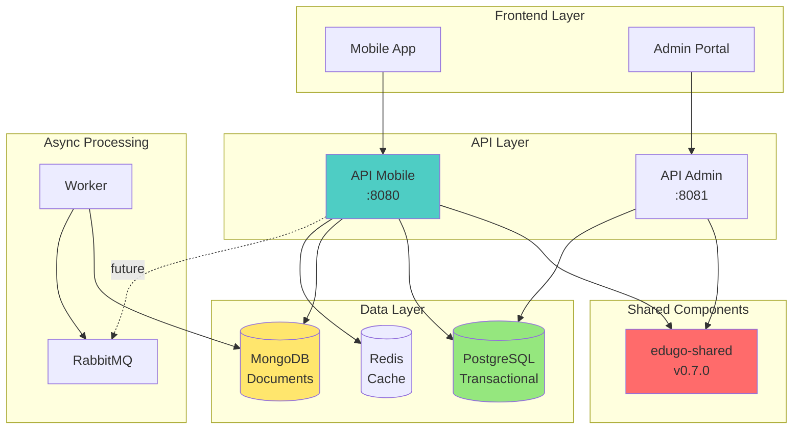
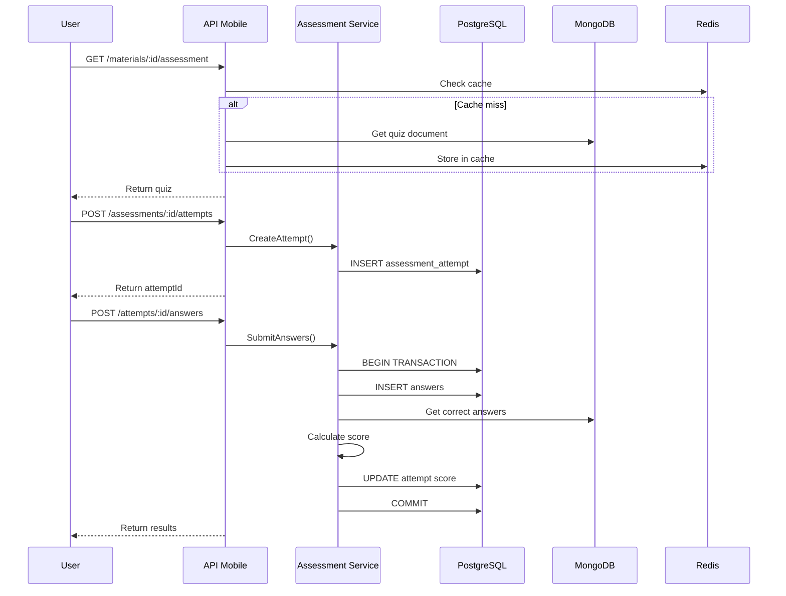
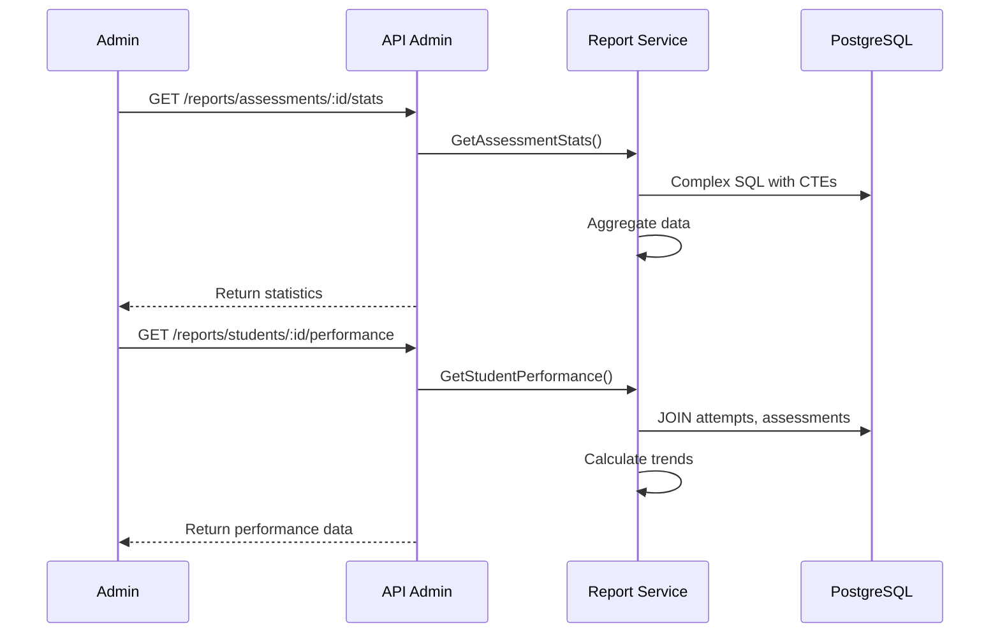

# 🏗️ Arquitectura del Sistema de Evaluaciones

**Versión:** 1.0  
**Fecha:** 14 de Noviembre, 2025  
**Arquitecto:** Claude Code

---

## 1. VISIÓN ARQUITECTÓNICA

### 1.1 Principios de Diseño
- **Separación de Concerns:** Cada repo tiene responsabilidad única
- **Clean Architecture:** Domain → Application → Infrastructure
- **Database per Service:** PostgreSQL para transaccional, MongoDB para documentos
- **Event-Driven:** RabbitMQ para comunicación asíncrona (futuro)
- **API-First:** Contratos definidos antes de implementación

### 1.2 Patrón General
```
[Frontend] → [API Gateway] → [APIs] → [Services] → [Repositories] → [DBs]
                                ↓
                            [Shared Lib]
```

---

## 2. ARQUITECTURA DE ALTO NIVEL



---

## 3. ARQUITECTURA POR COMPONENTE

### 3.1 edugo-shared (Library)

```
edugo-shared/
├── assessment/              # NEW in v0.7.0
│   ├── domain/
│   │   ├── types.go        # IDs, Value Objects
│   │   ├── assessment.go   # Assessment entity
│   │   └── attempt.go      # Attempt entity
│   ├── repository/
│   │   └── interface.go    # Repository contracts
│   ├── dto/
│   │   ├── request.go      # Request DTOs
│   │   └── response.go     # Response DTOs
│   └── errors.go           # Domain errors
├── auth/                   # Existing
├── config/                 # Existing
├── database/              # Existing
└── testing/               # v0.6.2
```

**Responsabilidades:**
- Define tipos compartidos entre repos
- Provee interfaces estándar
- Maneja errores comunes
- DTOs para comunicación

### 3.2 edugo-api-mobile (API REST)

```
internal/
├── domain/
│   └── assessment/
│       ├── entity/
│       │   ├── assessment.go      # Aggregate root
│       │   ├── attempt.go         # Entity
│       │   └── answer.go          # Entity
│       ├── valueobject/
│       │   ├── score.go           # Value object
│       │   └── difficulty.go      # Value object
│       └── repository/
│           ├── assessment_repo.go # Interface
│           └── quiz_repo.go       # Interface
├── application/
│   └── assessment/
│       ├── assessment_service.go  # Use cases
│       ├── grading_service.go     # Business logic
│       └── dto/                   # App DTOs
└── infrastructure/
    ├── persistence/
    │   ├── postgres/
    │   │   └── assessment_repository.go
    │   └── mongodb/
    │       └── quiz_repository.go
    ├── http/
    │   ├── handler/
    │   │   └── assessment_handler.go
    │   └── middleware/
    │       └── auth_middleware.go
    └── cache/
        └── redis_cache.go
```

**Flujo de Datos:**
1. Request → Handler
2. Handler → Service (via DTO)
3. Service → Domain (business logic)
4. Domain → Repository (persistence)
5. Repository → Database
6. Response ← Handler

### 3.3 edugo-api-administracion (Reporting)

```
internal/
├── application/
│   └── reports/
│       ├── assessment_report_service.go
│       └── student_performance_service.go
└── infrastructure/
    ├── persistence/
    │   └── postgres/
    │       └── report_repository.go
    └── http/
        └── handler/
            └── report_handler.go
```

**Responsabilidades:**
- Queries complejas de reporting
- Agregaciones y estadísticas
- Dashboards administrativos
- Read-only sobre assessments

### 3.4 Bases de Datos

#### PostgreSQL (OLTP)
```sql
-- Core tables
assessment
assessment_attempt  
assessment_attempt_answer
material_summary_link

-- Relationships
assessment >--< assessment_attempt
assessment_attempt >--< assessment_attempt_answer
assessment --> material
assessment_attempt --> users
```

#### MongoDB (Documents)
```javascript
// material_assessment collection
{
  "_id": "507f1f77bcf86cd799439011",
  "material_id": "uuid-from-postgres",
  "questions": [
    {
      "id": "q1",
      "text": "What is...?",
      "options": ["A", "B", "C", "D"],
      "correct_answer": "B",
      "explanation": "Because..."
    }
  ],
  "metadata": {
    "difficulty": "medium",
    "topics": ["math", "algebra"],
    "generated_at": "2024-01-01T10:00:00Z"
  }
}
```

---

## 4. FLUJOS DE DATOS

### 4.1 Flujo: Tomar Evaluación



### 4.2 Flujo: Reportes Administrativos



---

## 5. DECISIONES ARQUITECTÓNICAS (ADRs)

### ADR-001: Separación PostgreSQL y MongoDB

**Contexto:** Necesitamos almacenar metadatos transaccionales y documentos complejos.

**Decisión:** Usar PostgreSQL para datos transaccionales (intentos, scores) y MongoDB para documentos (quizzes generados por IA).

**Consecuencias:**
- ✅ Mejor performance para cada caso de uso
- ✅ Escalabilidad independiente
- ❌ Complejidad de sincronización
- ❌ Transacciones distribuidas

### ADR-002: Shared Library Pattern

**Contexto:** Múltiples servicios necesitan los mismos tipos y DTOs.

**Decisión:** Crear módulo compartido en edugo-shared.

**Consecuencias:**
- ✅ DRY - No repetición de código
- ✅ Consistencia entre servicios
- ❌ Acoplamiento de versiones
- ❌ Releases coordinados

### ADR-003: Clean Architecture

**Contexto:** Necesitamos mantener la lógica de negocio independiente de frameworks.

**Decisión:** Implementar Clean Architecture con capas claramente separadas.

**Consecuencias:**
- ✅ Testabilidad mejorada
- ✅ Independencia de frameworks
- ✅ Facilita cambios futuros
- ❌ Más boilerplate inicial

### ADR-004: Cache con Redis

**Contexto:** Quizzes de MongoDB se acceden frecuentemente.

**Decisión:** Implementar cache Redis con TTL de 1 hora.

**Consecuencias:**
- ✅ Reduce latencia 10x
- ✅ Menor carga en MongoDB
- ❌ Complejidad de invalidación
- ❌ Costo adicional de infra

---

## 6. CONSIDERACIONES DE SEGURIDAD

### 6.1 Autenticación y Autorización
```go
// JWT validation middleware
func AuthMiddleware() gin.HandlerFunc {
    return func(c *gin.Context) {
        token := extractToken(c)
        claims, err := validateJWT(token)
        if err != nil {
            c.AbortWithStatus(401)
            return
        }
        c.Set("user_id", claims.UserID)
        c.Set("roles", claims.Roles)
        c.Next()
    }
}
```

### 6.2 Validación de Datos
- Input validation en todas las capas
- Prepared statements para SQL
- Sanitización de datos de MongoDB
- Rate limiting por usuario

### 6.3 Encriptación
- TLS 1.3 para APIs
- Encriptación at-rest en DBs
- Respuestas sensibles encriptadas
- No logs de datos personales

---

## 7. ESCALABILIDAD Y PERFORMANCE

### 7.1 Estrategias de Escalado

| Componente | Estrategia | Trigger |
|------------|------------|---------|
| API Mobile | Horizontal (K8s HPA) | CPU >70% |
| PostgreSQL | Vertical + Read replicas | Connections >80% |
| MongoDB | Sharding por material_id | Storage >1TB |
| Redis | Cluster mode | Memory >75% |

### 7.2 Optimizaciones

```sql
-- Índices críticos
CREATE INDEX idx_attempt_user_assessment 
ON assessment_attempt(user_id, assessment_id, created_at DESC);

CREATE INDEX idx_answer_attempt 
ON assessment_attempt_answer(attempt_id)
INCLUDE (is_correct);
```

### 7.3 Circuit Breakers
```go
// Para MongoDB
cb := gobreaker.NewCircuitBreaker(gobreaker.Settings{
    Name:        "MongoDB",
    MaxRequests: 3,
    Interval:    10 * time.Second,
    Timeout:     30 * time.Second,
    ReadyToTrip: func(counts gobreaker.Counts) bool {
        return counts.ConsecutiveFailures > 5
    },
})
```

---

## 8. MONITOREO Y OBSERVABILIDAD

### 8.1 Métricas (Prometheus)
```go
var (
    assessmentAttempts = prometheus.NewCounterVec(
        prometheus.CounterOpts{
            Name: "assessment_attempts_total",
            Help: "Total assessment attempts",
        },
        []string{"assessment_id", "status"},
    )
    
    gradingDuration = prometheus.NewHistogramVec(
        prometheus.HistogramOpts{
            Name:    "grading_duration_seconds",
            Help:    "Time to grade assessment",
            Buckets: []float64{0.1, 0.25, 0.5, 1, 2.5, 5},
        },
        []string{"assessment_id"},
    )
)
```

### 8.2 Logs (Structured)
```json
{
  "timestamp": "2024-01-01T10:00:00Z",
  "level": "INFO",
  "service": "api-mobile",
  "trace_id": "abc123",
  "user_id": "user-456",
  "assessment_id": "assess-789",
  "action": "submit_answers",
  "duration_ms": 145,
  "status": "success"
}
```

### 8.3 Tracing (OpenTelemetry)
- Trace completo desde request hasta DB
- Span por cada operación significativa
- Context propagation entre servicios
- Sampling: 10% en producción

---

## 9. DISASTER RECOVERY

### 9.1 Backup Strategy
- **PostgreSQL:** Daily snapshots + WAL archiving
- **MongoDB:** Daily mongodump + oplog
- **Redis:** RDB snapshots cada hora

### 9.2 RTO y RPO
- **RTO (Recovery Time Objective):** 1 hora
- **RPO (Recovery Point Objective):** 1 hora
- **Degraded Mode:** Read-only si MongoDB falla

---

## 10. FUTURAS EVOLUCIONES

### Fase 2 (Q2 2026)
- GraphQL API para queries complejas
- WebSockets para evaluaciones en tiempo real
- Microservicio de analytics separado

### Fase 3 (Q3 2026)
- Event Sourcing para audit completo
- CQRS para separar reads/writes
- ML pipeline para question generation

---

**Última actualización:** 14 de Noviembre, 2025  
**Próxima revisión:** Post-implementación Phase 1