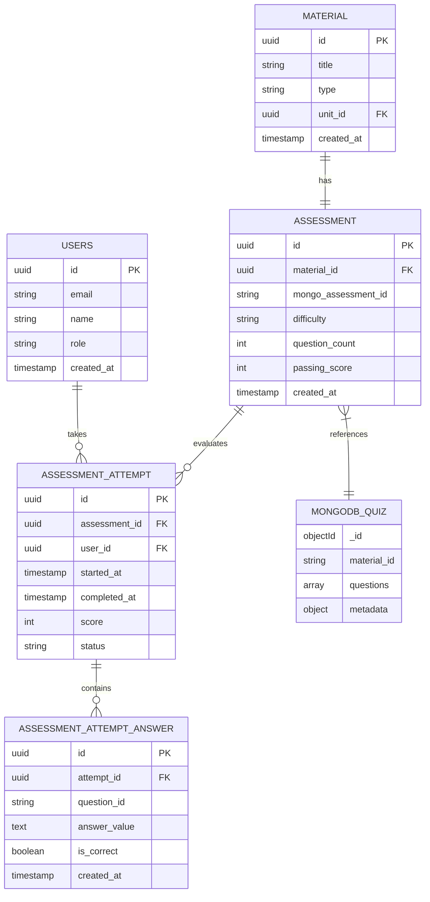

# 📊 Modelo de Datos: Sistema de Evaluaciones

**Versión:** 1.0  
**Fecha:** 14 de Noviembre, 2025  

---

## 1. OVERVIEW

### 1.1 Estrategia de Datos
- **PostgreSQL:** Datos transaccionales, ACID compliance
- **MongoDB:** Documentos complejos, schema flexible
- **Redis:** Cache temporal, session storage

### 1.2 Diagrama ER Principal



---

## 2. POSTGRESQL SCHEMA

### 2.1 Tabla: assessment

**Descripción:** Metadatos de evaluaciones vinculadas a materiales.

```sql
CREATE TABLE assessment (
    id UUID PRIMARY KEY DEFAULT gen_random_uuid(),
    material_id UUID NOT NULL REFERENCES material(id) ON DELETE CASCADE,
    mongo_assessment_id VARCHAR(255) NOT NULL,
    difficulty VARCHAR(20) NOT NULL CHECK (difficulty IN ('easy', 'medium', 'hard')),
    question_count INT NOT NULL CHECK (question_count > 0),
    passing_score INT NOT NULL DEFAULT 70 CHECK (passing_score BETWEEN 0 AND 100),
    max_attempts_per_day INT DEFAULT 3,
    time_limit_minutes INT DEFAULT 30,
    is_active BOOLEAN DEFAULT true,
    created_at TIMESTAMP DEFAULT NOW(),
    updated_at TIMESTAMP DEFAULT NOW(),
    UNIQUE(material_id)
);

-- Indices
CREATE INDEX idx_assessment_material ON assessment(material_id);
CREATE INDEX idx_assessment_active ON assessment(is_active) WHERE is_active = true;
CREATE INDEX idx_assessment_mongo ON assessment(mongo_assessment_id);
```

**Campos:**
- `id`: Identificador único en PostgreSQL
- `material_id`: FK al material educativo
- `mongo_assessment_id`: Referencia al documento en MongoDB
- `difficulty`: Nivel de dificultad (easy, medium, hard)
- `question_count`: Número total de preguntas
- `passing_score`: Porcentaje mínimo para aprobar
- `max_attempts_per_day`: Límite diario de intentos
- `time_limit_minutes`: Tiempo máximo por intento
- `is_active`: Si la evaluación está disponible

### 2.2 Tabla: assessment_attempt

**Descripción:** Registro de cada intento de evaluación por usuario.

```sql
CREATE TABLE assessment_attempt (
    id UUID PRIMARY KEY DEFAULT gen_random_uuid(),
    assessment_id UUID NOT NULL REFERENCES assessment(id) ON DELETE CASCADE,
    user_id UUID NOT NULL REFERENCES users(id) ON DELETE CASCADE,
    started_at TIMESTAMP DEFAULT NOW(),
    completed_at TIMESTAMP,
    last_activity_at TIMESTAMP DEFAULT NOW(),
    score INT CHECK (score BETWEEN 0 AND 100),
    total_questions INT NOT NULL,
    correct_answers INT DEFAULT 0,
    status VARCHAR(20) NOT NULL DEFAULT 'in_progress',
    time_spent_seconds INT,
    ip_address INET,
    user_agent TEXT,
    created_at TIMESTAMP DEFAULT NOW(),
    
    CONSTRAINT valid_status CHECK (
        status IN ('in_progress', 'completed', 'abandoned', 'timeout')
    ),
    CONSTRAINT valid_completion CHECK (
        (status = 'completed' AND completed_at IS NOT NULL AND score IS NOT NULL) OR
        (status != 'completed')
    )
);

-- Indices
CREATE INDEX idx_attempt_user ON assessment_attempt(user_id);
CREATE INDEX idx_attempt_assessment ON assessment_attempt(assessment_id);
CREATE INDEX idx_attempt_status ON assessment_attempt(status);
CREATE INDEX idx_attempt_user_assessment ON assessment_attempt(user_id, assessment_id, created_at DESC);
CREATE INDEX idx_attempt_date ON assessment_attempt(created_at);
```

**Estados:**
- `in_progress`: Intento activo
- `completed`: Finalizado normalmente
- `abandoned`: Usuario salió sin terminar
- `timeout`: Excedió tiempo límite

### 2.3 Tabla: assessment_attempt_answer

**Descripción:** Respuestas individuales de cada intento.

```sql
CREATE TABLE assessment_attempt_answer (
    id UUID PRIMARY KEY DEFAULT gen_random_uuid(),
    attempt_id UUID NOT NULL REFERENCES assessment_attempt(id) ON DELETE CASCADE,
    question_id VARCHAR(255) NOT NULL,
    question_order INT NOT NULL,
    answer_value TEXT,
    is_correct BOOLEAN,
    time_spent_seconds INT,
    created_at TIMESTAMP DEFAULT NOW(),
    updated_at TIMESTAMP DEFAULT NOW(),
    
    UNIQUE(attempt_id, question_id)
);

-- Indices
CREATE INDEX idx_answer_attempt ON assessment_attempt_answer(attempt_id);
CREATE INDEX idx_answer_correct ON assessment_attempt_answer(attempt_id, is_correct);
```

### 2.4 Tabla: material_summary_link

**Descripción:** Vincula materiales con sus resúmenes en MongoDB.

```sql
CREATE TABLE material_summary_link (
    id UUID PRIMARY KEY DEFAULT gen_random_uuid(),
    material_id UUID NOT NULL REFERENCES material(id) ON DELETE CASCADE,
    mongo_summary_id VARCHAR(255) NOT NULL,
    summary_type VARCHAR(50) NOT NULL,
    language VARCHAR(10) DEFAULT 'es',
    created_at TIMESTAMP DEFAULT NOW(),
    
    UNIQUE(material_id, summary_type, language)
);

-- Indices
CREATE INDEX idx_summary_material ON material_summary_link(material_id);
```

### 2.5 Vistas Materializadas

```sql
-- Vista para estadísticas de evaluación
CREATE MATERIALIZED VIEW assessment_stats AS
SELECT 
    a.id as assessment_id,
    a.material_id,
    COUNT(DISTINCT at.user_id) as unique_users,
    COUNT(at.id) as total_attempts,
    AVG(at.score) as avg_score,
    MIN(at.score) as min_score,
    MAX(at.score) as max_score,
    PERCENTILE_CONT(0.5) WITHIN GROUP (ORDER BY at.score) as median_score,
    SUM(CASE WHEN at.score >= a.passing_score THEN 1 ELSE 0 END)::FLOAT / 
        NULLIF(COUNT(at.id), 0) * 100 as pass_rate,
    AVG(at.time_spent_seconds) as avg_time_seconds
FROM assessment a
LEFT JOIN assessment_attempt at ON a.id = at.assessment_id 
    AND at.status = 'completed'
GROUP BY a.id, a.material_id;

-- Refrescar cada hora
CREATE INDEX idx_assessment_stats ON assessment_stats(assessment_id);

-- Vista para rendimiento de estudiantes
CREATE MATERIALIZED VIEW student_performance AS
SELECT
    u.id as user_id,
    COUNT(DISTINCT at.assessment_id) as assessments_taken,
    COUNT(at.id) as total_attempts,
    AVG(at.score) as avg_score,
    MAX(at.score) as best_score,
    SUM(CASE WHEN at.score >= 70 THEN 1 ELSE 0 END) as passed_count,
    AVG(at.time_spent_seconds) as avg_time_seconds,
    MAX(at.created_at) as last_attempt_date
FROM users u
LEFT JOIN assessment_attempt at ON u.id = at.user_id 
    AND at.status = 'completed'
GROUP BY u.id;

CREATE INDEX idx_student_performance ON student_performance(user_id);
```

---

## 3. MONGODB SCHEMA

### 3.1 Collection: material_assessment

**Descripción:** Quizzes generados por IA para cada material.

```javascript
{
  "_id": ObjectId("507f1f77bcf86cd799439011"),
  "material_id": "123e4567-e89b-12d3-a456-426614174000",  // UUID from PostgreSQL
  "version": 1,
  "questions": [
    {
      "id": "q1",
      "type": "multiple_choice",  // multiple_choice, true_false, short_answer
      "text": "¿Cuál es la capital de Francia?",
      "image_url": null,
      "options": [
        { "id": "a", "text": "Londres" },
        { "id": "b", "text": "París" },
        { "id": "c", "text": "Berlín" },
        { "id": "d", "text": "Madrid" }
      ],
      "correct_answer": "b",
      "explanation": "París es la capital de Francia desde el siglo XII.",
      "points": 1,
      "difficulty": "easy",
      "tags": ["geography", "europe", "capitals"]
    },
    {
      "id": "q2",
      "type": "true_false",
      "text": "El agua hierve a 100°C al nivel del mar.",
      "correct_answer": true,
      "explanation": "A presión atmosférica normal (1 atm), el agua hierve a 100°C.",
      "points": 1,
      "difficulty": "easy",
      "tags": ["physics", "chemistry"]
    }
  ],
  "metadata": {
    "total_points": 20,
    "estimated_time_minutes": 15,
    "difficulty": "medium",
    "topics": ["geography", "science"],
    "language": "es",
    "instructions": "Selecciona la respuesta correcta para cada pregunta."
  },
  "generation_info": {
    "model": "gpt-4",
    "prompt_template": "educational_quiz_v2",
    "generated_at": ISODate("2024-01-01T10:00:00Z"),
    "generation_time_ms": 2500,
    "tokens_used": 1500
  },
  "validation": {
    "is_validated": true,
    "validated_by": "system",
    "validated_at": ISODate("2024-01-01T10:05:00Z"),
    "quality_score": 0.92
  },
  "statistics": {
    "times_taken": 0,
    "avg_score": null,
    "difficulty_rating": null,
    "last_taken": null
  },
  "created_at": ISODate("2024-01-01T10:00:00Z"),
  "updated_at": ISODate("2024-01-01T10:05:00Z")
}
```

**Índices:**
```javascript
db.material_assessment.createIndex({ "material_id": 1 }, { unique: true })
db.material_assessment.createIndex({ "metadata.topics": 1 })
db.material_assessment.createIndex({ "metadata.difficulty": 1 })
db.material_assessment.createIndex({ "created_at": -1 })
```

### 3.2 Collection: material_summary

**Descripción:** Resúmenes generados por IA de materiales.

```javascript
{
  "_id": ObjectId("607f1f77bcf86cd799439012"),
  "material_id": "123e4567-e89b-12d3-a456-426614174000",
  "summary_type": "brief",  // brief, detailed, key_points
  "language": "es",
  "content": {
    "title": "Introducción a la Física Cuántica",
    "summary": "Este material explora los conceptos fundamentales...",
    "key_points": [
      "Dualidad onda-partícula",
      "Principio de incertidumbre",
      "Entrelazamiento cuántico"
    ],
    "learning_objectives": [
      "Comprender los principios básicos de la mecánica cuántica",
      "Identificar aplicaciones prácticas"
    ],
    "estimated_reading_time": "15 minutos",
    "difficulty_level": "intermediate"
  },
  "generation_info": {
    "model": "gpt-4",
    "generated_at": ISODate("2024-01-01T09:00:00Z"),
    "tokens_used": 800
  },
  "created_at": ISODate("2024-01-01T09:00:00Z")
}
```

**Índices:**
```javascript
db.material_summary.createIndex({ "material_id": 1, "summary_type": 1, "language": 1 }, { unique: true })
```

---

## 4. REDIS SCHEMA

### 4.1 Cache Keys

```
# Quiz cache (TTL: 1 hora)
quiz:material:{material_id}
Value: Serialized quiz JSON
TTL: 3600

# User attempt limit (TTL: hasta medianoche)
attempt:limit:user:{user_id}:assessment:{assessment_id}:date:{yyyy-mm-dd}
Value: Attempt count
TTL: Seconds until midnight

# Active attempt lock (TTL: 30 minutos)
attempt:active:user:{user_id}
Value: attempt_id
TTL: 1800

# Assessment stats cache (TTL: 5 minutos)
stats:assessment:{assessment_id}
Value: Serialized stats JSON
TTL: 300
```

---

## 5. RELACIONES Y CONSTRAINTS

### 5.1 Integridad Referencial

```sql
-- No permitir eliminar material con evaluaciones activas
ALTER TABLE assessment 
ADD CONSTRAINT fk_assessment_material 
FOREIGN KEY (material_id) 
REFERENCES material(id) 
ON DELETE RESTRICT;

-- Cascada de eliminación para intentos
ALTER TABLE assessment_attempt
ADD CONSTRAINT fk_attempt_assessment
FOREIGN KEY (assessment_id)
REFERENCES assessment(id)
ON DELETE CASCADE;

-- Un solo intento activo por usuario
CREATE UNIQUE INDEX idx_one_active_attempt 
ON assessment_attempt(user_id) 
WHERE status = 'in_progress';
```

### 5.2 Triggers

```sql
-- Auto-update updated_at
CREATE OR REPLACE FUNCTION update_updated_at()
RETURNS TRIGGER AS $$
BEGIN
    NEW.updated_at = NOW();
    RETURN NEW;
END;
$$ LANGUAGE plpgsql;

CREATE TRIGGER update_assessment_updated_at
BEFORE UPDATE ON assessment
FOR EACH ROW
EXECUTE FUNCTION update_updated_at();

-- Calcular tiempo transcurrido al completar
CREATE OR REPLACE FUNCTION calculate_time_spent()
RETURNS TRIGGER AS $$
BEGIN
    IF NEW.status = 'completed' AND OLD.status = 'in_progress' THEN
        NEW.time_spent_seconds = EXTRACT(EPOCH FROM (NEW.completed_at - NEW.started_at));
    END IF;
    RETURN NEW;
END;
$$ LANGUAGE plpgsql;

CREATE TRIGGER calculate_attempt_time
BEFORE UPDATE ON assessment_attempt
FOR EACH ROW
EXECUTE FUNCTION calculate_time_spent();
```

---

## 6. QUERIES IMPORTANTES

### 6.1 Queries de Aplicación

```sql
-- Obtener evaluación con estadísticas
SELECT 
    a.*,
    COALESCE(s.total_attempts, 0) as total_attempts,
    COALESCE(s.avg_score, 0) as avg_score,
    COALESCE(s.pass_rate, 0) as pass_rate
FROM assessment a
LEFT JOIN assessment_stats s ON a.id = s.assessment_id
WHERE a.material_id = $1 AND a.is_active = true;

-- Verificar límite de intentos diarios
SELECT COUNT(*) as attempts_today
FROM assessment_attempt
WHERE user_id = $1 
    AND assessment_id = $2
    AND DATE(created_at) = CURRENT_DATE;

-- Obtener historial de intentos con detalles
SELECT 
    at.id,
    at.started_at,
    at.completed_at,
    at.score,
    at.status,
    a.question_count,
    m.title as material_title
FROM assessment_attempt at
JOIN assessment a ON at.assessment_id = a.id
JOIN material m ON a.material_id = m.id
WHERE at.user_id = $1
ORDER BY at.started_at DESC
LIMIT 20;
```

### 6.2 Queries de Reporte

```sql
-- Top 10 preguntas más falladas
WITH question_stats AS (
    SELECT 
        aaa.question_id,
        COUNT(*) as total_answers,
        SUM(CASE WHEN aaa.is_correct THEN 1 ELSE 0 END) as correct_count
    FROM assessment_attempt_answer aaa
    JOIN assessment_attempt at ON aaa.attempt_id = at.id
    WHERE at.assessment_id = $1 AND at.status = 'completed'
    GROUP BY aaa.question_id
)
SELECT 
    question_id,
    total_answers,
    correct_count,
    (correct_count::FLOAT / total_answers * 100) as success_rate
FROM question_stats
ORDER BY success_rate ASC
LIMIT 10;

-- Progreso de estudiante en el tiempo
SELECT 
    DATE(created_at) as date,
    AVG(score) as avg_score,
    COUNT(*) as attempts
FROM assessment_attempt
WHERE user_id = $1 AND status = 'completed'
GROUP BY DATE(created_at)
ORDER BY date DESC
LIMIT 30;
```

---

## 7. MIGRACIONES

### 7.1 Script de Migración

```sql
-- Migration: 001_create_assessment_tables.sql
BEGIN;

-- Crear tablas
CREATE TABLE IF NOT EXISTS assessment (...);
CREATE TABLE IF NOT EXISTS assessment_attempt (...);
CREATE TABLE IF NOT EXISTS assessment_attempt_answer (...);
CREATE TABLE IF NOT EXISTS material_summary_link (...);

-- Crear índices
CREATE INDEX IF NOT EXISTS ...;

-- Crear vistas materializadas
CREATE MATERIALIZED VIEW IF NOT EXISTS assessment_stats AS ...;

-- Crear triggers
CREATE OR REPLACE FUNCTION ...;

-- Insertar datos de ejemplo
INSERT INTO assessment (material_id, mongo_assessment_id, difficulty, question_count)
SELECT 
    m.id,
    'mongo_' || m.id::text,
    'medium',
    20
FROM material m
WHERE NOT EXISTS (
    SELECT 1 FROM assessment a WHERE a.material_id = m.id
)
LIMIT 10;

COMMIT;
```

---

## 8. OPTIMIZACIONES

### 8.1 Particionamiento

```sql
-- Particionar assessment_attempt por fecha (mensual)
CREATE TABLE assessment_attempt_2024_01 PARTITION OF assessment_attempt
FOR VALUES FROM ('2024-01-01') TO ('2024-02-01');

CREATE TABLE assessment_attempt_2024_02 PARTITION OF assessment_attempt
FOR VALUES FROM ('2024-02-01') TO ('2024-03-01');
```

### 8.2 Índices Especializados

```sql
-- Índice BRIN para datos temporales
CREATE INDEX idx_attempt_created_brin 
ON assessment_attempt 
USING BRIN (created_at);

-- Índice parcial para consultas frecuentes
CREATE INDEX idx_recent_completed_attempts
ON assessment_attempt (user_id, score)
WHERE status = 'completed' 
    AND created_at > CURRENT_DATE - INTERVAL '30 days';
```

---

**Última actualización:** 14 de Noviembre, 2025  
**Versión del Schema:** 1.0.0