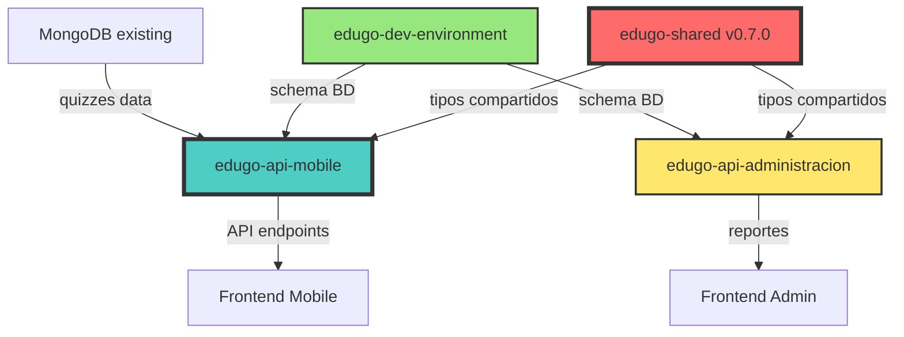

# 🔄 ORDEN DE EJECUCIÓN: Sistema de Evaluaciones

**CRÍTICO:** Este documento define el orden OBLIGATORIO de implementación. Violarlo causará dependencias rotas y retrabajos.

---

## 📊 DIAGRAMA DE DEPENDENCIAS



---

## 🚀 FASES DE IMPLEMENTACIÓN

### FASE 0: Preparación (Day 0)

```bash
# Verificar estado inicial de todos los repos
cd /Users/jhoanmedina/source/EduGo/repos-separados

# Para cada repo:
for repo in edugo-shared edugo-api-mobile edugo-api-administracion edugo-dev-environment; do
    echo "=== $repo ==="
    cd $repo
    git checkout dev
    git pull origin dev
    git status
    cd ..
done
```

**Checklist:**
- [ ] Todos los repos en branch `dev` actualizado
- [ ] No hay cambios locales sin commitear  
- [ ] Tests pasando en todos los repos
- [ ] CI/CD funcionando

---

### FASE 1: edugo-shared (Días 1-3) 🔴 BLOQUEANTE

**Branch:** `feature/evaluaciones-shared-tipos`  
**Resultado:** Release v0.7.0

#### Día 1: Estructura y Tipos Base
```bash
cd edugo-shared
git checkout -b feature/evaluaciones-shared-tipos

# Crear estructura
mkdir -p assessment/{domain,repository,dto}

# Implementar:
- assessment/domain/types.go       # IDs, value objects
- assessment/domain/assessment.go  # Entity
- assessment/domain/attempt.go     # Entity
- assessment/repository/interface.go
```

#### Día 2: DTOs y Validaciones
```bash
# Implementar:
- assessment/dto/assessment.go     # DTOs
- assessment/dto/validation.go     # Validadores
- assessment/errors.go             # Errores específicos
```

#### Día 3: Tests y Release
```bash
# Tests completos
go test ./assessment/... -cover

# Si coverage >85%:
git add .
git commit -m "feat(assessment): add assessment module with types and DTOs"
git push origin feature/evaluaciones-shared-tipos

# PR a dev
# Después de merge:
git checkout dev
git pull origin dev
git tag v0.7.0
git push origin v0.7.0
```

**⚠️ PUNTO DE CONTROL:** Sin v0.7.0 NO continuar

---

### FASE 2: edugo-dev-environment (Días 2-3) ⚡ PARALELO

**Branch:** `feature/evaluaciones-db-schema`  
**Puede ejecutarse EN PARALELO con Fase 1**

#### Día 2: Schema PostgreSQL
```bash
cd edugo-dev-environment
git checkout -b feature/evaluaciones-db-schema

# Crear archivo
touch docker/postgres/sql/06_assessments.sql
```

```sql
-- 06_assessments.sql
CREATE TABLE assessment (
    id UUID PRIMARY KEY DEFAULT gen_random_uuid(),
    material_id UUID NOT NULL REFERENCES material(id),
    mongo_assessment_id VARCHAR(255) NOT NULL,
    difficulty VARCHAR(20) NOT NULL,
    question_count INT NOT NULL,
    passing_score INT NOT NULL DEFAULT 70,
    created_at TIMESTAMP DEFAULT NOW(),
    UNIQUE(material_id)
);

CREATE TABLE assessment_attempt (
    id UUID PRIMARY KEY DEFAULT gen_random_uuid(),
    assessment_id UUID NOT NULL REFERENCES assessment(id),
    user_id UUID NOT NULL REFERENCES users(id),
    started_at TIMESTAMP DEFAULT NOW(),
    completed_at TIMESTAMP,
    score INT,
    status VARCHAR(20) NOT NULL DEFAULT 'in_progress',
    CONSTRAINT valid_status CHECK (status IN ('in_progress', 'completed', 'abandoned'))
);

CREATE TABLE assessment_attempt_answer (
    id UUID PRIMARY KEY DEFAULT gen_random_uuid(),
    attempt_id UUID NOT NULL REFERENCES assessment_attempt(id),
    question_id VARCHAR(255) NOT NULL,
    answer_value TEXT NOT NULL,
    is_correct BOOLEAN,
    created_at TIMESTAMP DEFAULT NOW()
);

-- Indices para performance
CREATE INDEX idx_assessment_material ON assessment(material_id);
CREATE INDEX idx_attempt_user ON assessment_attempt(user_id);
CREATE INDEX idx_attempt_assessment ON assessment_attempt(assessment_id);
CREATE INDEX idx_answer_attempt ON assessment_attempt_answer(attempt_id);
```

#### Día 3: Seeds de Prueba
```bash
# Crear seeds
touch docker/postgres/sql/seeds/06_assessment_seeds.sql
touch docker/mongodb/seeds/assessments.json

# Commit y PR
git add .
git commit -m "feat(assessments): add database schema and seeds"
git push origin feature/evaluaciones-db-schema
```

---

### FASE 3: edugo-api-mobile (Días 4-13) 🎯 CORE

**Branch:** `feature/evaluaciones-mobile-core`  
**Requiere:** shared v0.7.0

#### Día 4: Setup y Dependencias
```bash
cd edugo-api-mobile
git checkout -b feature/evaluaciones-mobile-core

# Actualizar dependencias
go get github.com/EduGoGroup/edugo-shared/assessment@v0.7.0
go mod tidy
```

#### Días 5-6: Dominio
```bash
# Crear estructura
mkdir -p internal/domain/assessment/{entity,valueobject,repository}

# Implementar:
- entity/assessment.go
- entity/attempt.go
- valueobject/score.go
- repository/assessment_repository.go
```

#### Días 7-8: Application Services
```bash
mkdir -p internal/application/assessment

# Implementar:
- assessment/assessment_service.go
- assessment/grading_service.go
- assessment/dto/
```

#### Días 9-10: Infrastructure
```bash
mkdir -p internal/infrastructure/persistence/assessment

# Implementar:
- postgresql/assessment_repository.go
- mongodb/quiz_repository.go
```

#### Días 11-12: HTTP Handlers
```bash
mkdir -p internal/infrastructure/http/handler/assessment

# Implementar endpoints:
- GET  /v1/materials/:id/assessment
- POST /v1/assessments/:id/attempts  
- POST /v1/attempts/:id/answers
- GET  /v1/attempts/:id/results
- GET  /v1/users/me/attempts
```

#### Día 13: Tests y PR
```bash
# Tests completos
make test-coverage

# PR a dev
git add .
git commit -m "feat(assessments): implement core assessment system"
git push origin feature/evaluaciones-mobile-core
```

---

### FASE 4: edugo-api-mobile Integration (Días 14-15)

**Branch:** `feature/evaluaciones-mobile-integration`  
**Continúa desde el PR anterior**

#### Día 14: Integración MongoDB
- Conectar con colección material_assessment
- Transformar schema MongoDB a dominio
- Cache de quizzes

#### Día 15: Optimizaciones
- Circuit breaker para MongoDB
- Rate limiting
- Telemetry y métricas

---

### FASE 5: edugo-api-administracion (Días 11-15) ⚡ PARALELO

**Branch:** `feature/evaluaciones-admin-reportes`  
**Puede empezar en Día 11 (paralelo con mobile días 11-15)**

#### Día 11: Setup
```bash
cd edugo-api-administracion  
git checkout -b feature/evaluaciones-admin-reportes

# Actualizar dependencias
go get github.com/EduGoGroup/edugo-shared/assessment@v0.7.0
go mod tidy
```

#### Días 12-13: Reports Service
```bash
mkdir -p internal/application/reports/assessment

# Implementar:
- assessment_stats_service.go
- student_performance_service.go
```

#### Días 14-15: Endpoints y Tests
```bash
# Endpoints:
- GET /v1/reports/assessments/:id/stats
- GET /v1/reports/students/:id/performance
- GET /v1/reports/materials/:id/assessment-analytics
```

---

## ⏱️ TIMELINE CONSOLIDADO

```
Día  1 2 3 4 5 6 7 8 9 10 11 12 13 14 15
─────────────────────────────────────────
shared    ███                              [v0.7.0 release]
dev-env   ░██                              [schema ready]
mobile        ███████████████──────        [core + integration]
admin                     ░░░░█████        [reports]

█ = Trabajo activo (bloqueante)
░ = Trabajo paralelo (no bloqueante)
─ = Testing/Polish/Buffer
```

---

## 🔒 PUNTOS DE CONTROL OBLIGATORIOS

### Checkpoint 1: Fin de Día 3
**DEBE estar completo:**
- [ ] shared v0.7.0 released y disponible
- [ ] dev-environment schema merged a dev
- [ ] Todos los repos pueden hacer `go get` del nuevo módulo

**Si falla:** STOP. No continuar hasta resolver.

### Checkpoint 2: Fin de Día 10
**DEBE estar completo:**
- [ ] api-mobile dominio completo
- [ ] api-mobile services completos
- [ ] Tests de dominio y services >85% coverage

**Si falla:** Revisar si continuar o resolver deuda técnica.

### Checkpoint 3: Fin de Día 13
**DEBE estar completo:**
- [ ] api-mobile endpoints funcionando
- [ ] Integración PostgreSQL probada
- [ ] Tests E2E pasando

**Si falla:** Postergar admin reports si es necesario.

### Checkpoint 4: Fin de Día 15
**DEBE estar completo:**
- [ ] Sistema completo E2E funcionando
- [ ] Reportes administrativos disponibles
- [ ] Documentación actualizada
- [ ] Todos los PRs merged

---

## 🚨 PLAN DE CONTINGENCIA

### Si shared se retrasa:
```bash
# Opción A: Desarrollo paralelo con mocks
- api-mobile crea interfaces locales temporales
- Se reemplazan cuando shared esté listo

# Opción B: Cambiar prioridades
- Adelantar tareas no dependientes
- Trabajar en tests, docs, refactors
```

### Si MongoDB falla:
```bash
# Fallback a datos de prueba
- Crear assessments hardcodeados
- Permitir desarrollo sin MongoDB temporal
- Agregar flag feature toggle
```

### Si un repo tiene conflictos:
```bash
# Procedimiento:
1. git stash           # Guardar cambios locales
2. git checkout dev    
3. git pull origin dev # Actualizar
4. git checkout -      # Volver a feature
5. git rebase dev      # Rebase sobre dev actual
6. git stash pop       # Recuperar cambios
# Resolver conflictos manualmente
```

---

## 📋 VALIDACIÓN FINAL

### Antes de declarar COMPLETO:

#### Para cada repositorio:
- [ ] PR merged a dev
- [ ] Tests pasando >80% coverage
- [ ] CI/CD verde
- [ ] Documentación actualizada
- [ ] CHANGELOG.md actualizado

#### Sistema completo:
- [ ] Test E2E: Crear assessment → Intentar → Calificar → Ver resultados
- [ ] MongoDB y PostgreSQL sincronizados
- [ ] Performance <200ms en calificación
- [ ] Logs sin errores en 1 hora de pruebas
- [ ] Métricas y telemetry funcionando

---

## 🔗 COMANDOS ÚTILES

```bash
# Ver progreso global
cd /Users/jhoanmedina/source/EduGo/Analisys/specs/sistema-evaluaciones
cat PROGRESS.json | jq '.'

# Verificar dependencias
cd /Users/jhoanmedina/source/EduGo/repos-separados/edugo-api-mobile
go list -m all | grep edugo-shared

# Correr tests en todos los repos
for repo in edugo-shared edugo-api-mobile edugo-api-administracion; do
    echo "Testing $repo..."
    cd ../$repo
    go test ./... -cover
done

# Ver todos los branches de evaluaciones
git branch -a | grep evaluaciones

# Limpiar branches locales después de merge
git branch -D feature/evaluaciones-*
```

---

**⚠️ RECORDATORIO FINAL:**
- El orden es CRÍTICO
- shared v0.7.0 es BLOQUEANTE
- Los checkpoints son OBLIGATORIOS
- En caso de duda, revisar este documento

**Última actualización:** 14 de Noviembre, 2025