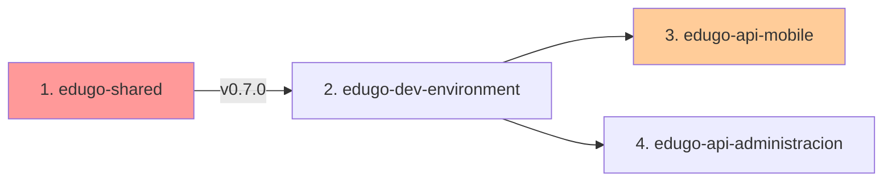

# 🎯 Sistema de Evaluaciones - Ecosistema EduGo

**Epic:** Sistema completo de evaluaciones y calificación automática  
**Prioridad:** 🔴 P0 (CRÍTICA)  
**Estado Global:** ⬜ Pendiente  
**Duración Estimada:** 4 semanas  
**Fecha Inicio:** Por definir  

---

## 📋 Descripción del Requisito

Implementar un sistema completo de evaluaciones que permita:
- Obtener quizzes generados por IA desde MongoDB
- Registrar intentos de evaluación en PostgreSQL
- Calificar automáticamente respuestas
- Mantener historial de intentos por usuario
- Proveer feedback personalizado
- Integrar resultados con el progreso del estudiante

## 🔍 Análisis de Impacto Multi-Repositorio

### Matriz de Impacto

| Repositorio | ¿Afectado? | Tipo de Cambio | Prioridad | Dependencias | Descripción |
|-------------|------------|----------------|-----------|--------------|-------------|
| **edugo-shared** | SÍ | feature | 1 | ninguna | Crear módulo `assessment` con tipos compartidos |
| **edugo-api-mobile** | SÍ | feature | 2 | shared@v0.7.0 | Core del sistema de evaluaciones |
| **edugo-api-administracion** | SÍ | feature | 3 | shared@v0.7.0 | Endpoints de reportes y analytics |
| **edugo-worker** | NO | - | - | - | Ya genera los quizzes en MongoDB |
| **edugo-dev-environment** | SÍ | config | 4 | ninguna | Scripts SQL y seeds de prueba |

### Orden de Ejecución Crítico



**Secuencia obligatoria:**
1. **edugo-shared** → Crear tipos compartidos → Release v0.7.0
2. **edugo-dev-environment** → Schema BD + seeds (paralelo con shared)
3. **edugo-api-mobile** → Implementación principal (requiere shared v0.7.0)
4. **edugo-api-administracion** → Reportes (puede ser paralelo con mobile)

---

## 📁 Estructura de Documentación

```
specs/sistema-evaluaciones/
├── README.md                    # Este archivo
├── RULES.md                     # Reglas específicas del proyecto
├── ORDEN_EJECUCION.md          # Orden crítico detallado
│
├── 00-Global/                   # Documentación transversal
│   ├── PRD.md                  # Requisitos de producto
│   ├── ARCHITECTURE.md         # Arquitectura completa
│   ├── DATA_MODEL.md           # Modelo de datos unificado
│   ├── API_CONTRACTS.md        # Contratos REST
│   └── DEPENDENCIES.md         # Matriz de dependencias
│
├── 01-shared/                   # Módulo assessment
│   ├── README.md               
│   ├── TASKS.md                # Plan de 3 días
│   ├── DESIGN.md               
│   └── VALIDATION.md           
│
├── 02-dev-environment/          # Infraestructura
│   ├── README.md               
│   ├── TASKS.md                # Plan de 2 días
│   └── DOCKER_COMPOSE.md       
│
├── 03-api-mobile/               # Core evaluaciones
│   ├── README.md               
│   ├── TASKS.md                # Plan de 10 días
│   ├── DESIGN.md               
│   ├── USER_STORIES.md         
│   └── VALIDATION.md           
│
├── 04-api-administracion/       # Reportes
│   ├── README.md               
│   ├── TASKS.md                # Plan de 5 días
│   ├── DESIGN.md               
│   └── VALIDATION.md           
│
├── PROGRESS.json                # Tracking automático
└── ESTADO_FINAL_REPOS.md       # Resumen final
```

---

## 🎯 Objetivos y Entregables

### Entregables Principales

1. **Módulo shared/assessment** (v0.7.0)
   - Tipos compartidos: AssessmentID, QuestionID, AnswerID
   - Value Objects: Score, Difficulty, QuestionType
   - Interfaces: AssessmentRepository

2. **API REST de Evaluaciones** (api-mobile)
   - `GET /v1/materials/:id/assessment` - Obtener quiz
   - `POST /v1/assessments/:id/attempts` - Iniciar intento
   - `POST /v1/attempts/:id/answers` - Enviar respuestas
   - `GET /v1/attempts/:id/results` - Ver resultados
   - `GET /v1/users/me/attempts` - Historial

3. **Schema PostgreSQL**
   - Tabla `assessment` - Metadatos de evaluaciones
   - Tabla `assessment_attempt` - Intentos de usuarios
   - Tabla `assessment_attempt_answer` - Respuestas
   - Tabla `material_summary_link` - Enlaces a MongoDB

4. **Reportes Administrativos** (api-admin)
   - `GET /v1/reports/assessments/:id/stats` - Estadísticas
   - `GET /v1/reports/students/:id/performance` - Rendimiento

### Criterios de Éxito Globales

- ✅ **Funcionalidad:** Sistema E2E funcionando
- ✅ **Testing:** >80% coverage en todos los repos
- ✅ **Integración:** PostgreSQL + MongoDB sincronizados
- ✅ **Performance:** <200ms latencia en calificación
- ✅ **Documentación:** Swagger actualizado, README completos
- ✅ **CI/CD:** Todos los workflows pasando

---

## 📊 Métricas de Tracking

### Por Repositorio

| Repositorio | Tareas | Completadas | % | PRs | Estado |
|-------------|--------|-------------|---|-----|--------|
| edugo-shared | 8 | 0 | 0% | 0/1 | ⬜ Pendiente |
| edugo-dev-environment | 5 | 0 | 0% | 0/1 | ⬜ Pendiente |
| edugo-api-mobile | 25 | 0 | 0% | 0/3 | ⬜ Pendiente |
| edugo-api-administracion | 12 | 0 | 0% | 0/2 | ⬜ Pendiente |
| **TOTAL** | **50** | **0** | **0%** | **0/7** | ⬜ |

### Timeline Estimado

```
Semana 1: shared (release v0.7.0) + dev-environment
Semana 2-3: api-mobile (core implementation)
Semana 4: api-administracion (reportes) + integración final
```

---

## 🔄 Estado Actual

### Próximos Pasos Inmediatos

1. [ ] Crear estructura de carpetas completa
2. [ ] Generar TASKS.md para cada repositorio
3. [ ] Definir API_CONTRACTS.md global
4. [ ] Crear DATA_MODEL.md unificado
5. [ ] Iniciar con edugo-shared

### Bloqueadores Identificados

- ⚠️ Ninguno identificado aún

### Riesgos

- 🔴 **Alto:** Dependencia de shared v0.7.0 para 2 repos
- 🟡 **Medio:** Integración MongoDB-PostgreSQL compleja
- 🟢 **Bajo:** Cambios en dev-environment son menores

---

## 📚 Documentación de Referencia

### Enlaces Internos
- [Plan Original](../../docs/roadmap/PLAN_IMPLEMENTACION.md#proyecto-2-edugo-api-mobile)
- [Estado del Proyecto](../../docs/ESTADO_PROYECTO.md)
- [Análisis de Worker](../../docs/analisis/VERIFICACION_WORKER.md)

### Repositorios
- [edugo-shared](https://github.com/EduGoGroup/edugo-shared)
- [edugo-api-mobile](https://github.com/EduGoGroup/edugo-api-mobile)
- [edugo-api-administracion](https://github.com/EduGoGroup/edugo-api-administracion)
- [edugo-dev-environment](https://github.com/EduGoGroup/edugo-dev-environment)

---

## 🚀 Comandos Rápidos

```bash
# Navegar a la documentación
cd /Users/jhoanmedina/source/EduGo/Analisys/specs/sistema-evaluaciones

# Ver estado global
cat PROGRESS.json

# Iniciar trabajo en shared
cd /Users/jhoanmedina/source/EduGo/repos-separados/edugo-shared
git checkout -b feature/assessment-module

# Verificar dependencias
cd ../edugo-api-mobile
go list -m github.com/EduGoGroup/edugo-shared
```

---

**Última actualización:** 14 de Noviembre, 2025  
**Próxima revisión:** Al completar estructura de carpetas  
**Generado con:** Claude Code